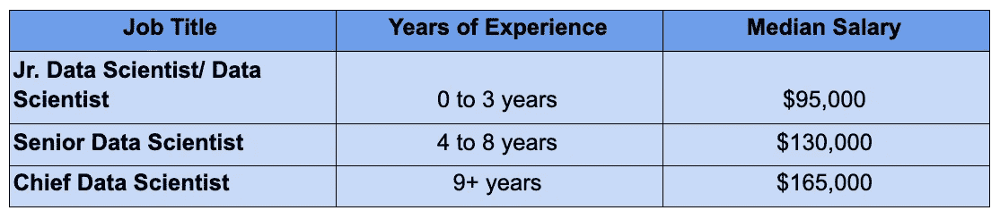
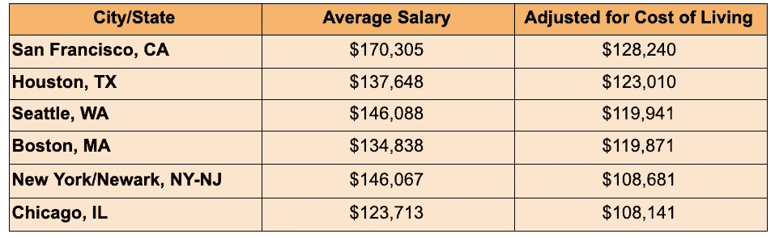

# 雇用数据科学家时要考虑的 4 件事

> 原文：<https://towardsdatascience.com/4-things-to-consider-when-hiring-a-data-scientist-b44f33c90d6d?source=collection_archive---------44----------------------->

## *顶尖数据科学候选人每天都会收到许多机会选项。为了避免候选人被遗漏，你必须考虑这四件事。*

作为一家[人事代理机构](https://www.focusgts.com/)，我们[的专业之一是数据科学](https://www.focusgts.com/look-for-talent/artificial-intelligence-and-data-science-recruiters/)，我们知道在招聘数据科学人才时应该注意什么。

数据科学仍然是 2020 年技术领域的热门词汇之一，但让我们回到过去，看看这一切是从哪里开始的。

2012 年,《哈佛商业评论》( HBR)称，数据科学家是 21 世纪最性感的工作。近十年后，可以说它更加性感了。

LinkedIn 以 37%的年增长率将其列为 2020 年新兴工作的第三名。随着人工智能(AI)和大数据现在成为我们日常对话的一部分，无法想象数据科学消亡的世界。这是大家关注的重点。难怪这个角色登上了 Indeed.com 的“2020 年最佳角色”榜单。

所以我们知道需求是存在的，问题是:当[招聘一名数据科学家](https://focusgts.com/hiring-guide-data-science)时，你在寻找什么，你在和谁竞争？

# 数据科学家的预算应该是多少。

嗯，有几个因素会影响数据科学职位的预期薪资。正如你所料，最大的贡献者之一是他们的技能。本质上，[他们如何实现投资回报](https://focusgts.com/how-to-optimize-hiring-process-and-skyrocket-your-roi/)？

数据科学的问题是没有足够的合格候选人来填补空缺职位(即使在经济困难时期)。在候选人驱动的市场中，很难找到精英数据科学家，而在雇主驱动的市场中，你可能会浪费几个小时来筛选不合格的简历，从而找到几份值得面试的。

有数百名候选人拥有这一头衔，但缺乏与之匹配的技能。2011 年，麦肯锡数字公司估计，到 2018 年，数据科学家将短缺约 14 万至 19 万人。他们是对的。2018 年，领英报告称，数据科学家短缺 151，717 人。

但这正是好消息的来源——当具备合适资格的申请人出现时，他们拥有更大的谈判能力。他们可以获得高薪和丰厚的福利。

在美国，[大多数数据科学家(54%)至少拥有硕士学位](/how-to-become-a-data-scientist-in-2020-top-skills-education-and-experience-afa306d3af02)，其中 23%拥有博士学位。他们通常有物理学、数学、统计学或工程学的背景。略占多数(57%)的数据科学家精通脚本和建模，而 43%的数据科学家更擅长生产和工程。

[根据威斯康星大学](https://datasciencedegree.wisconsin.edu/data-science/data-scientist-salary/#:~:text=A%202020%20Burtch%2DWorks%20study,scientist%20remains%20high%20at%20%2495%2C000.)的数据，截至 2019 年，数据科学家的基本工资中值为 13 万美元。对于有一到三年经验的一级科学家来说，他们的预期工资约为 95，000 美元，而经验丰富的专业人士和管理人员的工资可以从 146，000 美元到 257，000 美元不等。

图片由布列塔尼·福克斯拍摄

至于数据科学经理，根据经验水平的不同，工资中位数在 146，000 美元至 257，000 美元之间。

数据科学家最有收入潜力的州:

图片由布列塔尼·福克斯拍摄

至于福利，众所周知，IT 专业人员拥有一些最好的福利。因此，如果你从事 IT 行业，你已经进入了正确的行业。这些是数据科学家获得的一些最常见的好处:

*   远程工作
*   弹性工时
*   购股选择权
*   签证担保
*   通勤援助
*   无限带薪休假

# 数据科学家很难留住

像大多数 IT 职位一样，数据科学职位非常适合那些不断寻找新刺激的人。数据科学家往往会在一家公司工作一到三年后离开，然后去寻找更好的机会——更具体地说，是更高的薪水。

Big Cloud 进行的一项调查显示，数据科学家发现找新工作非常容易。他们通常愿意搬到任何地方，并期望加薪 11%至 20%。

这项研究还显示，拥有“数据科学家”头衔的受访者中，近一半(42%)对自己目前的职位不满意。所以问题来了，如何留住数据科学家，让他们不去找别的地方？

数据科学家寻找新机会的常见原因包括:

*   更好的工作/生活平衡。
*   从事有意义项目的机会。
*   职业发展机会。
*   更好的文化契合度。

能够向他们的数据科学团队提供上述内容的公司可能会击败统计数据。数据科学家寻找更好机会的另一个重要原因是缺乏公司内部的支持。通常，公司在没有完全理解其含义的情况下就对雇佣数据科学家感到兴奋。这可能会赶走合格的专业人员，他们(理所当然地)不愿意加入没有其他科学家、工程师或建筑师支持项目的公司。

这就是为什么公司必须对他们的人才需求有一个清晰的认识，以便能够留住他们。

# 寻找什么样的技能组合以及如何给它们定价。

**主生产级编码**

成为数据科学家的好处在于，根据行业和公司的不同，这个角色可能需要不同的专业知识。例如，一些数据科学家专注于分析数据和开发预测模型。然后，一些数据科学家专门研究模型的部署和集成。

大多数数据科学家属于第一类。然而，最近出现了对数据科学家的需求，他们知道如何做到这两者，并能编写生产级代码，即模块化、可读、经过测试和优化的代码。他们被称为“全栈”数据科学家，这个术语来自 web 开发世界，用来描述精通该领域所有领域的人。

如果你能向未来的雇主展示这种多才多艺，那就更容易谈成更高的薪水。

**技术&技能**

作为一名数据科学家，Python、R 和 SQL 应该已经是你的拿手好戏了。但是如果你想走得更远，增加一些可以提高你的价值。

让我们来谈谈数字——据《跳板》报道，像 Spark 和 Scala 这样的学习工具可以带来 1.5 万英镑的加薪。以下是一些影响数据科学薪酬的流行技能和工具:

**技能:**

*   Apache Hadoop
*   Hadoop
*   机器学习
*   大数据分析
*   数据挖掘
*   斯堪的纳维亚航空公司

**工具:**

*   张量流
*   （舞台上由人扮的）静态画面
*   神谕
*   储备
*   D3.js
*   BigQuery
*   Hadoop
*   朱皮特
*   亚马逊网络服务
*   蔚蓝的

## 拥有博士学位的候选人

如上所述，大多数数据科学家至少拥有硕士学位。2019 年的数据显示，拥有博士学位的数据科学家将比只有硕士学位的人多赚大约 11，000 美元——这是在所有经验水平上。

然而，对于数据科学经理来说，对于零到三年管理经验的新经理来说，获得博士学位只会产生 6K 美元的差异。

## 软技能——有效沟通他们的行话

理解数据是一回事，能够解释数据是完全不同的另一回事。作为一名数据科学家，很多工作都是技术性很强的。然而，他们直接团队之外的人不太可能理解他们的模型。这就是为什么他们必须有沟通技巧和商业头脑来与利益相关者讨论他们的发现。

如果你不能把数据转化成可以理解的东西，你总是会遇到障碍。说到底，如果没有人能够理解数据见解，那么这些数据见解又有多大帮助呢？

# 数据科学家想在哪里工作，为什么

确定具有竞争力的薪酬以吸引顶尖人才的最佳方式是，查看提供最具竞争力薪酬的行业和/或公司。在全球范围内，技术是对数据科学家需求最高的行业。

在美国，我们知道技术引领潮流，其次是教育/学术领域。

如果你想要顶尖的数据科学人才，重要的是要明白你正在与 IBM、亚马逊、微软和脸书等公司竞争，众所周知，这些公司为专注于数据的角色提供最好的福利和薪水。

总之，在你开始招聘的时候考虑这四件事会给你带来优势。你需要了解每个职位的市场价格，以准备可靠的报价。你还需要了解如何留住顶尖人才的心理学([我们提供了如何留住顶尖人才的指南](https://focusgts.com/wp-content/uploads/2020/09/DataScienceMarketInsights_2020.pdf))。最后，了解大多数数据科学家的工作目标会让你知道你能提供什么好处和服务。