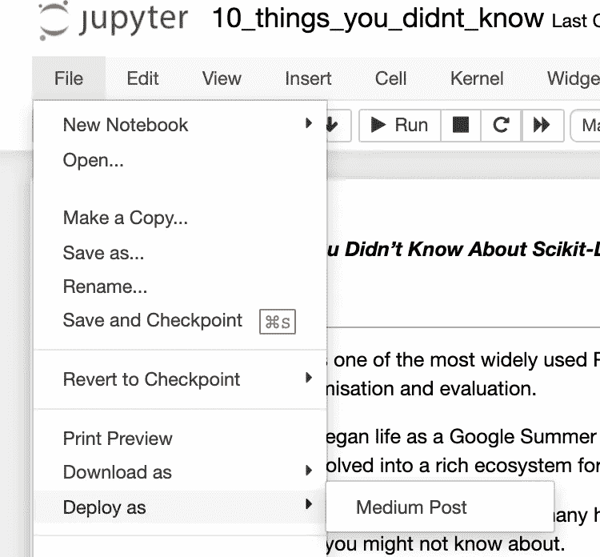
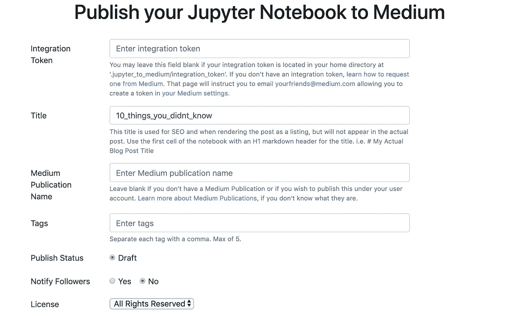
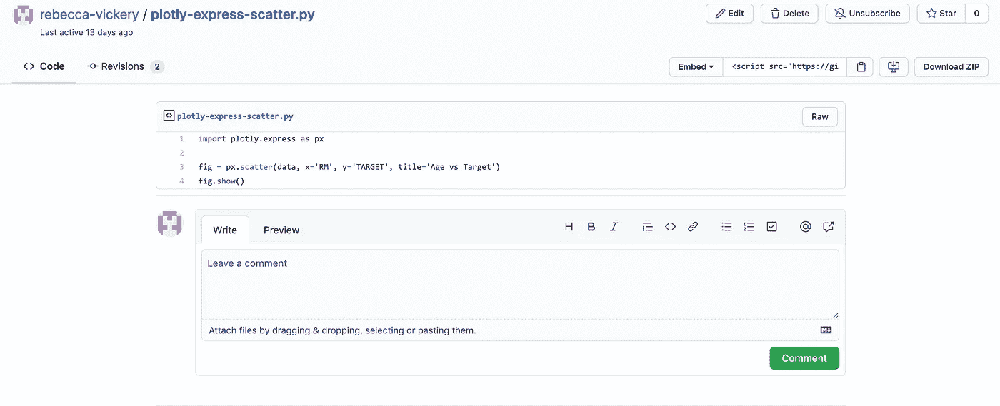
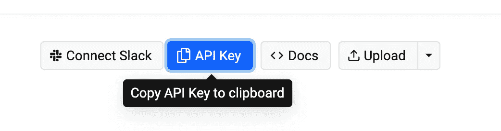
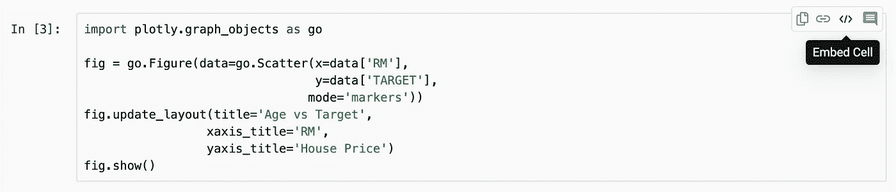
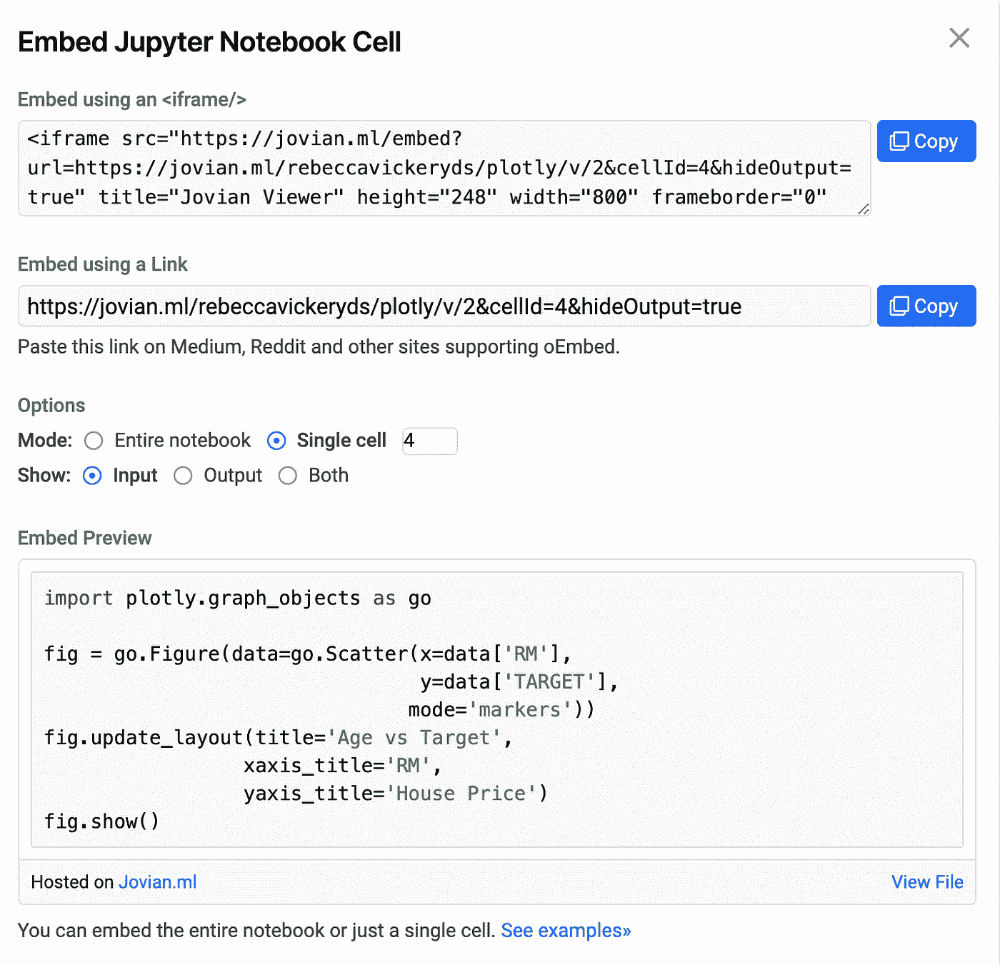

# 加速数据科学写作的 4 个工具

> 原文：<https://towardsdatascience.com/4-tools-to-speed-up-your-data-science-writing-11d3823cd01b?source=collection_archive---------19----------------------->

## 用这四个工具实现你的写作目标


由[凯特·斯托克斯](https://unsplash.com/@katstokes_?utm_source=unsplash&utm_medium=referral&utm_content=creditCopyText)在 [Unsplash](https://unsplash.com/s/photos/writing?utm_source=unsplash&utm_medium=referral&utm_content=creditCopyText) 拍摄的照片

我在 Medium 上写数据科学已经两年多了。写作，尤其是技术写作可能很费时间。你不仅需要想出一个主意，写好，编辑你的文章的准确性和流动性，并进行校对。对于技术文章，你通常还需要编写代码来说明你的解释，确保它是准确的，并将代码从你用来编写它的工具转移到你的文章中。

我试着一周发表一两次。当我第一次开始写作时，我发现这个过程非常耗时，而且很难在一份全职工作中保持这个时间表。

随着时间的推移，我发现一些工具大大加快了我创作和发表文章的时间。尤其是包含编码示例的那些。以下工具帮助我实现了每周围绕我的其他生活承诺发表一到两篇文章的目标。

# 1.Jupyter 到 Medium

[](https://pypi.org/project/jupyter-to-medium/) [## jupyter 到 medium

### 在 jupyter_to_medium 的帮助下，直接从您的笔记本中将 Jupyter 笔记本发布为中型博客文章。你……

pypi.org](https://pypi.org/project/jupyter-to-medium/) 

这个工具今年 5 月才由 Ted Petrou 发布，但是如果你在 Jupyter 笔记本上写代码，它将会改变游戏规则。使用这个 Python 包，您可以将笔记本的全部内容作为博客文章直接发布到您的 Medium 帐户中。

要使用这个工具，首先您需要将它 pip 安装到您的项目环境中。

```
pip install jupyter_to_medium
```

您可能还需要在启动笔记本的环境中安装此扩展。

```
jupyter bundlerextension enable --py jupyter_to_medium._bundler --sys-prefix
```

安装完成后，当你打开 Jupyter 笔记本并导航到**文件> >部署为**时，你会发现一个选项来部署为**中型文章**。



当你选择这个选项时，你会看到一个表格。在顶部，它要求一个集成令牌。如果您是 Medium 上的常规作者，您可以在 Medium 帐户的设置中访问此内容。如果您的设置中没有令牌，您需要通过此电子邮件地址 yourfriends@medium.com 联系 Medium 申请一个令牌。

根据我的经验，你会很快得到回复，通常在 1 到 2 天内。

您可以每次都将您的集成令牌粘贴到该表单中，或者为了避免重复访问，您可以将令牌保存为一个文件和目录，并以下面的方式进行标记`.jupyter_to_medium/integration_token`。



Jupyter to Medium 将以文本形式发布您的降价信息，以代码块形式发布代码，并以草稿形式直接将图像发布到 Medium。我发现你通常只需要做最少的编辑就可以发表一篇博文。

# 2.Github Gists

[](https://gist.github.com/) [## 发现要点

### 此时您不能执行该操作。您已使用另一个标签页或窗口登录。您已在另一个选项卡中注销，或者…

gist.github.com](https://gist.github.com/) 

Github 有一个名为 Github Gists 的工具，可以让你轻松地将代码片段直接嵌入到你的博客文章中。在您的文章中使用 Gists 而不是代码块的好处是，它们可以更好地保留代码的格式，它们可以提升您的 Github 帐户，并且读者可以更容易地访问您的代码，亲自尝试这些示例。

你需要一个 Github 帐户来创建一个 Gist。一旦你有一个简单的导航到 Gists 页面在[gist.github.com](https://gist.github.com/)。创建一个要点非常简单，只要给它一个名字，粘贴你的代码，点击发布。发布后，您将看到此页面。要将要点嵌入到你的文章中，只需将网址编码在“嵌入”下面，然后粘贴到你的文章中。



代码显示在您的媒体文章中，如下所示。

# 3.Jovian.ml

 [## Jovian:所有数据科学项目的平台——Jovian 文档

### 对于你的数据科学项目、Jupyter 笔记本、机器学习模型、实验等等，Jovian.ml 是一个更好的地方

jovian.ml](https://jovian.ml/docs/index.html) 

Jovian.ml 是一个在线托管 Jupyter 笔记本的工具，对于从您的本地环境外部共享分析非常有用。Jovian 最近发布了一项功能，可以将整个笔记本、代码片段、单元格输出和 markdown 直接嵌入到你的中型帖子中。

要开始使用 Jovian，你需要在 [jovian.ml](https://www.jovian.ml/) 上创建一个账户。免费层给你无限的公共项目，这是理想的，如果你使用它来分享通过一个中型博客。然后，您需要将 pip 安装到本地环境中。

```
[p](https://www.jovian.ml/)ip install jovian
```

要将本地 Jupyter 笔记本上传到您的在线 Jovian 帐户，只需在您的笔记本中运行以下命令。

```
import jovian
jovian.commit()
```

这将提示您输入一个 API 密钥，您可以在您的帐户中找到它。



在单元格中嵌入特定的代码片段。导航到您已上传到您的在线帐户的笔记本和包含您要共享的代码的单元格。点击**嵌入单元格**。



这将给你一个链接，你可以粘贴到你的媒体文章。



这将显示如下。

# 4.语法上

[](https://app.grammarly.com/) [## 语法上

### 加入数百万作家的社区。Grammarly 受到学生、专业作家、商业人士的信任…

app.grammarly.com](https://app.grammarly.com/) 

Grammarly 是一个相当知名的应用程序，它可以检查你的内容中的拼写错误、语法错误，甚至是你文本的情感。虽然这是一个显而易见的写作工具，但我花了一段时间才开始使用它，而且它对我的文章的编辑时间产生了如此大的影响，所以我认为它值得在这里分享。

Grammarly 可以作为浏览器扩展安装，本地作为桌面应用或移动应用。为了最大限度地利用我的时间，我在许多不同的环境中写作，所以如果我离线写作，在我的浏览器中安装语法是有用的，如果我在移动中写作，则在我的浏览器中安装语法。

如果你对关于数据科学写作的文章感兴趣，你可能会发现我以前写的关于这个主题的文章也很有用。

[](/how-i-write-a-data-science-blog-62e4108fe478) [## 我如何写数据科学博客

### 撰写数据科学(或任何其他主题)的顶级技巧

towardsdatascience.com](/how-i-write-a-data-science-blog-62e4108fe478) [](/why-i-write-a-data-science-blog-7726c3c7d3d9) [## 我为什么写数据科学博客

### 写博客加速了我在数据科学方面的学习，原因如下

towardsdatascience.com](/why-i-write-a-data-science-blog-7726c3c7d3d9) 

感谢阅读！

我每月都会发一份简讯，如果你想加入，请点击此链接注册。期待成为您学习旅程的一部分！