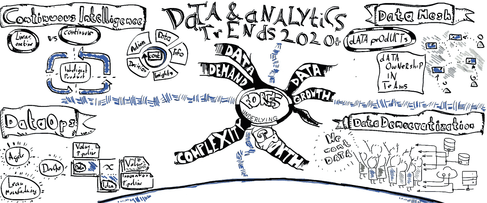
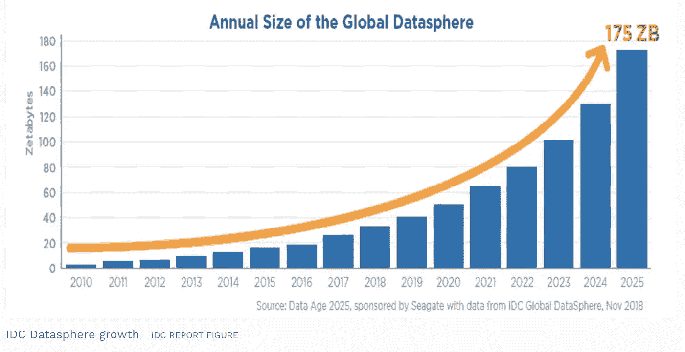
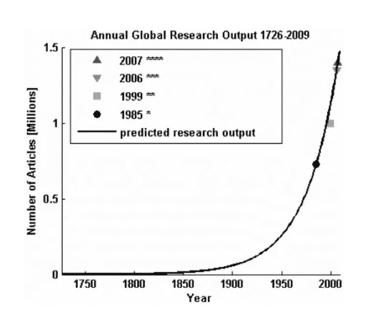
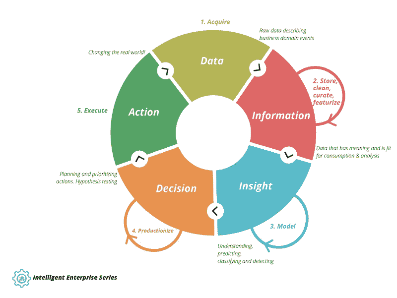
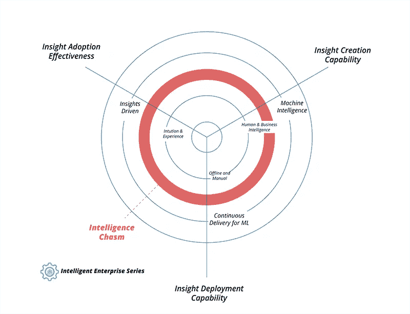
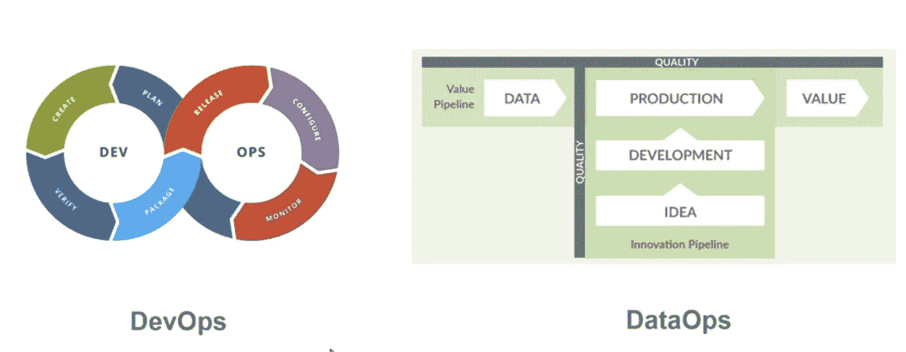
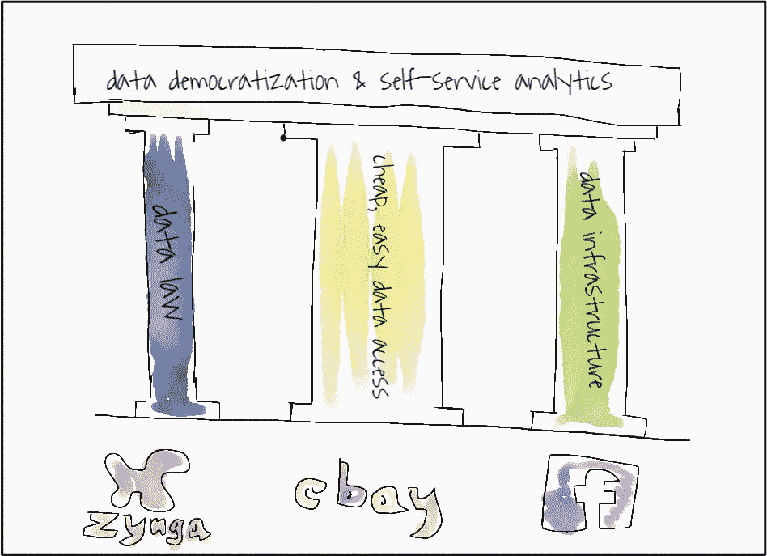
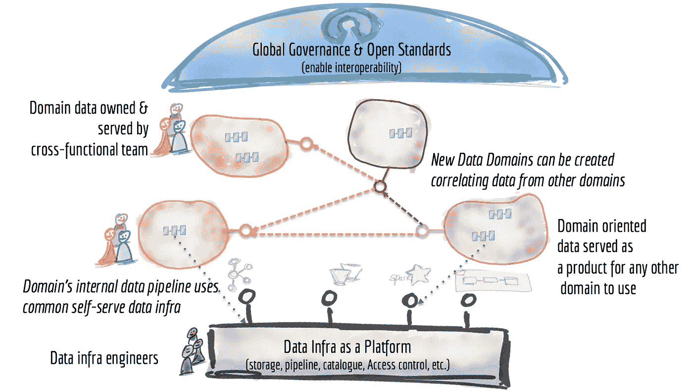

# 将在 2020–2021 年扰乱您的数据和分析战略的 4 种趋势

> 原文：<https://towardsdatascience.com/4-trends-that-will-disrupt-your-data-analytics-strategy-in-2020-2021-9005335be907?source=collection_archive---------15----------------------->

## 持续智能、数据操作、数据民主化和数据网状化是我最近观察到的数据分析的四大趋势。所有这些都可能在 2020-21 年与你的业务相关，不是因为它们是“最新的东西”，而是因为有三种主要的潜在力量推动这些趋势向前发展。他们会以这样或那样的方式来找你。

*Analytics &数据战略:三种力量，数据需求、数据增长和复杂性增长伴随着四种趋势。图片由作者提供。*

在这篇文章中，我将解释:

*   定义未来十年分析策略的**三大力量**是什么。
*   这三种力量目前形成的四种趋势**是什么，将在 2020-21 年相关。**
*   趋势是什么在**有些细节**有资源链接，比我能更好地解释它们。

让我们来了解一下会扰乱您的分析策略的三种力量和四种趋势！

# **趋势概述**

我一次又一次地偶然发现了四个趋势，我相信它们将在 2020-21 年与分析领域的几乎所有人相关。这四个趋势是

1.  **数据网格:**数据不是副产品，而是实际产品。生产团队的所有权。 [ThoughtWorks](https://www.thoughtworks.com/) 推出的一个概念。
2.  **数据民主化:**公司中的每个人都可以访问大量数据，包括非技术员工，例如 AirBnB(采用率接近 50%)。
3.  **持续智能**:通过机器学习和大量持续数据摄取&处理进行自动近实时决策支持&。
4.  **DataOps** :专注于通过数据传递价值，并将现在常见的软件工程实践，如持续集成(CI) &持续交付(CD)等引入数据管道。

但是为什么这四个趋势会变得如此重要呢？我觉得会的，因为有三股主要力量在推动这些趋势。

# 推动这些趋势的潜在力量

据我所知，推动这些趋势的潜在力量将在未来 10 年内继续发展。这就是我相信这些趋势还将持续相当长一段时间的原因。

**不断增长的数据需求:**随着机器学习者、数据科学家和其他人发现越来越多的应用，对作为产品的**数据的需求**正在飙升。4 年前，几乎任何公司的数据科学家和机器学习工程师都很乐意将数据作为副产品，从他们能找到的任何地方提取出来。现在，越来越多的公司拥有 100 多名数据科学家&机器学习工程师，他们都需要适当的数据。公共 API 的使用正在爆炸式增长。出于数据科学目的的公共和公司内部数据集也是如此。

**不断增长的海量数据:**可用数据以及数据采集设备的数量正在飞速增长，而且似乎每三年翻一番*。*

**

*(来源:数据时代 2025，[https://www . Forbes . com/sites/tomcoughlin/2018/11/27/175-zetta bytes-by-2025/# 7f 03 b 9085459](https://www.forbes.com/sites/tomcoughlin/2018/11/27/175-zettabytes-by-2025/#7f03b9085459))*

***市场越来越复杂:**我确实相信，市场和我们所处的竞争环境会变得越来越复杂。例如，在本书[“Edge:价值驱动的数字化转型”](https://www.thoughtworks.com/books/edge)中给出了定性原因。我也相信知识的增长与世界的复杂性相关，因此学术论文的指数增长可能是另一个观察复杂性增长的好点。*

**

*(来源:[金哈，Arif。(2010).5000 万篇:对现存学术文章数量的估计。学过出版。23.258–263.10.1087/20100308.](https://www.researchgate.net/publication/229062236_Article_50_million_An_estimate_of_the_number_of_scholarly_articles_in_existence))*

*所有这些力量本质上为掌握处理数据并将其转化为决策和行动的公司带来了巨大的竞争优势。让我们来详细探讨有助于建立这种竞争优势的四种趋势。*

# ***趋势 1:持续的详细情报***

*持续智能是现在存在的一种可能性，以前是不存在的。*

> ***使从数据到决策的循环成为可能&行动是连续的，而不是“一次性的”！***

*事实证明，一个在[Amazon.com](http://amazon.com/)上向你展示产品推荐的基本“推荐引擎”可以对用户行为的变化或 A/B 测试的结果做出极快的反应。这些推荐引擎已经完成了从数据到行动的循环，形成了一个连续的流程。*

*但是这种技术，在变体中，可以应用于几乎任何类型的动作和任何类型的数据。它可能以其他形式出现，如“决策支持”或统计，但它确实存在。*

*在其他公司，这种循环只是一次性的线性事情，但在一些公司，这已经变成了巨大的竞争优势。比如搜索中的 Google，推荐中的 Amazon，二手车定价中的 wirkaufendeinauto.de 等等。*

*智能循环是将行动产生的原始数据再次转化为新的决策和行动的方式。思想作品是这样描述的:*

**

*(来源:[https://www . thoughtworks . com/insights/articles/intelligent-enterprise-series-models-enterprise-intelligence # continuous intelligence](https://www.thoughtworks.com/insights/articles/intelligent-enterprise-series-models-enterprise-intelligence#continuousintelligence))*

***#1 如何应对这一趋势:**将你的公司置于智能成熟度模型之上。然后花一分钟思考一下你所在行业的其他公司在这个领域可能处于什么位置。这真的决定了你是在追赶，还是能够获得竞争优势。*

**

*(来源:(来源:[https://www . thoughtworks . com/insights/articles/intelligent-enterprise-series-models-enterprise-intelligence # continuous intelligence](https://www.thoughtworks.com/insights/articles/intelligent-enterprise-series-models-enterprise-intelligence#continuousintelligence))*

***#2 不评价这个趋势的理由:**我觉得没有不评价这个趋势的理由。持续智能已经应用于您不会想到的行业、医院、工业组织，以优化机器吞吐量并发现错误或损坏机器，以及整个行业。如上所述，数据呈指数级增长，随之而来的是其他公司破坏您的数据的机会。不过，我确实认为贵公司的时间框架取决于你们的竞争环境以及你们的内部情况。*

***#3 首先考虑其他趋势的理由:**如果你没有投入任何努力使数据在你的公司可用，不要认为自己是数据驱动或数据启发的，那么你可能要首先考虑其他趋势。*

***#4 其他资源:** ThoughtWorks 提供了关于这个主题的大量资源，很好地解释了机器学习连续循环是如何工作的，以及决策支持是如何工作的:*

*   *[ThoughtWorks 智能企业系列](https://www.thoughtworks.com/insights/articles/intelligent-enterprise-series-models-enterprise-intelligence#continuousintelligence)第 1 部分。*
*   *[智造企业系列](https://www.thoughtworks.com/de/insights/articles/intelligent-enterprise-series-patterns-enterprise-intelligence)第二部。*
*   *ThoughtWorks 智能企业系列第三部分。*

# ***趋势 2:详细数据操作***

*数据操作是一种趋势的名称，现在已经有了适当的形式。这是将产品和价值观点以及软件工程的最佳实践整合到通常的数据工作中的趋势。*

*这一趋势是由数据操作宣言、数据厨房、数据砖块和数据砖块推动的。*

*DataOps 意味着我们应用 DevOps 思维，结合精益制造的常用方法和敏捷思维来处理数据。主要模型包括下面描述的数据和想法管道的想法:*

**

*(来源:([https://medium . com/data-ops/data ops-is-not-just-devo PS-for-data-6e 03083157 b 7](https://medium.com/data-ops/dataops-is-not-just-devops-for-data-6e03083157b7))*

***#1 为什么这一点现在如此重要？**这三种力量都在挤压数据&分析部门专注于在快速变化的环境中提供价值。实际上，dataOps 只是将需要做的事情整理成文，以获得正确的关注。*

***#1 评估这一趋势的理由:**如果你的公司&你的竞争环境变得越来越复杂，你的数据世界也会随之而来。*

*评估这一趋势的第二个理由:如果你的数据分析团队正努力在像 SCRUM 这样的敏捷框架中工作，因为他们应该这样做。如果你没有产品经理负责你的分析数据团队，因为你应该有。*

***#3 进一步的资源:**这种趋势还没有形成系统，但是一些信息是可用的，比如宣言和一些博客帖子。这是其中的两个:*

*   *[DataOps Medium](https://medium.com/data-ops/dataops-is-not-just-devops-for-data-6e03083157b7) 博文*
*   *[数据行动宣言](https://www.dataopsmanifesto.org/)*

# ***数据民主化的细节***

*数据民主化用一句话来说就是“把数据访问权给所有人”。Airbnb、Zynga、易贝和脸书等公司多年来一直在积极实践数据民主化。这些公司有很多陷阱，也有很多值得我们学习的地方，这就是为什么我已经写了这些:*

**

*(资料来源:我在一篇关于数据民主化的[文章中写的](/democratize-data-like-zynga-facebook-and-ebay-do-b15a7325c54a))*

***#1 为什么这一点现在如此重要？世界变得越来越复杂，这意味着决策实际上需要更多的数据。没有它，在一个日益复杂的世界里，另一种决策方式——直觉——迟早会失灵。不断增长的数据量实际上意味着有更多的数据你必须给人们访问。***

***#2 评价这种趋势的理由:**你们公司有多少人可以接触到数据？30%或更少？那么你肯定低于采取行动的门槛(行业平均水平在 30-40%之间)。*

***#3 不评估这一趋势的理由**:您有大型自助分析设置？直接 SQL 访问或贵公司大多数人可比拟的东西？那就没有理由去深究这个趋势了。*

***#4 资源:***

*   *[我发的一篇关于这个话题的帖子](/democratize-data-like-zynga-facebook-and-ebay-do-b15a7325c54a)。*
*   *[博客文章解释了朝着这个方向发展的一些原因](https://medium.com/datadriveninvestor/the-problems-facing-data-analytics-customers-today-eedfe527af2e)。*

# ***详细数据网格***

*DDD，微服务在过去的十年里改变了我们开发软件的方式。然而，分析部门的数据却赶不上这一速度。为了在采用现代开发方法的公司中加快基于数据的决策制定，分析软件团队需要改变。*

*(1)软件团队必须将*数据视为产品*，他们*为其他所有人*服务，包括分析团队*

*(2)分析团队必须以此为基础，停止囤积数据，转而按需获取数据*

*(3)分析团队必须开始将他们的*数据湖/数据仓库也视为数据产品*。*

*数据网格可能看起来像这样:*

**

*(来源:z . Dehghani:[https://Martin fowler . com/articles/data-monolith-to-mesh . html](https://martinfowler.com/articles/data-monolith-to-mesh.html))*

***#1 考虑构建数据网格的理由:**复杂的领域、庞大的组织结构、大量的数据以及不断增长的内部数据需求都是考虑这一趋势的好理由。*

***#2 不考虑数据网格的理由:**如果你觉得你的领域仍然很简单，很容易由一个分析部门来管理，那么我看不出有什么理由要转向数据网格。正如微服务一样，数据网格是灵活性(通过数据网格获得)和复杂性*(通过数据网格增长)之间的*权衡。如果复杂的成本不值得，保持一个中心的方法。***

***#3 资源:**基于数据网格的资源基础在不断增长，我想在这里强调三个。*

*   *来自 ThoughtWorks 的 Z. Dehghani 的[原始数据网格文章。](https://martinfowler.com/articles/data-monolith-to-mesh.html)*
*   *一个[更实用的版本我就这个题目写了](/data-mesh-applied-21bed87876f2)。*
*   *Zalando 网络研讨会解释了他们与 ThoughtWorks 一起实施的数据网格版本。*
*   *Zalando 解释了他们的数据网格版本。*

**就是这样！**

*我希望听到一些关于我可能错过的其他趋势的反馈，你认为这三种力量如何推动未来的分析策略。*