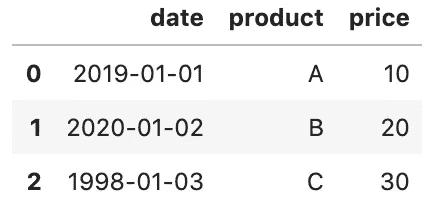
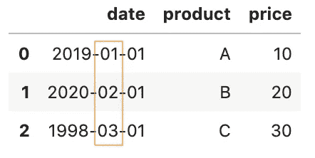
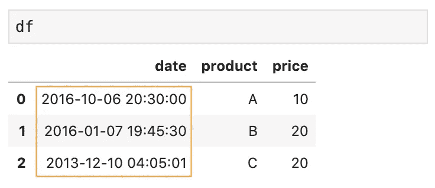

# 您应该知道的用 Pandas read_csv()解析日期列的 4 个技巧

> 原文：<https://towardsdatascience.com/4-tricks-you-should-know-to-parse-date-columns-with-pandas-read-csv-27355bb2ad0e?source=collection_archive---------0----------------------->

## 一些最有用的熊猫把戏


布莱斯·巴克在 [Unsplash](https://unsplash.com/s/photos/date-and-time?utm_source=unsplash&utm_medium=referral&utm_content=creditCopyText) 上拍摄的照片

导入数据是任何数据科学项目的第一步。通常，您会处理 CSV 文件中的数据，并在一开始就遇到问题。

在这些问题中，解析日期列是最常见的。在本文中，我们将讨论以下最常见的解析日期列问题:

1.  从 CSV 文件中读取日期列
2.  日首格式(日/月、日/月或日-月)
3.  将多个列组合成一个日期时间
4.  自定义日期解析器

请查看我的 [Github repo](https://github.com/BindiChen/machine-learning/blob/master/data-analysis/012-parse-date-with-read_csv/parse-date-column-with-read_csv.ipynb) 获取源代码。

# 1.从 CSV 文件中读取日期列

默认情况下，从 CSV 文件加载数据时，日期列表示为**对象**。

例如 **data_1.csv**

```
date,product,price
1/1/2019,A,10
1/2/2020,B,20
1/3/1998,C,30
```

使用默认的`read_csv()`将 ***日期*** 列读取为**对象**数据类型:

```
df = **pd.read_csv('data/data_1.csv')**
df.info()RangeIndex: 3 entries, 0 to 2
Data columns (total 3 columns):
 #   Column   Non-Null Count  Dtype 
---  ------   --------------  ----- 
 **0   date     3 non-null      object**
 1   product  3 non-null      object
 2   price    3 non-null      int64 
dtypes: int64(1), object(2)
memory usage: 200.0+ bytes
```

为了正确读取 ***日期*** 列，我们可以使用参数`parse_dates`来指定日期列的列表。

```
df = pd.read_csv('data/data_3.csv', **parse_dates=['date']**)
df.info()RangeIndex: 3 entries, 0 to 2
Data columns (total 3 columns):
 #   Column   Non-Null Count  Dtype         
---  ------   --------------  -----         
 **0   date     3 non-null      datetime64[ns]**
 1   product  3 non-null      object        
 2   price    3 non-null      int64         
dtypes: datetime64[ns](1), int64(1), object(1)
memory usage: 200.0+ bytes
```

现在，数据帧应该看起来像这样:



# 2.日首格式(日/月、日/月或日-月)

默认情况下，`parse_dates`参数会先读取月( **MM/DD** 、 **MM DD、**或 **MM-DD** )格式的日期数据，这种安排在美国是比较独特的。

在世界上大多数其他地方，首先写的是日期( **DD/MM** 、 **DD MM** 或 **DD-MM** )。如果你想让熊猫先考虑日子而不是月份，你可以将参数`dayfirst`设置为`True`。

```
pd.read_csv('data/data_1.csv', 
            parse_dates=['date'], 
            **dayfirst=True**)
```



或者，您可以定制一个日期解析器来处理第一天的格式。请查看" **4 中的解决方案。定制日期解析器**”。

# 3.将多个列组合成一个日期时间

有时日期被拆分成多列，例如， ***年*** ， ***月*** ，以及 ***日***

```
year,month,day,product,price
2019,1,1,A,10
2019,1,2,B,20
2019,1,3,C,30
2019,1,4,D,40
```

为了将它们组合成一个日期时间，我们可以将一个嵌套列表传递给`parse_dates`。

```
df = pd.read_csv('data/data_4.csv',
                 **parse_dates=[['year', 'month', 'day']]**)
df.info()RangeIndex: 4 entries, 0 to 3
Data columns (total 3 columns):
 #   Column          Non-Null Count  Dtype         
---  ------          --------------  -----         
 **0   year_month_day  4 non-null      datetime64[ns]**
 1   product         4 non-null      object        
 2   price           4 non-null      int64         
dtypes: datetime64[ns](1), int64(1), object(1)
memory usage: 224.0+ bytes
```

注意，列名***year _ month _ day***是自动生成的。为了指定一个定制的列名，我们可以传递一个字典来代替。

```
df = pd.read_csv('data/data_4.csv',
                 parse_dates=**{ 'date': ['year', 'month', 'day'] }**)
df.info()RangeIndex: 4 entries, 0 to 3
Data columns (total 3 columns):
 #   Column   Non-Null Count  Dtype         
---  ------   --------------  -----         
 **0   date     4 non-null      datetime64[ns]**
 1   product  4 non-null      object        
 2   price    4 non-null      int64         
dtypes: datetime64[ns](1), int64(1), object(1)
memory usage: 224.0+ bytes
```

# 4.自定义日期解析器

默认情况下，使用来自`dateutil.parser.parse`的 Pandas 内置解析器解析日期列。有时，您可能需要编写自己的解析器来支持不同的日期格式，例如， **YYYY-DD-MM HH:MM:SS** :

```
date,product,price
2016-6-10 20:30:0,A,10
2016-7-1 19:45:30,B,20
2013-10-12 4:5:1,C,20
```

最简单的方法是编写一个 lambda 函数，它可以读取这种格式的数据，并将 lambda 函数传递给参数`date_parser`。

```
from datetime import datetimecustom_date_parser = lambda x: datetime.strptime(x, "**%Y-%d-%m %H:%M:%S**")df = pd.read_csv('data/data_6.csv',
                 parse_dates=['date'],
                **date_parser=custom_date_parser**)
df.info()RangeIndex: 3 entries, 0 to 2
Data columns (total 3 columns):
 #   Column   Non-Null Count  Dtype         
---  ------   --------------  -----         
 **0   date     3 non-null      datetime64[ns]**
 1   product  3 non-null      object        
 2   price    3 non-null      int64         
dtypes: datetime64[ns](1), int64(1), object(1)
memory usage: 200.0+ bytes
```

现在，熊猫数据框中的日期栏已被正确读取。



# 好了

感谢阅读。

源代码请查看我的 Github 上的[笔记本。](https://github.com/BindiChen/machine-learning)

如果你对机器学习的实用方面感兴趣，请继续关注。

一些相关文章

*   [你应该知道的 6 个熊猫技巧，以加速你的数据分析](/6-pandas-tricks-you-should-know-to-speed-up-your-data-analysis-d3dec7c29e5)
*   数据科学项目开始时应该包括的 7 个设置。