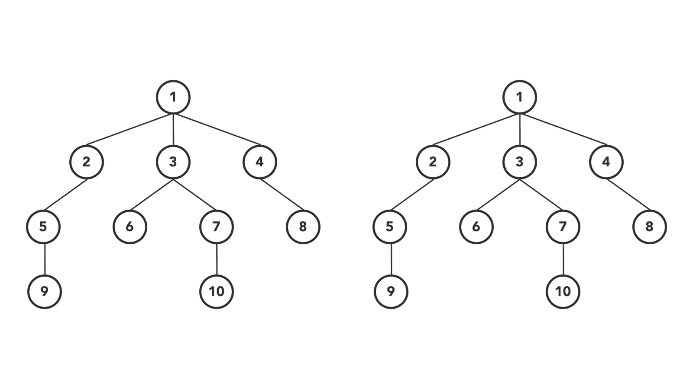
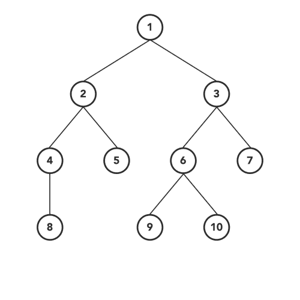

# 4 种类型的树遍历算法

> 原文：<https://towardsdatascience.com/4-types-of-tree-traversal-algorithms-d56328450846?source=collection_archive---------0----------------------->

## 在 7 分钟内你需要知道的关于树遍历的一切(带动画)

DFS 和 BFS 算法||由[阿南德·K·帕尔马](https://medium.com/u/bafde9c53431?source=post_page-----d56328450846--------------------------------)设计

如果你是一名职业程序员或者在软件行业工作多年，那么这个话题对你来说可能显得很琐碎。但是这种算法的用例以及不同的变体可能会在初学者的头脑中造成混乱。因此，我试图把所有你需要知道的关于树遍历的知识放在这篇文章中(带动画)。

> ”**动画**可以解释人类大脑所能想到的一切。这种功能使它成为迄今为止为大众快速欣赏而设计的最通用、最明确的交流方式。”―华特·迪士尼

这篇文章不仅仅是关于这些算法的理论，你还将学习如何通过代码实现这些算法。

# 时间表

1.  树形数据结构
2.  树遍历-简介
3.  让我们开始吧——实用指南
4.  有序遍历
5.  前序遍历
6.  后序遍历
7.  层次顺序遍历
8.  最终注释

# 1.树形数据结构

在进入树遍历算法之前，让我们先将树定义为一种数据结构。这将帮助你以一种有意义的方式掌握概念。

> **Tree** 是一种分层数据结构，它以分层的形式自然地存储信息，不像线性数据结构，如链表、堆栈等。树包含不应形成循环的节点(数据)和连接(边)。

以下是树形数据结构的几个常用术语。

**节点—** 节点是一种结构，它可以包含一个值或条件，或者表示一个单独的数据结构。

**根—** 树中的顶层节点，主要祖先。

**子节点—** 离开根节点时直接连接到另一个节点的节点，即直接后代。

**父母—** 孩子的相反概念，直系祖先。

**叶—** 没有子节点的节点。

**内部节点—** 至少有一个子节点的节点。

**边缘—** 一个节点与另一个节点之间的连接。

**深度—** 节点与根之间的距离。

**级别—** 节点和根之间的边数+ 1

**高度—** 节点和后代叶子之间最长路径上的边数。

**宽度—** 叶子的数量。

**子树—** 树 *T* 是由 *T* 中的一个节点及其在 *T* 中的所有后代组成的树。

**二叉树—** 是一种树形数据结构，其中每个节点最多有两个子节点，分别称为左子节点和右子节点。

**二叉查找树** —是一种特殊类型的二叉树，具有以下属性。

*   节点的左子树只包含键小于该节点键的节点。
*   节点的右边子树只包含键大于节点键的节点。
*   左侧和右侧的子树都必须是二叉查找树。

> 注意:为了简单起见，我们将以**二叉树**为例来理解树遍历算法。但是这些算法也可以推广到其他类型的树。

# 2.树遍历-简介

> 在计算机科学中，**树遍历**(也称为**树搜索**)是图遍历的一种形式，指的是访问(检查和/或更新)树数据结构中的每个节点，恰好一次的过程。这种遍历按照节点被访问的顺序进行分类—维基百科

Wikipedia 定义不言自明，可以理解树遍历的含义。但是我想详细说明定义的最后一行，这将有助于我们理解树遍历的类型以及它们之间的区别。

根据节点被访问的顺序，树遍历算法可以大致分为以下两类:

*   **深度优先搜索(DFS)算法:**它从根节点开始，首先尽可能深地访问一个分支的所有节点，在回溯之前，它以类似的方式访问所有其他分支。这下面有三个子类型，我们将在本文中介绍。
*   **广度优先搜索(BFS)算法:**它也从根节点开始，在移动到树中的下一个深度之前，访问当前深度的所有节点。我们将在下一节讨论一种 BFS 类型的算法。

# 3.让我们开始吧——实用指南

是时候用实际的方法来理解这个概念了。我将使用 Java 编程语言来解释代码。但是这些算法可以用你喜欢的编程语言编写，就像我们用 Java 编写一样。

下面是我们的节点类的蓝图，它将作为树数据结构的原子成员。我们将称之为 **TreeNode** ，它将数据保存为一个整数值，左右是相同类型的子节点(TreeNode)。您可以使用任何其他数据结构将 as 数据保存在 **TreeNode 下。**

# 4.有序遍历

Inorder 遍历是 DFS(深度优先搜索)遍历树的一种最常用的变体。

正如 DFS 所建议的，我们将首先关注所选节点的深度，然后再去关注该级别的广度。因此，我们将从树的**根**节点开始，以递归的方式越来越深入到左边的子树。

当我们通过上面的步骤到达最左边的节点时，我们将访问当前节点并转到它的右边子树的最左边的节点(如果存在的话)。

应该以递归方式遵循相同的步骤来完成有序遍历。这些步骤的顺序如下(在递归函数中)…

1.  转到左侧子树
2.  访问节点
3.  转到右侧子树

顺序遍历||由[阿南德·K·帕尔马](https://medium.com/u/bafde9c53431?source=post_page-----d56328450846--------------------------------)设计

> **重要事实:** Inorder 遍历二叉查找树总会给你节点排序的方式。

# 5.前序遍历

前序遍历是 DFS 的另一种变体。其中递归函数中的原子操作与顺序遍历相同，但顺序不同。

这里，我们首先访问当前节点，然后转到左边的子树。在覆盖了左侧子树的每个节点之后，我们将向右侧子树移动，并以类似的方式进行访问。

这些步骤的顺序如下…

1.  访问节点
2.  转到左侧子树
3.  转到右侧子树

前序遍历||由 [Anand K Parmar](https://medium.com/u/bafde9c53431?source=post_page-----d56328450846--------------------------------) 设计

# 6.后序遍历

后序遍历也是如此。其中我们在递归中访问当前节点之前先访问左子树和右子树。

因此，这些步骤的顺序将是…

1.  转到左侧子树
2.  转到右侧子树
3.  访问节点

后序遍历||由 [Anand K Parmar](https://medium.com/u/bafde9c53431?source=post_page-----d56328450846--------------------------------) 设计

# 7.层次顺序遍历

这是一个不同于我们上面所讨论的遍历。层次顺序遍历遵循 BFS(广度优先搜索)来访问/修改树的每个节点。

正如 BFS 所建议的，树的广度优先，然后向深度移动。简而言之，我们将从左到右逐个访问同一级别的所有节点，然后移动到下一个级别，访问该级别的所有节点。

层次顺序遍历||由 [Anand K Parmar](https://medium.com/u/bafde9c53431?source=post_page-----d56328450846--------------------------------) 设计

与上面三个遍历相比，这里的实现稍微有点挑战性。我们将使用队列(FIFO)数据结构来实现层次顺序遍历，其中在访问一个节点后，我们简单地将它的左右子节点按顺序放入队列。

这里，在队列中添加孩子的顺序很重要，因为我们必须在同一级别从左到右遍历。查看以下要点以获得更多理解。

# 8.最终注释

树遍历算法可以大致分为两类:

*   深度优先搜索(DFS)算法
*   广度优先搜索(BFS)算法

**深度优先搜索(DFS)算法有三种变体:**

1.  前序遍历(当前-左-右)-在访问左或右子树中的任何节点之前，先访问当前节点。
2.  in order Traversal(left-current-right)-在访问左侧子树中的所有节点之后，但在访问右侧子树中的任何节点之前，访问当前节点。
3.  后序遍历(左-右-当前)-在访问左、右子树的所有节点后访问当前节点。

**广度优先搜索(BFS)算法有一个变种:**

1.  层级顺序遍历—在同一层级以从左到右的方式逐层访问节点。

查看我的 [Github 库](https://github.com/anandkumarkparmar/Data-Structures-Algorithms/tree/master/data-structures/binary-tree)获取详细代码。

> **重要事实:**还有其他的树遍历算法，既不是深度优先搜索，也不是广度优先搜索。一种这样的算法是[蒙特卡罗树搜索](https://en.wikipedia.org/wiki/Monte_Carlo_tree_search)，它集中分析最有希望的移动，基于搜索空间的随机抽样扩展搜索树。

# 您的机会…

加入我的部落后，获得我的个人 Java 收藏清单作为免费的欢迎礼物。 [*马上获取！*](https://mailchi.mp/809aa58bc248/anandkparmar)

# 关于作者

Anand K Parmar 是一名软件工程师，热爱设计和开发移动应用程序。他是一名作家，发表关于计算机科学、编程和个人理财的文章。在 [LinkedIn](https://www.linkedin.com/in/anandkparmar/) 或 [Twitter](https://twitter.com/anandkparmar_) 上与他联系。下面是他的最新文章。

 [## 每个初学者都应该知道数据结构和算法之间的区别

### 理解计算机科学基础的简单指南

medium.com](https://medium.com/swlh/differences-between-data-structures-and-algorithms-eed2c1872cfc)