# 管理不平衡分类场景的 4 种独特方法

> 原文：<https://towardsdatascience.com/4-unique-approaches-to-manage-imbalance-classification-scenario-7c5b92637b9c?source=collection_archive---------24----------------------->

## [内部 AI](https://towardsdatascience.com/machine-learning/home)

## 大多数业务案例都与预测少数群体事件有关，如欺诈、联合检测等。基于不平衡数据训练的机器学习模型对罕见事件的预测精度非常差。


由[阿马尔·埃拉米尔](https://unsplash.com/@ammarelamir?utm_source=medium&utm_medium=referral)在 [Unsplash](https://unsplash.com?utm_source=medium&utm_medium=referral) 上拍摄的照片

在数十亿笔金融交易中，只有少数涉及欺骗和欺诈。在公路上行驶的数百万辆汽车中，只有少数在公路中间抛锚，其余的都开得很好。如果我们密切关注我们的日常活动，那么也可以发现一些例外事件。相同的倾斜数据存在于许多数据点中，其中一个或几个类别覆盖了大多数情况。

当我们向机器学习算法提供这些不平衡的数据点时，少数多数类会以忽略少数类为代价产生严重影响。大多数业务案例都与预测少数群体事件有关，如欺诈、联合检测等。在不平衡数据上训练的机器学习模型对罕见事件的预测精度非常差。

在本文中，我将讨论处理不平衡数据集和提高少数类预测准确性的四种独特方法。此外，我们还将了解为什么仅考虑分类指标分数(如 F1 分数或准确度)会误导罕见事件预测中的模型预测性能。

我们将使用 ***Scitkit-Learn*** 中的 make_classification 方法来生成不平衡数据集。

```
import pandas as pd
from sklearn.model_selection import train_test_split
from sklearn.datasets import make_classification
from sklearn.ensemble import RandomForestClassifier
from sklearn.metrics import f1_score,accuracy_score
from sklearn.metrics import plot_confusion_matrix
import matplotlib.pyplot as plt
```

我们将学习五种独特的方法来处理 5000 个样本的不平衡数据集，其中一个类包含 98%的案例。

```
X, y = make_classification(n_samples=5000,weights=[0.02, 0.98],
                           random_state=0,n_clusters_per_class=1)ycount=pd.DataFrame(y)
print(ycount[0].value_counts())
```

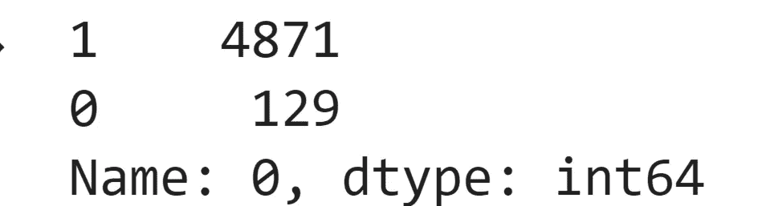

样本数据集中多数类和少数类的比例(上面代码的输出)

在 5000 个样本记录中，我们有 4871 个 1 类记录和 129 个 0 类记录。让我们考虑等级 1 表示正常交易，等级 0 表示欺诈交易。

样本数据集分为两部分，即。训练和测试设备。训练集是训练机器学习模型，测试集是检验模型的预测。

我们将使用 80%的样本数据集来训练模型，剩余的 20%模型以前没有见过的记录保留给测试集。

```
X_train, X_test, y_train, y_test = train_test_split(X, y, test_size=0.2,random_state=42,stratify=y)
```

为了理解不平衡数据集甚至对像随机森林分类器这样的复杂算法的影响，让我们首先用不平衡训练集直接训练标准随机森林分类器，并且没有任何权重参数。

```
clf =RandomForestClassifier(max_depth=2,random_state=0).fit(X_train, y_train)print("F1 Score is ", f1_score(y_test,clf.predict(X_test)))
print("Accuracy Score is ", accuracy_score(y_test,clf.predict(X_test)))
```

经过训练的随机森林分类器模型在测试数据集上的 F1 分和准确率分都很高。但是，在不平衡数据集的情况下，仅考虑这些度量来判断模型的预测性能可能是非常误导的。

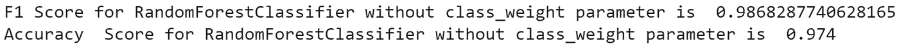

F1 和在不平衡数据集上训练的随机森林分类器的准确度分数(上述代码的输出)

仅基于这两个指标部署这样一个模型，而不了解分类模型在哪些方面出错，成本可能会非常高。

像混淆矩阵这样的视觉指标在几个方面胜过其他指标。我们可以即时了解模型在分类方面的性能，以及模型的优势和需要微调的方面。基于业务用例，我们可以从假阳性、假阴性、真阳性和真阴性计数中快速判断模型是否准备好进行部署。

您可以在文章[准确性可视化:监督机器学习分类算法](/accuracy-visualisation-supervised-machine-learning-classification-algorithms-af13d18fcc6c)中深入了解混淆矩阵

```
fig=plot_confusion_matrix(clf, X_test, y_test)
plt.show()
```

正如预期的那样，多数类已经完全影响了模型，并且经过训练的模型已经将测试数据集中所有记录的分类预测为多数类。在罕见的欺诈检测或罕见的恶性疾病预测的情况下，这种错误分类预测是非常有害的。

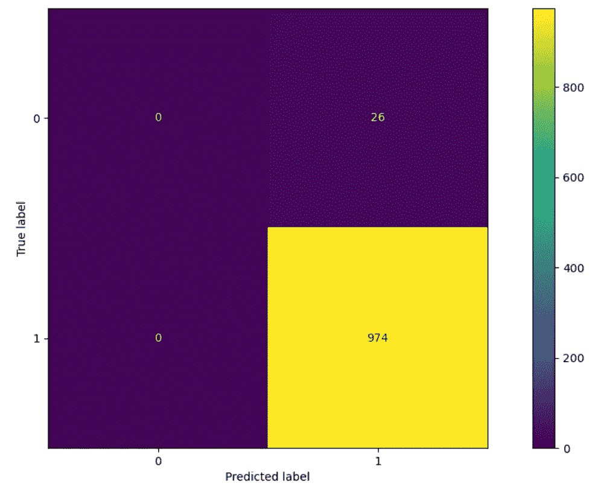

通过在不平衡数据集上训练的随机森林分类器预测测试数据集的混淆矩阵(上述代码的输出)

幸运的是，Random Forrest 分类器有一个参数“class_weight ”,用于在不平衡数据集的情况下指定每个类的权重。

在样本数据集中，类 1 比类 0 普遍大约 38 倍。因此，我们将按这样的比例提及“类权重”,以便算法在训练期间进行补偿。

```
weighted_clf = RandomForestClassifier(max_depth=2, random_state=0,**class_weight={0:38,1:1}**).fit(X_train, y_train)print("F1 Score for RandomForestClassifier with class_weight parameter is ", f1_score(y_test,weighted_clf.predict(X_test)))print("Accuracy  Score for RandomForestClassifier with class_weight parameter is ", accuracy_score(y_test,weighted_clf.predict(X_test)))
```

具有类别权重补偿的随机森林分类器模型的 F1 分数和准确度分数也很高，但是我们可以通过检查混淆矩阵来确定真实性能。

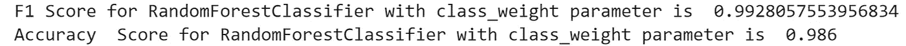

F1 和在具有 **class_weight** 参数的类优化数据集上训练的随机森林分类器的准确度分数(上述代码的输出)

我们可以看到，大多数类还没有完全超越权重调整的随机森林分类器模型。

```
fig=plot_confusion_matrix(weighted_clf, X_test, y_test)
plt.show()
```

在测试数据集中总共 1000 条记录中，它只错误分类了 14 条记录。此外，它还对测试数据集中 26 个少数类记录中的 20 个少数类样本记录进行了正确分类。

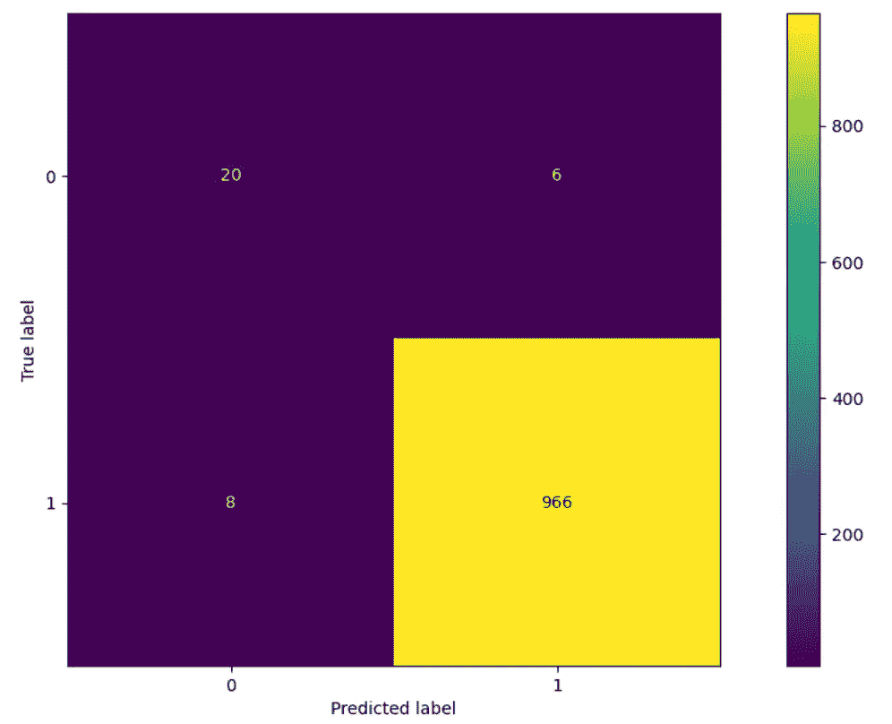

在权重优化数据集上训练的随机森林分类器预测测试数据集的混淆矩阵(上述代码的输出)

我们学习了在随机 Forrest 分类器中处理带有 class_weight 参数的不平衡数据集的方法，提高了少数类的预测精度。

接下来，我们将学习使用不平衡学习库中的 BalancedRandomForestClassifier 管理不平衡输入训练数据集的不同方法。

用 pip 安装不平衡学习库

> pip 安装不平衡-学习

在下面的代码中，我们用训练数据集训练了 BalancedRandomForestClassifier，然后检查了测试数据集上的指标得分。

```
from imblearn.ensemble import BalancedRandomForestClassifierbrfc = BalancedRandomForestClassifier(n_estimators=500,
random_state=0).fit(X_train,y_train)print("F1 Score for Balanced Random Forest Classifier is ", f1_score(y_test,brfc.predict(X_test)))print("Accuracy  Score for Balanced Random Forest Classifier is ", accuracy_score(y_test,brfc.predict(X_test)))
```

和前面两个例子一样，它也表示高 F1 和准确度分数。

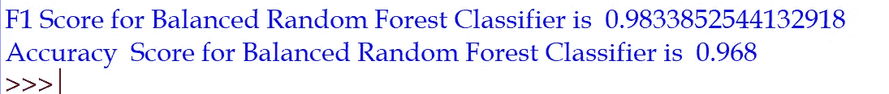

F1 和训练的平衡随机森林分类器的准确度分数(上述代码的输出)

我们可以在混淆矩阵中看到，与没有 weight_class 参数的 RandomForestClassifier 相比，BalancedRandomForestClassifier 在内部很好地处理了类权重。

```
fig=plot_confusion_matrix(brfc, X_test, y_test)
plt.show()
```

在 1000 个测试记录中，它正确地预测了 968 个记录的分类。通过正确地分类少数类中 26 个记录中的 21 个记录，它也比具有 class_weight 的随机 Forrest 分类器表现得稍好。

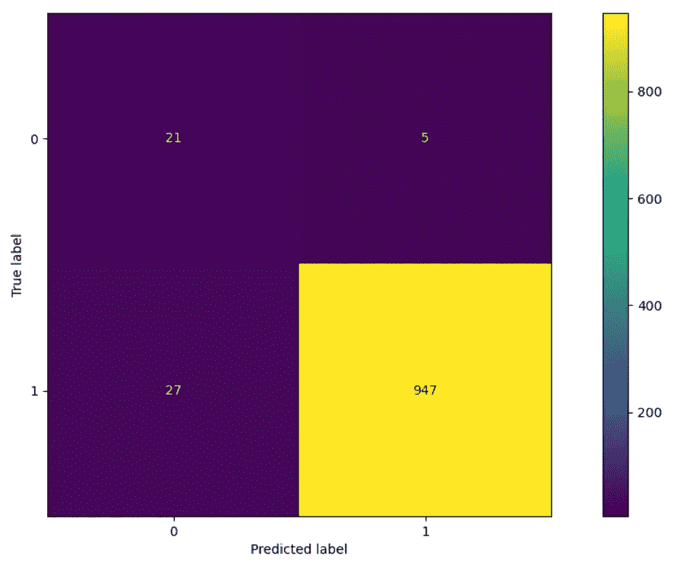

平衡随机森林分类器预测测试数据集的混淆矩阵(上述代码的输出)

接下来，我们将使用完全不同的过采样方法来管理训练数据集中的少数类。

接下来，我们将使用完全不同的过采样方法来管理训练数据集中的少数类。基本思想是在少数类中随机生成示例，以获得更平衡的数据集。

```
from imblearn.over_sampling import RandomOverSampler
ros = RandomOverSampler(random_state=0)
X_resampled, y_resampled = ros.fit_resample(X_train, y_train)
print("Number of records for X_train is ", X_train.shape)
print("Number of records for X_resampled oversampling is ",X_resampled.shape)
```

之前，我们将 5000 条记录的样本数据集分为分别具有 4000 条和 1000 条记录的训练数据集和测试数据集。

RandomOverSampler 上的训练数据集 fit 随机生成少数类记录，重采样的平衡训练数据有 7794 条记录。

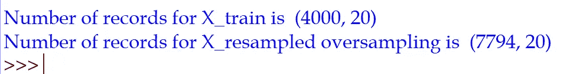

使用过采样策略随机生成的少数类记录对训练数据集进行计数，以平衡训练数据集(上述代码的输出)

一旦训练数据集被人工平衡，那么我们可以在没有“class_weight”参数的情况下训练标准随机森林分类器。

```
oclf = RandomForestClassifier(max_depth=2, random_state=0).fit(X_resampled, y_resampled)
```

我们看到，在过采样的人工平衡训练数据集上训练的标准随机森林分类器可以很好地预测。

过采样有助于随机分类器克服多数分类器的影响，以高精度预测测试数据记录类。

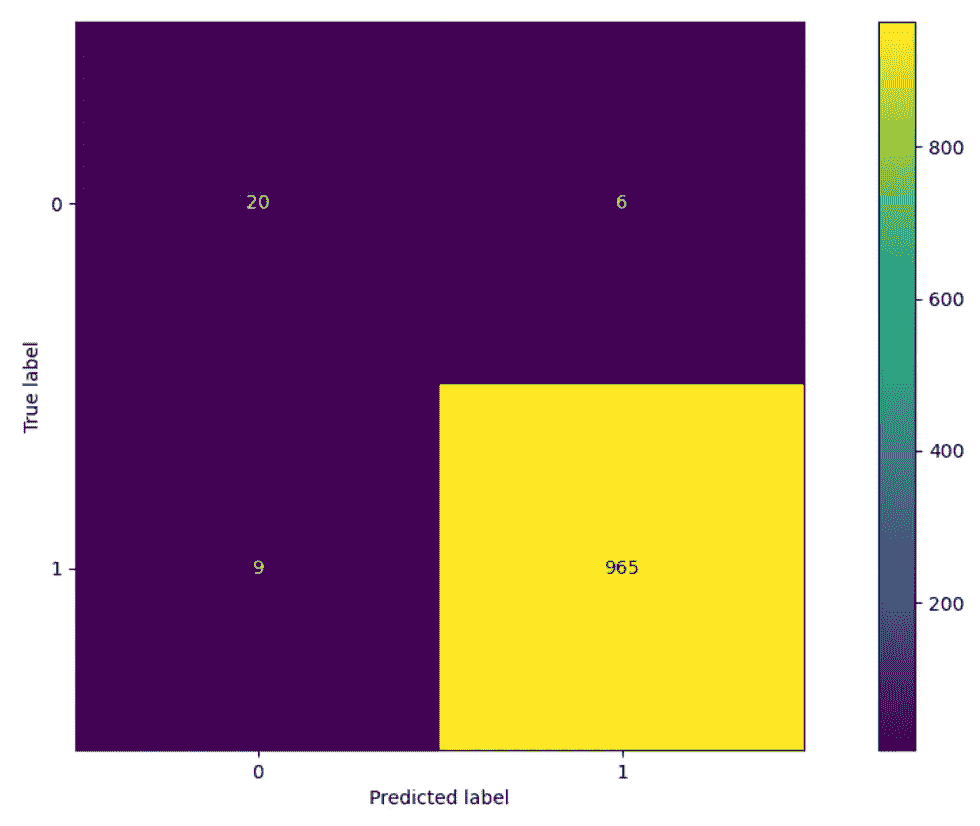

由在过采样数据集上训练的随机森林分类器预测的测试数据集的混淆矩阵(上述代码的输出)

在 1000 个测试记录中，它正确地预测了 985 个记录的分类。它的性能也几乎与 BalancedRandomForestClassifier 相当，对少数类中的 26 个记录中的 20 个进行了分类。

最后，我们将了解处理不平衡数据集的欠采样策略。这是一种与我们之前学习的过采样完全不同的方法。随机删除多数课上的例子。关键思想是随机删除多数类记录，以获得更平衡的数据集。

```
from imblearn.under_sampling import RandomUnderSamplerrus = RandomUnderSampler(random_state=0)
X_resampled, y_resampled = rus.fit_resample(X_train, y_train)print("Number of records for X_train is ", X_train.shape)
print("Number of records for X_resampled undersampling is ",X_resampled.shape)
```

随机删除的多数类记录的数量，以便用 4000 条数据记录中的 206 条记录来平衡训练数据集。

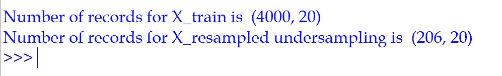

使用欠采样策略的训练数据集计数。随机删除多数类记录以平衡训练数据集(上面代码的输出)

一旦训练数据集达到平衡，我们就可以直接使用它来训练模型，就像前面讨论的过采样策略一样。

```
uclf=RandomForestClassifier(max_depth=2,
random_state=0).fit(X_resampled, y_resampled)
```

似乎欠采样策略能够像本文中讨论的其他策略一样以相似的精度预测罕见的少数类事件，但与其他策略相比，它在预测多数类方面表现得相当差。它错误地预测了测试数据集中的 82 个多数类记录。

```
fig=plot_confusion_matrix(uclf, X_test, y_test)
plt.show()
```

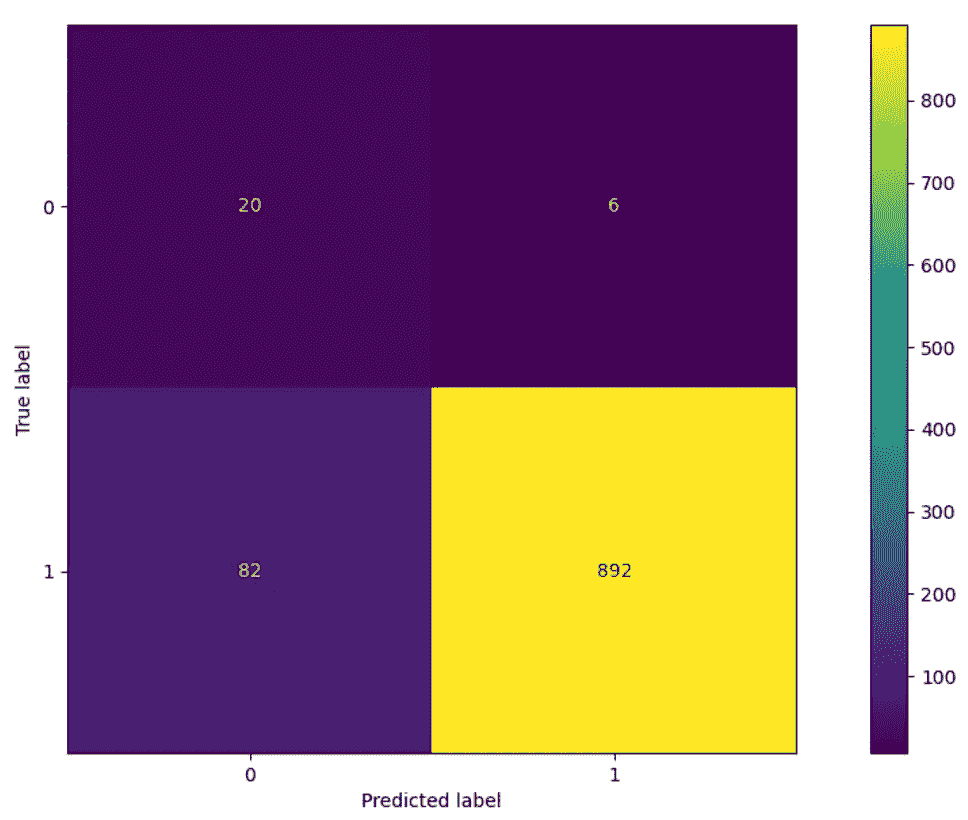

由在欠采样数据集上训练的随机森林分类器预测的测试数据集的混淆矩阵(上述代码的输出)

> *关键要点和我的方法*

大多数机器学习分类算法期望训练数据集是平衡的。在用数据训练机器学习模型之前，检查训练数据集是否不平衡并采取适当的预处理措施至关重要。

GIGO —垃圾输入和垃圾输出:如果我们用不平衡的数据训练一个模型，那么这个模型很有可能会错过对生产中少数类的预测。

数据是非常有价值的。我不喜欢欠采样策略，因为它会强制删除与多数类相关的数据。我们看到，由于这一点，即使该模型能够以与本文中讨论的其他策略几乎相同的精度预测少数类记录，但它在预测多数类记录时表现很差。

我更喜欢带' class_weight '参数的随机森林分类器和不平衡学习库中的 BalancedRandomForestClassifier。

我建议您在为您的项目选择任何一个策略之前，用本文中讨论的所有策略检查训练样本的性能。

您可以通过探索性数据分析深入了解不平衡的数据集。要了解更多信息，请阅读文章- [探索性数据分析(EDA)的 5 种高级可视化](/5-advanced-visualisation-for-exploratory-data-analysis-eda-c8eafeb0b8cb)