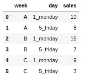
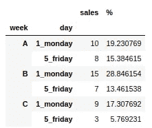
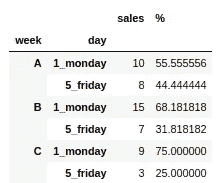
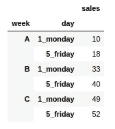
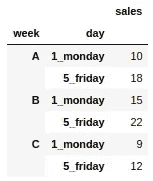
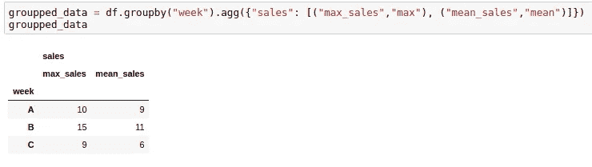
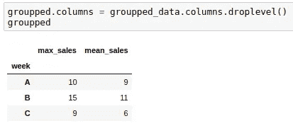
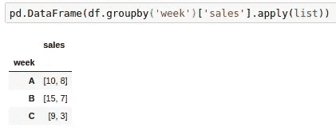

# 如何计算熊猫的组内百分比？

> 原文：<https://towardsdatascience.com/4-useful-tips-of-pandas-groupby-3744eefb1852?source=collection_archive---------7----------------------->

# 和其他分组提示


伊洛娜·弗罗利希在 [Unsplash](https://unsplash.com?utm_source=medium&utm_medium=referral) 上的照片

(这个帖子的所有代码你可以在[我的 github](https://github.com/andryw/pandas_tips) 里找到)

( [#2 关于熊猫的帖子提示:如何显示熊猫数据帧的所有列/行？](/how-to-show-all-columns-rows-of-a-pandas-dataframe-c49d4507fcf))

你好！Pandas 是数据科学中最重要的 Python 库之一。Groupby 是对熊猫进行分析的最强大的功能之一。它类似于 SQL 的 GROUP BY。

在我作为数据科学家的日常生活中，我发现了一些非常有用的分组技巧。但是熊猫群是什么？

# 分组依据

正如 Pandas 文档中所指出的，Groupby 是一个涉及以下一个或多个步骤的过程:

*   根据某些标准将数据分组。
*   将函数独立应用于每个组。
*   将结果组合成数据结构。

在大多数情况下，我们希望将数据分成组，并对这些组做一些事情。通常是聚集，转化，过滤。

我将使用这个玩具销售数据框架来说明这些技巧:



玩具销售数据框架

# 每组内的相对频率

这是我用的最多的功能。很多时候我使用 Groupby 来汇总一些值，我想知道每个组中的值所占的百分比，而不是所有数据中的百分比。
如果我们在汇总数据框中直接计算百分比，将使用所有数据计算结果:

```
groupped_data = df.groupby(['week', 'day']).agg({'sales': 'sum'})
groupped_data["%"] = groupped_data.apply(lambda x:  100*x / x.sum())
groupped_data
```



每天和每周的销售额，但百分比是使用全部数据计算的

例如，第一行的百分比(19.23%)是 10 除以 52(所有销售额的总和)。要计算与每周相关的百分比，我们必须使用 groupby(level = 0):

```
groupped_data["%"] = groupped_data.groupby(level=0).apply(
     lambda x:  100*x / x.sum()
)
groupped_data
```



每天和每周的销售额，但百分比仅使用每周的数据计算

现在，第一行中的百分比(55.55%)只比较 a 周的销售额，groupby("level=0 ")选择层次索引的第一级。在我们的例子中，第一级是*天*。

# 累积和

很多时候我想做一个累加和。在我们的示例中，验证我们每天完成了多少销售。为此，我们需要使用 cumsum()函数:

```
groupped_data.cumsum()
```



销售的累计总额

要计算每周的累积和，您可以使用上一个主题的相同技巧(groupby(level = 0)):

```
groupped_data.groupby(level=0).cumsum()
```



每周的累计销售额

# 更改聚集度量的名称

如果希望在聚合时更改聚合指标的列名，只需传递一个包含新列名和聚合函数的元组:

```
df.groupby("week").agg(
    {"sales": [("max_sales","max"), ("mean_sales","mean")]}
)
```



具有不同列名的聚合列。

如果您想删除级别 *sales* ，这可能会很有用:

```
groupped_data.columns = groupped_data.columns.droplevel()
```



移除数据帧的一个级别

# 将值放入列表中

如果你想把一个组的所有值放入一个列表，你只需要这样做:

```
pd.DataFrame(df.groupby('week')['sales'].apply(list))
```



每周的销售额都在列表中

它将*应用*函数在每周的每个*组的*销售*列中创建一个*列表*。*

## 来源

*   [https://pandas . pydata . org/pandas-docs/stable/user _ guide/group by . html](https://pandas.pydata.org/pandas-docs/stable/user_guide/groupby.html)
*   [https://stack overflow . com/questions/23377108/pandas-percentage-total-with-group by](https://stackoverflow.com/questions/23377108/pandas-percentage-of-total-with-groupby)
*   [https://stack overflow . com/questions/22219004/grouping-rows-in-list-in-pandas-group by](https://stackoverflow.com/questions/22219004/grouping-rows-in-list-in-pandas-groupby)

***目前就这样。但我会回来发布更多关于熊猫和其他数据科学主题的文章。请随意添加您的评论***