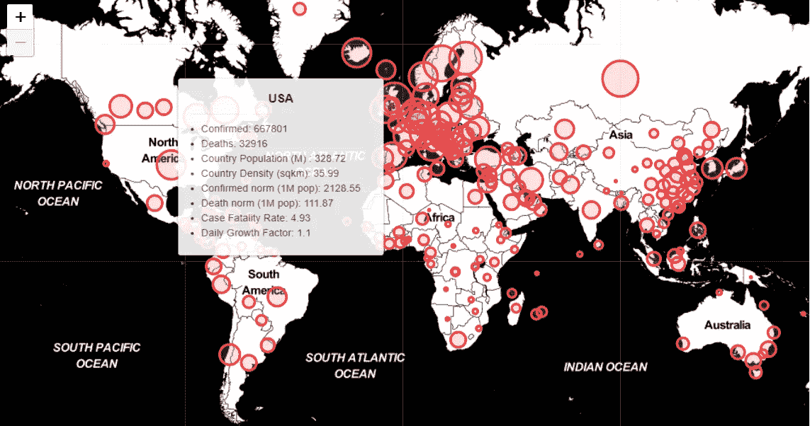
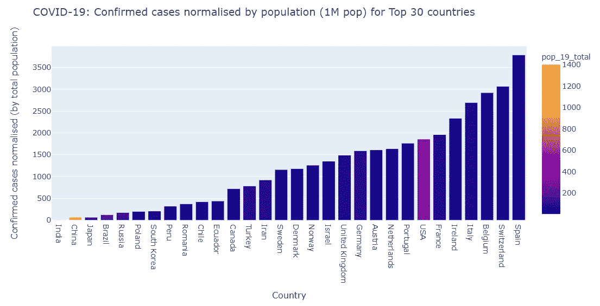
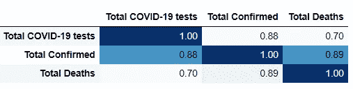
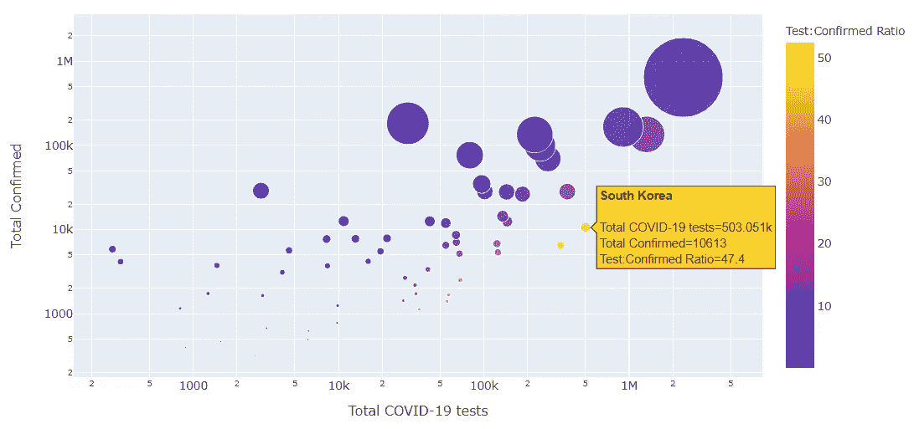
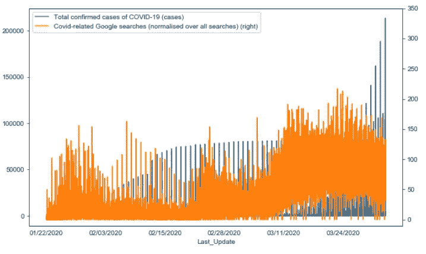
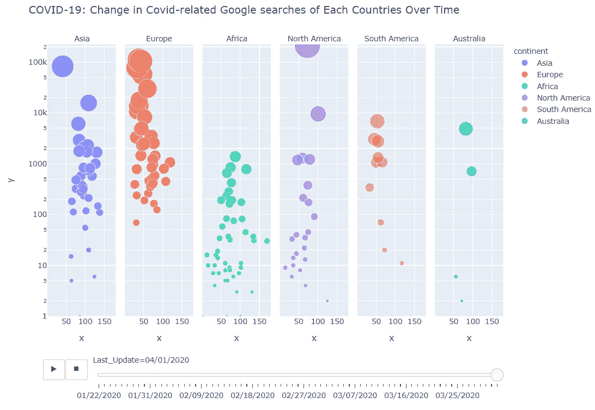
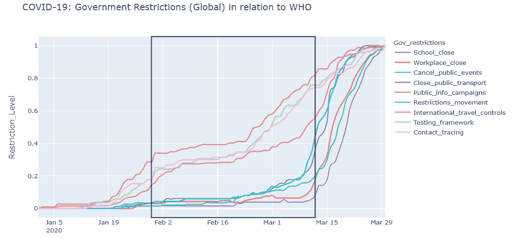
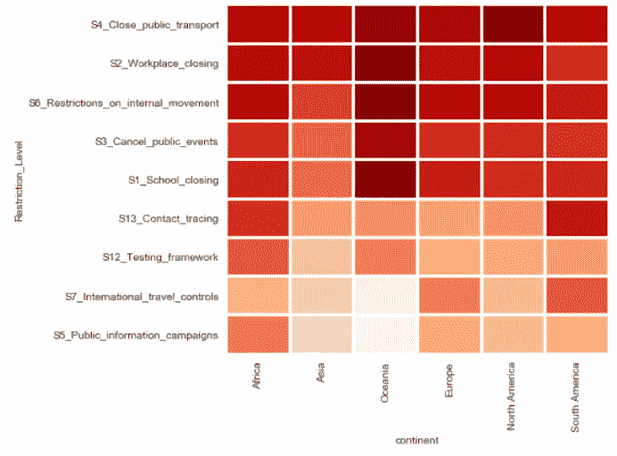

# 分析疫情数据的 4 种方法(新冠肺炎)

> 原文：<https://towardsdatascience.com/4-ways-to-analyse-pandemic-data-covid-19-ccf4bce32a33?source=collection_archive---------29----------------------->

## 从数据科学的角度来看，跨地区和大洲

新冠肺炎互动统计制图([点击此链接](https://aczw900.github.io/)

自从在中国发现一组不寻常的呼吸道病例以来，直到本文撰写之日，有两件事已经很清楚了。

> 第一，我们将在与我们的亚微观地球居民共存方面学到一个重要的教训。
> 
> 第二，实现这种学习所需的数据将是丰富的。

在世卫组织官方宣布疫情的几个月前，许多国家和机构已经在收集和公开发布与新冠肺炎有关的数据。所有这些都是为了鼓励国际合作应对这一病毒威胁。

> 从数据科学的角度来看，这既有趣又令人沮丧。

**有趣的**，因为它提供了一个从不同领域(流行病学、公共卫生、社会行为等)跨受影响地区进行分析和统计比较的机会。

**令人沮丧的**因为许多信息渠道利用一维数据点的切片得出不负责任的结论并传播错误信息。例如，不应将一个国家确诊感染病例的绝对数量与另一个国家的绝对数量进行比较，而不考虑一个适当的时间因素，即这些国家目前所处的流行病生命周期阶段。

这篇文章的目的是建议和说明在组合和分析新冠肺炎数据集的不同观点。

## **内容:**

> 1.新冠肺炎和人口数据
> 2。数据可靠性和测试的重要性
> 3。社交搜索趋势和健康意识
> 4。政府对新冠肺炎的回应

你可以在这里找到我的完整的 [**互动新冠肺炎统计跟踪器**](https://aczw900.github.io/) 。

# **1。新冠肺炎和人口数据**

> 流行病的研究，恰当地称为流行病学，是研究疾病在人群中的分布。

就已经发展成为全球性疫情的新冠肺炎而言，需要进行跨国和跨区域的比较，以便更好地了解这种疾病的特性。然而，为了做到这一点，必须进行一些标准化以增加可比性。

一个国家/地区的**总人口数量**和**平均人口密度**，都会影响给定地区传染病的传播速度。这是因为它增加了在规定时间内人类宿主之间近距离接触的次数，以及在“封闭”环境中暴露于疾病的最大人类总数。

按正常确诊病例排名的国家([点击此链接](https://aczw900.github.io/)

截至本文撰写之日(2020 年 4 月 17 日)，上图显示了按人口密度标准化的新冠肺炎确诊病例总数。

> 惊讶于这与你在电视上看到的普通图形相比有多么不同吗？

根据人口规模进行调整后，瑞士和比利时突然成为每百万人口中确诊病例数最高的前三名。美国尽管拥有最高的确诊病例绝对数量，但由于其相对较大的人口规模，现在排名第七。

思考什么是有意义的，以及哪些因素会影响被衡量的结果。例如，如果您希望按城市来比较传染病传播，那么调整城市和农村地区之间的人口密度可能也是有意义的。

# **2。数据可靠性和测试的重要性**

*对于我们所有人心中的怀疑者(或大或小)……*

另一个要考虑的角度是我们的计算和成功(*或失败*)标准所基于的度量的可靠性。显而易见，这是由于该疾病而被确认感染或死亡的人数。

> 报告的确诊病例数的可靠性取决于严格和广泛的检测。

这是有意义的，因为测试做得越多，你就能发现越多的病例。根据这一推理，进行较少检测的国家报告的病例数也可能相应减少，换句话说，报告的数字估计数偏低。

*测试数据从*[*ourworldindata.org*](https://ourworldindata.org/covid-testing)获得

正如预期的那样，对 57 个国家进行的快速相关性分析发现，总检测数和总确诊病例数之间存在 0.88 的强相关性。

> 感染估计越可靠，国家在协调遏制努力方面就越有能力。

## 测试:确认比率

那么有没有办法建立可靠性的基准呢？

是的有。我们可以期待那些已经采取了早期检测措施的国家，并根据它们的检测实践和确诊病例数建立一个衡量标准。

> 介绍**‘测试:确认比率’**
> 
> 以确诊病例数为分母，任何国家的理想比值都将远大于 1。看看这是如何绘制成下图的:

测试互动图解:确认比率([点击此链接](https://aczw900.github.io/)

> 对数图显示了各国通过已进行检测的数量(x 轴)与确诊病例数量(y 轴)的相对位置。

右下象限的国家尽管确诊病例相对较少，但仍进行了大量检测。

> 你注意到“浅色”国家的趋势线了吗？这能帮助我们指出我们的可靠性基准吗？

这条无形趋势线上的 7 个国家(南韩、澳洲、阿联酋、南非、纽西兰、巴林和立陶宛)的平均**检验:确认比率**为**的 43.91** 。也就是说，每确诊一名感染者，就有 44 人接受了检测。

# **3。社交搜索趋势和健康意识**

疫情的另一个研究视角是人类的社会行为。正如我们最近观察到的，拥有世界上最好的医疗保健系统之一并不能保证成功缓解失控的病毒群。

> 人们在危机时期的行为(或不当行为)对结果的影响要大得多。协议只有在被遵守的情况下才有效。

下面的简单图表显示了与 Covid/冠状病毒(橙色)相关的**术语的**确诊病例**(蓝色)相对于**谷歌搜索流行度**的增长时间表。**

请注意，尽管确诊病例激增，但整个 2 月份公众的搜索兴趣(表明意识)仍然相对较低。

搜索量仅在 2020 年 3 月 12 日左右达到峰值，当时世卫组织宣布了疫情级别的威胁。

> 尽管全球病例激增，但公众反应却滞后了整整一个月，你对此感到惊讶吗？

## 按洲搜索兴趣

下一个互动观想没有上面那个重要，但看起来更有趣。

如果你点击提供的**链接中的互动*【播放】*按钮，你会看到一幅有趣的图片，展示了与 Covid 相关的谷歌搜索在各大洲的变化。**

****

**与新冠肺炎相关的谷歌搜索的互动插图([点击此链接](https://aczw900.github.io/))**

> **垂直段=大陆
> 气泡=国家(气泡大小:确诊病例总数)
> x 轴=与 Covid 相关的谷歌搜索(对所有搜索进行归一化)
> y 轴=新冠肺炎确诊病例总数**

# **政府对新冠肺炎的回应**

**另一个需要考虑的重要角度是政府对新冠肺炎的反应。流行病学研究的结果经常被用来为政府政策的改进提供信息。**

## **一段时间内的政府行为**

**下图显示了世界各国政府在过去几个月采取的限制性措施。**

****

**全球政府反应图解([点击此链接](https://aczw900.github.io/)**

> **观察哪些限制是先实施的，哪些是后实施的，以及这些限制是如何随着时间的推移而变化的。这个顺序有意义吗？**

**中间的方框标志着我所说的“关键行动期”，左边是世卫组织宣布 2020 年 1 月 30 日进入全球紧急状态，右边是世卫组织宣布疫情级别的威胁。**

## **政府回应**

**和这篇文章中的其他分析一样，有一个指标让我们能够快速比较不同国家采取的措施是很有用的。**

**为此，我提出了一个衡量政府对新冠肺炎反应的准备时间的方法:政府反应度**。为了保持这篇文章的技术性，我将省略计算。****

**该指标的一个用途是让我们测试在什么时间实施的哪种形式的政府应对措施(以及与特定关键事件相关的延迟)对测量 Covid 感染率最重要。**

****

**跨洲计算的政府响应度指标([点击此链接](https://aczw900.github.io/))**

**上图汇总了 9 种政府行为在洲一级的响应度。浅色方框表示政府管理部门迅速采取先发制人的行动，而深色方框表示反应较慢。**

**请注意，为了便于说明，我特意在洲一级进行了汇总。这解释了为什么大洋洲作为一个国家较少的大陆，在颜色模式上有更多的极端变化。**

> **感谢阅读！**
> 
> **如果你觉得这篇文章有用，请分享！如果你想看我以上实验的更多故事，请告诉我。**

*****数据来源*** *COVID 案例报告——约翰霍普金斯 CSSE
人口数据——世界银行 wbdata API
检测数据——*[*ourworldindata.org*](https://ourworldindata.org/coronavirus-testing-source-data) *社交搜索行为——谷歌 pytrend API
政府响应——*[*牛津新冠肺炎政府响应跟踪器*](https://www.bsg.ox.ac.uk/research/research-projects/oxford-covid-19-government-response-tracker)**

*****编者注:*** [*走向数据科学*](http://towardsdatascience.com/) *是一份以研究数据科学和机器学习为主的中型刊物。我们不是健康专家或流行病学家，本文的观点不应被解释为专业建议。想了解更多关于疫情冠状病毒的信息，可以点击* [*这里*](https://www.who.int/emergencies/diseases/novel-coronavirus-2019/situation-reports) *。***