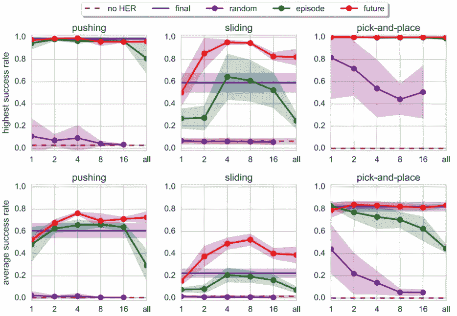
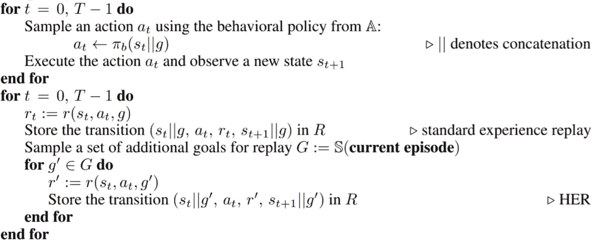
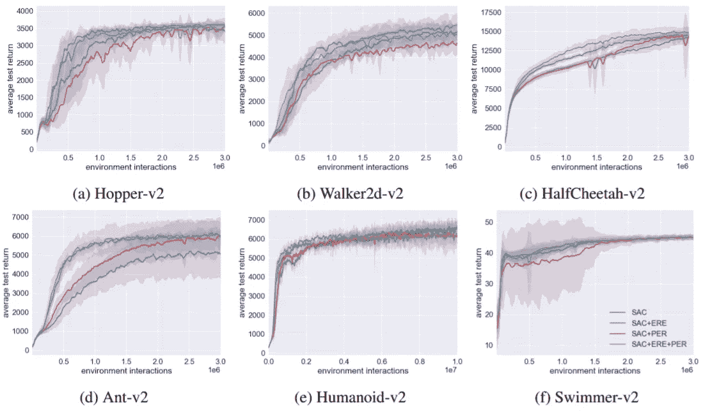

# 增强体验再现的 4 种方法

> 原文：<https://towardsdatascience.com/4-ways-to-boost-experience-replay-999d9f17f7b6?source=collection_archive---------31----------------------->

## 让代理记住重要的事情

[M. B. M.](https://unsplash.com/@m_b_m?utm_source=medium&utm_medium=referral) 在 [Unsplash](https://unsplash.com?utm_source=medium&utm_medium=referral) 上拍摄的照片

# 开始做事

经验回放是政策外学习的重要组成部分。它让代理人获得最大的“性价比”，从过去的经历中挤出尽可能多的信息。然而，与更复杂的采样方法相比，从重放中均匀采样已被证明具有次于标准的结果。在本文中，我们讨论了四种不同的体验回放，每一种都可以根据上下文提高学习的鲁棒性和速度。

# 1.优先体验重放(PER)

> 上下文:最初是为双 DQN 算法设计的，以提高采样效率，但自然也适用于任何 RL 算法。

PER 利用了这样一个事实，即代理人可以从某些经验中学到比其他人更多的东西。有些过渡可能很少但很重要，所以应该给予更多的关注。有些过渡可能是多余的，并且已经学习过，所以代理的时间最好花在学习其他东西上。

> 并非所有的经历都是平等的

直觉上，我们希望对模型中损失较大的点进行采样，因为损失越大，代理学习的空间就越大。因此，我们使用一个转换的**时间差(TD)误差**来衡量它的重要性。

双 DQN 中的 TD 误差

然而，我们不想天真地在每次迭代中选择具有最高 TD 误差的转换。请记住，在迭代算法中，TD 误差会缓慢减少*，因此我们会将大部分时间用于重放的一小部分，冒着过度拟合的风险。因此，我们提出一种采样方法，其中转移采样概率与 TD 误差成比例。*

**

*过渡抽样概率*

*其中α是 0 到 1 之间的可调参数。我们还定义了变量:*

**

*将变量 P 定义为绝对 TD 误差加上小值*

*注意，α值越低，我们越接近均匀采样。因此，我们可以将 alpha 视为一个参数，用于调整“我们希望优先处理具有较高 TD 误差的转换的程度”*

*有一个问题。用这些优先化的样本训练代理可能导致偏差错误，从而导致可能的训练不稳定。我们通过将过渡的渐变更新乘以一个权重来纠正这一点，该权重定义为:*

**

*校正偏差误差的权重*

*其中 N 是重放中的样本数，β是可调超参数。β是一个介于 0 和 1 之间的值，表示我们希望补偿偏置误差的程度。论文[1]建议*将*β退火为 1，因为无偏更新在训练周期结束时比开始时更重要。作者还建议将每个权重除以所有更新权重的最大值，以获得“标准化”效果。*

**

*更新步骤如[1]所示*

# *1.5.分布式优先体验重放*

> *背景:分布式强化学习方法(同步和异步)。虽然最初是为分布式 DQN 和 DPG 变体 Ape-X 提出的，但它自然适合同一伞下的任何算法。*

*顺便提一下，PER 有一个适应分布式设置的变体！典型地，分布式算法有相同环境的几个实例。虽然我们仍然训练一个*单个代理，*我们给每个环境一个代理的*副本*。然后，来自所有这些环境的经验被汇集成一个单一的重播。最后，我们从优先重放中采样(类似于 PER)并训练学习代理，偶尔用原始的更新参数更新每个*副本*。*

*通过这种方式，我们可以利用不同的策略积累更多的经验。虽然 Ape-X [2]有更多的细微差别，但使用单一、共享的经验回放的想法在学习中提供了许多好处。*

# *2.马后炮经验回放(她)*

**

*照片由[史蒂夫·哈维](https://unsplash.com/@trommelkopf?utm_source=medium&utm_medium=referral)在 [Unsplash](https://unsplash.com?utm_source=medium&utm_medium=referral) 上拍摄*

> *背景:主要是通过鼓励更有意义的探索，而不是漫无目的的游荡，来解决回报微薄的问题。选择与之耦合的 RL 算法是任意的。*

*假设一个代理被给予一个带有某个目标的任务 *g.* 然后，假设每一个*没有*导致我们的目标状态的转换都有一个-1 的奖励，否则为 1。这是一个回报很少的环境(或者说，就回报而言，大多数转型看起来都很相似的环境)。对于普通的 RL 算法，在这些环境中学习是非常困难的。她试图解决这个问题。*

*假设我们训练了政策和价值函数，它们不仅以国家为目标，还以*为目标。*我们定义奖励函数，如果目标没有实现，返回负奖励 *r* ，否则返回任意更高的奖励。然后，存储到体验重放的过渡将如下所示:*

**

*体验目标回放过渡*

*然而，我们仍然有稀疏的问题！如果我们很少达到目标，我们很少看到回报的变化。她背后的想法是:用子目标来分割任务。换句话说，不是只存储一个带有总目标 *g* 的转换，我们也存储*相同的转换*，但是用一些其他子目标*g’替换目标 *g* ！*通过这种方式，代理可以更频繁地看到一些奖励差异。*

**

*体验带有子目标的重放转换*

*但是，这有什么用呢？在我们只关心一个目标的任务中，这是如何工作的？我们可以把生成这些子目标看作是将我们的代理人“圈”向最终目标的一种方式。我们会留下一些饼干屑让探员追踪。*

*然后，问题来了，我们如何选择我们的子目标。我们不想明确地告诉代理子目标是什么，因为这需要特定领域的知识。另外，它不能推广到多项任务。*

**

*她的结果如[3]所示*

*论文提出选择 *k* 子目标*g’*来代替目标*g*论文[3]提出了选择这些子目标的各种方法:*

*   ***最终:**在剧集中使用*单个*最终状态*
*   ***未来:**从当前和下一集采样 *k* 状态*
*   ***事件:**从当前事件中取样 *k* 状态*
*   ***随机:**从迄今为止观察到的所有情节中采样 *k* 个状态*

*换句话说，将过渡存储到体验重放中的整个过程看起来像这样:*

1.  *收集一集的过渡*
2.  *使用原始目标 *g* 存储该集的所有过渡*
3.  *使用上述方案之一选择 *k* 子目标*
4.  *对于剧集的每个过渡，通过用每个 *k* 子目标替换 *g* 来存储*新过渡**

*在机械臂运动的背景下测试 HER 的效果，每个选择方案的结果如上图所示。*

**

*如[3]所示，与她一起存储过渡的一集*

# *3.强调近期经验(ERE)*

**

*山姆·麦克格在 [Unsplash](https://unsplash.com?utm_source=medium&utm_medium=referral) 上的照片*

> *上下文:最初是为支持软演员评论家(SAC)收敛速度而设计的。可以说，可以应用于大多数算法和任务，这些算法和任务天生受益于更快地学习最近的经验(如具有多个部分的任务)*

*通常，我们的代理能够很好地适应学习过程中早期发现的转变。因此，从这些早期过渡中统一取样对我们的政策没有好处。ERE 创建了一个简单而强大的采样方法，允许代理强调最近的转换，同时不忽略从过去学到的策略。*

*假设，在更新阶段，我们抽样了 *K* 个小批量。然后，更新每个小批量的模型参数。ERE 提出了一个方案，我们只从体验回放的**子集进行采样，而不是全部。换句话说，对于第*个*小批量，我们从最近的 c_k 点均匀采样:***

**

*ERE 的采样点*

*其中 c_min 是我们可以从中采样的最近数据点的最小数量，N 是我们的经验重放的大小，nu 是一个可调的超参数，用于确定我们对最近观察的优先程度。*

*请注意在由 *K* 小批量组成的更新中，早期的样本允许对早期的过渡进行训练，而后期的样本则更加强调最近的过渡。换句话说，我们从最近的经历中学到更多，但永远不会忘记过去。*

*论文[4]建议将 nu 设置为. 996 对于所有环境都是一个好的值。此外，建议随着训练的进行，将 nu 的值退火为 1。这是用来在早期阶段允许更快的训练，并在后期阶段鼓励更慢、更仔细的训练。*

**

*ERE 的表现如[4]所示*

*有些人可能会问:为什么不直接使用 PER？这两种方法似乎在做类似的事情，对数据的训练将使代理人受益最大。这里的美在于它的简单。虽然 PER 需要额外的实现(特殊的数据结构以提高计算效率)，但 ERE 不需要。尽管已经表明将 PER 和 ERE 结合使用通常会产生更好的结果，但是单独使用 ERE 的效果是相似的或者只是稍微差一些。*

**

*帕特里克·塞林在 [Unsplash](https://unsplash.com?utm_source=medium&utm_medium=referral) 上拍摄的照片*

# *4.重复体验回放*

> *上下文:最初是为循环分布式代理设计的，尤其是那些涉及部分可观察性的代理。然而，它可以应用于大多数基于值的算法，无论它是否是分布式的。*

*在许多方法中，我们可以用 *n* 步前视训练 Q 值。在经典 Q-learning 中，目标是通过使用一步前瞻产生的；我们以一个时间步长扫视了未来。对于大于 1 的 *n* ，我们在 *n* 的组中收集经验，并“展开”转换，为我们的值更新获得更明确的目标值。*

**

*n 步展开的 Q 值目标*

*本文[5]提出代理存储固定长度( *m* = 80)的状态-动作-回报观察值序列。除此之外，我们还强加了:*

*   *相邻序列只能重叠四十个时间步长*
*   *序列不能跨越幕式边界*

*然后，当我们对这个序列进行采样时，我们在同一组状态上“展开”价值和目标网络，生成价值估计和训练目标。*

*然而，我们首先如何对这些序列进行采样呢？这种方法从优先体验重放(PER)中获得灵感，但通过使用两个不同值的加权和来调整标准。假设我们使用的值 *n* 小于 *m，*第一项是包含在 *m* 长度序列内的 **max** 绝对值*n*-步长 TD 误差。第二个是序列的**平均值**绝对值*n*-步长 TD 误差:*

**

*按 P 值替换，如[5]所示*

*其中 nu 是 0 到 1 之间的可调超参数。论文[5]建议将 nu 设置为. 9，从而产生一种更积极的采样方法。在贪婪的一方犯错误直觉上是有道理的，因为平均往往会抵消和消除较大的错误，从而很难挑出有价值的转变。*

**

*照片由[罗兰兹·齐尔文斯基](https://unsplash.com/@rolzay?utm_source=medium&utm_medium=referral)在 [Unsplash](https://unsplash.com?utm_source=medium&utm_medium=referral) 上拍摄*

# *结束语*

*当然，还有许多其他采样方案和经验重放变化。虽然我们在这里只概述了一些，但总有其他版本比其他版本更好地适应某些环境。我们只需要实验、探索和分析。尽管体验重放不是一个“要么成功，要么失败”的交易，但它可以在我们的 RL 代理的最优性、健壮性和收敛特性中发挥重要作用。这绝对值得我们关注一下。*

# *参考*

*[1] T. Schaul，J. Quan，I. Antonoglou，D. Silver，[优先化经验回放](https://arxiv.org/pdf/1511.05952.pdf) (2016)。*

*[2] D .霍根，j .全，d .布登，g .巴斯-马龙，m .赫塞尔，h .哈塞尔特，d .西尔弗，[分布式经验回放](https://arxiv.org/pdf/1803.00933.pdf) (2018)。*

*[3] M. Andrychowicz，F. Wolski，A. Ray，J. Schneider，R. Fong，P. Welinder，B. McGrew，J. Tobin，P. Abbeel，W. Zaremba，[后见之明经验回放](https://arxiv.org/pdf/1803.00933.pdf) (2017)。*

*[4] C .王(C. Wang)，k .罗斯(K. Ross)，[助推软演员-评论家:强调近期经验不忘过去](https://arxiv.org/pdf/1906.04009.pdf) (2019)。*

*[5] S. Kapturowski，G. Ostrovski，J. Quan，R. Munos，W. Dabney，[分布式强化学习中的递归经验重放](https://openreview.net/pdf?id=r1lyTjAqYX) (2019)。*

> *从经典到最新，这里有讨论多代理和单代理强化学习的相关文章:*

* [## 分层强化学习:封建网络

### 让电脑看到更大的画面

towardsdatascience.com](/hierarchical-reinforcement-learning-feudal-networks-44e2657526d7)  [## DeepMind 的虚幻代理如何比 Atari 上的专家表现好 9 倍

### 最佳深度强化学习

towardsdatascience.com](/how-deepminds-unreal-agent-performed-9-times-better-than-experts-on-atari-9c6ee538404e)*