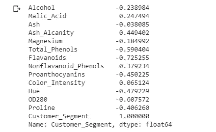
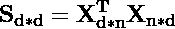
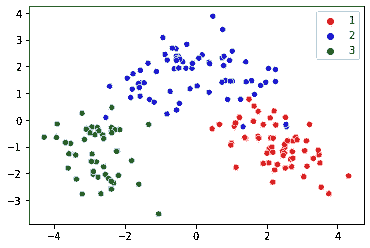
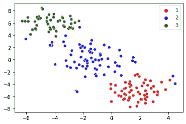
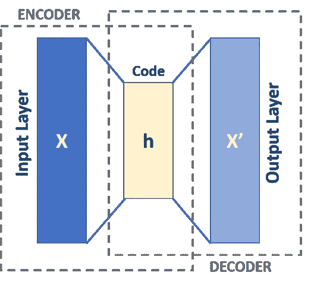

# 4 种降低数据维度的方法

> 原文：<https://towardsdatascience.com/4-ways-to-reduce-dimensionality-of-data-8f82e6565a07?source=collection_archive---------15----------------------->

## 降维方法概述——相关、主成分分析、t-SNE、自动编码器及其在 python 中的实现

照片由 [Avel Chuklanov](https://unsplash.com/@chuklanov?utm_source=medium&utm_medium=referral) 在 [Unsplash](https://unsplash.com?utm_source=medium&utm_medium=referral) 上拍摄，使用 [Pixlr](https://pixlr.com/x/) 编辑

降维是减少数据集中特征或变量数量的过程。它是将数据从高维空间转换到低维空间，以便低维表示保留原始数据的一些有意义的属性。

## 为什么降维很重要？

在现实世界的数据集中，数据中经常有太多的变量。要素数量越多，数据的可视化和处理就越困难。有时，这些特征中的大多数是相关的，因此是多余的。这就是降维算法发挥作用的地方。

有多种方法可以降低数据的维数，在本文中，您可以了解其中的一些方法:

1.  特征选择方法:使用相关系数方法
2.  矩阵分解
3.  流形学习:SNE
4.  自动编码器

# 特征选择方法:

一些数据集具有大量的要素，而这些要素中只有一些与目标类标注相关。特征选择技术使用评分或统计方法来选择保留哪些特征和删除哪些特征。

用于通过选择顶部特征来减小尺寸的技术或算法有:

*   皮尔逊相关系数(数值输入，数值输出)
*   Spearman 相关系数(数值输入，数值输出)
*   卡方检验(分类输入，分类输出)
*   肯德尔τ检验(数值输入，分类输出)

 [## 皮尔逊和斯皮尔曼等级相关系数—解释

### 随机变量之间的关系。

towardsdatascience.com](/pearson-and-spearman-rank-correlation-coefficient-explained-60811e61185a) 

根据训练数据的特征是数字的还是分类的，以及目标类别标签是数字的还是分类的，可以从上述列表中选择不同的特征。

获取来自 [UCI ML 知识库的葡萄酒样本数据集。](https://archive.ics.uci.edu/ml/datasets/wine)目标类别标签是分类的，其余的训练数据具有数字特征。因此，我们可以使用 Kendall Tau 测试找到与目标类别标签(“Customer_Segment”)高度相关的顶级特征。

(作者代码)

(图片由作者提供)，上面代码片段的第 4 行输出

从具有目标类标签“Customer_Segment”的数据集中的每个特征的上述 Kendall 系数，可以确认特征“Flavanoids”、“OD280”和“Total_Phenols”是具有最大模值的前 3 个特征。您可以通过取系数值的模来挑选前 x 个特征。

# 矩阵分解:

矩阵分解方法可用于降维。主成分分析(PCA)是一种矩阵分解技术，用于将高维数据降维。PCA 保持方差最大的方向。

PCA 应遵循的步骤:

*   给定数据集 X 的形状(n 行，d 要素)
*   标准化数据集 X
*   计算协方差矩阵

*   从协方差矩阵中找出特征值和特征向量。
*   为了挑选前 f 个特征，挑选具有相应的前 x 个最大特征值的特征向量。

(作者代码)

对于取自 [UCI ML 知识库](https://archive.ics.uci.edu/ml/datasets/wine)的葡萄酒样本数据集，最初，数据集有 13 个特征，经过 PCA 算法后，维数减少到 2 维，可视化结果如下图所示。

(图片由作者提供)，来自 PCA 算法的二维数据的可视化

# 多方面学习:

高维度统计的技术也可以用于降维。使用流形学习并用于创建高维数据的低维投影。这通常用于数据可视化。

t-分布式随机邻居嵌入( **t-SNE** )是一种流形学习技术，用于将高维数据投影到低维(主要是 2 维或 3 维)进行可视化。t-SNE 是一种邻域保持嵌入技术，它能最好地保持低维数据中的显著结构或关系。

(作者代码)

对于取自 [UCI ML 知识库](https://archive.ics.uci.edu/ml/datasets/wine)的葡萄酒样本数据集，最初，数据集有 13 个特征，在应用 t-SNE 算法后，维数减少到 2 维，可视化结果如下图所示。

(图片由作者提供)，来自 t-SNE 算法的二维数据的可视化

# 自动编码器:

Auto Encoders 是一个人工神经网络模型，用于执行维度缩减。自动编码器有两个组成部分，压缩和扩展。形状的初始数据集(n 行，d 维)被传递到自动编码器神经网络模型，并被编码到较低维的隐藏层。然后，它试图从简化的编码中生成尽可能接近其原始输入的表示。

([图像源](https://en.wikipedia.org/wiki/Autoencoder#/media/File:Autoencoder_schema.png))，自动编码器架构

以上是基于单层感知器的自动编码器，它参与了多层感知器(MLP)——具有输入层、输出层和连接它们的一个或多个隐藏层。输出层中的节点数量与输入层中的节点数量相同，并且通过最小化输入和输出之间的差异来重构其输入。

输入和输出层有 d 个神经元(d 是原始数据集的维数)。中间隐藏层有 f 个神经元(f 是降维后的维数)。

# 结论:

在本文中，我们讨论了 4 种不同的降维技术，每种技术都有各自的优缺点。没有最好的降维技术。相反，最好的方法是使用系统的受控实验，并发现哪些降维技术与您选择的模型结合使用时，会在数据集上产生最佳性能。

> 感谢您的阅读