# 数据科学家的 40 个统计面试问题和答案

> 原文：<https://towardsdatascience.com/40-statistics-interview-problems-and-answers-for-data-scientists-6971a02b7eee?source=collection_archive---------0----------------------->

## 为你的面试复习统计知识的资源！

来自 admiralmarkets.com 的照片

> ***务必*** [***订阅此处***](https://terenceshin.medium.com/membership) ***或至我的*** [***独家快讯***](https://terenceshin.substack.com/embed) ***千万不要错过另一篇关于数据科学的指南、窍门和技巧、生活经验等！***

鉴于我的文章、 [Google 的数据科学面试脑筋急转弯](/googles-data-science-interview-brain-teasers-7f3c1dc4ea7f)、[亚马逊的数据科学家面试练习题](/amazon-data-scientist-interview-practice-problems-15b9b86e86c6)、[微软数据科学面试问答](/microsoft-data-science-interview-questions-and-answers-69ccac16bd9b)、[数据科学家常见的 5 个 SQL 面试问题](/40-statistics-interview-problems-and-answers-for-data-scientists-6971a02b7eee)的受欢迎程度，我在网上收集了一些统计数据科学面试问题，并尽我所能地进行了回答。

我对数据科学了解得越多，就越意识到基本的统计知识对成功至关重要。因此，我浏览了网页，找到了四十个**数据科学家的统计面试问题，我将回答这些问题。开始了。**

# 1.你如何评估一个洞察力的统计意义？

您将执行假设检验来确定统计显著性。首先，你要陈述零假设和替代假设。其次，您将计算 p 值，即假设零假设为真，获得测试观察结果的概率。最后，您将设置显著性水平(alpha ),如果 p 值小于 alpha，您将拒绝 null 换句话说，结果具有统计显著性。

# 2.解释什么是长尾分布，并提供三个有长尾的相关现象的例子。为什么它们在分类和回归问题中很重要？

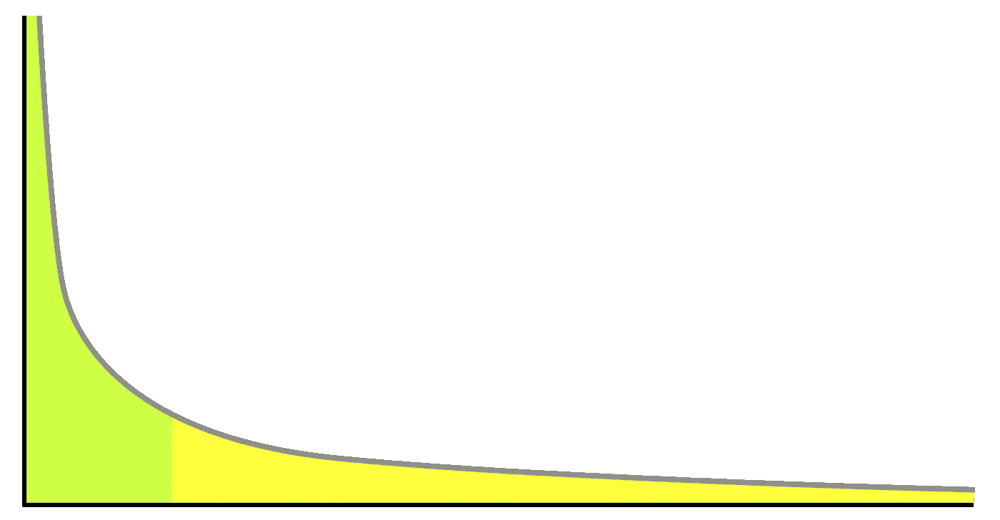

长尾分布的例子

**长尾分布**是一种重尾分布，它有一条(或多条)逐渐渐近消失的尾巴。

3 实际例子包括幂定律、帕累托原则(通常称为 80-20 法则)和产品销售(即最畅销的产品与其他产品相比)。

在分类和回归问题中注意长尾分布是很重要的，因为出现频率最低的值构成了总体的大多数。这最终会改变您处理异常值的方式，并且它也与一些假设数据正态分布的机器学习技术相冲突。

# 3.什么是中心极限定理？解释一下。为什么重要？

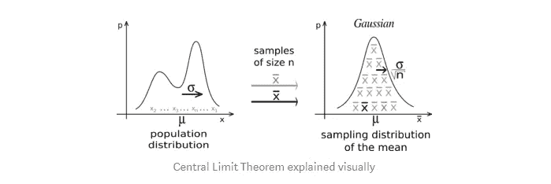

来自维基百科

统计学如何为 CLT 提供了最好的定义，这就是:

> “中心极限定理表明，无论总体分布的形状如何，随着样本量的增加，样本均值的抽样分布接近正态分布。”[1]

中心极限定理很重要，因为它用于假设检验和计算置信区间。

# 4.统计力是什么？

“统计功效”是指二元假设的功效，即假设替代假设为真，测试拒绝零假设的概率。[2]

# 5.解释选择偏差(关于数据集，而不是变量选择)。为什么重要？丢失数据处理等数据管理程序如何使情况变得更糟？

**选择偏倚**是指在选择个人、群体或数据进行分析时，没有实现适当的随机化，最终导致样本不能代表总体的现象。

理解和识别选择偏差是很重要的，因为它会严重扭曲结果，并提供关于特定人群的错误见解。

选择偏差的类型包括:

*   **抽样偏差**:非随机抽样导致的有偏差样本
*   **时间间隔**:选择支持预期结论的特定时间范围。例如，在临近圣诞节时进行销售分析。
*   **暴露**:包括临床易感性偏倚、原发性偏倚、适应症偏倚。*此处阅读更多***。**
*   ***数据**:包括摘樱桃、压制证据、证据不全的谬误。*
*   ***:流失偏倚类似于生存偏倚，即只有那些在长期过程中“幸存”的人才会被纳入分析，或者类似于失败偏倚，即那些“失败”的人才会被纳入分析***
*   ***观察者选择:与人择原理相关，人择原理是一种哲学上的考虑，即我们收集的关于宇宙的任何数据都要经过过滤，为了使它可以被观察到，它必须与观察它的有意识和有智慧的生命兼容。[3]***

***处理缺失数据会使选择偏差变得更糟，因为不同的方法会以不同的方式影响数据。例如，如果您用数据的平均值替换空值，您就增加了偏差，因为您假设数据并不像实际可能的那样分散。***

> ******务必*** [***订阅此处***](https://terenceshin.medium.com/membership) ***或至我的*** [***独家快讯***](https://terenceshin.substack.com/embed) ***千万不要错过另一篇关于数据科学的指南、窍门和技巧、生活经验等！******

# ***6.提供一个简单的例子，说明实验设计如何帮助回答一个关于行为的问题。实验数据和观测数据如何对比？***

*****观察数据**来自观察研究，即观察某些变量并试图确定它们之间是否存在关联。***

*****实验数据**来自实验研究，即当你控制某些变量并保持它们不变，以确定是否存在因果关系。***

***实验设计的一个例子如下:将一组分成两个。对照组正常生活。测试组被告知在 30 天内每天晚上喝一杯酒。然后可以进行研究，看看酒是如何影响睡眠的。***

# ***7.缺失数据的均值插补是可接受的做法吗？为什么或为什么不？***

*****均值插补**是用数据的均值替换数据集中的空值的实践。***

***均值插补通常是不好的做法，因为它没有考虑特征相关性。例如，假设我们有一个显示年龄和健康分数的表格，并假设一个 80 岁的老人缺少健康分数。如果我们从 15 岁到 80 岁的年龄范围内取平均健康分数，那么 80 岁的人看起来会有一个比他实际应该有的高得多的健康分数。***

***第二，均值插补减少了数据的方差，增加了数据的偏倚。由于方差较小，这导致模型不太精确，置信区间较窄。***

# ***8.什么是离群值？解释如何筛选异常值，如果在数据集中发现异常值，您会怎么做。此外，解释什么是内联体，如何筛选内联体，如果在数据集中发现了内联体，你会怎么做。***

*****异常值**是与其他观察值显著不同的数据点。***

***根据异常值的原因，从机器学习的角度来看，它们可能是坏的，因为它们会降低模型的准确性。如果异常值是由测量误差引起的，那么将它们从数据集中移除是非常重要的。有几种方法可以识别异常值:***

*****Z 值/标准偏差:**如果我们知道一个数据集中 99.7%的数据位于三个标准偏差内，那么我们可以计算一个标准偏差的大小，乘以 3，并确定超出该范围的数据点。同样，我们可以计算给定点的 z 分数，如果它等于+/- 3，那么它就是异常值。
注意:使用这种方法时需要考虑一些意外情况；数据必须呈正态分布，这一点[不适用于小数据集](https://statisticsbyjim.com/basics/outliers/)，并且过多异常值的存在会影响 z 值。***

***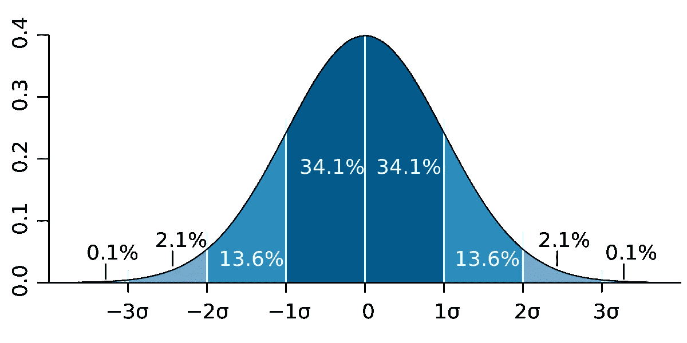***

*****四分位距(IQR):** IQR，用于构建箱线图的概念，也可用于识别异常值。IQR 等于第三个四分位数和第一个四分位数之差。然后，如果一个点小于 Q1-1.5 * IRQ 或大于 Q3 + 1.5*IQR，则可以确定该点是否为异常值。这达到大约 2.698 个标准偏差。***

***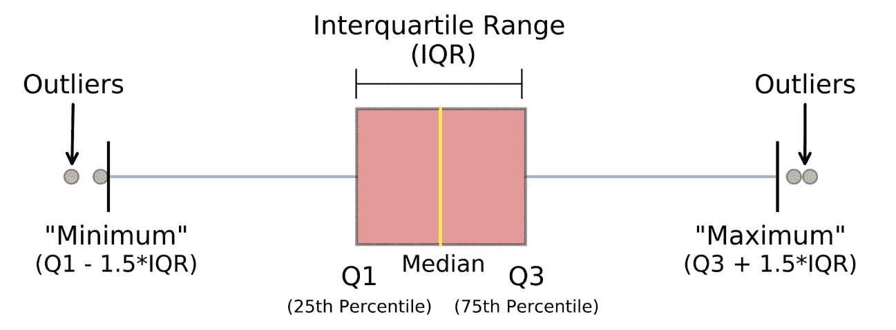***

***照片来自迈克尔·加拉尼克***

***其他方法包括 DBScan 聚类、隔离森林和稳健随机采伐森林。***

***一个**内联者**是一个数据观察，它位于数据集的其余部分，是不寻常的或者是错误的。由于它位于数据集中，通常比异常值更难识别，需要外部数据来识别它们。如果您发现了任何内联者，您可以简单地将它们从数据集中删除以解决它们。***

# ***9.你如何处理丢失的数据？有什么插补技巧推荐？***

***有几种方法可以处理丢失的数据:***

*   ***删除缺少数据的行***
*   ***均值/中值/众数插补***
*   ***分配唯一的值***
*   ***预测缺失值***
*   ***使用支持缺失值的算法，如随机森林***

***最好的方法是删除缺少数据的行，因为这样可以确保没有偏差或差异被添加或删除，并最终产生一个稳健而准确的模型。但是，只有在开始时有大量数据并且缺失值的百分比很低的情况下，才建议这样做。***

# ***10.您有呼叫中心通话时长的数据。为如何编码和分析这些数据制定一个计划。解释一下这些持续时间的分布情况。你如何测试，甚至是图形化地测试，你的期望是否实现了？***

***首先，我会进行 EDA——探索性数据分析，以清理、探索和理解我的数据。*见我关于 EDA 的文章* [*这里*](/an-extensive-guide-to-exploratory-data-analysis-ddd99a03199e) *。作为我的 EDA 的一部分，我可以构建一个通话持续时间的直方图来查看潜在的分布。****

***我的猜测是，呼叫的持续时间将遵循对数正态分布(见下文)。我认为它是正偏的原因是因为下限被限制为 0，因为调用不能是负秒。然而，在高端，很可能有一小部分通话时间相对较长。***

***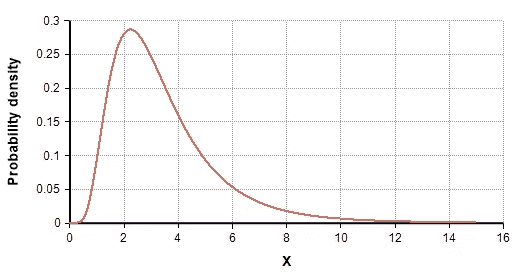***

***对数正态分布示例***

***您可以使用 QQ 图来确认通话时长是否符合对数正态分布。*参见* [*此处*](https://www.youtube.com/watch?v=okjYjClSjOg) *了解更多 QQ 剧情。****

# ***11.解释管理数据集和从实验研究中收集的数据集之间可能的差异。管理数据可能会遇到什么问题？实验方法如何帮助缓解这些问题？它们带来了什么问题？***

***行政数据集通常是政府或其他组织出于非统计原因使用的数据集。***

***管理数据集通常比实验研究更大，更具成本效益。假设与管理数据集相关联的组织是活动的并且正在运行，那么它们也会被定期更新。与此同时，管理数据集可能无法捕获用户可能需要的所有数据，也可能不是所需的格式。它还容易出现质量问题和遗漏条目。***

# ***12.您正在为每月上传的用户内容编写一份报告，并注意到 10 月份的上传量出现了峰值。特别是图片上传的高峰。您可能认为这是什么原因造成的，您将如何测试它？***

***照片上传数量激增的潜在原因有很多:***

1.  ***一项新功能可能已经在 10 月份实施，它涉及上传照片，并获得了用户的大量关注。例如，提供创建相册能力的功能。***
2.  ***同样，有可能之前上传照片的过程不直观，在 10 月份得到了改善。***
3.  ***可能有一场病毒式的社交媒体运动，包括持续了整个 10 月的上传照片。八月天，但更具扩展性的东西。***
4.  ***这有可能是因为人们上传了自己穿着万圣节服装的照片。***

***测试的方法取决于尖峰的原因，但是您可以进行假设测试来确定推断的原因是否是实际原因。***

# ***13.你即将登上去西雅图的飞机。你想知道你是否应该带一把伞。你打电话给住在那里的三个朋友，分别问他们是否在下雨。你的每个朋友都有 2/3 的机会对你说真话，1/3 的机会用谎言来搞乱你。三个朋友都告诉你“是的”下雨了。西雅图真的下雨的概率有多大？***

***你可以看出这个问题与贝叶斯理论有关，因为最后一个陈述基本上遵循这样的结构，“假设 B 为真，A 为真的概率是多少？”因此，我们需要知道某一天伦敦下雨的概率。假设是 25%。***

***P(A) =下雨的概率= 25%
P(B) =三个朋友都说在下雨的概率
P(A|B)假定他们说在下雨的概率
P(B|A)假定在下雨的情况下三个朋友都说在下雨的概率= (2/3) = 8/27***

****第一步:求解 P(B)*
P(A | B)= P(B | A)* P(A)/P(B)，可以改写为
P(B)= P(B | A)* P(A)+P(B | not A)* P(not A)
P(B)=(2/3)* 0.25+(1/3)* 0.75 = 0.25 * 8/27+0.75 * 1/27***

****第二步:求解 P(A | B)*
P(A | B)= 0.25 *(8/27)/(0.25 * 8/27+0.75 * 1/27)
P(A | B)= 8/(8+3)= 8/11***

***因此，如果三个朋友都说在下雨，那么有 8/11 的几率是真的在下雨。***

> ******一定要*** [***订阅***](https://terenceshin.medium.com/membership) ***千万不要错过另一篇关于数据科学指南、诀窍和技巧、生活经验等的文章！******

# ***14.有一个盒子——有 12 张黑色和 12 张红色卡片，第二个盒子有 24 张黑色和 24 张红色卡片；如果你想从 2 个盒子中随机抽取 2 张卡片，哪个盒子获得相同颜色的概率更高？你能直观地说出为什么第二个盒子有更高的概率吗***

***有 24 张红卡和 24 张黑卡的盒子获得两张同色卡片的概率更大。让我们走过每一步。***

***假设你从每副牌中抽出的第一张牌是红色的 a。***

***这意味着在有 12 个红和 12 个黑的牌组中，现在有 11 个红和 12 个黑。因此，你再抽一张红色的几率等于 11/(11+12)或 11/23。***

***一副牌中有 24 个红和 24 个黑，那么就有 23 个红和 24 个黑。因此，你再抽一张红色的几率等于 23/(23+24)或 23/47。***

***由于 23/47 > 11/23，所以卡数较多的第二副牌有较大概率得到相同的两张牌。***

# ***15.什么是:提升、KPI、稳健性、模型拟合、实验设计、80/20 法则？***

*****提升:**提升是针对随机选择目标模型测量的目标模型的性能的度量；换句话说，lift 告诉你你的模型在预测事物方面比没有模型时好多少。***

*****KPI:** 代表关键绩效指标，这是一个可衡量的指标，用于确定公司实现其业务目标的情况。错误率。***

*****健壮性:**健壮性通常指系统处理可变性并保持有效的能力。***

*****模型拟合:**指一个模型对一组观察值的拟合程度。***

*****实验设计:**也称为 DOE，它是在假设反映变量的条件下，旨在描述和解释信息变化的任何任务的设计。[4]本质上，实验的目的是根据一个或多个输入(独立变量)的变化来预测结果。***

*****80/20 法则:**又称帕累托原理；80%的结果来自 20%的原因。80%的销售额来自 20%的顾客。***

# ***16.定义质量保证，六西格玛。***

*****质量保证:**一项或一组活动，旨在通过减少错误和缺陷来维持期望的质量水平。***

*****六西格玛:**一种特定类型的质量保证方法，由一套用于过程改进的技术和工具组成。六西格玛流程是指所有结果的 99.99966%没有缺陷。***

# ***17.给出既不是高斯分布也不是对数正态分布的数据的例子。***

*   ***任何类型的分类数据都不会有高斯分布或对数正态分布。***
*   ***指数分布——例如，汽车电池的持续时间或地震发生前的时间。***

# ***18.什么是根本原因分析？如何识别原因和相关性？举例说明***

*****根本原因分析:**用于确定问题根本原因的解决问题的方法[5]***

*****相关性**衡量两个变量之间的关系，范围从-1 到 1。因果关系是指第一个事件似乎引发了第二个事件。因果关系主要看直接关系，而相关性可以看直接和间接关系。***

***例句:在加拿大，较高的犯罪率与较高的冰淇淋销售额有关，也就是说，它们是正相关的。然而，这并不意味着一个导致另一个。相反，这是因为当室外温度较高时，这两种情况发生得更多。***

***您可以使用假设检验或 A/B 检验来检验因果关系。***

# ***19.请给出一个中值比平均值更好衡量的例子***

***当有许多异常值正或负地扭曲了数据时。***

# ***20.给定两个公平的骰子，得分总和为 4 的概率是多少？到 8？***

***滚动 a 4 有 4 种组合(1+3，3+1，2+2):
P(滚动 a 4) = 3/36 = 1/12***

***有滚安 8 的组合(2+6，6+2，3+5，5+3，4+4):
P(滚安 8) = 5/36***

# ***21.什么是大数定律？***

***大数定律是一种理论，它指出随着试验次数的增加，结果的平均值将越来越接近期望值。***

***正面硬币 100，000 次的翻转次数应该接近 0.5 次而不是 100 次。***

# ***22.你如何计算所需的样本量？***

******

***误差幅度公式***

***您可以使用误差幅度(ME)公式来确定所需的样本量。***

*   ***t/z =用于计算置信区间的 t/z 分数***
*   ***ME =期望的误差幅度***
*   ***S =样本标准偏差***

# ***23.当你取样时，你造成了什么样的偏见？***

***潜在的偏见包括:***

*   *****抽样偏倚:**由非随机抽样引起的有偏倚的样本***
*   *****覆盖偏差:**采样太少的观测值***
*   *****生存偏差:**忽略没有通过某种形式的选择过程的观察的错误。***

# ***24.你如何控制偏见？***

***你可以做很多事情来控制和减少偏见。两种常见的方式包括**随机化**，参与者被随机分配，以及**随机抽样**，每个成员被选中的概率相等。***

# ***25.什么是混杂变量？***

***混杂变量或混杂因素是一种既影响因变量又影响自变量的变量，导致虚假关联，即两个或更多变量相关但无因果关系的数学关系。***

# ***26.什么是 A/B 测试？***

***A/B 检验是假设检验和双样本假设检验的一种形式，用于比较单个变量的两个版本，即控制变量和变量。它通常用于改善和优化用户体验和营销。***

# ***27.医院的感染率高于每 100 人-日 1 例感染的风险被视为高。某医院在过去的 1787 人/天中有 10 例感染风险。给出医院是否低于标准的正确片面检验的 p 值。***

***由于我们查看的是给定时间段内发生的事件数量(感染数量)，因此这是一个泊松分布问题。***

***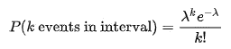***

***在一个区间内观察到 k 个事件的概率***

***零(H0):每人每天 1 例感染
备选方案(H1): >每人每天 1 例感染***

***k(实际)= 10 次感染
λ(理论)= (1/100)*1787
p = 0.032372 或 3.2372% *计算使用。excel 中的 poisson()或 R 中的 ppois****

***由于 p 值< alpha (assuming 5% level of significance), we reject the null and conclude that the hospital is below the standard.***

# ***28\. You roll a biased coin (p(head)=0.8) five times. What’s the probability of getting three or more heads?***

***Use the General Binomial Probability formula to answer this question:***

******

***General Binomial Probability Formula***

***p = 0.8
n = 5
k = 3，4，5***

***P(3 头以上)= P(3 头)+ P(4 头)+ P(5 头)= **0.94 或 94%*****

# ***29.随机变量 X 是具有平均值 1020 和标准偏差 50 的正态变量。计算 P(X>1200)***

***使用 Excel…
p =1-norm.dist(1200，1020，50，true)
**p= 0.000159*****

# ***30.假设出现在公交车站的人数为泊松分布，平均值为 2.5 人/小时。四小时内最多出现三人的概率是多少？***

***x = 3
平均值= 2.5*4 = 10***

***使用 Excel…***

***p = poisson.dist(3，10，true)
**p = 0.010336*****

# ***31.艾滋病毒检测的灵敏度为 99.7%，特异性为 98.5%。患病率为 0.1%的人群中的受试者获得阳性测试结果。测试的精确度是多少(即他是 HIV 阳性的概率)？***

******

***精度方程(PV)***

***精度=阳性预测值= PV
PV =(0.001 * 0.997)/[(0.001 * 0.997)+((1–0.001)*(1–0.985))]
PV = 0.0624 或 6.24%***

****更多关于这个方程的内容请看* [*这里*](https://online.stat.psu.edu/stat509/node/151/) *。****

# ***32.你正在竞选公职，而你的民意调查者调查了上百人。他们中的 60 个人声称他们会投你的票。你能放松吗？***

*   ***假设只有你和另一个对手。***
*   ***另外，假设我们想要 95%的置信区间。这使我们的 z 值为 1.96。***

***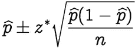***

***置信区间公式***

***p-hat = 60/100 = 0.6
z * = 1.96
n = 100
这就给了我们一个[50.4，69.6]的置信区间。因此，给定 95%的置信区间，如果你可以接受最糟糕的捆绑情形，那么你可以放松了。否则，你不能放松，直到 100 分中有 61 分说是。***

# ***34.苏格兰的凶杀率从前一年的 115 下降到了去年的 99。这种报道的变化真的值得注意吗？***

*   ***因为这是一个泊松分布问题，均值=λ=方差，这也意味着标准差=均值的平方根***
*   ***95%的置信区间意味着 z 值为 1.96***
*   ***一个标准偏差= sqrt(115) = 10.724***

***因此置信区间= 115+/- 21.45 = [93.55，136.45]。由于 99 在这个置信区间内，我们可以假设这个变化不是很值得注意。***

# ***35.考虑双亲异性恋家庭的流感流行。假设父母中至少有一方患病的概率是 17%。父亲感染流感的概率为 12%，而母亲和父亲都感染该疾病的概率为 6%。母亲感染流感的概率有多大？***

***利用概率中的一般加法法则:
P(母亲或父亲)= P(母亲)+ P(父亲)— P(母亲和父亲)
P(母亲)= P(母亲或父亲)+ P(母亲和父亲)— P(父亲)
P(母亲)= 0.17+0.06–0.12
P(母亲)= 0.11***

# ***36.假设 35-44 岁男性的舒张压(DBPs)正态分布，平均值为 80(毫米汞柱)，标准差为 10。随机选择一个 35-44 岁的人，其 DBP 低于 70 的概率是多少？***

***因为 70 比平均值低一个标准差，所以取一个标准差左边的高斯分布的面积。***

***= 2.3 + 13.6 = 15.9%***

# ***37.在感兴趣的人群中，9 名男性的样本产生了 1,100cc 的样本平均脑容量和 30cc 的标准偏差。这个新群体的平均脑容量的 95%学生 T 置信区间是多少？***

***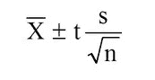***

***样本的置信区间***

***假设置信度为 95%，自由度等于 8，t 值= 2.306***

***置信区间= 1100±2.306 *(30/3)
置信区间= [1076.94，1123.06]***

# ***38.在六周的时间里，给 9 名受试者服用减肥药。体重的平均差异(随访-基线)为-2 磅。要使 95% T 置信区间的上端点达到 0，体重差异的标准偏差必须是多少？***

***上限=平均值+ t 得分*(标准偏差/sqrt(样本大小))
0 =-2+2.306 *(s/3)
2 = 2.306 * s/3
s = 2.601903
因此，标准偏差必须至少约为 2.60，95% T 置信区间的上限才能达到 0。***

# ***39.在一项关于急诊室等待时间的研究中，调查人员考虑了一种新的标准分流系统。为了测试系统，管理员选择了 20 个晚上，并随机分配新的分流系统在 10 个晚上使用，标准系统在其余 10 个晚上使用。他们计算了每晚看医生的平均等待时间(MWT)。新系统的平均 MWT 为 3 小时，方差为 0.60，而旧系统的平均 MWT 为 5 小时，方差为 0.68。考虑与新系统相关的平均 MWT 差异的 95%置信区间估计。假设方差不变。间隔是多少？按此顺序减去(新系统—旧系统)。***

***查看此处获得寻找两个独立样本的置信区间的完整教程。***

***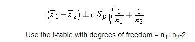***

***置信区间=平均值+/- t 分数*标准误差*(见上文)****

***均值=新均值-旧均值= 3–5 =-2***

***给定 df = 18(20–2)和 95%的置信区间，t 得分= 2.101***

***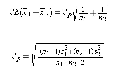***

***标准误差= sqrt((0。⁶ *9+0.⁶⁸* 9)/(10+10–2))* sqrt(1/10+1/10)
标准误差= 0.352***

***置信区间= [-2.75，-1.25]***

# ***40.为了进一步测试医院的分流系统，管理员选择了 200 个晚上，随机分配了一个新的分流系统用于 100 个晚上，一个标准系统用于其余的 100 个晚上。他们计算了每晚看医生的平均等待时间(MWT)。新系统的平均 MWT 为 4 小时，标准偏差为 0.5 小时，而旧系统的平均 MWT 为 6 小时，标准偏差为 2 小时。考虑与新治疗相关的平均 MWT 降低的假设。相对于这一假设，方差不等的 95%独立组置信区间说明了什么？(因为每组有如此多的观察值，所以用 Z 分位数代替 t 分位数。)***

***假设我们按照这个顺序减去(新系统—旧系统):***

***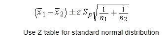***

***两个独立样本的置信区间公式***

***均值=新均值-旧均值= 4–6 =-2***

***z 得分= 1.96 95%的置信区间***

******

***st. error = sqrt((0。⁵* 99+* 99)/(100+100–2))* sqrt(1/100+1/100)
标准差= 0.205061
下界=-2–1.96 * 0.205061 =-2.40192
上界= -2+1.96*0.205061 = -1.59808***

***置信区间= [-2.40192，-1.59808]***

# ***参考***

***【1】[中心极限定理，定义及例题步骤简单](https://www.statisticshowto.datasciencecentral.com/probability-and-statistics/normal-distributions/central-limit-theorem-definition-examples/)，*统计如何****

***[2] [电力，统计，*维基*](https://en.wikipedia.org/wiki/Power_(statistics))***

***【3】[人择原理，*百科*](https://en.wikipedia.org/wiki/Anthropic_principle)***

***[4] [实验设计，*维基百科*](https://en.wikipedia.org/wiki/Design_of_experiments)***

***[5] [根本原因分析，*百科*](https://en.wikipedia.org/wiki/Root_cause_analysis)***

# ***感谢阅读！***

> ******如果您喜欢这篇文章，请务必点击*** [***订阅此处***](https://terenceshin.medium.com/membership) ***或至我的*** [***独家快讯***](https://terenceshin.substack.com/embed) ***千万不要错过另一篇关于数据科学指南、技巧和提示、生活经验等的文章！******

# ***更多相关文章***

*** [## 亚马逊的数据科学家面试实践问题

### 一些亚马逊面试问题的演练！

towardsdatascience.com](/amazon-data-scientist-interview-practice-problems-15b9b86e86c6)  [## 微软数据科学面试问答！

### 微软面试中一些数据科学问题的演练

towardsdatascience.com](/microsoft-data-science-interview-questions-and-answers-69ccac16bd9b)  [## 更多微软数据科学面试问题和答案

### 微软面试中一些数据科学问题的另一个演练

towardsdatascience.com](/more-microsoft-data-science-interview-questions-and-answers-f9ee8337072c)  [## 谷歌的数据科学面试脑筋急转弯

### 作为谷歌数据科学面试的一部分，他们喜欢问一些他们称为“解决问题”的问题…

towardsdatascience.com](/googles-data-science-interview-brain-teasers-7f3c1dc4ea7f)  [## 数据科学家的 5 个常见 SQL 面试问题

### 帮助您发展 SQL 技能，在任何面试中胜出

towardsdatascience.com](/5-common-sql-interview-problems-for-data-scientists-1bfa02d8bae6)***