# 45 对 KMeans 和 KMedoids 无监督学习聚类的广泛研究的观察

> 原文：<https://towardsdatascience.com/45-observations-of-an-extensive-study-of-kmeans-and-kmedoids-unsupervised-learning-clustering-41da9b254712?source=collection_archive---------50----------------------->

在数据集中发现模式或聚类是人类智能的基本能力之一。如果我们要接近或超过人类的智能，我认为它必须是半监督学习，或者更好的是，无监督学习。我对选择无监督学习聚类模型的“最佳实践”并不满意。利用机器学习框架 **Photonai** ，我们探索了 **KMeans** 和 **KMetroids** 集群模型**的异同。**我们改变聚类数、每个聚类的点数、聚类大小和目标聚类形状。最后，我们尝试在一个*“真实世界”*数据集上进行聚类。

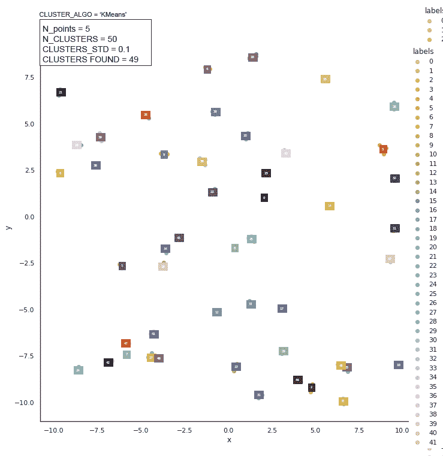

**k 是指**以各种细胞计数密度对细胞(小球形斑点)进行计数。50 和 300 个细胞的细胞计数为-2%。1000 个细胞的细胞计数为+6.5%。瑞秋·科特曼的动画

# **k 均值**和**k 均值**聚类模型比较的目的

> 理解、评估和利用已识别聚类的最基本步骤是对它们进行定量比较。—来自

[](https://www.nature.com/articles/s41598-019-44892-y) [## 以元素为中心的聚类比较统一了重叠和层次

### 聚类是理解复杂数据的最通用的方法之一。集群的一个关键方面…

www.nature.com](https://www.nature.com/articles/s41598-019-44892-y) 

上面的引用触及了我们为什么从比较**kme means**和 **KMedoids** 集群开始的核心。

我们可以一起对广泛的 **KMeans** 和 **KMetroids** 星团模型**进行广泛的成对研究。我们想要观察这些聚类模型之间的差异和相似之处。**

此外，我们希望在未来用其他聚类模型完成类似的广泛研究。我们尝试回答以下任何一个问题。

*   我们能开发一个区分每个聚类模型的观察结果的“备忘单”吗？
*   我们能否查看数据并缩小我们应该使用的聚类模型的选择范围？
*   在我们研究的某个阶段，我们能找到一个元算法或一套规则来选择一个聚类模型吗？
*   我们的研究能指导我们得到更好的聚类模型吗？

我们的答案可能是 ***对这些问题的部分或全部*** 不。然而，我们不会放弃；无监督学习聚类模型是一个活跃的研究领域。

我们将一起探讨这些问题。让我们看看我们走了多远。

## 什么是集群？

> “恩恩德的伯德和色弗洛克和弗赖在一起。——威廉·特纳(公元 1545 年)《拯救罗米什·福克斯》
> 
> 物以类聚，人以群分。(近似现代英语翻译)

根据相似性将事物分成不同的组是一种古老的能力。它可能早于自我意识，因为史前生命会对*太阳*或*不太阳*做出反应，然后*吃*或*不吃。*

通常(也许总是)，聚类是一个*无监督的*机器学习问题。数据没有标签(*无监督*)来将数据点划分为聚类。

聚类通过数据特征的相似性来区分。

我们需要一个例子！好吧，狗、猫和灰鲸怎么样。我们最初的猜测是有三个不同的集群。

如果你有两个特征:长度和体重，那么狗和猫的数据点聚类由于高度重叠而不明显。在猫狗群里，大型犬也有异常值。(好吧，我猜狮子可以算是大型家猫。)数据点的灰鲸群集明显地与狗-猫群集分开。

据我所知，任何聚类模型都会找到两个聚类。

你可能会说:**错了**！如果你这样做了，那是因为你使用了比长度和重量更多的特征来区分一群猫和一群狗。

想象一个二维图，其中纵轴是*长度*测量值，横轴是*重量*测量值。您可能会得到两个不同的聚类，其中成对的点(任意两点的对)距离是数据点的二维(2-D)向量长度，坐标为长度和权重。

你可能想在狗-猫-灰鲸聚类任务中使用缩放。(我们稍后将讨论缩放。).然而，如果长度和重量都放在一个范围从 0.0 到 1.0 的单位轴上，它仍然不会将狗-猫聚类分开。

例如，如果我们有细菌、老鼠和灰鲸，以及两个特征:长度和重量，我们将得到不同的集群(在双对数图上)。

***观察#1:为您的聚类选择一组可测量的区别特征是至关重要的。***

***观察#2:(有时)如果你改变可测量的特征的数量，你就改变了你观察的集群的数量。***

> 注意:观察#2 不是一个“*硬性规定*”。在上面的两个例子中，您能想到哪些特性会或不会创建更多的集群吗？
> 
> 注:之所以称之为 ***无监督*** 学习，是因为你应该**而不是*监督*** *学习*。没有*监督*，在某种程度上， ***没有*** 很难做到。如果你*以任何方式监督*，*，*你可以引入隐藏的**偏见**和假设。

例如，将对象聚类成*是*而*不是*一个比萨饼切片严重偏向于特征选择，以至于它是*监督的*学习，即使你使用传统的*非监督的*模型。

***观察#3:从一组可衡量的显著特征开始。聚类之后，在改变可测量的特征时要小心。这可能是监督，应该记录下来。***

> 注意:在两个阵营中有一个很大的争论，我称之为"*实干*"阵营和"*纯粹主义*"阵营。在这篇文章中，我使用了“*纯粹主义者*”的 camp 方法。然而，我有时会在现实世界或游戏竞赛中加入“努力完成”阵营。我(试图)用前者来证明我的假设。

欢迎你采用你自己的立场作为“*完成*”“*纯粹主义者*”或者其他完全不同的阵营。

## 什么是相似？

我们可以引入术语*相似度*，它(通常)是两个数据点(对)之间的距离。在上面的例子中，每个数据点都是测量的长度和重量。

我们发现，根据*相似性的定义，*即数据点对越接近，它们具有越高的相似性分数。相距较远的数据点对具有较低的相似性得分。

***观察#4:如果相似度是两个数据点之间距离的度量，那么我们就不能使用范畴特征。分类值的值是不明确的。***

星期一离星期二有一天的距离还是六天的距离？a 卡是 0 还是 1 还是 11 还是*最高*？这取决于你玩的游戏。

> 注意:在以后的文章中，我们将发现将分类特征转换成连续特征的方法。我们还将讨论将连续特征转换为分类特征的方法。

## 他们定义聚类模型距离的方式不同吗？

是的，有不同的方法来定义距离。如何定义或测量数据点之间的距离通常决定了分类模型。

对于本文，我们使用欧几里德距离，距离= sqrt(x + y)。

**k** - < x >系列，其中 **KMeans** 和 **KMedoids** 是其成员，要求距离不同。如果是差异的，那么优化器会使 **k** - < x >系列成为现有的执行速度最快的集群模型之一。

> 注意:**k 表示**有多种变化。如 **KMedian** ，组成 **k** - < x >家族。
> 
> 注意:微分是微积分的一部分。理解这篇文章的任何部分都不一定要知道区分的机制。有许多优化版本的 **k** - < x >系列，你不需要关心实现。
> 
> 注意:我们在这项研究中集中使用 **k** - < x >家系。

## 什么是*休伯特和阿拉比调整后的兰德指数(HAARI)？*

我们在预测的数据点聚类标签和实际的“*真实的*”数据点聚类标签之间测量聚类算法的“*优度*”。

数据点标签数量*正确预测*与*T30*地面数据点标签*数量之比就是*精度*。*

```
*accuracy* = (*correct-predicted)/ground-truth*
```

我们测量聚类标签的预测有多好。尽管如此，*无监督的*学习，因为我们不是用*基本事实*标签训练聚类模型。

我们需要一个比数据点分配(*准确性*)更好的度量来比较聚类结果。我们可以使用的第一个指标是*休伯特和阿拉比调整后的兰德指数(HAARI)* 。

***k**-<x>家族和 *HAARI* 有三个已知的偏差(违反已知的真实世界条件) *:**

1.  *一个数据点只能位于一个群集中；*
2.  *每个聚类中的数据点数量必须相同；*
3.  *并且每个簇必须具有相同的大小。*

*用人工数据集创建者，`make-blobs`，*

1.  *每个数据点被分配给一个聚类；*
2.  *每个聚类可以具有相同数量的数据点；*
3.  *并且每个簇具有相同的大小。*

*在一个调用配置中使用`make-blobs,`，我们不会陷入 *HAARI* 的偏差陷阱。然而，使用`make-blobs,`使用不同的调用配置，我们会违反偏差#2 和#3..*

**HAARI* 从*精度中减去给定聚类的数据点随机分配。HAARI* 使用超几何分布作为随机性(噪声)的模型。*

> *注意:使用超几何分布，假设基础数据点分布近似为高斯形状。自然过程产生的数据的良好近似值，其数据点计数相对大于聚类计数 20 倍或更高。换句话说，如果每个聚类至少有二十个数据点。(中心极限定理)。*

*[](/hypergeometric-distribution-explained-with-python-2c80bc613bf4) [## 用 Python 解释超几何分布

### 数学课上的概率问题，你需要的概率要么给你，要么相对容易…

towardsdatascience.com](/hypergeometric-distribution-explained-with-python-2c80bc613bf4) 

想象掷一枚硬币，它的边数不是 2 而是当前的簇数。抛硬币。它着陆，面朝上的一侧是分配的群集标签。

> 注意:如果一便士是两面的(*抵制一个糟糕的双关语*)，那么超几何分布就变成了二项式解。

总之， *HAARI* 是测量预测聚类标签的“*优度”*与减去了*“随机噪声”**的“*真实值*”聚类标签的比率。*警告:如果*哈里的*已知偏差不适用。

> 注意: *HAARI* 范围在 0.0(随机)到 1.0(完美)之间。
> 
> 注意:其他 *xARIs* 使用其他随机性分布。
> 
> 注意: *HAARI* 分数可能会因随机分配的种子而略有不同。

你可以在这里详细阅读关于 HAARI 的[。](https://en.wikipedia.org/wiki/Rand_index#Adjusted_Rand_index)

> 注:`*sklearn.metrics.ari*`不执行*休伯特和阿拉比调整后的兰德指数(* HRARI *)* 。

## 什么是以元素为中心的相似性(ECS)聚类指标？

> 一种纠正聚类比较中偏差的方法是**在聚类**的随机集合的背景下考虑聚类相似性。这种机会纠正使用由**随机模型指定的聚类之间所有成对比较的预期相似性来建立基线相似性值**。然而，**机会修正**方法有严重的**缺点** : (i) **它强烈依赖于为聚类**假设的随机模型的选择，这通常是高度不明确的，以及(ii) **没有提出用于重叠或分层聚类**的随机模型…来自

[](https://www.nature.com/articles/s41598-019-44892-y) [## 以元素为中心的聚类比较统一了重叠和层次

### 聚类是理解复杂数据的最通用的方法之一。集群的一个关键方面…

www.nature.com](https://www.nature.com/articles/s41598-019-44892-y) 

上面的引用来自发明 *HAARI* 的一些人。他们提出了一个比 HAARI 更健壮的聚类指标，这并不奇怪。

我将这个新的度量标准称为 ECS。

[以元素为中心的相似性( *ECS*](https://www.nature.com/articles/s41598-019-44892-y) )聚类度量比 *HAARI 具有更少的偏差。*当我们使用`make-blobs`时，当我们没有触发 *HAARI* 偏差，因此 *HAARI* 产生的分数应该接近 *ECS* 分数*。*

**观察#5:群集度量 *ECS* 比 *HAARI 具有更少的偏差，并且据报告*** [***更好。*T39**](https://www.nature.com/articles/s41598-019-44892-y)

> 注意:25 个聚类指标需要标签，超过 5 个聚类指标不需要标签。一个优秀的计算集群度量的软件包是 [**clusim**](https://github.com/Hoosier-Clusters/clusim) **。**
> 
> 注意:在此讨论中，我们仅使用 *HAARI* 和 *ECS* 。

## 什么是`make-blobs`？

我在回避一个有如下描述的数学。`make-blobs`创造`n_features (or n_cluster)`，以`N`为中心。每个中心用`n_samples (or n_data_points).`创建一个数据点集群，每个点从中心以随机距离分布，随机距离选自标准偏差为`cluster_std.`的高斯(正态)分布

> 注:也许我应该用一个方程来解释？
> 
> 注意:聚类中心的距离选自具有较大标准差(std)的高斯(正态)分布。
> 
> 注意:距离= sqrt(x + y)

我们也可以用三个例子来回答`make-blobs`创造了什么。

1.  没有每簇不同数据点的***k**-<x>族和 *HAARI* 偏差的触发。下面对`make-blobs`的调用有 21 个集群，每个集群的标准差为 1.0，有 30 个数据点。*

```
*from sklearn.datasets import make_blobs

data_X, data_y= make_blobs(n_samples=30, n_features=21, cluster_std=1.0, random_state=0)*
```

*2.触发每簇不同数据点计数的**k** - < x >族和 *HAARI* 偏差。下面对`make-blobs`的调用有 3 个集群。第一个聚类的数据点数为 3，第二个聚类的数据点数为 30，第三个聚类的数据点数为 300。这 3 个聚类每个都有 1.0 的标准偏差。*

```
*from sklearn.datasets import make_blobs

data_X, data_y= make_blobs(*n_samples=[3,30,300]*, n_features=3, cluster_std= 1.0, random_state=777)*
```

*3.触发不同簇大小的**k** - < x >族和 *HAARI* 偏置。下面对`make-blobs`的调用有 3 个集群。第一个聚类的标准偏差为 0.3，第二个聚类的标准偏差为 0.66，第三个聚类的标准偏差为 1.0。每个集群中有 300 个数据点。*

```
*from sklearn.datasets import make_blobs

data_X, data_y= make_blobs(n_samples=300, n_features=3, cluster_std=[0.3, 0.66, 1.0], random_state=777)*
```

> *注意:我们将处理人工数据和*真实世界*测量数据。在这两种情况下，聚类标签是已知的。*

*稍后我们将深入探讨**kme means**和 **KMedoids** 模型的方式(或许还有一点原因)。*

*现在，让我们找点乐子。*

*让我们通过以下方式来探索**k 方法**和**k 方法***

1.  *改变聚类的数量，并改变每次运行的数据点的数量。对于每次运行，每个聚类都有相同数量的数据点。我们不应该引发一个 **k** - < x >家族或者 *HAARI* 的偏见；*
2.  *改变集群大小；我们触发了 **k** - < x >族和 *HAARI* 偏置，即每个簇必须具有相同的大小；*
3.  *并且将簇的形状从圆形改变为椭圆形。给定"*distance = sqrt(x+y)"*measure 预测球状星团，我们会触发隐藏偏差吗？*

# *改变每个聚类的数据点的数量和改变圆形聚类(斑点)的数量对聚类算法 KMeans 和 **KMedoids** 的影响*

*我们来看看**kme means**和 **KMedoids** 在改变数据点数量和聚类数量方面的表现。标准偏差( *std* )在第 1 和第 2 个动画图中为 0.3 *std* ，在第 3 和第 4 个动画图中为 1.0 *std* 。人造数据点是由`make-blob`创造的。*

> *注意:std 决定了所形成的集群的包络的大小。*

*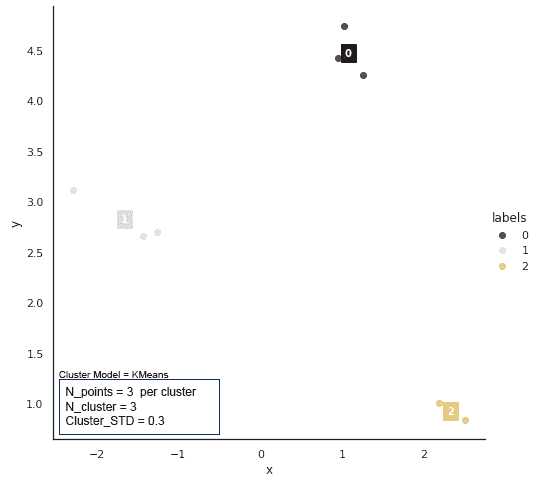*

***k 表示**聚类，其中*改变每个聚类的固定数据点*，用于 std = 0.3 的 3 个聚类。瑞秋·科特曼的动画*

*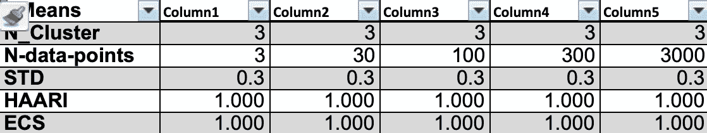*

*对于 std = 0.3 的 3 个聚类，v *改变每个聚类的固定数据点*计数的**k 均值**聚类表。*

*观察# n(1):k 意味着:数据点计数越高，斑点越圆。*

*簇中的点越多，由`make-blobs`创建的簇的圆形包络就越多。*

*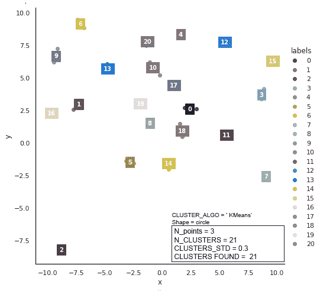*

**图中的****k 表示对于 std = 0.3 的 21 个聚类，改变每个聚类的固定数据点计数。动画由* [*雷切尔·科特曼*](http://rachel.alvear.cottman@gmail.com)***

*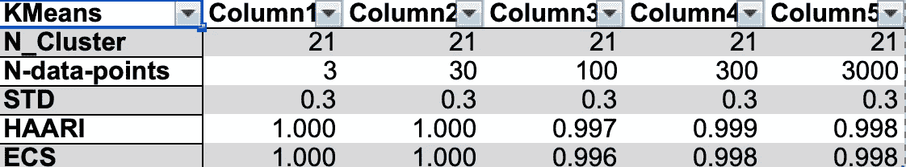*

*对于 std = 0.3 的 21 个聚类，**k 表示** *聚类，改变每个聚类的固定数据点 t 计数。**

***观察# n1:k 意味着:数据点计数越高，斑点越圆。***

***观察# N2:k 均值:3 和 21 个聚类，std = 0.3，我们看到圆形聚类的良好分离，没有共享数据点。***

> *注意:由于没有偏差触发，我们预计大小为`std = 0.3`的**k 均值**的 *HAARI* 和 *ECS* 得分接近 1.0。*

*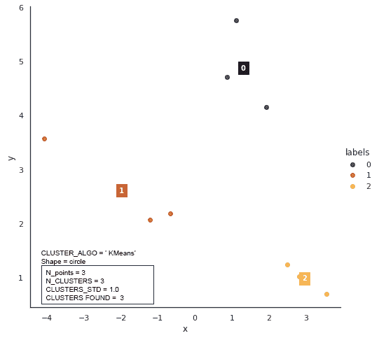*

**图中的****k 表示对于 std = 1.0 的 3 个聚类，改变每个聚类的固定数据点数进行聚类。动画由* [*雷切尔·科特曼*](http://rachel.alvear.cottman@gmail.com) *≤****

*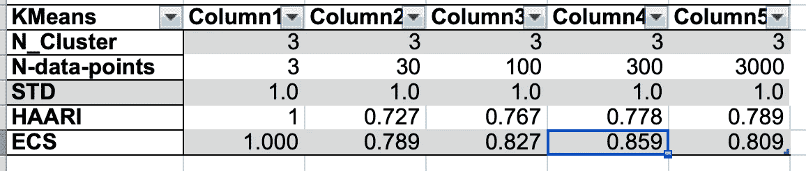*

**表****k 表示*** *聚类，对于 std = 1.0 的 3 个聚类，改变每个聚类的固定数据点计数**

****观察# n3:*k 意味着*形状偏离圆形，簇重叠越多。****

****观察#n4:* 对于重叠的聚类，KMeans *的 HAARI 和 ECS 分数低于 1.0。****

*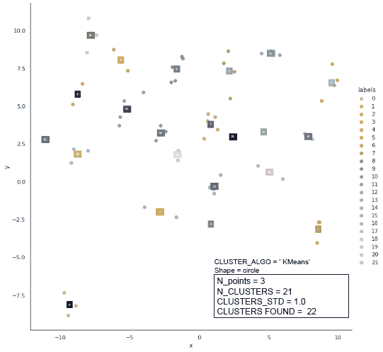*

**图中的****k 表示*** *聚类，对于 std = 1.0 的 21 个聚类，改变每个聚类的固定数据点计数。动画由* [*雷切尔·科特曼*](http://rachel.alvear.cottman@gmail.com) 制作*

*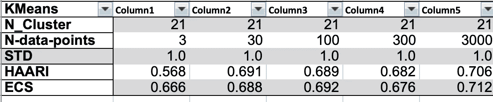*

**表****k 均值*** *聚类，对于 std = 1.0 的 21 个聚类，改变每个聚类的固定数据点计数。**

****观察# n3:*k 表示*形状偏离圆形。群集重叠越多。****

****观察#n4:* KMeans 在聚类计数正确时，对于重叠的聚类，其 *HAARI 和 ECS 得分低于 1.0。****

****观察# n5:*k 均值具有 *HAARI，并且当每个聚类计数的数据点为 21 时，ECS 分数低于 1.0。****

****观察#n6:* 当每个聚类计数的数据点为 30 或更大时，k 均值的 *HAARI 和 ECS 分值的值等于 0.1%。****

*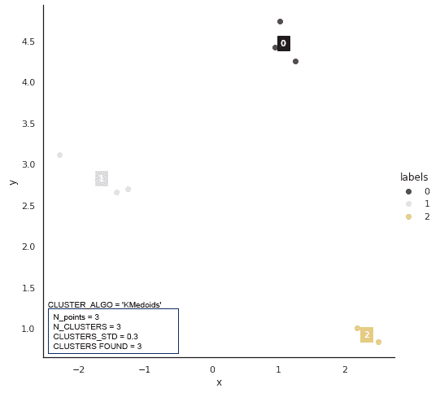*

**图* **KMediods** 聚类，其中*改变 std = 0.3 的 3 个聚类的每个聚类的固定数据点计数*。瑞秋·科特曼的动画*

*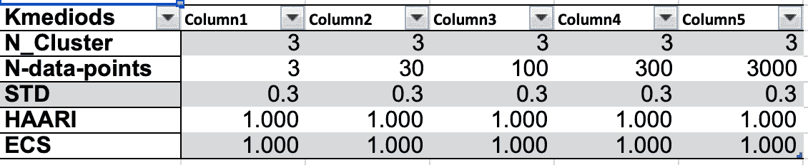*

***KMediods** *聚类表，对于 std = 0.3 的 3 个聚类，改变每个聚类的固定数据点计数。**

***观察#n7:当聚类被很好地分离并且不重叠时，KMedoids *具有 1.0 的 HAARI 和 ECS。****

**

**图****KMediods****聚类，对于 std = 1.0 的 3 个聚类，改变每个聚类的固定数据点计数。动画由* [*雷切尔·科特曼*](http://rachel.alvear.cottman@gmail.com) 制作*

*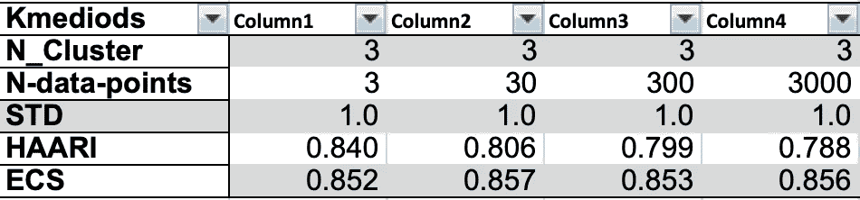*

***KMedoids** *聚类表，针对 std = 1.0 的 3 个聚类，改变每个聚类的固定数据点计数。**

***观察#n8: KMedoids *当聚类没有很好地分离和重叠时，HAARI 和 ECS 得分低于 1.0*。***

*我们可以理解较低的 ***HAARI*** 和 ***ECS*** 分数，因为 **KMedoids** 从数据集中选择质心。每个聚类的数据点计数越低，一个聚类具有也是该聚类的理想中间点的数据点的概率就越低。(仅对称形状的簇。)*

****观察#n9:* KMedoids 有 *HAARI 和 ECS 的值相差 1.5%到 7%。****

*推理同 ***观察#n(13)。* KMedoids** 从数据集中选择一个质心。每个聚类的数据点计数越低，一个聚类具有也是该聚类的理想中间点的数据点的概率就越低。(仅对称形状的簇。)*

****观察#n10:* KMedoids: T *数据点计数范围左端的低点计数效应和数据点计数范围右端的聚类重叠似乎为 ECS 分数彼此平衡。****

*我们观察到，随着数据点计数的增加， *HAARI* 低于 *ECS，**

**

**图* **KMediods** 聚类，其中*改变 std = 0.3 的 21 个聚类的每个聚类的固定数据点*计数。瑞秋·科特曼制作的动画*

**

*表 **KMedoids** *聚类，每个聚类的数据点计数不同，有 21 个聚类，std = .3。瑞秋·科特曼的动画**

****观察#n11:* KMeans *聚类模型，std =0.3，具有比* KMedoids *，std =0.3，聚类模型更高的 HAARI 和 ECS 分数。****

*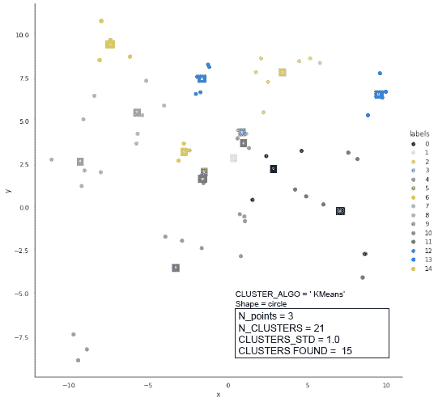*

**图* **KMediods** 聚类，其中*改变 std = 1.0 的 21 个聚类的每个聚类的固定数据点*计数。由[瑞秋·科特曼](http://rachel.alvear.cottman@gmail.com)制作的动画*

*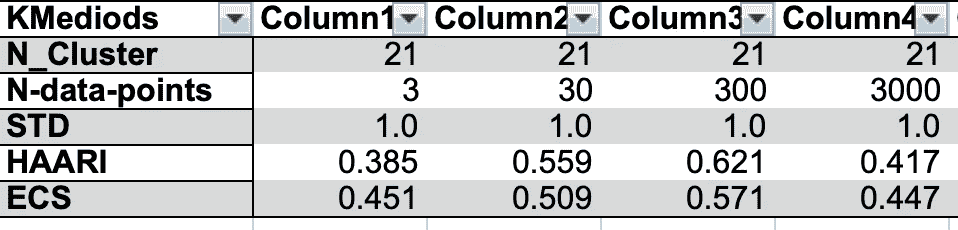*

***KMedoids** *聚类表，对于 std = 1.0 的 21 个聚类，改变每个聚类的固定数据点计数。**

****观察#n12:* KMeans *聚类模型，std =1.0，具有比* KMedoids *，std =1.0，聚类模型更高的 HAARI 和 ECS 分数。****

****观察 n13:对于 KMeans 和 KMediods 聚类模型，数据点越多，聚类计数对实际聚类计数越好，因此 HAARI 和 ECS 得分越高。****

*当有监督和无监督的机器学习被给予更多的数据点时，就有了更好的模型来预测未来的数据点。*

****观察#n14:* KMeans *似乎比* KMedoids *有更高的 HAARI 和 ECS 分数。****

*如果***【n14】******的观测成立，我们将发现其他扰动，如星团的大小和形状。****

# *各种圆形斑点簇大小对模型 KMeans 和 **KMedoids 的影响。***

*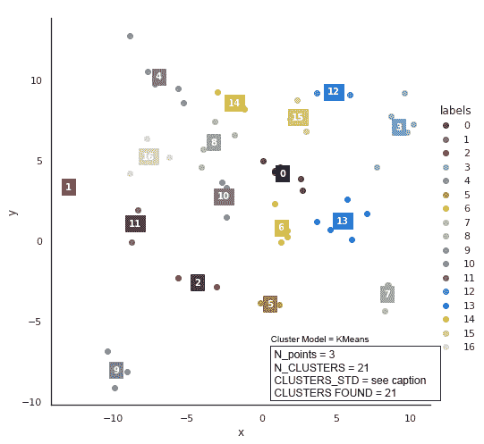*

**图* **表示对于基数 std=0.25 的 21 个集群，使用各种圆形斑点集群大小进行集群。瑞秋·科特曼的动画***

*聚类标准偏差(小标准偏差)为[0.2，0.45，0.55，0.63，0.7，0.75，0.84，0.86，0.91，. 95，1.0，1.03，1.07，1.10，1.14，1.17，1.2，1.23，1.26，1.29，1.32]，导致不同的聚类大小。*

*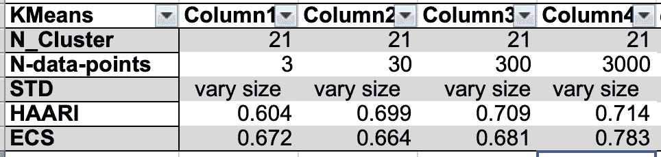*

*对于基数 std=0.25 的 21 个聚类，具有各种圆形斑点聚类大小的**k 均值**聚类表。*

****观察# S1:**不同大小的簇上的 KMeans 比固定大小的簇上的 KMeans 具有更低的 HAARI 和 ECS 分数。****

**

**图* **表示**对于基数 std=0.50 的 21 个聚类，使用各种圆形斑点聚类大小进行聚类。瑞秋·科特曼的动画*

*聚类标准偏差是:[0.2，0.7，0.90，1.06，1.2，1.31，1.42，1.52，1.61，1.7，1.78，1.85，1.93，2.00，2.07，2.13，2.2，2.26，2.32，2.379，2.43]导致不同的聚类大小。*

*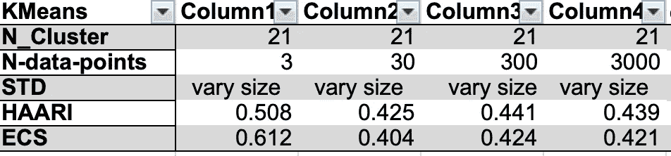*

****观察# S1:**不同大小的簇上的 k 均值比固定大小的簇上的 k 均值具有更低的 HAARI 和 ECS 分数。****

****观察# S2:**较大的不同大小的簇上的 k 均值比较小的不同大小的簇上的 k 均值具有较低的 HAARI 和 ECS 分数。****

*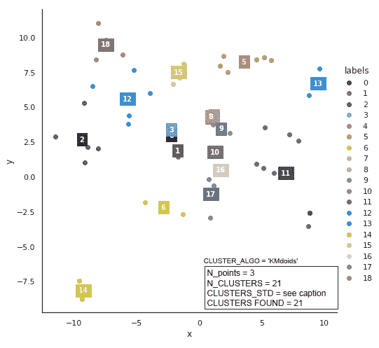*

**图* **KMediods** 对于基数 std=0.25 的 21 个聚类，使用各种圆形斑点聚类大小进行聚类。瑞秋·科特曼的动画*

*聚类标准偏差为 n_cluster_std [0.2，0.45，0.55，0.63，0.7，0.75，0.84，0.86，0.91，0.95，1.0，1.03，1.07，1.10，1.14，1.17，1.2，1.23，1.26，1.29，1.32]，导致不同的聚类大小。*

*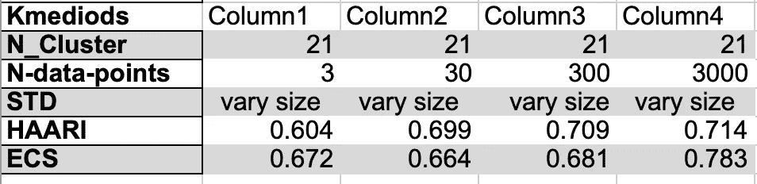*

***基 std=0.25 的 21 个聚类的具有各种圆形斑点聚类大小的 KMediods** 聚类表。*

****观察#s3:* 不同大小的簇上的 kmediod 比固定大小的簇上的 kmediod*具有更低的 HAARI 和 ECS 分数。****

*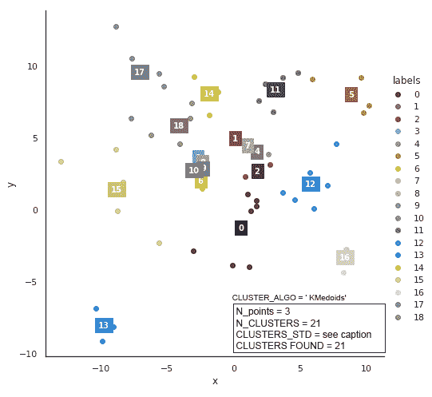*

**图* **对基数 std=0.50 的 21 个聚类进行具有各种圆形斑点聚类大小的 KMediods** 聚类。瑞秋·科特曼的动画*

> *注意:标题框不正确。对于`N_points = 3, CLUSTERS_FOUND =19; N_points = 30, CLUSTERS_FOUND =21; N_points = 100, CLUSTERS_FOUND =15; N_points = 300, CLUSTERS_FOUND =17.`*

*聚类标准偏差[0.2，0.7，0.90，1.06，1.2，1.31，1.42，1.52，1.61，1.7，1.78，1.85，1.93，2.00，2.07，2.13，2.2，2.26，2.32，2.38，2.43]导致不同的聚类大小。*

*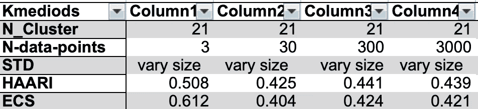*

***基 std=0.50 的 21 个聚类的具有各种圆形斑点聚类大小的 KMediods** 聚类表。*

****观察#s3:* 不同大小的簇上的 kmediod 比固定大小的簇上的 kmediod 具有更低的 HAARI 和 ECS 分数。***

****观察# S4:**不同大小的簇上的较大的 kme dids 具有比较小的不同大小的簇上的*kme dids*更低的 HAARI 和 ECS 分数。****

# *每个椭圆形斑点的不同数量的数据点对聚类模型 k 均值和 k 均值的影响*

*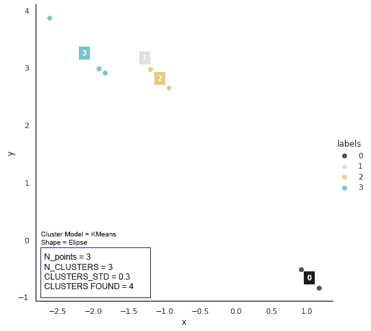*

**数字***k 表示对于 std = 0.3 的 3 个聚类，每个椭圆聚类的数据点计数变化**。瑞秋·科特曼的动画*

*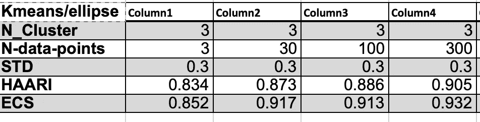*

**表中的****k 表示对于 std = 0.3 的 3 个群，每个椭圆群具有不同的数据点计数****

****观察#e1:* 椭圆形聚类上的 k 均值*将一些数据点分配给错误的聚类。****

****观察#e2:* 椭圆形簇上的 KMeans *比圆形相同大小簇上的* KMeans *具有更低的 HAARI 和 ECS 分数。****

*观察#e1 和观察#e2 源于基于距离的相似性，导致导出的聚类的圆形包络以质心为中心。*

****观察# E3:k 均值聚类随着预测的聚类形状偏离圆形而退化。****

**

**图***k 表示对于 std = 0.3 的 21 个群，每个椭圆群的数据点数不同**。瑞秋·科特曼的动画*

*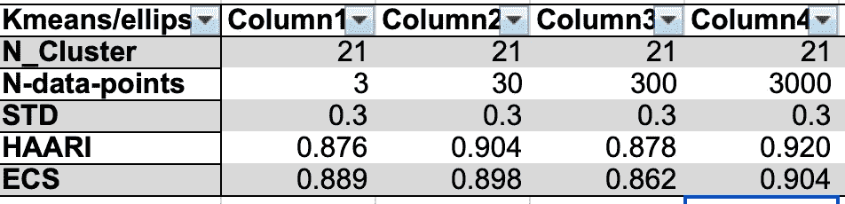*

*对于 std = 0.3 的 21 个集群，每个椭圆集群具有不同数据点计数的**k 均值**表。*

****观察#e1:* 椭圆形聚类上的 k 均值*将一些数据点分配给错误的聚类。****

****观察#e2:* 椭圆形簇上的 KMeans *比圆形相同大小簇上的* KMeans *具有更低的 HAARI 和 ECS 分数。****

****观察# E3:k 均值随着集群形状偏离圆形而退化。****

****观察#e4:* 计数为 21 的椭圆形簇上的 KMeans *比计数为 3 的较大椭圆形簇上的* KMeans *具有更低的 HAARI 和 ECS 分数。****

**

**数字****k 表示对于 std =1.0 的 3 个群，每个椭圆群具有不同的数据点计数。动画由* [*雷切尔·科特曼*](http://rachel.alvear.cottman@gmail.com) 制作***

*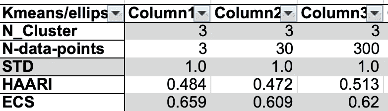*

*表***k 均值*** *对于 std =1.0* 的 3 个聚类，每个椭圆聚类具有不同的数据点计数*

****观察#e1:* 椭圆形聚类上的 k 均值*将一些数据点分配给错误的聚类。****

****观察#e2:* 椭圆形簇上的 KMeans *比相同大小的圆形簇上的* KMeans *具有更低的 HAARI 和 ECS 分数。****

****观察# E3:k 均值聚类随着聚类形状偏离圆形而退化。****

****观察#e5:* 椭圆形簇上的 KMeans *比更大尺寸的椭圆形簇上的* KMeans *具有更低的 HAARI 和 ECS 分数。****

****观察#e6:* KMeans *对具有三个数据点的椭圆形聚类预测了错误的聚类数。****

*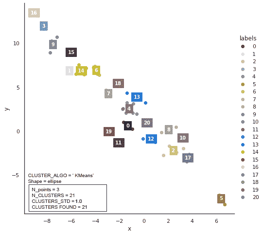*

**图****k 表示对于 std = 1.0 的 21 个群，每个椭圆群具有不同的数据点数*** *动画作者* [*雷切尔·科特曼*](http://rachel.alvear.cottman@gmail.com)*

*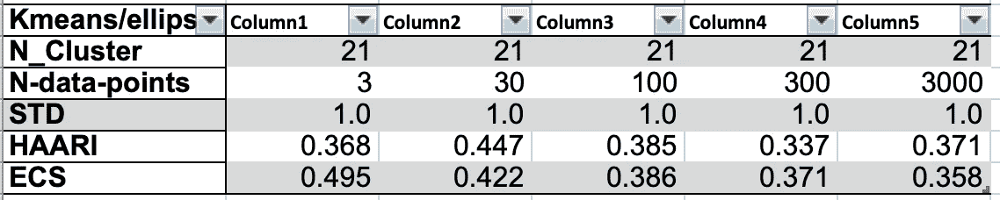*

*表***k 均值*** *对于 std = 1.0* 的 21 个聚类，每个椭圆聚类具有不同的数据点计数*

****观察#e1:* 椭圆形聚类上的 k 均值*将一些数据点分配给错误的聚类。****

****观察#e2:* 椭圆形簇上的 KMeans *比圆形相同大小簇上的* KMeans *具有更低的 HAARI 和 ECS 分数。****

****观察# E3:k 均值聚类随着聚类形状偏离圆形而退化。****

****观察#e4:* 具有 21 个聚类的椭圆形上的 k 均值*比具有 3 个聚类的更大尺寸的椭圆形上的*k 均值*具有更低的 HAARI 和 ECS 分数。****

****观察#e5:* 椭圆形簇上的 KMeans *比更大尺寸的椭圆形簇上的* KMeans *具有更高的 HAARI 和 ECS 分数。****

*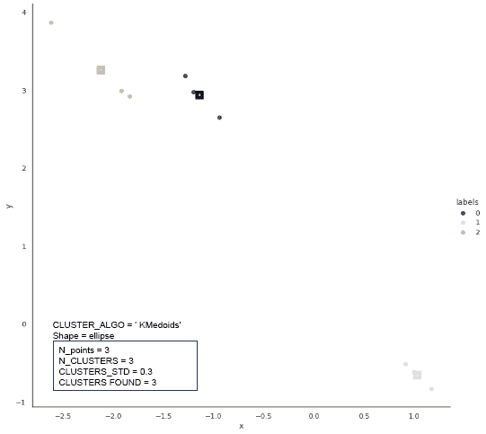*

**图* **KMedoids** 对于 std = 0.3 的 3 个群，每个椭圆群具有不同的数据点计数。瑞秋·科特曼的动画*

*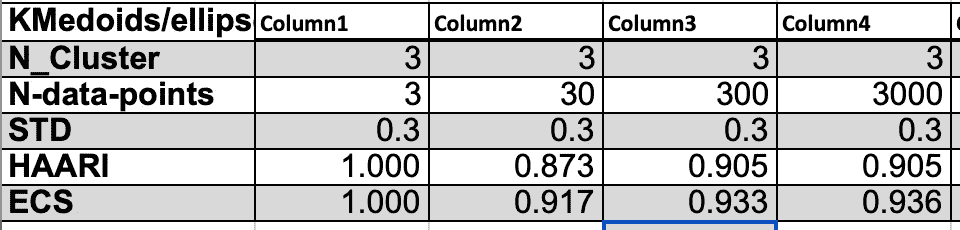*

*对于 std = 0.3 的 3 个集群，每个椭圆集群具有不同数据点计数的 **KMedoids** 表*

****观察#e7:* 椭圆形聚类上的 KMediods *将一些数据点分配给错误的聚类。****

****观察#e8:* 椭圆形簇上的 kme dids*的 HAARI 和 ECS 分数低于圆形相同大小簇上的*kme dids*。****

****观察#e9:* KMediods *聚类随着聚类形状偏离圆形而退化。****

****观察#e10:* 具有 3 个簇的椭圆形上的 KMediods *比具有 3 个簇的更大尺寸的椭圆形上的* KMediods *具有更高的 HAARI 和 ECS 分数。****

*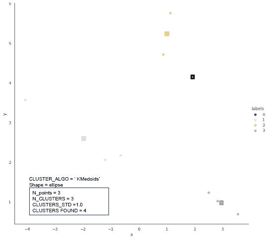*

**图* **KMedoids** 对于 std = 1.0 的 3 个聚类，每个椭圆聚类的数据点计数不同。瑞秋·科特曼的动画*

*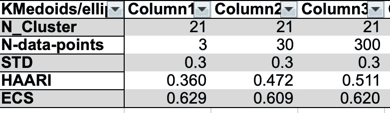*

*对于 std = 1.0 的 3 个集群，每个椭圆集群具有不同数据点计数的 **KMedoids** 表。*

****观察#e7:* 椭圆形聚类上的 KMediods *将一些数据点分配给错误的聚类。****

****观察#e8:* 椭圆形簇上的 KMediods *比圆形、相同大小的簇上的*kme ads*具有更低的 HAARI 和 ECS 分数。****

****观察#e9:* KMediods *聚类随着聚类形状偏离圆形而退化。****

****观察#e10:* 具有 3 个簇的椭圆形上的 KMediods *比具有 3 个簇的更大尺寸的椭圆形上的* KMediods *具有更高的 HAARI 和 ECS 分数。****

*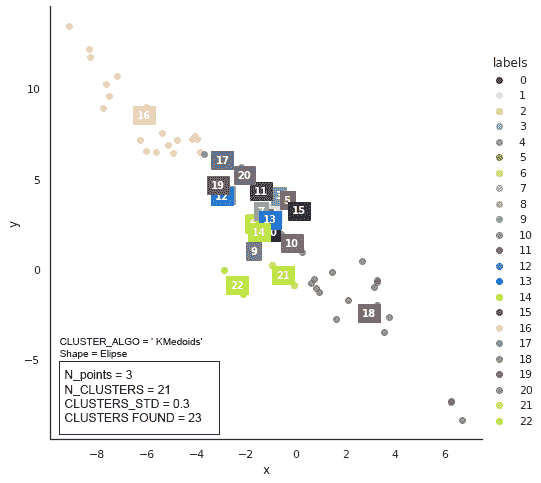*

**对于 std = 1.0 的 21 个群，图* **KMedoids** 具有每个椭圆群的不同数据点计数。瑞秋·科特曼的动画*

*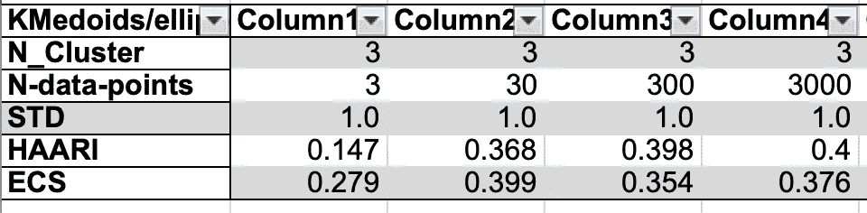*

*对于 std = 1.0 的 21 个集群，每个椭圆集群具有不同数据点计数的 **KMedoids** 表*

****观察#e7:* 椭圆形聚类上的 KMediods *将一些数据点分配到错误的聚类。****

****观察#e8:* 椭圆形簇上的 KMediods *比圆形、相同大小的簇上的* Kmeans *具有更低的 HAARI 和 ECS 分数。****

****观察#e9:* KMediods *聚类随着聚类形状偏离圆形而退化。****

****观察#e11:* 具有 21 个团簇的椭圆形状上的 KMediods *比具有 3 个团簇的更大尺寸的椭圆形状上的* KMediods *具有更高的 HAARI 和 ECS 分数。****

****观察#e12:* 椭圆形上的 kme dids*具有比* KMeans 更低的 HAARI 和 ECS 分数。***

# *什么是 Photonai？*

***Photonai** 将 **Scikit-Learn** 和其他机器学习(ML)或深度学习(DL)框架与一个统一的范例相结合。 **Photonai** 采用 **Scikit-Learn 的** `Estimator`和`Transformer`类方法架构。*

***Photonai** 有*元素，*有 **Photonai** 术语即的意思是`Estimator`或`Transformer`，通过将前学习器和后学习器算法转换成带有参数签名的元素来减少人工编码和错误。元素的例子是数据清理器、定标器、估算器、类平衡器、交叉验证器、超参数调谐器和集成的几种选择。*

*Photonai 的一个很酷的架构特性是，它提供了一种无代码的[方式来添加元素](https://photon-ai.com/documentation/register)(如果元素可被 **Python** 调用)。我添加了聚类算法`sklearn.cluster.KMeans`和`sklearn_extra.cluster.KMmediods`。*

*`PCA, t-SNE, K-Fold(cross-validation), hyperopt (hyper-parameter tuning), and StandardScaler (scaling)`已经是注册的元素，我们可以在机器学习框架 **Photonai** 中自由使用。*

*所有这些不同的机器学习技术，比如`PCA, t-SNE, K-Fold...`，在参考资料部分的文章中都有详细的讨论。*

***Photonai** 具有`registry.list_available_elements()`功能，逐项列出 **Photonai 中所有当前可用的 ***元素*** 。***

```
*from photonai.base.photon_elements import PhotonRegistry
registry = PhotonRegistry(custom_elements_folder=custom_elements_folder)
registry.activate()registry.list_available_elements()output ==>
PhotonCore
ARDRegression      sklearn.linear_model.ARDRegression  Estimator
AdaBoostClassifier sklearn.ensemble.AdaBoostClassifier Estimator
.
.
PhotonCluster
KMeans            sklearn.cluster.KMeans               Estimator
KMedoids          sklearn_extra.cluster.KMedoids       Estimator*
```

## *在群集模型中控制我们基于光的研究*

```
*CLUSTER_ALGO = 'KMedoids'

C_SHAPE ='ellipse'           # for cells C_SHAPE ='circle'
N_CLUSTERS = [21]            # for cells N_CLUSTERS = [50,300, 1000]
CLUSTERS_STD = 0.3           # for cells CLUSTERS_STD = 0.1
N_P_CLUSTERS = [3, 30, 300, 3000] # for cells N_P_CLUSTERS = [5]
INNER_FOLDS = 5
OUTER_FOLDS = 5*
```

*   *`CLUSTER_ALGO`确定使用哪个聚类模型。*
*   *`C_SHAPE`确定聚类的形状和包含所有聚类的包络的形状。*
*   *`N_CLUSTER`确定生成的簇的数量。*
*   *`CLUSTER_STD`调节生成的簇的大小。*
*   *`N_P_CLUSTERS`调节每个聚类的数据点数量。*
*   *`INNER_FOLDS`确定进行超参数搜索的次数，这将产生由 t *he 调整的 Rand 指数(ARI)确定的最佳超参数集。**
*   *`OUTER_FOLDS`决定 *ARI 的 *K 倍交叉验证*。*这里 *K* 给定为`OUTER_FOLDS.`结果是 ARI 的*均值*和 *std* 。*

*通过将`INNER_FOLDS` 和`OUTER_FOLDS` 设置为三或更大，我们更有信心优化 **KMeans** 和 **KMedoids 的拟合。**聚类模型针对每次`INNER_FOLDS*OUTER_FOLDS`运行进行了超参数优化。*

> **K-fold 交叉验证(CV)* 通过将数据划分为多个折叠，并确保每个折叠都作为一个测试集，为这个问题提供了一个解决方案。来自…*

*[](https://medium.com/datadriveninvestor/k-fold-cross-validation-6b8518070833) [## k 倍交叉验证

### 评估机器学习模型可能非常棘手。通常，我们将数据集分成训练集和测试集…

medium.com](https://medium.com/datadriveninvestor/k-fold-cross-validation-6b8518070833) 

## 这项研究使用的主要 Photonai 函数

本研究使用的所有代码都可以从 github 下载[。](https://github.com/bcottman/photon_experiments/tree/master/Cluster/kmeans-kmedoids)

```
def hyper_cluster(cluster_name):
    if C_SHAPE == 'ellipse' :
        yield_cluster = yield_parameters_ellipse
    else: 
        yield_cluster = yield_parameters

    n_p_clusters = N_P_CLUSTERS
    for data_X, data_y,n_cluster  in yield_cluster(n_p_clusters):
        simple_output('CLUSTER_ALGO:', CLUSTER_ALGO)
        simple_output('C_SHAPE:',C_SHAPE)
        simple_output('n_cluster:', n_cluster)
        simple_output('INNER_FOLDS:', INNER_FOLDS)
        simple_output('OUTER_FOLDS:', OUTER_FOLDS)        
        simple_output('n_points:', len(data_y))X = data_X.copy(); y =  data_y.copy()
        # DESIGN YOUR PIPELINE
        settings = OutputSettings(project_folder='./tmp/')

        my_pipe = Hyperpipe('batching',
                            optimizer='sk_opt',
        #                    optimizer_params={'n_configurations': 25},
                            metrics=['ARI', 'MI', 'HCV', 'FM'],
                            best_config_metric='ARI',
                            outer_cv=KFold(n_splits=OUTER_FOLDS),
                            inner_cv=KFold(n_splits=INNER_FOLDS),
                            verbosity=0,
                            output_settings=settings)my_pipe += PipelineElement(cluster_name, hyperparameters={
                                                           'n_clusters': IntegerRange(floor(n_cluster*.7)
                                                                                      , ceil(n_cluster*1.2)),
                                                            },random_state=777)logger.info('Cluster optimization range:',  floor(n_cluster*.7), ceil(n_cluster*1.2))
        print('Cluster optimization range:',  floor(n_cluster*.7), ceil(n_cluster*1.2))# TRAIN PIPELINE
        my_pipe.fit(X, y)debug = Truey_pred=cluster_plot(my_pipe, X, n_cluster, PALLET)print(pd.DataFrame(my_pipe.best_config.items()
                           ,columns=['n_clusters', 'k']))print('train','\n'
              ,results_to_df(my_pipe.results.metrics_train))
        print('test','\n'
              ,results_to_df(my_pipe.results.metrics_test))# turn the ground-truth labels into a clusim Clustering
        true_clustering = Clustering().from_membership_list(y) 
        kmeans_clustering = Clustering().from_membership_list(y_pred) # lets see how similar the predicted k-means clustering is to the true clustering# output all available similarity measures
        row_format2 ="{:>25}" * (2)
        for simfunc in sim.available_similarity_measures:
            print(row_format2.format(simfunc, eval('sim.' + simfunc+'(true_clustering, kmeans_clustering)')))elsim = sim.element_sim(true_clustering, kmeans_clustering)
        print("Element-centric similarity: {}".format(elsim))
```

## 如何获得 Photonai？

> **注意**:我只给出了基于 **Python-** 的集群模型示例，但是这些集群模型在其他语言中也是可用的。
> 
> **注意:Photonai** 是一个公开发布包，我已经对它进行了修改，以包含集群模型。

如果你的机器学习项目涉及到聚类，你将需要使用我的 **Photonai** 代码。很快，我打算添加 **xgboost** 和 **lightgbm** 。你可以从可克隆的 GitHub 获得我的增强功能。我建议每月更新，因为 **Photonai** 是一个正在进行的项目。

> **注意**:我已经服从了 **Photonai 的外部 API 调用签名。**
> 
> **注** [:当前文档仍然适用](https://photon-ai.com)。我的改进只记录在代码和以前关于 ***中*** 的博客中。
> 
> **注**:所有改动我都写了测试。

您可以使用以下命令将 Photonai 1.3.0 放在本地项目目录中

```
git clone [https://github.com/bcottman/photon.git](https://github.com/bcottman/photon.git)
```

> **注**:如果你愿意，你可以通过以下方式将**光子**包含在笔记本中:

```
import sys, o
old__file__ = !pwd
__file__ = !cd ../../../photon ;pwd
__file__ = __file__[0]sys.path.append(__file__)
print(sys.path)
os.chdir(old__file__[0])
!pwd
```

您将针对您的特定目录结构更改`__file__ = !cd ../../../photon` 。

**注** : **光子有一个** `**..photon/photonai/docker**`，用于构建一个 **Docker** 容器。该目录中指定了两种不同的 Docker 虚拟环境。`dev`具有 **Jupyter** 和 **Jupyter 扩展**所需的包版本。此配置在以下章节中有详细说明:

[](/adding-jupyter-notebook-extensions-to-a-docker-image-851bc2601ca3) [## 将 Jupyter 笔记本扩展添加到 Docker 映像

### 我们的 Jupyter Python 和 R 用户的 Docker 映像要求他们在每隔…之后设置他们的 Nbextensions 首选项

towardsdatascience.com](/adding-jupyter-notebook-extensions-to-a-docker-image-851bc2601ca3) 

**注意**:你可以造一个重量更轻的 **Docker** 集装箱(`test`)，没有 **Jupyter** ，而且是行李。该配置在中有详细说明

[](https://medium.com/@dr.bruce.cottman/a-docker-solution-for-the-test-groups-use-cases-8e8ed6c28e11) [## 我们将 Docker 企业解决方案的速度提高了一倍

### 我们收到了大量关于 Docker 解决方案 0.0.2 版本的反馈。反馈有一个共同的主题:只有 R&D…

medium.com](https://medium.com/@dr.bruce.cottman/a-docker-solution-for-the-test-groups-use-cases-8e8ed6c28e11) 

当您使用本文中的[示例代码或您的基于的 **photonai-** 项目时，您可以通过使用两个 **Docker** 映像中的任何一个来省去安装 20 多个包和更改(破坏)您的环境的麻烦。](https://github.com/bcottman/photon_experiments/tree/master/Cluster/kmeans-kmedoids)

# 什么是 KMeans 聚类算法？

**k 均值**算法如下:

1.  首先，我们随机初始化 k 个中心点，称为质心。
2.  我们将每个数据点聚类标记到其最近的质心。然后，我们更新质心的坐标，这是到目前为止该聚类中包含的所有数据点的平均值(*表示*)。
3.  我们对给定的迭代次数重复该过程，直到数据点的聚类分配不变为止。

**Photonai** 具有函数`registry`，该函数详述了一个元素 **Photonai** ，调用可更改的签名或超参数。

```
registry.info("KMeans")output ==>
----------------------------------
Name: KMeans
Namespace: sklearn.cluster
----------------------------------
Possible Hyperparameters as derived from constructor:
n_clusters                          n_clusters=8                                                               
init                                init='k-means++'                                                           
n_init                              n_init=10                                                                  
max_iter                            max_iter=300                                                               
tol                                 tol=0.0001                                                                 
precompute_distances                precompute_distances='auto'                                                
verbose                             verbose=0                                                                  
random_state                        random_state=None                                                          
copy_x                              copy_x=True                                                                
n_jobs                              n_jobs=None                                                                
algorithm                           algorithm='auto'                                                           
----------------------------------
```

## 什么是 **KMedoids** 聚类算法？

**KMedoids** 型号与 **KMeans** 型号有一个显著的区别。k 形心必须来自数据集中的任何数据点。

在 **KMeans 中，**质心是数据点的平均值，而在 **KMediods** 中，质心必须是数据点之一。有趣的是，一个簇中的数据点越多，越接近 *HAARI* 和 *ECS* 的得分 **KMeans** 和 **KMdiods (** *中心极限定理* **)。**

**KMedoids** 的 **Photonai** 主叫签名为:

```
registry.info("KMedoids")
output ==>
----------------------------------
Name: KMedoids
Namespace: sklearn_extra.cluster
----------------------------------
Possible Hyperparameters as derived from constructor:
n_clusters                          n_clusters=8                                                               
metric                              metric='euclidean'                                                         
init                                init='heuristic'                                                           
max_iter                            max_iter=300                                                               
random_state                        random_state=None                                                          
----------------------------------
```

# 使用 KMeans 和 **KMedoids** 进行细胞( ***圆形斑点*** )计数

给医学实验室一个细胞样本，要求得到一个细胞计数。让我们看看 KMeans 和 KMedoids 在这项任务中表现如何。


*数字***k 表示各种细胞计数密度的**细胞(小球形斑点)计数。瑞秋·科特曼的动画

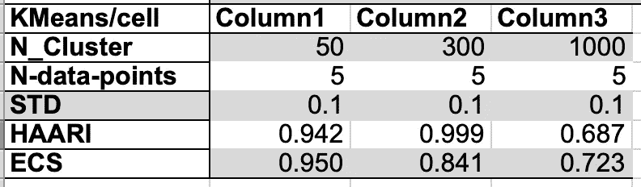

***k 表是指**各种细胞计数密度的细胞(小球形斑点)计数。*

***英寸。***

*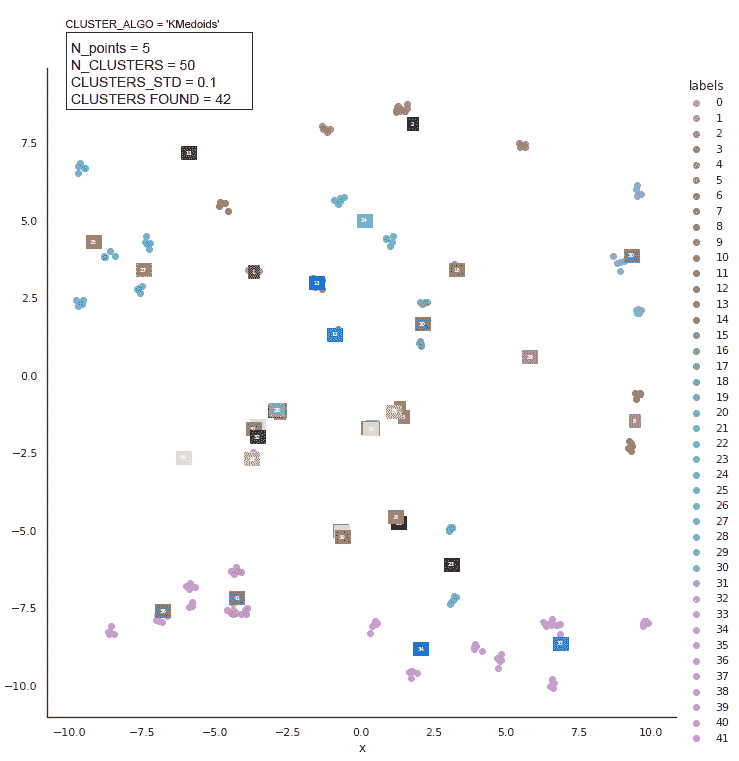*

**数字* **KMedoids** 细胞(小球形斑点)以各种细胞计数密度计数。瑞秋·科特曼的动画*

*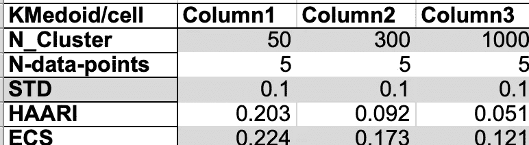*

*各种细胞计数密度的 **KMedoids** 细胞(小球形斑点)计数表。*

****观察#cc2:在圆形细胞上，KMeans 的细胞计数误差小于* KMedoids *。****

****观察#cc3: KMediods 具有圆形细胞，计数范围从 1%到 16%。****

****观察#cc4:* KMediods *不如* KMeans *对* *圆形细胞计数可靠。****

## *使用 KMeans 和 KMedoids 进行单元椭圆斑点计数*

*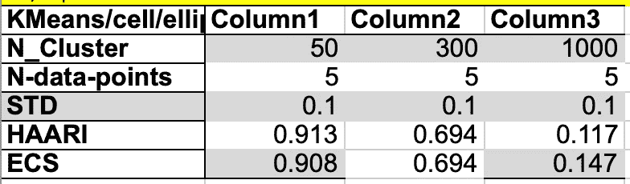*

*表**k 表示**细胞(小椭圆形斑点)在不同细胞计数密度下的计数。*

****观察# cc5:*k 均值*模型不应用于计数* *椭圆形细胞计数。****

*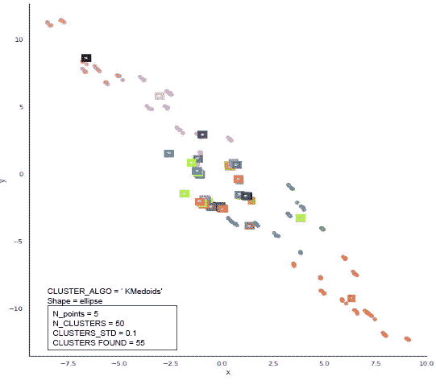*

**图* **KMedoids** 细胞(小椭圆形斑点)以各种细胞计数密度计数。瑞秋·科特曼的动画*

*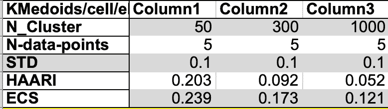*

*不同细胞计数密度的**水母**细胞(小椭圆形斑点)计数表*

****观察#cc6:* KMediods *模型不应用于计数* *椭圆形细胞计数。****

# *使用 KMeans 和 KMedoids 模型对 Isis 数据集进行聚类*

*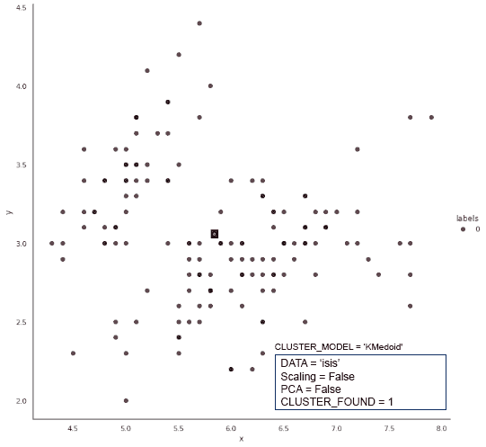*

**图***k 表示**模型对 Isis 数据集进行聚类。瑞秋·科特曼的动画*

*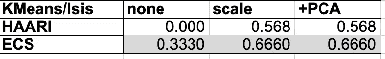*

*Isis 数据集的 KMeans 模型聚类得分表。*

*上图显示了由 **KMeans** 聚类的原始 **Isis** 数据集。*

***Isis** 数据集的特征(列)处于原始比例，因此由每个特征的值形成的轴具有不同的长度。*

*不同长度的轴形成一个椭球形状，我们知道**k 意味着**不擅长聚类。*

***Iris** 数据集通过`StandardScale,`进行变换，使得每个特征具有相同的单位长度(范围),从 0.0 到 1.0。形成一个椭球体，所有轴的长度都相同。*

****观察# i1:*k 均值*模型聚类得分通过先用*** `StandardScaler.`变换数据集来提高*

*接下来，我们添加了 **PCA** (主成分分析)以将 5 个特征(5 维)Isis 数据集缩减为 2 个主轴(2 维)数据集。*

****观察#i2: PCA 没有改变*k 均值*模型聚类分数。****

****观察# i3:*k 均值*模型未能找到 Isis 数据集的 3 个聚类。****

****观察# i4:ECS 指标正确地测量了 3 个数据点集群分配中的 2 个。****

****观察#i5:添加 PCA 对这个 KMeanss 聚类没有影响。****

**

**图* **KMedoids** 模型聚类 Isis 数据集。瑞秋·科特曼的动画*

*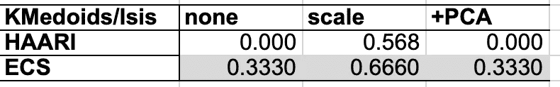*

*Isis 数据集的 **KMedoids** 模型聚类得分表。*

*第一个显示了由 **KMeans** 聚类的原始 Isis 数据集。*

*Isis 数据集的要素(列)处于其单位比例，因此由每个要素的值形成的轴具有不同的长度。*

*不同长度的轴形成一个椭球形状，我们知道**k 意味着**不擅长聚类。*

*虹膜数据集通过`StandardScaler,` 进行变换，使每个特征具有相同的轴长，从而成为一个椭球体。*

****观察#i6:* KMediods *模型聚类得分通过先用*** `StandardScaler.`变换数据集来提高*

*接下来，我们添加了 **PCA** (主成分分析)以将 5 个特征(5 维)Isis 数据集缩减为 2 个主轴(2 维)数据集。*

****观察#i7: PCA 没有改变* KMediods *模型聚类分数。****

****观察#i8:* KMediods *模型找不到 Isis 数据集的 3 个聚类。****

****观察#i9:应用缩放时，ECS 指标正确测量了 3 个数据点集群分配中的 2 个。****

****观察#i10: PCA 伤害这个 KMedoids 聚类。****

# *资源*

*[](https://medium.com/swlh/21-techniques-to-write-better-python-code-3029f6562483) [## 编写更好的 Python 代码的 21 种技巧

### 我从 35 年的多个项目的多语言编程中总结了这些技术。那里…

medium.com](https://medium.com/swlh/21-techniques-to-write-better-python-code-3029f6562483) [](https://medium.com/@dr.bruce.cottman/seventeen-basic-techniques-from-my-code-review-checklist-8d5f0f7c4bbc) [## 我的代码审查清单中的 17 项基本技术

### 现在是代码审查时间。你们中的一些人宁愿避免代码审查过程。无论你是编程新手还是…

medium.com](https://medium.com/@dr.bruce.cottman/seventeen-basic-techniques-from-my-code-review-checklist-8d5f0f7c4bbc) [](https://distill.pub/2016/misread-tsne/) [## 如何有效地使用 t-SNE

### 一种流行的探索高维数据的方法叫做 t-SNE，是由范德马滕和辛顿提出的…

istill.pub](https://distill.pub/2016/misread-tsne/) [](https://medium.com/datadriveninvestor/principal-components-analysis-pca-71cc9d43d9fb) [## 主成分分析

### 主成分分析是一种无监督学习类的统计技术，用于解释数据在高…

medium.com](https://medium.com/datadriveninvestor/principal-components-analysis-pca-71cc9d43d9fb) [](/cross-validation-430d9a5fee22) [## 交叉验证—为什么和如何

### 交叉验证在机器学习中的重要性

towardsdatascience.com](/cross-validation-430d9a5fee22) [](/hyperparameter-optimization-in-python-part-2-hyperopt-5f661db91324) [## Python 中超参数优化。第二部分:远视。

### 在这个博客系列中，我将比较 python HPO 库。在阅读这篇文章之前，我强烈建议你阅读…

towardsdatascience.com](/hyperparameter-optimization-in-python-part-2-hyperopt-5f661db91324)  [## 标准缩放器()

### 现在还是星期天，是#weeklypython 的时间了！

medium.com](https://medium.com/@yhpf/standardscaler-fd4bef76411d) 

# 摘要

本文中 **KMeans** 和 **KMedoids** 、[各种运行的所有笔记本都可以在这里找到。](https://github.com/bcottman/photon_experiments/tree/master/Cluster/kmeans-kmedoids)

当我用这些笔记本进行实验时，代码发生了变化。更先进的笔记本有:

*   K [表示-椭圆-3–1.0 . ipynb](https://github.com/bcottman/photon_experiments/blob/master/Cluster/kmeans-kmedoids/KMeans-ellipse-3-1.0.ipynb)
*   [KMedoids-iris.ipynb](https://github.com/bcottman/photon_experiments/blob/master/Cluster/kmeans-kmedoids/KMedoids-iris.ipynb)

我们进行了 45 次观察，总结如下:

1. *ECS* 是比 *HAARI* 更健壮的聚类度量。

**K-意味着优势**

1.  在大多数机器初学者课程中讲授；
2.  比大多数其他聚类算法更快；
3.  技术访谈中常见的实施问题。
4.  适用于分离的、大小相等的球形集群，其中集群数为 50 或更少。
5.  足以计数在培养物中均匀分布的细胞。

**K-均值偏差**

1.  在非球形集群上性能不佳。
2.  不同规模的集群性能不佳。
3.  每个集群的不同数据点计数性能不佳。
4.  群集未分离时性能不佳。
5.  **Isis** 数据集性能不佳。

**K-Mediods 优势**

1.  没有。**K-methods**与 **KMeans** 在我们执行的所有实验中的性能相同或更差。

在以后的文章中，我们将探索**凝聚**、**线索**、**光学**、 **DBSCAN** 、 **Birch** 、**深度学习集群**模型，以及其他出现的模型。

我们将通过配对其他集群模型并比较它们的相似性和差异来继续这种乐趣。最后，我们将举行一场比赛，为给定数据集的给定可检测行为找到冠军聚类模型。

总之，我们希望在回答这些问题方面取得进展:

*   我们能开发一个观察的“备忘单”来区分每个聚类模型吗？
*   我们能否查看数据并缩小我们应该使用的聚类模型的选择范围？
*   我们能找到一个元算法，或者一套规则来找到或者选择一个集群模型吗？
*   我们的研究能指导我们得到更好的聚类模型吗？

接下来的研究，我们比较 **Cure** 和 **DBSCAN** 无监督学习聚类模型。

**Cure** 承诺解决 **K- < x >** 簇性能不佳，大小不一致或非球形簇。

**DBS can**(**D**en sity-**b**ased**s**partial**c**lustering of**a**applications with**n**oise)是最常见的聚类算法之一。我们将看到为什么(或为什么不)。

通过我们的第一项研究，我们开始了对无监督学习聚类模型的详细研究之旅。***