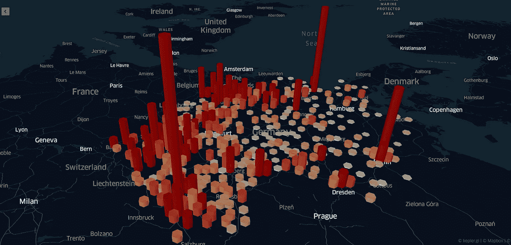
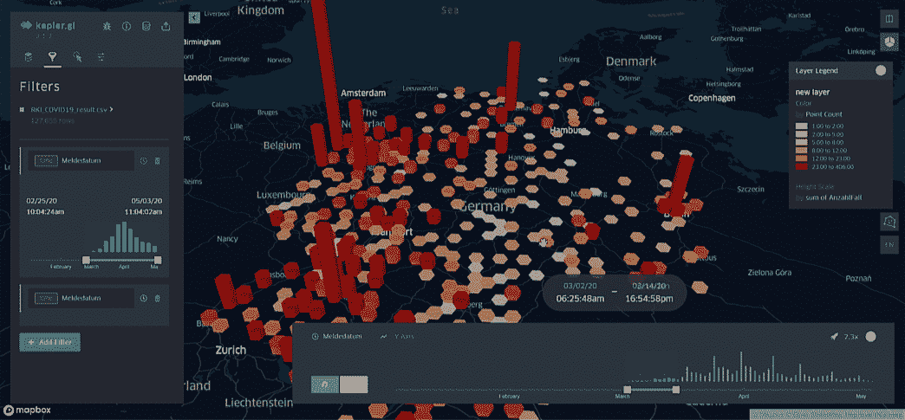
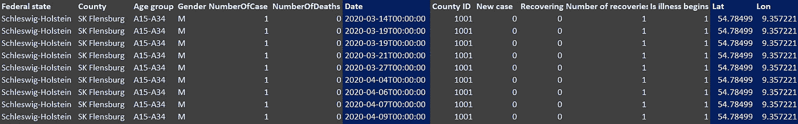
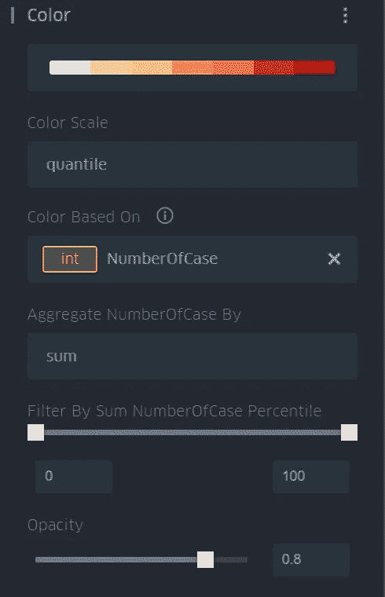
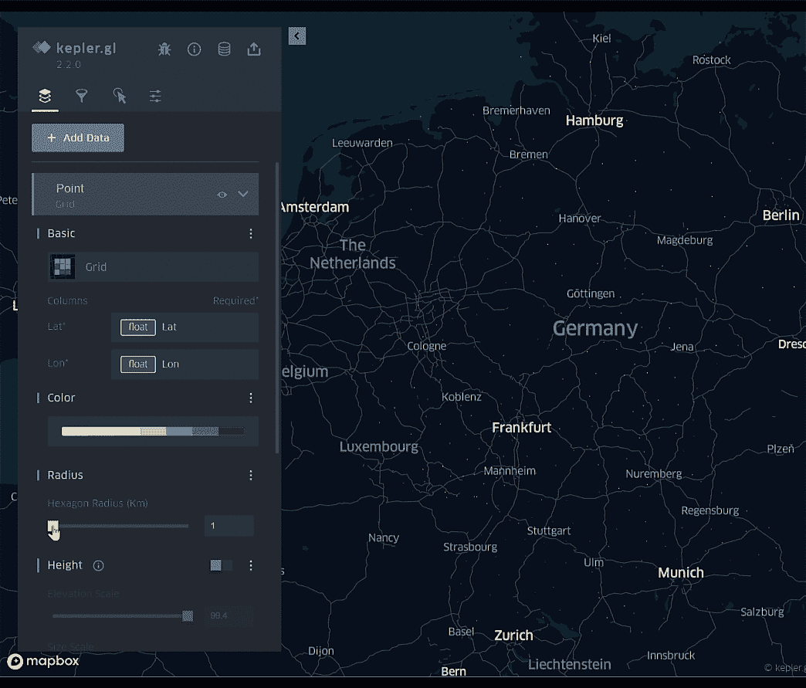
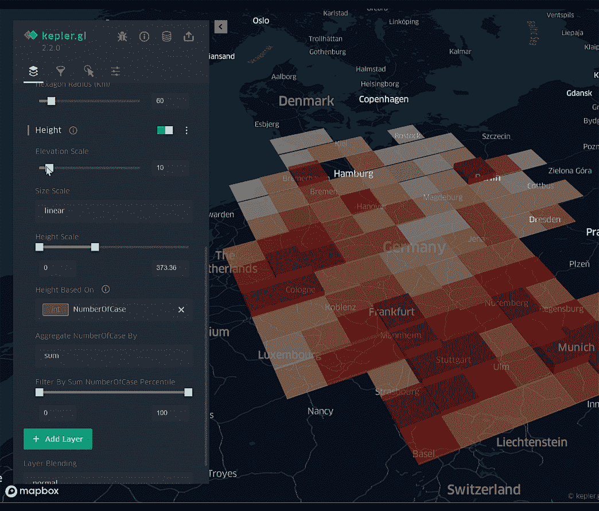
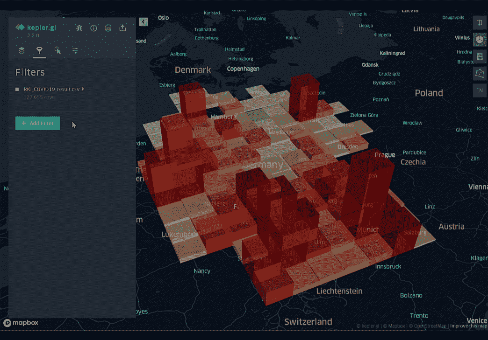

# 用 Kepler.gl 实现 4D 数据可视化

> 原文：<https://towardsdatascience.com/4d-data-visualization-with-kepler-gl-b6bd6dd90451?source=collection_archive---------37----------------------->

## 数据可视化

## 教程 Kepler.gl 以新冠肺炎数据集为例显示时态数据



**在 Kepler.gl 中可视化德国新冠肺炎数据**(作者)

[Kepler.gl](https://kepler.gl/) is 是优步于 2018 年推出的一款针对大规模数据集的强大开源地理空间分析工具。它是数据科学家探索和分析地理空间数据的绝佳工具。

在本文中，我将展示一个非常简短的教程，介绍如何准备和可视化四维数据:位置(纬度、经度、高度)和时间。例如，下图显示了德国一段时间内新增新冠肺炎确诊病例数的可视化示例:



**在 Kepler.gl** 中可视化德国新冠肺炎数据(作者—来自 [RKI](https://www.rki.de/DE/Content/InfAZ/N/Neuartiges_Coronavirus/nCoV_node.html) 的数据集)

# 第一步。数据准备📝

为了在 2D/3D 地图上可视化数据，我们需要确保我们的数据包含纬度和经度的地理空间字段，以映射每一行数据。如果数据源是 shapefile、geojson 这样的地理空间格式，那么我们就不需要担心这个问题。但是，如果它是表格格式并且没有地理空间字段，那么我们可以在 GIS 软件中运行地理编码器，或者使用一些地理编码器脚本，如 Python 和地理编码器库，如下例所示:

```
***import* geocoder
g = geocoder.google('Stuttgart', key="<Your Google API Key>")
print(g.latlng)** >> [48.7758459, 9.1829321]
```

或者，您也可以运行使用 GeoPandas 来完成这项工作。数据集中的日期/时间列是可选的，它允许应用程序显示及时的数据。例如，我从 RKI 下载了德国新冠肺炎数据集。(从此处[下载](https://npgeo-corona-npgeo-de.hub.arcgis.com/datasets/dd4580c810204019a7b8eb3e0b329dd6_0))然后准备如下所示的数据集:



**Cleaned _ RKI _ covid 19 _ Dataset . CSV**(作者—来自 [RKI](https://www.rki.de/DE/Content/InfAZ/N/Neuartiges_Coronavirus/nCoV_node.html) 的数据集)

# 第二步。将数据集加载到 Kepler.gl🔃

这一步很简单。我们可以简单地将准备好的数据集拖放到*中。csv* 、*。json* ，或*。geojson* 到 Kepler.gl 应用程序中。或者，如果您是 Python 和 Jupyter 的爱好者，那么您可以在将熊猫加载到开普勒地图之前，将它们加载到您的轻松加载数据集。

```
**from keplergl import KeplerGl
import pandas as pd****map = KeplerGl(height=500)
df = pd.read_csv(f'<your dataset>')
#...........................................
#... pandas data manipulation if needed ....
#...........................................****map.add_data(data=<df_cleaned>, name='<data_named>')**
```

# 第三步。开普勒地图设置🔨

现在，让我们来看看开普勒地图吧！😊

*   选择你想要的地图类型(在上面的第一个 gif 例子中，我使用了 Hexbin)


**开普勒. gl** 中的图层类型(作者)

*   定义位置(纬度/经度)列。
*   指定颜色主题、比例、选定列的聚合方法、过滤器和不透明度。



**Kepler . GL 中的颜色设置**(作者)

*   调整网格大小，开普勒会自动为你聚合数据！



**在 Kepler.gl** 中调整网格大小(作者)

*   启用基于选定列的高度。在本例中，我选择通过对新冠肺炎案件编号求和来汇总数据。



**在 Kepler.gl** 中调整网格高度属性(作者)

*   最后，让我们通过添加图层过滤器并选择日期/时间列来启用时态可视化。然后，我们将得到动画地图，显示随着时间的推移，网格高度的新冠肺炎案件。🎉🎉



**启用 Kepler.gl 中的时间过滤器**(作者)

# 结论:

本文展示了如何使用 Kepler.gl 在 4D 可视化和浏览数据集的分步教程。您可以使用 Kepler.gl 来体验许多功能，如热点图图层、旅行图层等。在 https://kepler.gl/[检查一下。我希望你喜欢这篇文章，并发现它对你的日常工作或项目有用。如果您有任何问题或意见，请随时给我留言。](https://kepler.gl/)

关于我&查看我所有的博客内容:[链接](https://joets.medium.com/about-me-table-of-content-bc775e4f9dde)

安全**健康**健康**！💪**

**感谢您的阅读。📚**