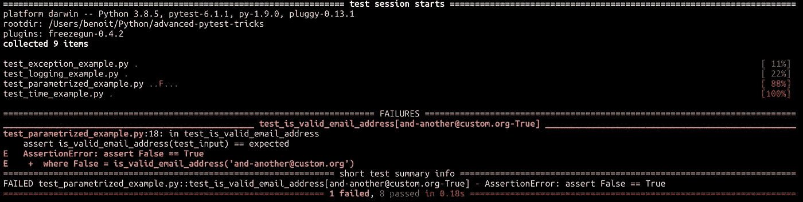

# 5 个高级 Pytest 技巧

> 原文：<https://towardsdatascience.com/5-advanced-pytest-tricks-c5d733b2acc7?source=collection_archive---------40----------------------->

## [实践教程](https://towardsdatascience.com/tagged/hands-on-tutorials)

## Pytest 是一个非常强大的工具，但是很多项目没有利用它提供的所有特性。



作者图片

我们编写测试是因为它们帮助我们建立对代码的信心。它们还帮助我们编写干净和可维护的代码。然而，编写测试需要一些努力。幸运的是，我们可以利用一些库。例如，Pytest 附带了许多经常不被使用的便利特性。在这篇文章中，我将向你介绍其中的 5 种。

## 用 caplog 设备测试测井

有时，日志记录是您的功能的一部分，您希望确保以预期的日志记录级别记录正确的消息。

您可以利用一个名为 caplog 的内置设备。[这个固定装置](https://docs.pytest.org/en/stable/reference.html#caplog)允许你访问和控制日志捕获。

让我们通过一个基本示例来看看它的实际应用。假设你有一个函数可以将一种语言中的动物名称翻译成另一种语言。如果翻译词典中缺少一种动物，您需要确保记录该动物，以便最终将其添加到词典中。

这里我们使用了`record_tuples`，一个由记录器名称、级别和消息组成的元组列表。这是一个简单的例子，但是你可以做得更好。

## 引发了测试异常

测试允许您验证代码在面临边缘情况时的行为。当涉及到边缘情况时，您经常会抛出异常。Pytest 帮助您[验证异常是否如预期的那样被引发](https://docs.pytest.org/en/reorganize-docs/new-docs/user/pytest_raises.html)。

让我们用一个真实的例子来看看它是如何工作的。比方说，您想要编写一个 CLI 应用程序的身份验证层。验证电子邮件地址格式可能是个好主意。

您的 CLI 应用程序使用 [Click](https://click.palletsprojects.com/en/7.x/) ，这是一个帮助您更快构建 CLI 应用程序的包。Click 附带了很多便利的功能，比如通过[输入](https://click.palletsprojects.com/en/7.x/parameters/#parameter-types)进行输入验证。然而，电子邮件地址不是内置的点击类型，所以我们需要自己进行输入验证。我们将使用[验证回调](https://click.palletsprojects.com/en/7.x/options/#callbacks-for-validation)。

因此，您所要做的就是使用`pytest.raises()`上下文管理器，然后调用函数，Pytest 会处理剩下的事情！

## 测试时间相关函数

操纵日期总是困难的。编写测试可以给我们很大帮助。然而，当你调用像`today()`或`now()`这样的方法时，你会遇到测试依赖于时间的棘手情况。为了解决这个问题，你可以使用 [pytest-freezegun](https://pypi.org/project/pytest-freezegun/) 插件，而不是从标准库中打补丁。这个插件让事情变得简单。

又是一个例子的时候了！这一次，您需要实现一个函数来计算自用户订阅您的服务以来的天数。幸运的是，你已经阅读了这篇文章，并且知道了`pytest-freezegun`插件😉

## 用不同的参数组合测试相同的函数

大多数时候，您希望针对不同的输入来测试您的函数。在这种情况下，最简单的解决方案是为所有参数组合复制代码。但是，这不是一个好的做法，你应该避免这样做。假设你想对你的测试做一个小的调整，你需要复制你的代码多少次就复制多少次。第二，在性能方面，测试是顺序运行的，速度很慢。您可以并行执行。

避免这些常见问题的解决方案是使用[参数化测试](https://docs.pytest.org/en/stable/example/parametrize.html)。让我们回到电子邮件验证的例子。你可能想过*“很多情况没有覆盖”*。嗯，我同意，是时候解决这个问题了！

看，你可以用`pytest.mark.parmaetrize`来描述你的输入，避免代码重复。

如果您运行这个测试，您将看到它失败了，这很好，因为它证明了我们的测试是有用的，并且有很好的覆盖率！

## 额外小费

因为你几乎一直读到最后，我想给你一个额外的提示来感谢你🙂

上一个例子中的一种情况导致测试失败。现在您想要更正代码并重新运行失败的测试。如果您有一个大型的测试套件，重新运行整个测试套件是非常耗时的。相反，您可以运行:

```
pytest --last-failed test_parametrized.py
```

它将只执行最后一个失败的测试，从而允许您快速迭代并修复那个 bug。一旦测试通过，不要忘记运行所有测试以避免任何回归。

## 结论

这是一个总结！Pytest 非常强大，一篇博文太短，无法涵盖所有特性。这是另一个教程的绝佳机会！🤗

## 参考

[1] Pytest 官方文档

 [## 完整的 pytest 文档

### 测试中断言的编写和报告

docs.pytest.org](https://docs.pytest.org/en/stable/contents.html) 

[2] Dane Hillard，[有效的 Python 与 Pytest](https://realpython.com/pytest-python-testing/) (2020)，真正的 Python

[](https://realpython.com/pytest-python-testing/) [## 用 Pytest - Real Python 进行有效的 Python 测试

### 在本教程中，您将学习如何使用 pytest 将您的测试提升到一个新的水平。你将负责中级和…

realpython.com](https://realpython.com/pytest-python-testing/)