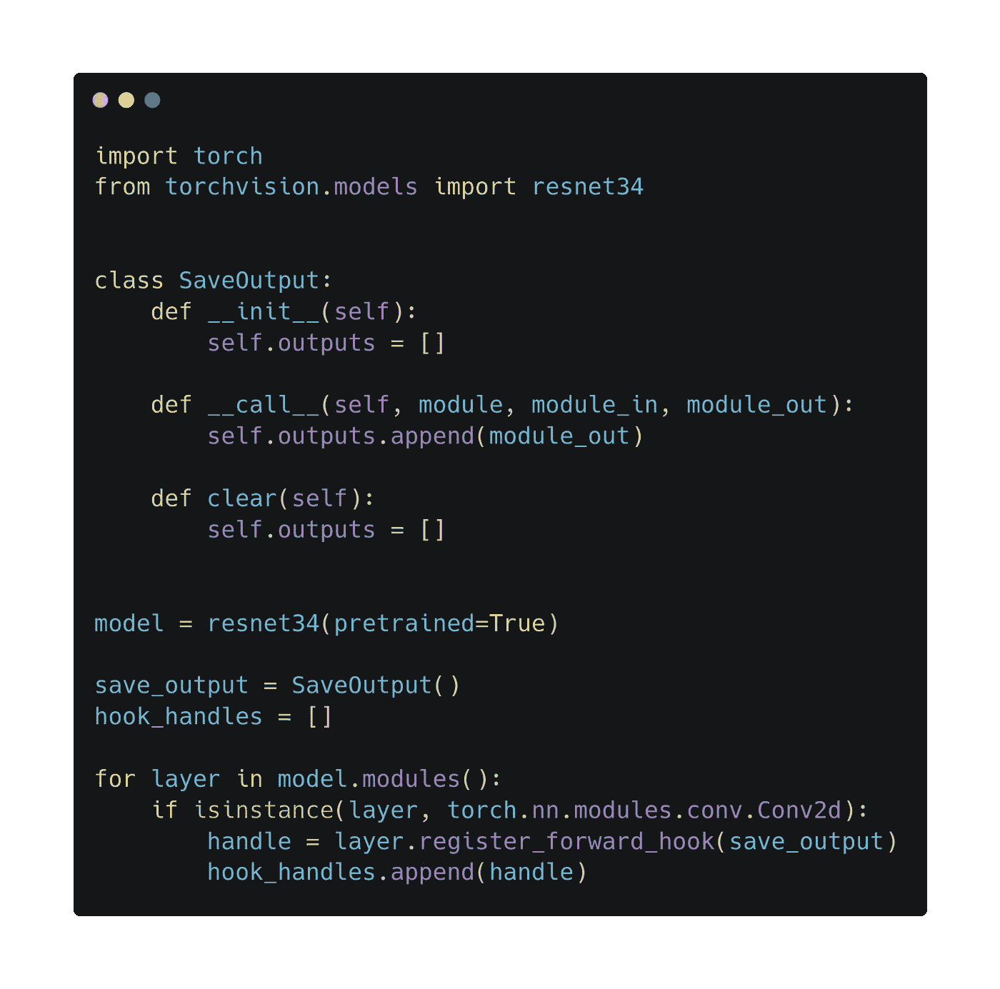

# 5 个高级 PyTorch 工具提升您的工作流程

> 原文：<https://towardsdatascience.com/5-advanced-pytorch-tools-to-level-up-your-workflow-d0bcf0603ad5?source=collection_archive---------21----------------------->



## 从开发到生产

PyTorch 太棒了。自成立以来，它已经成为仅次于 TensorFlow 的领先深度学习框架之一。它的易用性和动态定义的性质在研究人员中特别受欢迎，他们能够比以往任何时候都更快地进行原型设计和实验。

从一开始，它就经历了爆炸性的发展，变得不仅仅是一个快速原型的框架。在这篇文章中，我的目标是向您介绍五种工具，它们可以帮助您使用 PyTorch 改进开发和生产工作流程。

为了给你一个快速的纲要，我们将看看这些。

*   **挂钩**
*   **PyTorch 闪电**
*   **量化**
*   **修剪**
*   **TorchScript + JIT**

# 钩住

首先，让我们谈谈钩子，它是 PyTorch 中最有用的内置开发工具之一。你是否曾经用打印语句和断点来处理那些讨厌的张量形状不匹配或随机层中出现的神秘 NaN？

好消息是:你不必这样做。有一个简单而优雅的解决方案。一个*钩子*是一个功能，可以附加到某些层上。它在向前传递(或向后传递，取决于您附加它的位置)之前接收层的输入，允许您存储、检查甚至修改它。

在下面的例子中，您可以看到如何使用钩子简单地存储 ResNet 模型的每个卷积层的输出。

如果你想了解更多的细节，我已经写了一个关于钩子的详细指南。

[](/the-one-pytorch-trick-which-you-should-know-2d5e9c1da2ca) [## 你应该知道的一个 PyTorch 把戏

### 钩子如何显著改善你的工作流程

towardsdatascience.com](/the-one-pytorch-trick-which-you-should-know-2d5e9c1da2ca) 

# PyTorch 闪电

如果你用过 Keras，你就会知道一个好的界面可以让训练模型变得轻而易举。最初，PyTorch 没有这个功能。然而 [PyTorch Lightning](https://github.com/PyTorchLightning/pytorch-lightning) 被开发出来填补了这个空白。虽然不是 PyTorch 的官方部分，但它目前是由一个非常活跃的社区开发的，最近获得了很大的关注。

为了演示它如何帮助您消除通常出现在 PyTorch 中的样板代码，这里有一个简单的例子，我们在 MNIST 上训练了一个 ResNet 分类器。

此外，`Trainer`类支持多 GPU 训练，这在某些场景中可能很有用。在[官方文档](https://pytorch-lightning.readthedocs.io)中有更多的例子。

在 Medium 上有一篇作者 William Falcon 的精彩介绍，如果你感兴趣，我强烈推荐。

[](/from-pytorch-to-pytorch-lightning-a-gentle-introduction-b371b7caaf09) [## 从 PyTorch 到 py torch Lightning——一个温和的介绍

### 这篇文章对使用 PyTorch 和 PyTorch Lightning 实现的 MNIST 进行了对比。

towardsdatascience.com](/from-pytorch-to-pytorch-lightning-a-gentle-introduction-b371b7caaf09) 

# 量化

随着神经网络结构变得越来越复杂，它们的计算需求也增加了。这使得某些模式在实践中不可行。您可能希望在移动应用程序中运行神经网络，这有很强的硬件限制。正因为如此，人们正在做出巨大努力来克服这些障碍。

其中最有希望的是网络的量子化。本质上，量化就是简单地用 uint8 代替 float32 或 float64。这使得网络更小，计算更快。即使在准确性和大小/速度之间有一个折衷，如果做得好，性能损失可以是最小的。

PyTorch 支持[三种量化工作流程](https://pytorch.org/docs/stable/quantization.html):

1.  动态量化，在计算过程中将权重和输入转换为 uint8。这使得它更快，但权重和输出仍然存储为浮点型。(因此，更快的 uint8 内存访问不会加速。)
2.  训练后静态量化。这转换了整个训练过的网络，也提高了存储器访问速度。但是，这可能会导致性能下降。
3.  量化感知训练。如果训练后量化导致次优性能损失，则可以在训练期间应用量化。

如果你的目标是生产，量化是非常值得探索的。(请记住，它目前是一项实验性功能，可能会有所变化。)

延伸阅读:

*   [PyTorch 量化文档](https://pytorch.org/docs/stable/quantization.html)
*   PyTorch 博客上的量子化介绍

# 修剪

除了量化之外，还有更多加速/缩小神经网络的技术。即使中等规模的卷积网络也包含数百万个参数，使得训练和推断的计算成本很高。由于经过训练的网络本身就很稀疏，因此简单地删除不必要的神经元以减小规模和提高速度是一种自然的想法。

减肥似乎不是一个好主意，但却是一个非常有效的方法。只要想想卷积层实际上是一个线性层，有一堆零权重。在 PyTorch 中，`torch.nn.utils.prune`模块中实现了几种修剪方法。要使用它们，只需对要修剪的图层应用修剪功能:

```
prune.random_unstructured(nn.Conv2d(3, 16, 3), "weight", 0.5)
```

这为模块添加了一个修剪前向预挂钩，它在每次前向传递之前执行，屏蔽了权重。因此，由于权重的稀疏性，这一层中的计算将会更快。

延伸阅读:

*   [PyTorch 修剪教程](https://pytorch.org/tutorials/intermediate/pruning_tutorial.html)

# 火炬脚本+ JIT

如你所知，PyTorch 的内部其实是用 C++实现的，使用了 CUDA、CUDNN 等高性能计算工具。这就是为什么它真的很快。你用来训练的只是一个 C++张量库之上的 Python 包装器。这有一些缺点，例如它增加了计算的开销。Python 对于开发来说非常方便，但是在生产中，你并不真正需要这种便利。

你需要的是一种快速运行你的模型的方法。TorchScript 和 JIT 正好提供了这一点。它将您的模型转换成中间表示，可用于在 Python 之外的环境中加载它。此外，这种表示可以进一步优化，以实现更快的性能。

要翻译您的模型，您可以使用

```
torch.jit.trace
```

或者

```
torch.jit.script
```

追踪需要一个示例输入，它被传递到您的模型，同时在内部表示中记录操作。但是，如果您的前向传递计算控制流，比如`if`语句，那么表示就不正确。如果描摹仅触及分支的一部分，其他分支将不会出现。在这些情况下，应该使用脚本，它直接分析模型的源代码。

更多资源:

*   [PyTorch 火炬脚本教程](https://pytorch.org/tutorials/beginner/Intro_to_TorchScript_tutorial.html)
*   [研究到生产:PyTorch JIT/TorchScript 更新](https://www.youtube.com/watch?v=St3gdHJzic0)作者:Michael Suo
*   [从研究到生产](https://www.youtube.com/watch?v=EkELQw9tdWE)，杰夫·史密斯在 QCon New York 2019 上的演讲

你在工作中使用过这些吗？你知道什么最佳实践或很棒的教程吗？请在评论中告诉我们！:)

在那之前，让我们提升 PyTorch 技能，建造一些令人敬畏的东西！

[***如果你喜欢把机器学习概念拆开，理解是什么让它们运转，我们有很多共同点。看看我的博客，我经常在那里发表这样的技术文章！***](https://www.tivadardanka.com/blog)