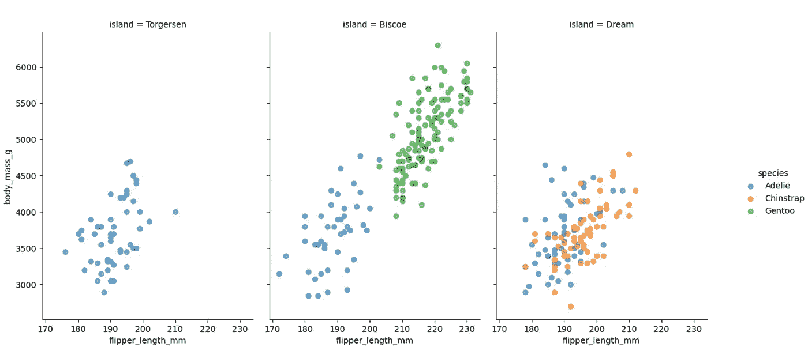
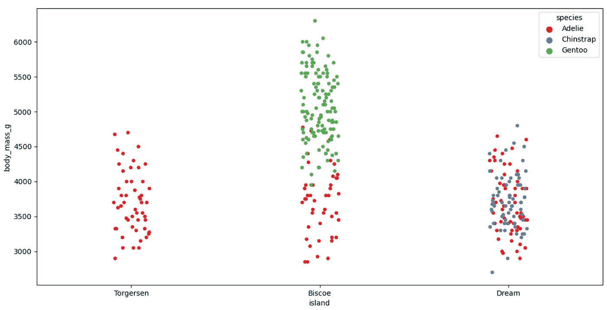
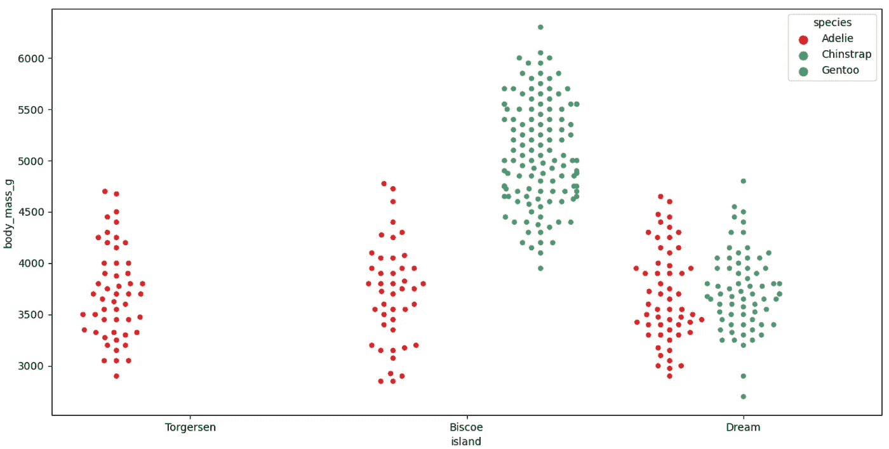
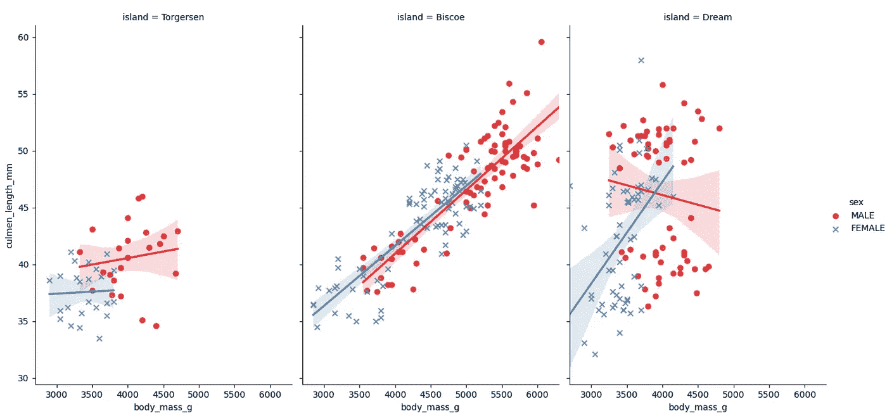
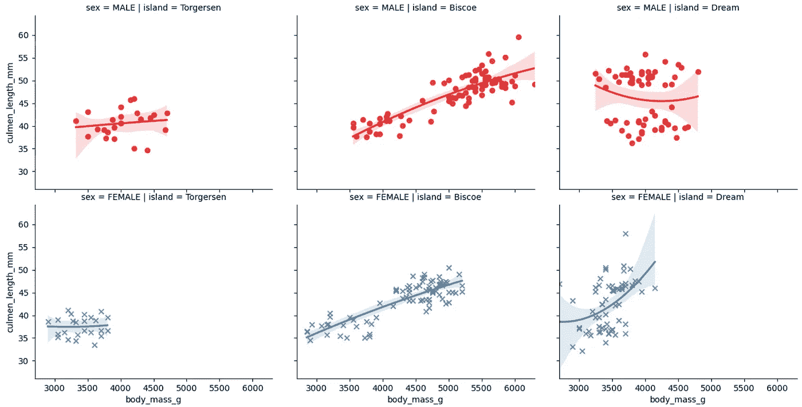
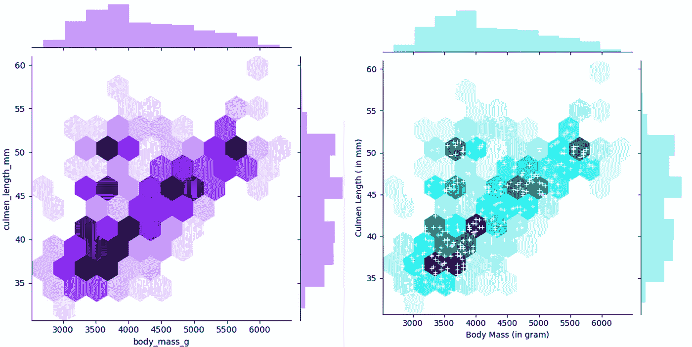
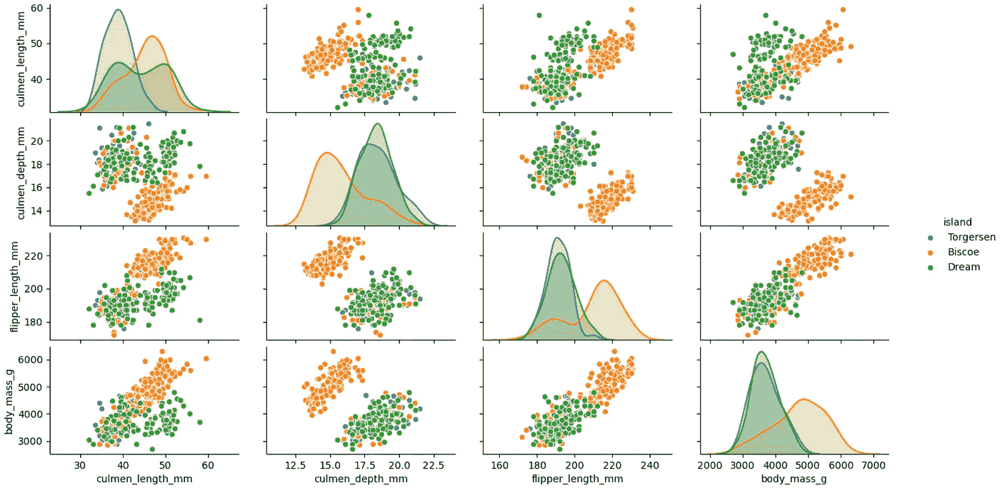

# 5 探索性数据分析(EDA)的高级可视化

> 原文：<https://towardsdatascience.com/5-advanced-visualisation-for-exploratory-data-analysis-eda-c8eafeb0b8cb?source=collection_archive---------11----------------------->

## 每个业余或专业数据科学家都应该擅长探索性数据分析。这是为了看看数据能告诉我们什么，而不仅仅是正式的建模或统计分析。


用作者在本文中提到的代码生成的图

清晨，一位女士来见夏洛克·福尔摩斯和华生。甚至在这位女士开口并开始讲述她来访的原因之前，夏洛克就可以通过他纯粹的观察和推理能力来了解一个人。同样，在复杂的建模和将数据输入算法之前，我们可以推导出许多关于数据和特征之间关系的信息。

***目标***

在本文中，我将讨论五个高级数据可视化选项，以执行高级 EDA 并成为数据科学的福尔摩斯。目标是用最少的编码和最快的内置选项推断出不同数据点之间的关系。

***步骤 1:*** 我们将使用 seaborn 包内置的数据集和高级选项来演示高级数据可视化。

```
import seaborn as sns
import matplotlib.pyplot as plt
```

***步骤 2:*** Seaborn 软件包附带了一些内置数据集，可以快速构建可视化原型，并使用自己的数据点评估其对 EDA 的适用性。在本文中，我们将使用 seaborn“企鹅”数据集。从在线 seaborn 存储库中，使用 load_dataset 方法加载数据集。我们可以用 get_dataset_names() names 方法获得所有内置 Seaborn 数据集的列表。

在下面的代码中，在 FacetGrid 方法中，数据集名称(即“bird”)、我们希望用来组织数据可视化的特征(即“island”)以及我们希望用来分组的特征(即作为“specifies”的色调)作为参数被提及。此外，在“地图”方法中，散点图的 X 轴和 Y 轴，即“脚蹼 _ 长度 _ 毫米”，以及下面示例中提到的“身体 _ 质量 _ 克”。

```
bird= sns.load_dataset("penguins")
g = sns.FacetGrid(bird, col="island", hue="species")
g.map(plt.scatter, "flipper_length_mm", "body_mass_g", alpha=.6)
g.add_legend()
plt.show()
```

基于上述代码的数据集可视化绘制了按“岛”组织并按“物种”进行颜色编码的数据点。

只要看一眼，我们就能推断出“巴布亚”物种只存在于“比斯科”岛上。巴布亚物种比其他物种更重，鳍状肢也更长。“阿德利”物种在所有三个岛上都有，“下巴颏带”只在“梦”岛上有。你可以看到，只用 5 行代码，我们就可以在没有任何建模的情况下获得如此多的信息。

我鼓励你对我们从下面的视觉化图像中推断出的其他信息发表评论。



***第三步:*** 我们想快速了解企鹅按物种和岛屿的体重范围。另外，确定重量范围的浓度。

通过带状图，我们可以绘制出每个岛屿按物种分类的企鹅重量。

```
sns.stripplot(x="island", y="body_mass_g", hue= "species", data=bird, palette="Set1")
plt.show()
```



只要图中没有过多密集的数据点，带状图有助于获得洞察力。在岛内“梦”点在剧情中密集分布，想要从中获取有意义的信息有点困难。

群聚图有助于直观显示每个岛屿非重叠点上不同物种企鹅的体重范围。

在下面的代码中，我们在带状图中提到了类似的信息。

```
 sns.swarmplot(x="island", y="body_mass_g", hue="species",data=bird, palette="Set1", dodge=True)
plt.show()
```

在数据密集的情况下，这极大地提高了对数据点的理解。我们一眼就可以推断出“阿德利”的体重大约在 2500 到 4800 克之间，一个典型的巴布亚物种比下颚带物种要重。我会让你根据下面的群体图进行其他探索性的数据分析。



***第四步:*** 接下来，我们要根据企鹅的性别来了解每一个岛上企鹅的体重和身长之间的关系。

在下面的代码中，在我们有兴趣识别的 x 和 y 参数特征中，提到了关系。色调被称为“性别”,因为我们想分别了解雄性和雌性企鹅的关系。

```
sns.lmplot(x="body_mass_g", y="culmen_length_mm", hue="sex", col="island", markers=["o", "x"],palette="Set1",data=bird)
plt.show()
```

我们可以推断，比斯开岛企鹅的体重和体长的关系对于雄性和雌性都是相似的。相反，在《岛梦》中，雄性和雌性企鹅的关系趋势完全相反。《岛梦》中企鹅的体重和身长关系是线性还是非线性？

我们可以通过在 lmplot 方法中指定参数顺序来可视化多项式关系。



在人口高度密集的数据点的情况下，我们可以进一步扩展我们的探索性数据分析，通过为每个岛屿分别可视化男性和女性的身体质量和身高的关系。

可视化是由代码中提到的 col 和 row 参数组织的。

```
sns.lmplot(x="body_mass_g", y="culmen_length_mm", hue="sex", col="island",row="sex",order=2, markers=["o", "x"],palette="Set1",data=bird)
plt.show()
```



***第五步:*** 将散点图和直方图并排显示有助于获得数据点分布的整体视图，同时也有助于观察频率。联合地块是描绘它的有效方式。在下面的代码中，x & y 参数是我们试图识别的特征之间的关系。由于数据点密集，因此我们将绘制六边形图，而不是散点图。“种类”参数表示绘图的类型。如果你想知道更多关于 hexbin 的情节，那么请参考我的文章 [5 强大的可视化与熊猫的数据预处理](/5-powerful-visualisation-with-pandas-for-data-preprocessing-bbf6a2033efd)。

```
sns.set_palette("gist_rainbow_r")
sns.jointplot(x="body_mass_g", y="culmen_length_mm", kind="hex",data=bird )
plt.show()
```



根据直方图，我们可以推断大多数企鹅的体重在 3500 到 4500 克之间。你能推断出企鹅最常见的长度范围吗？

我们还可以用下面的代码在 hexbin 图中绘制各个数据点(如右侧图所示)。

```
g = sns.jointplot(x="body_mass_g", y="culmen_length_mm", data=bird, kind="hex", color="c")
g.plot_joint(plt.scatter, c="w", s=30, linewidth=1, marker="+")
g.set_axis_labels("Body Mass (in gram)", "Culmen Length ( in mm)")
plt.show()
```

***第六步:*** 最后，我们来了解一下各个岛屿不同特征之间的传播和关系。散点图非常便于显示不同特征之间的散点图。特征“岛”作为色调被提及，因为我们想要基于它对情节进行颜色编码。

```
sns.pairplot(bird, hue="island") 
plt.show()
```

我们可以从视觉化图像中看到，在比斯开岛，大多数的企鹅都有浅的顶点深度，但是比其他岛屿的企鹅要重。类似地，我们可以得出结论，对于比斯开岛的大多数企鹅来说，鳍状肢的长度更长，但是具有较浅的鳍状肢深度。



我希望你在开始任何复杂的建模练习之前，将这些高级可视化用于探索性数据分析，并了解数据点之间的关系。我很想听听你最喜欢的 EDA 可视化图，以及我们可以从本文中举例说明的例子中得出的结论列表。

了解 Scikit-Learn 于 2020 年 5 月推出的[复合估算器和管道的交互式可视化](/productivity-booster-interactive-visualisation-of-composite-estimator-and-pipeline-407ab780671a)。

如果您想学习使用 pandas 进行数据可视化，请阅读关于 [5 使用 Pandas 进行数据预处理的强大可视化的趋势文章](/5-powerful-visualisation-with-pandas-for-data-preprocessing-bbf6a2033efd)。

此外，在文章[深度学习中的准确性可视化](/accuracy-visualisation-in-deep-learning-part-1-b42d32b07913)中了解关于张量板和深度学习模型可视化的更多信息。

如果你有兴趣学习不同的 Scikit-Learn 定标器，那么请阅读我的文章[特性缩放——不同 Scikit-Learn 定标器的效果:深入探讨](/feature-scaling-effect-of-different-scikit-learn-scalers-deep-dive-8dec775d4946)

```
"""**Full Code**"""**import seaborn as sns
import matplotlib.pyplot as plt****bird= sns.load_dataset("penguins")
g = sns.FacetGrid(bird, col="island", hue="species")
g.map(plt.scatter, "flipper_length_mm", "body_mass_g", alpha=.6)
g.add_legend()
plt.show()****sns.stripplot(x="island", y="body_mass_g", hue= "species", data=bird, palette="Set1")
plt.show()****sns.swarmplot(x="island", y="body_mass_g", hue="species",data=bird, palette="Set1", dodge=True)
plt.show()****sns.lmplot(x="body_mass_g", y="culmen_length_mm", hue="sex", col="island", markers=["o", "x"],palette="Set1",data=bird)
plt.show()****sns.lmplot(x="body_mass_g", y="culmen_length_mm", hue="sex", col="island",row="sex",order=2, markers=["o", "x"],palette="Set1",data=bird)
plt.show()****sns.set_palette("gist_rainbow_r")
sns.jointplot(x="body_mass_g", y="culmen_length_mm", kind="hex",data=bird )
plt.show()****g = sns.jointplot(x="body_mass_g", y="culmen_length_mm", data=bird, kind="hex", color="c")
g.plot_joint(plt.scatter, c="w", s=30, linewidth=1, marker="+")
g.set_axis_labels("Body Mass (in gram)", "Culmen Length ( in mm)")
plt.show()****sns.pairplot(bird, hue="island") 
plt.show()**
```