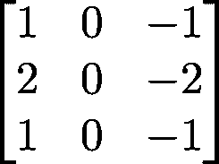
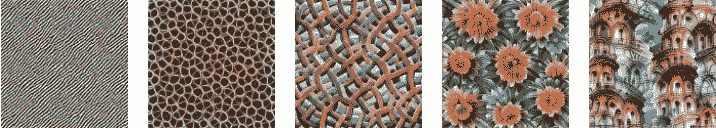
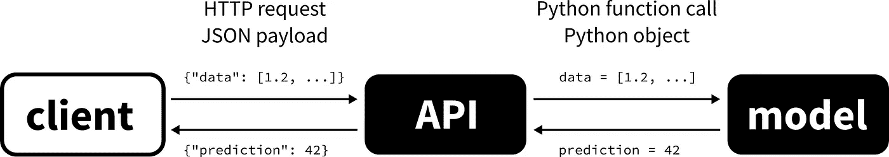

# 5 个了不起的项目磨练你的深度学习技能

> 原文：<https://towardsdatascience.com/5-awesome-projects-to-hone-your-deep-learning-skills-a2d6252b9b9b?source=collection_archive---------30----------------------->

约书亚·阿拉贡在 [Unsplash](https://unsplash.com?utm_source=medium&utm_medium=referral) 上拍摄的照片

## 实践中学习

深度学习是一个非常多样化的领域，事物发展迅速。为了在游戏中保持领先，你需要不断提高你的技能。最有效的学习方法是边做边学。说到这一点，没有什么比亲身体验更好的了。为了在这个过程中帮助你，我收集了五个很棒的项目想法，你可以马上去做，让你的技能更上一层楼。在这些当中，你会发现其他的更实际，而其他的更理论化。然而，共同的事情是，你会从他们每个人身上学到很多东西。此外，如果你想找一份机器学习方面的工作，优质的项目组合是非常有益的。

为了使学习最大化，我建议你不要先看完整的项目就去尝试。当然，如果你陷入困境，参考现有的解决方案是有用的——我甚至会指出其中的一些——但是失败是学习的重要部分。

还是看项目本身吧！

# 1.从头开始实现卷积神经网络

在生产环境中，我们通常依赖高级框架和库来避免重复劳动并保持高效。这对快速产生结果很重要，但是它对你隐藏了底层的细节。我的经验是，确切地知道神经网络和反向传播如何工作就像一种超能力。不是很多人知道所有的细节，但它给人一种非常深刻的洞察力。

首先，我推荐斯坦福大学著名的 [CS231n:视觉识别卷积神经网络](http://cs231n.stanford.edu/)课程。出于我们的目的，最重要的模块如下。

*   [优化:随机梯度下降](https://cs231n.github.io/optimization-1/)
*   [反向传播，直觉](https://cs231n.github.io/optimization-2/)
*   [神经网络第 1 部分:建立架构](https://cs231n.github.io/neural-networks-1/)
*   [神经网络第 2 部分:设置数据和损失](https://cs231n.github.io/neural-networks-2/)

如果你对神经网络还没有一个较低层次的理解，我建议你在开始编码之前浏览一下。如果你被卡住了，我已经写了一个详细的指南，附带 GitHub 库。

 [## 如何在 NumPy 中构建 DIY 深度学习框架

### 通过从头开始构建神经网络来理解神经网络的细节

towardsdatascience.com](/how-to-build-a-diy-deep-learning-framework-in-numpy-59b5b618f9b7) 

此外，Andrej Karpathy 最近的一个作品是 [micrograd](https://github.com/karpathy/micrograd) 库，这是一个极其简洁但功能强大的亲笔签名引擎。这也绝对值得一试！

当你从零开始构建你的第一个神经网络时，你会更加欣赏你最喜欢的深度学习框架。他们为你做了这么多工作！

# 2.卷积网络的可视化探索

对神经网络的一个普遍批评是，所得到的模型是不可解释的。这并不完全正确，尽管它们不像决策树那样容易解释。例如，如果我们谈论卷积网络，卷积层本质上是过滤器的集合。每个过滤器代表一个单独的图像处理操作。这些很少像经典的那样容易处理，例如用于平滑的高斯滤波器，但是如果你从正确的角度看它们，它们仍然可以揭示很多东西。

衡量滤波器表现的一种常用方法是构建一幅响应最大化的图像。让我们快速考虑一个例子。

什么图像可以最大限度地激活这个过滤器？稍加思考后，很容易看出这将是一个仅由强周期性垂直线组成的图像。(而带有水平线的图像根本不会激活此滤镜。)事实上，这个滤波器就是众所周知的 Sobel 算子，用于检测垂直线。总之，过滤器寻找的模式可以通过优化找到。一般来说，卷积网络的过滤器会随着你的深入逐渐学习发现越来越复杂的模式。以下是由在 ImageNet 上训练的 GoogLeNet 模型学习的特征的可视化。

GoogLeNet 特征可视化。来源:[特征可视化](https://distill.pub/2017/feature-visualization/)作者:[克里斯·奥拉](https://colah.github.io/)，[亚历山大·莫德文采夫](https://znah.net/)和[路德维希·舒伯特](https://schubert.io/)。发布于[distilt](https://distill.pub)，通过 3.0 US 许可在 [CC 下可用。](https://creativecommons.org/licenses/by/3.0/us/)

如果您想更深入地探索您训练的模型，这里有两个很好的起点。

*   [特征可视化](https://distill.pub/2017/feature-visualization/)由[克里斯·奥拉](https://colah.github.io/)、[亚历山大·莫德文采夫](https://znah.net/)和[路德维希·舒伯特](https://schubert.io/)制作
*   [卷积网络如何看待世界](https://blog.keras.io/how-convolutional-neural-networks-see-the-world.html)Francois Chollet

# 3.为您的深度学习模型构建 API

只有当数据科学家将模型交给开发人员时，模型的生命才开始。为了将它发布到产品中并向用户公开，应该提供一个简单统一的接口。如果没有这一点，模型的用户将不得不知道模型使用的确切框架，并相应地格式化他们的输入。这不仅不切实际，如果技术堆栈中存在差异，这还可能是一个严重的技术障碍。相信我，你不会想从 JavaScript 函数调用 Python 脚本的。

通常的处理方式是将模型放在 API 后面，并将其作为独立的服务进行部署。API 的用户(即希望使用您的服务的客户端，可以是移动应用程序、智能相机等)发送数据并以 HTTP 请求的形式接收答案。API 为模型正确格式化数据，调用预测函数，并以 HTTP 响应的形式返回答案。

用 Python 编写的模型的 API 的高级概述

在 Python 中，有几种构建 API-s 的框架

*   [烧瓶，](https://flask.palletsprojects.com/en/1.1.x/)
*   [金字塔，](https://trypyramid.com/)
*   [猎鹰，](https://falconframework.org/)
*   [FastAPI](http://fastapi.tiangolo.com/) 。

对于简单地打包你的模型，我不会推荐 Django，因为它没有这些轻量级。我个人最喜欢的是最近的 FastAPI，它非常适合这个任务。

如果你想看一个完整的例子，我用 FastAPI、Docker 和 GitHub 动作写了一个详细的指南和示例代码。

 [## 如何正确地发布和部署您的机器学习模型

### FastAPI、Docker 和 GitHub 操作实用指南

towardsdatascience.com](/how-to-properly-ship-and-deploy-your-machine-learning-model-8a8664b763c4) 

# 4.为开源框架做贡献

在整个深度学习堆栈中，一个经常被忽视的方面是创造东西并使它们对其他人可用。如果你想一想，几乎所有的进步都是由于用户友好的开源机器学习框架的广泛采用而成为可能的。在我看来，熟悉投稿流程是所有机器学习工程师必备的软技能。它需要清晰的交流，并作为一个(可能非常大的)开发团队的一部分工作，这是一个很重要的经历。此外，您将看到您最喜欢的框架在幕后是如何工作的，这是增强您的知识的一个很好的方式。

在开始编码之前，请确保您熟悉框架的贡献准则。这些文件概述了应遵循的流程。要找到需要解决的问题，可以去存储库的问题页面。如果你刚刚开始，寻找`good first issue`标签，这通常很容易让你熟悉贡献工作流程。

您可以开始的一些项目:

*   scikit-learn ( [投稿指南](https://scikit-learn.org/stable/developers/contributing.html)，[问题](https://github.com/scikit-learn/scikit-learn/issues))
*   PyTorch ( [投稿指南](https://pytorch.org/docs/stable/community/contribution_guide.html)，[问题](https://github.com/pytorch/pytorch/issues))
*   TensorFlow ( [投稿指南](https://www.tensorflow.org/community/contribute)，[问题](https://github.com/tensorflow/tensorflow/issues))
*   Keras ( [投稿指南](https://keras.io/contributing/)，[问题](https://github.com/keras-team/keras/issues))

贡献也是一种熟悉生态系统的好方法，也是结识志同道合者的好机会。

# 5.纸质复制品

扩大知识面的另一种方法是复制研究论文的结果。有些人足够幸运，可以以此为生(或者甚至发表研究论文)，但即使这不是你的工作，也有很多好处。正如我们现在已经确定的那样，深刻的知识来自于构建事物，而不是阅读它们。即使你从高层次上理解了一个结果，也有很多重要的细节，只有当你把手弄脏了才会显露出来。了解这些是掌握一门特定学科的标志。

复制研究论文有各种各样的困难。有些比较简单，但有些需要付出很多努力和辛苦。这里有一个简短的完全主观的列表，可以帮助你开始。(我的主要领域是计算机视觉，所以偏向那个。)

## 初级水平

*   U-Net:生物医学图像分割的卷积网络
*   [用于图像识别的深度残差学习](https://arxiv.org/abs/1512.03385)何、、任、
*   [可视化神经网络的损失景观](https://arxiv.org/abs/1712.09913)作者:郝莉、徐征、加文·泰勒、克里斯托夫·斯图德、汤姆·戈尔茨坦

## 中间能级

*   [关于自适应学习率的方差及超越](https://arxiv.org/abs/1908.03265v1)刘丽媛等人(修正的亚当论文)
*   [使用循环一致对抗网络的不成对图像到图像翻译](https://arxiv.org/abs/1703.10593v3)作者:朱俊彦、朴泰成、菲利普·伊索拉、阿列克谢·埃夫罗斯
*   伊恩·j·古德菲勒等人的生成对抗网络。

## 优等

*   面具 R-CNN 作者:明凯·何、乔治娅·格基奥萨里、彼得·多拉尔、罗斯·吉斯克
*   [用于深度网络快速适应的模型不可知元学习](https://arxiv.org/abs/1703.03400)作者:Chelsea Finn，Pieter Abbeel，Sergey Levine

# 最后的想法

我希望你已经发现这些想法很有趣，你已经准备好投入工作了！(收集真正的知识来自于你自己的创造，而最好的创造是那些对社会有益的东西。

让我们开始建造东西吧！

[***如果你喜欢把机器学习概念拆开，理解是什么让它们运转，我们有很多共同点。看看我的博客，我经常在那里发表这样的技术文章！***](https://www.tivadardanka.com/blog)