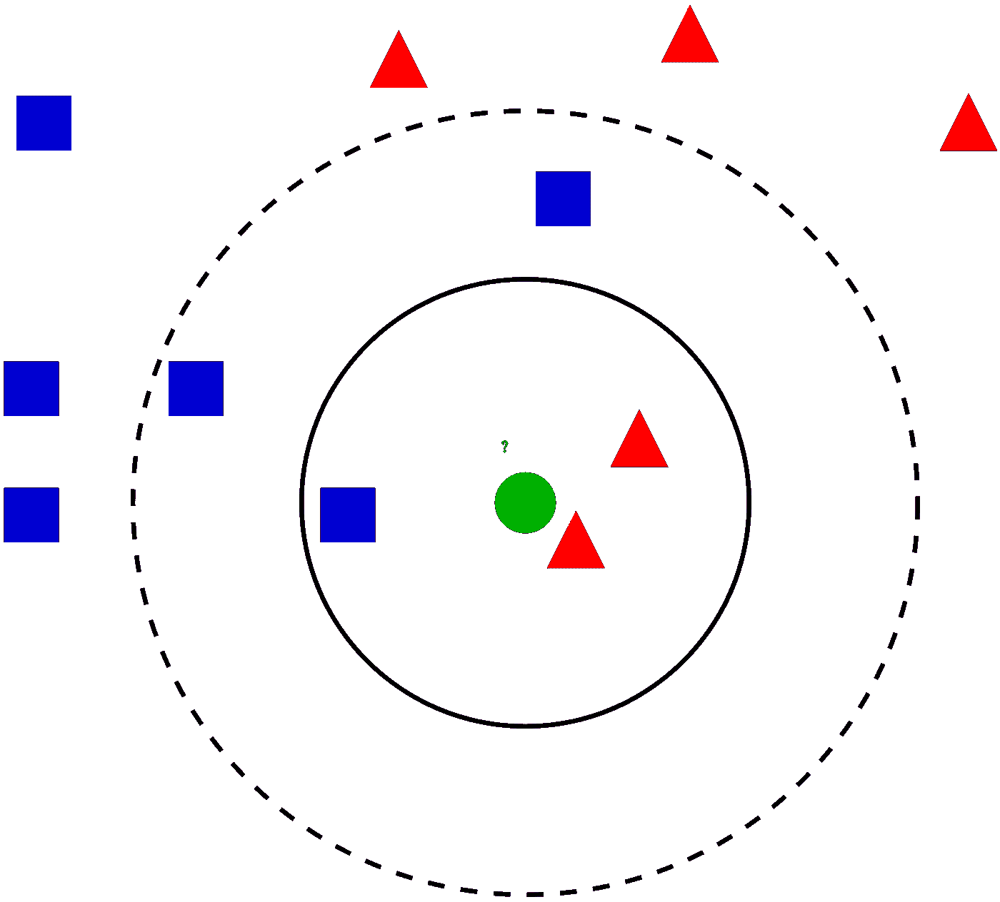
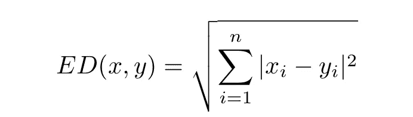
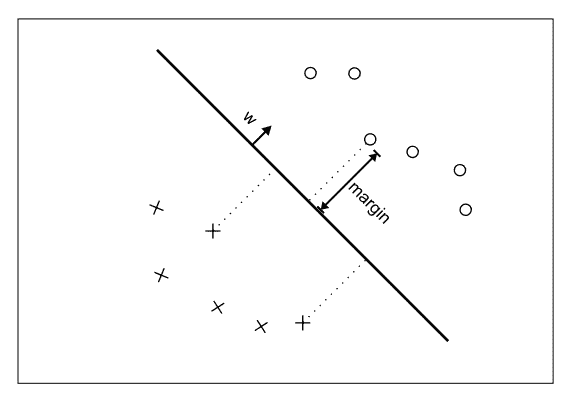
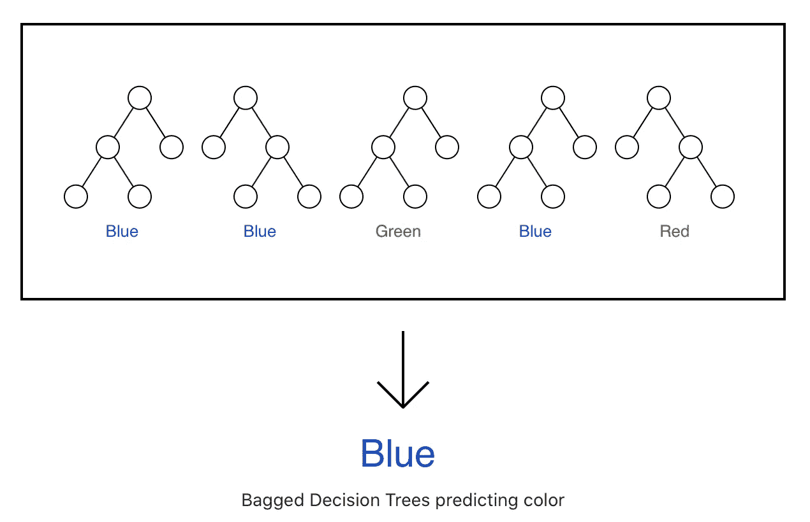
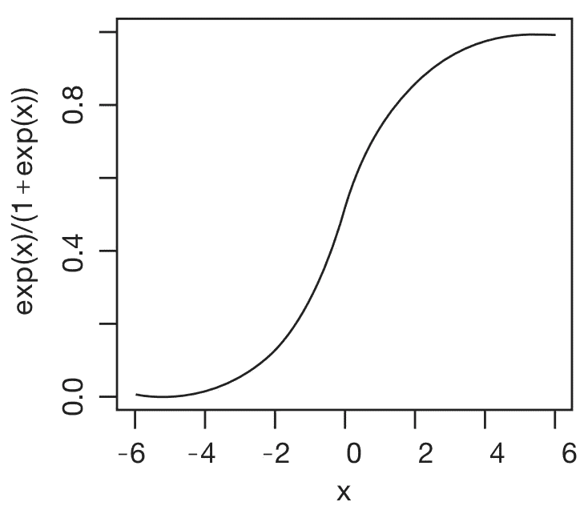

# 每个机器学习工程师都应该知道这 5 种算法

> 原文：<https://towardsdatascience.com/5-basic-machine-learning-algorithms-you-need-to-know-in-2020-ec4f2825ce06?source=collection_archive---------52----------------------->

## 机器学习算法

## 学习这些基本算法可以增强你的理解和技能

克里斯·本森在 [Unsplash](https://unsplash.com?utm_source=medium&utm_medium=referral) 上的照片

[**机器学习**](https://www.iunera.com/kraken/fabric/machine-learning/) (ML)是一种自动建立分析模型的数据分析方法。它是一个技术分支，允许计算机系统从大量数据中学习，识别图像和文本中的模式，并在最少的人工干预下做出统计决策。

最基本的， [**机器学习**](https://www.iunera.com/kraken/fabric/machine-learning/) 使用预编程的算法，接收和分析输入数据，在可接受的范围内预测输出值。随着新数据输入这些算法，它们[学习并优化](https://www.iunera.com/kraken/fabric/machine-learning/)它们的操作以提高性能，随着时间的推移发展“智能”。

选择正确的 [**机器学习**](https://www.iunera.com/kraken/fabric/machine-learning/) 算法取决于几个因素，如数据大小、质量和多样性，以及支持我们预测的业务目标。我已经编辑了一个十大最常用的[机器学习算法](https://www.iunera.com/kraken/fabric/machine-learning/)列表，这将有助于为任何特定的挑战找到最合适的用例。

# 线性回归

[**线性回归**](https://www.iunera.com/kraken/fabric/machine-learning/) 是监督学习的一部分，它试图通过将线性方程拟合到观察到的数据来模拟任意两个变量之间的关系。一个变量被认为是解释变量，另一个被认为是因变量。线性回归线具有形式为 ***Y = a + bX*** 的方程，其中 ***X*** 是解释变量， ***Y*** 是因变量。直线的斜率为 ***b*** ， ***a*** 为截距。

一旦线性回归模型被拟合到一组数据，残差(拟合线与观察值的数据点偏差)的检查允许建模者调查他或她存在线性关系的假设的有效性。

拟合线性回归线最常用的方法是**最小二乘法**。该方法通过最小化每个数据点到直线的垂直偏差的平方和来计算观察数据的最佳拟合直线(如果一个点正好位于拟合直线上，则它的垂直偏差为 0)。

# k 近邻

k 最近邻算法(k-NN)是一种基于实例的学习方法。它被认为是所有机器学习算法中最简单的一种。k-NN 的合理性在于相似样本属于同一类的概率大。k-NN 算法的关键思想是首先为每个测试样本选择 k 个最近邻，然后使用学习的 k 个最近邻来预测该测试样本。

k-NN 经常被说是‘懒学习’的一部分。懒惰学习意味着算法不进行归纳。这意味着存储所有的训练数据，并等待直到产生测试数据，而不必创建学习模型。因此，当使用 k-NN 时，所有的训练数据都用于测试。

下面的知识库解释了如何使用 k-NN 在流行的 Iris 数据集中对不同类型的花进行分类。

 [## 虹膜数据可视化和 KNN 分类

### 使用 Kaggle 笔记本探索和运行机器学习代码|使用鸢尾物种的数据

www.kaggle.com](https://www.kaggle.com/skalskip/iris-data-visualization-and-knn-classification) 

## 距离度量

k-NN 算法基于与测试样本最接近的 k 个最近邻中的大多数相似样本对未标记的测试样本进行分类。这是通过使用所谓的“距离度量”来完成的，其中测试样本和每个训练数据样本之间的距离被确定。在通常的实践中，使用欧几里德距离。

研究人员可能对 k-NN 的某些特性感兴趣:

*   对于多类分类问题易于实现
*   不同的距离标准可供选择(例如欧几里德距离、汉明距离等。)
*   不需要假设，因为 k-NN 是一个非参数算法。

# 支持向量机(SVM)

[支持向量机](https://www.iunera.com/kraken/fabric/support-vector-machines-svm/) (SVM)是一种由分离“超平面”形式定义的判别分类器。换句话说，给定带标签的训练数据(监督学习)，[算法输出最佳超平面](https://www.iunera.com/kraken/fabric/support-vector-machines-svm/)，该超平面根据分类目标将新示例分类到多个组中。

[SVM](https://www.iunera.com/kraken/fabric/support-vector-machines-svm/) 旨在通过将超平面训练到最佳量来优化表示两个类之间垂直距离的[线性判别模型](https://www.iunera.com/kraken/fabric/support-vector-machines-svm/)。

在 [Python](https://www.iunera.com/kraken/fabric/machine-learning/) 中，有很多常用的库来实现 [SVM](https://www.iunera.com/kraken/fabric/support-vector-machines-svm/) ，其中最流行的是 **scikit-learn** 。它是一个广泛用于实现[机器学习](https://www.analyticsvidhya.com/machine-learning/?utm_source=blog&utm_medium=support-vector-machine)算法的库。Scikit learn 有大量内置应用程序(导入库、对象创建、拟合模型和预测)来帮助使用 [SVM](https://www.iunera.com/kraken/fabric/support-vector-machines-svm/) 创建预测类。

[来源](http://www.jmlr.org/papers/volume2/tong01a/tong01a.pdf)

[支持向量机](https://www.iunera.com/kraken/fabric/support-vector-machines-svm/)具有强大的理论基础和优秀的实证成功。它们已经被应用于各种任务，例如手写数字识别、图像/对象识别、文本分类、自然语言处理等等。

# 随机森林分类器(或决策树)

[随机森林](https://www.iunera.com/kraken/fabric/adaptive-random-forest/)是最流行、最强大的机器学习算法之一。它是一种类型的[集成机器学习算法](https://machinelearningmastery.com/ensemble-methods-for-deep-learning-neural-networks/)，称为 Bootstrap Aggregation 或“**bagging”**。该算法构建了一个“森林”,它本质上是多个决策树的集合。

[随机森林](https://www.iunera.com/kraken/fabric/adaptive-random-forest/)的一个显著优点是它可以用于分类和回归问题。

[随机森林](https://www.iunera.com/kraken/fabric/adaptive-random-forest/)是一种平均多个深度决策树的方法，在同一训练集的不同部分进行训练，旨在减少方差。这是以偏差[略有增加](https://www.iunera.com/kraken/fabric/adaptive-random-forest/)和可解释性有所损失为代价的，但通常会显著提高最终模型的性能。

> [随机森林](https://www.iunera.com/kraken/fabric/adaptive-random-forest/)就像是决策树算法工作的集合——许多树的协同工作将提高单个[随机树](https://www.iunera.com/kraken/fabric/adaptive-random-forest/)的性能。尽管不太相似，森林给出了 K 倍交叉验证的剩余效应

[随机森林](https://www.iunera.com/kraken/fabric/adaptive-random-forest/)算法有相当多的几个特点比如:

*   它可以在不删除变量的情况下处理数千个输入变量。
*   它有一个有效的方法来估计缺失数据，并在大部分数据缺失时保持准确性。
*   它计算事例对之间的邻近性，这些事例对可用于聚类、定位异常值或(通过缩放)给出有趣的数据视图。
*   其算法将避免过拟合的常见问题。
*   它有在类总体不平衡数据集中平衡错误的方法。
*   它提供了一种**实验性的**方法来检测变量间的相互作用。

# 逻辑回归

逻辑回归或有时称为逻辑模型或 logit 模型分析多个自变量和一个分类因变量之间的关系，并通过将数据拟合到逻辑曲线来估计事件发生的概率。逻辑回归有两种模式——二元和多项式回归。

二元逻辑回归主要用于测量因变量，自变量或者是连续变量，或者是分类变量。逻辑回归不需要基于最小二乘法的线性回归模型的许多主要假设。

逻辑回归还可以**处理因变量和自变量之间的非线性关系**，因为它应用了线性回归的非线性对数变换。

 [## 物流回收

### 用 Python 从头开始实现逻辑回归

github.com](https://github.com/perborgen/LogisticRegression/blob/master/logistic.py) 

# 最后

在[机器学习](https://www.iunera.com/kraken/fabric/machine-learning/)领域，有大量[算法](https://www.iunera.com/kraken/fabric/machine-learning/)非常重要。然而，在[机器学习](https://www.iunera.com/kraken/fabric/machine-learning/)中，你不必知道所有可用的算法。

如果我已经设法让你注意到这一点，请留下你的评论，如果你对这个系列有任何建议，因为它将大大增加我的知识，改善我的写作方式。 [***普雷姆·库马尔***](https://towardsdatascience.com/@premstroke95) *是一个无私的学习者，对我们身边的日常数据充满热情。如果你想谈论这个故事和等待的未来发展，请在* [***上与我联系。***](https://www.linkedin.com/in/premstrk/)