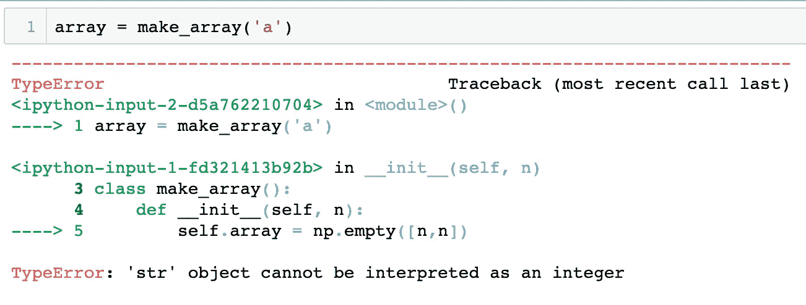
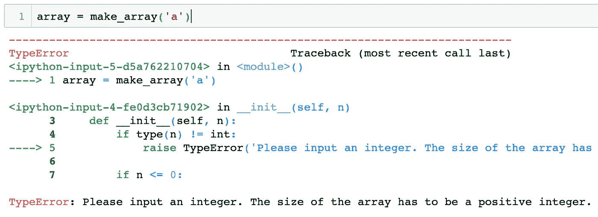
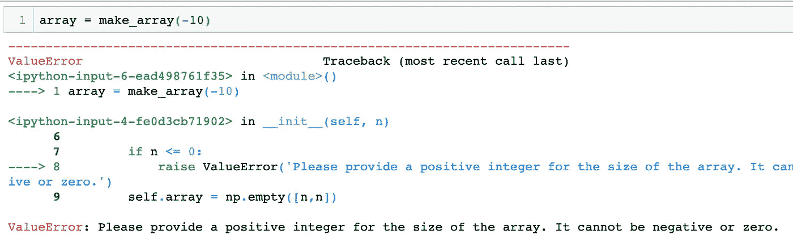
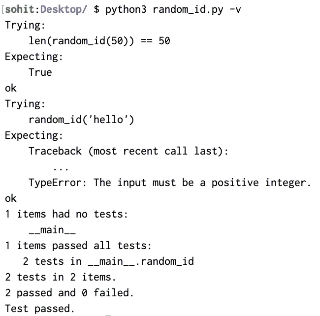
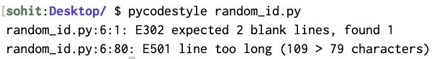

# Python 专业面向对象编程的 5 个最佳实践

> 原文：<https://towardsdatascience.com/5-best-practices-for-professional-object-oriented-programming-in-python-20613e08baee?source=collection_archive---------3----------------------->

## 处理异常的最好方法是编写文档、类继承的装饰器和自动清理代码的包。

构建 Python 类总是很有趣。但是为了效率、外部使用和文档化，对它们进行适当的打包是非常重要的。在本文中，我将介绍记录、维护和测试 Python 类的五种最佳实践。这些方法包括处理异常、编写文档和文档测试、类继承和数据管理的装饰器、抽象类以及清理和格式化代码的自动化包的最佳方式。


来源: [Unsplash](https://unsplash.com/photos/D9Zow2REm8U)

# **1 -异常处理**

构建 Python 类很酷。但同样重要的是，要确保当不正确的输入被输入到函数中时，你正在引发正确的错误。这里有一个例子:假设你正在构建一个函数来接受一个整数“n ”,并用它来构建一个大小为 n×n 的数组。下面是代码的样子:

现在，让我们运行这个函数，但是我们将输入一个字符串“a”而不是一个整数。以下是我们得到的结果:



TypeError 不是帮助调试问题的最直观的消息，尤其是如果您的包将被广泛的受众使用。让我们对我们的原始代码做一点修改。

上面的代码检查输入的整数是否是整数。如果不是，它将引发一个带有定制消息的 TypeError。它还检查整数是否为非负。如果不是，它会引发一个 ValueError，要求用户必须提供一个正整数。

以下是一些测试案例:



**为什么这很重要？**提出正确类型的直观消息对于构建易于调试的包极其重要。如果用户不能理解或调试你的包的需求，他们就不会使用它。

用户可以引发各种各样的内置错误，如 SystemError、FileNotFoundError 等。你可以在这里阅读更多关于它们的信息。通过调试这些错误，用户为包构建用例。这就把我们带到了下一步——文档。

# **2 —文件**

曾几何时，我们常常在代码中编写注释来恰当地解释它。但是注释并不是记录工作流的最结构化或最具视觉吸引力的方式。您应该使用带三个撇号的结构化文档来为您的代码编写结构化文档。这里有一个例子:

在上面的代码中，我们已经将所有的信息转移到我们在函数开始时写的一个段落中。所有信息都包含在开头的三个撇号和结尾的三个撇号中。大多数 Python 包都是用这种技术记录的。

# **3 —测试(Doc 测试)**

在大多数 python 文档中，开发人员还包括该函数的文档化用例。这些用例也被用作“测试”,以确保函数提供正确的响应。利用我们在上面学到的文档技术，我们还可以编写文档测试，既可以用作用例，也可以在函数上运行测试。在这些测试中，我们指定了预期的输出。如果实际输出与预期输出不匹配，doctest 就会失败。下面是一个生成随机 id 的函数中的文档测试示例:

```
def random_id(length):
    """
    This function creates a random configuration 
    key for a given length. Inputs:
      - length (Type: int and positive)
    Outputs:
      - ID (Type: str)

    DocTest 1
    >>> len(random_id(50)) == 50
    True

    DocTest2
    >>> random_id('hello')
    Traceback (most recent call last):
        ...
    TypeError: The input must be a positive integer.
    """ if type(length) != int or length < 1:
        raise TypeError('The input must be a positive integer.') choices = '0123456789abcdefghijklmnopqrstuvwxyz' id = '' for _ in range(length):
        id += random.choice(choices)
    return id
```

在上面的文档中，文档测试由符号“> > >”表示。该符号之后的 python 代码由 doctests 编译器执行。预期产出显示在该线下方。如果是错误，会在第二个 doctest 中指出，如上所示。让我们用 doctest 库运行这个文件。

您需要在。包含上述代码的 py 文件:

```
if __name__ == "__main__":
    import **doctest**
    doctest.testmod()
```

现在，让我们用下面的 bash 命令运行 doctest:(我已经将我的文件命名为 random_id.py)

```
python random_id.py -v
```



所以我们的代码通过了所有的文档测试。但是这些 doc 测试非常简单。您也可以编写更复杂的 doc 测试。当您继续编辑和维护 Python 类时，确保没有任何会导致 doc 测试失败的错误或问题是很重要的。

# **4 —遵循 pep8 指南**

pep8 指南是 Python 包的编码约定。虽然这些约定并不严格，也不影响代码的正确性，但是它们对于发布易于阅读、理解和维护的代码是有价值的。一些最突出的准则如下:

*   **每行代码不得超过 80 个字符**。如果代码行超过了这个长度，您可以使用' \ '符号在下一行继续编写代码。如果在函数中指定输入，就不需要使用反冲，因为 Python 保持代码连续。这只是字符串的问题，这就是' \ '有用的地方。
*   所有库必须在开始时一起导入，不能有任何重复。为什么？如果存在依赖问题，它会被提前突出显示，而不是在代码执行的时候。
*   冗余变量或中间变量(不执行进一步的操作)应该被删除以节省内存。

但是您不必手动实现所有这些准则。有一个名为 pycodestyle 的 python 包，它将一个 python 文件作为输入，并突出显示它的每个问题。

让我们在同一个 random_id.py 文件中运行 pycodestyle。该消息强调了两个函数之间没有足够的行(推荐的空行是 2 行),并且第 6 行太长。



您还可以运行一个名为 autopep8 的包，它获取一个 python 文件，并根据 pep8 准则自动对其进行重新格式化。点击此处了解更多关于 autpep8 [的用法。](https://pypi.org/project/autopep8/#usage)

# **5 —使用抽象类和继承**

在面向对象编程中，人们应该减少他们必须做的编码量。这意味着编码者应该构建抽象的类，并且更普遍地适用于广泛的对象。例如，我正在构建一个桌子的模拟，我需要编写代码来模拟钢笔、笔记本、铅笔、橡皮、卷笔刀等对象。但是我们不会为每一个对象编写另一个类。我们将编写一个名为“Table_Object”的抽象类，如下所示:

abstractclass 装饰器是一个特殊的函数，它表示对象的类型。现在，让我们定义另一个类，它用 object_type 的特定函数继承这个类的所有数据。

在这里，我们定义了两个类，它们从 Table_Object 类“继承”,然后成为与成为表对象的主要思想相关的专用继承类。类继承允许减少代码的重复性，也允许类的层次结构对于不是专家的程序员来说是有意义的。

您在 Table_Object 中看到的“@”符号称为装饰符。装饰器是另一个简单的函数，它允许你为不同的函数添加一个特殊的特性。Python 类中还有另一个装饰器，叫做静态方法。这些方法是“静态”的，调用时不会继承该类。它们通常用于保持类的一部分不受变化的影响。

对于专门的数据驱动类，您应该使用 dataclass 装饰器。在这里阅读更多关于他们[的信息。](https://realpython.com/python-data-classes/)

我希望你喜欢阅读这篇文章。如果你有任何问题，请随时通过 LinkedIn 联系我。编码快乐！