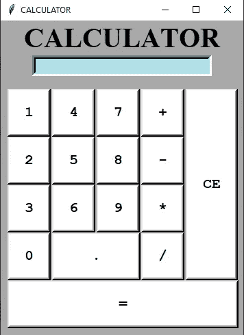
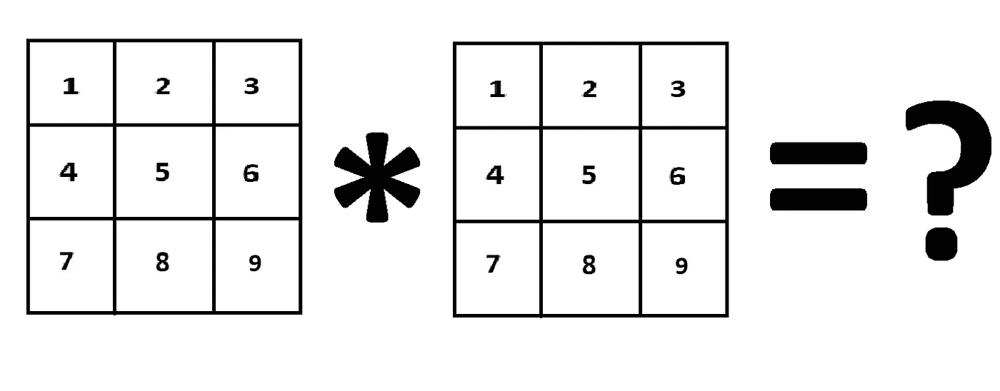
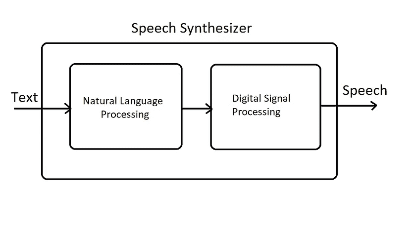

# 带有完整代码片段和有用链接的 5 个最佳 Python 项目创意！

> 原文：<https://towardsdatascience.com/5-best-python-project-ideas-with-full-code-snippets-and-useful-links-d9dc2846a0c5?source=collection_archive---------5----------------------->

## 为 Python 和机器学习创建一份令人敬畏的简历的 5 个最佳项目想法的代码片段和示例！


乔尔·霍兰德在 [Unsplash](https://unsplash.com?utm_source=medium&utm_medium=referral) 上拍摄的照片

Python 是一种优秀的编程语言，适合从初学者到高级用户。它正在成为一种非常流行的语言，同时也是当今谈论最多的编程语言，这要归功于它的灵活性。

编码语言 python 不仅易于学习和实现，而且在保持简单性的同时提供了广泛的多样性。Python 作为一种总体上易于入门和实现顶级项目的语言，为我们提供了执行各种选项的空间。

今天，我们将讨论 5 个项目想法，我们将在 python 的帮助下实施这些想法。我已经提到了 2 个初级项目的想法，另外 2 个中级项目的想法，最后，1 个复杂项目的想法。

我将用必要的代码、示例、基本指南和有用的链接来彻底讨论每个项目想法，以帮助您开始构建提到的 python 项目。

简单的介绍结束后，让我们深入到本文有趣的部分，详细讨论每一个项目，这样您就可以马上开始工作了！

# 基本启动项目

## 1.从简单到高级的计算器:



作者截图。参考— [GitHub](https://github.com/abhishek305/ProgrammingKnowlegde-Tkinter-Series/blob/master/12th%20video%20Calc/My%20cal.py)

这个要实现的基本项目可以用你选择的任何方式来完成。让我们分析一下这个简单的计算器项目是如何针对每一类难度执行的。我将从简单计算器的初学者实现开始，但即使你有基本的编程知识，也要坚持到本节的下一部分，因为我有一些建议，可以让这个项目更上一层楼，如上图所示。

如果你是一个初学者，刚刚开始使用 python，那么请参考下面提供的入门代码，这是你理解 python 中函数使用的最好方法之一。

通过上面显示的简单代码，您已经成功地创建了四个函数来计算计算器的四个基本操作。要从用户处获取两个输入用于计算目的，可以使用下面的代码块赋值。

在执行下面的代码块之后，我将为我的两个数字赋值，比如 5 和 2，用于解释计算。你可以根据你的要求随意声明你想要的任何数字。下列作业的答案应该如下:

```
Enter the first number: 5
Enter the second number: 2
The Sum is:  7
The Difference is:  3
The product is:  10
The answer is:  2.5
```

这部分完成了简单的计算器程序。然而，这还没有接近尾声。使用各种技术可以做出大量的改进。让我们讨论一下如何完成这项任务。对于中级程序员，我强烈建议您通过使用函数可用的*args 选项，超越两个输入整数，使用更高的 n 元素方法。然后，尝试使用类来更精确地理解这个概念，并开发一个更复杂的计算器。

对于同一个项目的更高级或专家级的构建，可以查看像 Tkinter 这样的图形用户界面库。使用这个模块，用户可以为你的计算器开发一个很棒的 GUI 结构。也有其他图形模块可以使用，但我个人推荐 Tkinter 作为一个很好的起点。参考上图中 GitHub 链接中编程知识用户提供的惊人代码片段，获得计算器开发的简明指南。

## 2.没有机器学习库的矩阵乘法；



作者截图和图片

python 和机器学习的一个重要方面是理解这些概念背后的数学，并了解机器学习库中的一些代码。为了更好地掌握这些概念，有必要实践在 numpy 和 scikit 等科学模块中实现的思想——自学。一个这样的编程应用是在不使用任何 ML 库的情况下执行矩阵乘法运算。

要完成这项任务，主要要求是了解矩阵是如何工作的。完整的解释和指导可以从我下面的文章中获得。但是，如果您只是对这个编码问题的基本要点感兴趣，并想尝试自己解决这个问题，那么使用下面的参考段落来帮助您开始。

[](/python-coding-from-scratch-matrix-multiplication-without-any-machine-learning-libraries-463624fe8726) [## Python 从头编码:没有任何机器学习库的矩阵乘法！

### 从零开始了解如何在没有任何机器学习库的情况下实现矩阵乘法！

towardsdatascience.com](/python-coding-from-scratch-matrix-multiplication-without-any-machine-learning-libraries-463624fe8726) 

我解决这个问题的方法是从用户那里获取所有的输入。这些是第一和第二矩阵的行数和列数。同样，根据每个矩阵的行数和列数，我们将相应地分别填充备选位置。

在做任何矩阵乘法之前，第一步是检查两个矩阵之间的运算是否实际可行。这可以通过检查第一矩阵的列是否匹配第二矩阵的行的形状来完成。这可以表述为:

## →矩阵 1 中的列数=矩阵 2 中的行数

这应该是你入门的一个很好的起点。

# 中级项目:

## 3.从头开始构建您选择的游戏:


我的第一个项目的作者过时的 GIF

你们在上面看到的过时的 GIF 是我三年前在 pygame 的帮助下完成的第一个项目。如果你想要一个更简洁的关于如何用 python 从头开始构建的指南，请告诉我。但是这里的主要思想是用 python 自己从头开始构建一个游戏。从一些简单的游戏开始，比如蛇游戏，或者井字游戏，然后通过强化学习进行更高级的游戏，比如 flappy birds。

完成这项任务背后的想法更多的是个人观点和偏好。我相信掌握任何编程语言的最好方法之一就是从一个有趣和令人愉快的项目开始。我也有点沉迷游戏。为了开始与 python 相关的游戏项目，我强烈推荐使用 Pygame 库模块来执行这类程序。

使用 pygame 模块，您可以用 python 构建一些简单有趣的游戏。然而，不要期望任何过于花哨的东西，因为它有其局限性。不管怎样，这是一个很好的开始方式，下面是开始代码。只需用一个简单的 pip 命令安装 pygame，然后使用下面的 import pygame 命令。成功导入模块后，将出现以下消息。

```
pygame 1.9.6
Hello from the pygame community. [https://www.pygame.org/contribute.html](https://www.pygame.org/contribute.html)
```

根据安装时间的不同，版本可能会有所不同，所以不要太担心。在任何情况下都使用更新的版本。我将介绍一些你应该知道的基本命令以及它们是如何工作的。下面是 pygame 入门所需了解的所有重要方面的完整代码块。

```
#imports the pygame library module
import pygame# initilize the pygame module
pygame.init()# Setting your screen size with a tuple of the screen width and screen height
display_screen = pygame.display.set_mode((800,600)) 

# Setting a random caption title for your pygame graphical window.
pygame.display.set_caption("pygame test")# Update your screen when required
pygame.display.update()# quit the pygame initialization and module
pygame.quit()# End the program
quit()
```

我强烈建议你看看 YouTube 上的一些视频，以便更好地理解和学习制作一些游戏。pygame 模块的[文档](https://python101.readthedocs.io/pl/latest/_downloads/pygame192.pdf)虽然有点冗长，但可能是了解这个模块更多信息的最佳资源之一。

## 4.文本到语音和光学字符识别:



作者提供的图片— 1。GTTS 语音合成| 2。OCR 流程

我们将关注的下一个中级水平是拥有 python 编程知识的最酷的方面之一。复杂的任务，如文本到语音的转换和 python 的光学字符识别，只需要理解为此目的创建的 python 库模块就可以完成。

文本到语音(TTS)是将单词转换成有声音频形式的过程。程序、工具或软件从用户处获取输入文本，并使用自然语言处理方法，理解所使用语言的语言学，并对文本执行逻辑推理。该处理后的文本被传递到下一个块，在那里对处理后的文本执行数字信号处理。随着许多算法和转换的使用，这个处理过的文本最终被转换成语音格式。这整个过程包括语音合成。

光学字符识别是通过使用电子或机械设备将二维文本数据转换成机器编码的文本形式。二维文本数据可以从各种来源获得，例如 PDF 文件之类的扫描文档、具有以下格式的文本数据的图像。png 或者。jpeg、路标(如交通标志)或任何其他带有任何形式文本数据的图像。光学字符识别有广泛的有趣应用。

下面是两篇文章的列表，对于您熟悉用于语音翻译的 Google 文本到语音模块和用于光学字符识别的 pytesseract 模块非常有用。请参考下面的文章，获得全面的入门指南，并一起使用它们执行项目。

[](/how-to-get-started-with-google-text-to-speech-using-python-485e43d1d544) [## 如何使用 Python 开始使用 Google 文本到语音转换

### 从零开始的文本到语音转换简介

towardsdatascience.com](/how-to-get-started-with-google-text-to-speech-using-python-485e43d1d544) [](/getting-started-with-optical-character-recognition-using-python-e4a9851ddfab) [## 使用 Python 开始光学字符识别

### 对光学字符识别从无到有的直观理解和简要介绍

towardsdatascience.com](/getting-started-with-optical-character-recognition-using-python-e4a9851ddfab) 

您可以在更高级的项目中充分利用这些模块，例如将它们用于序列对序列，注意构建机器翻译的深度学习模型等等。体验和探索这些库的乐趣。

# 高级项目:

## 5.从头开始虚拟助手:


Brannon Naito 在 [Unsplash](https://unsplash.com?utm_source=medium&utm_medium=referral) 上拍摄的照片

在虚拟助手项目中，你的计算机会听你的每一个命令，并执行你所有想要的任务。这个项目将有助于用一个简单的声音命令来控制你的所有活动。

你可以在用你的声音打字后执行像电子邮件自动化这样的操作，虚拟助手会自动完成所需的自动更正。你也可以命令你的虚拟助手浏览互联网，或者打开任何网站，或者购物，或者做任何你想做的事情。我将检查我的一个虚拟助理项目，但你可以自由创新，也可以尝试任何你自制的想法。所有参考链接也可在本节的相应部分找到。

首先，我希望我的虚拟助理只允许我或我选择的成员访问。我建了一个智能面锁系统只允许我进入。我利用深度学习技术和 python 构建了人脸识别模型。这个项目的完整的简明反馈可以从下面的链接获得。

[](/smart-face-lock-system-6c5a77aa5d30) [## 智能面部锁定系统

### 建立高精度人脸识别模型

towardsdatascience.com](/smart-face-lock-system-6c5a77aa5d30) 

我希望我的虚拟助手做的下一件事是在我的脑海中自动预测下一个单词，并执行下一个单词的预测任务，以更快的速度完成我的消息，而不需要太多的努力。使用 python 的自然语言处理和深度学习的下一个单词预测模型完成了这个任务。

下面是实现下一个单词预测模型的完整、简明的指南，它深入地涵盖了所有这些概念。

[](/next-word-prediction-with-nlp-and-deep-learning-48b9fe0a17bf) [## 基于自然语言处理和深度学习的下一个单词预测

### 使用 LSTM 设计单词预测系统

towardsdatascience.com](/next-word-prediction-with-nlp-and-deep-learning-48b9fe0a17bf) 

我的虚拟助手项目的最后一部分是聊天机器人的实现。我希望有一个伙伴能和我说话，理解我说的话，并做出适当的回应。我用一个讽刺的数据集设计了我的聊天机器人，这使得聊天机器人回复充满讽刺的有趣消息。下面是使用 Python 和深度学习从头开始构建聊天机器人的完整而简明的指南。

[](/innovative-chatbot-using-1-dimensional-convolutional-layers-2cab4090b0fc) [## 使用一维卷积层的创新聊天机器人

### 从头开始使用深度学习和 Conv-1D 层构建聊天机器人

towardsdatascience.com](/innovative-chatbot-using-1-dimensional-convolutional-layers-2cab4090b0fc) 

你可以随意做同样的事情，我已经实现了我的上述想法或尝试一些独特的和创新的与你的风格指南的虚拟助理项目的实施。

GIF 来自 [GIPHY](https://giphy.com/gifs/mickey90-friends-birthday-mickey-90-fxe8v45NNXFd4jdaNI)

# 结论:

本文中提到的这五个项目对所有级别的程序员都有用，不管您是刚刚入门还是已经掌握了中级到高级的 Python 知识。如果你对本文提到的这五个项目有任何疑问，请随时联系我。

人工智能正在崛起，我们甚至接近征服整个宇宙。有了这些 python 项目和对诸如[稀疏](/lost-in-a-dense-forest-intuition-on-sparsity-in-machine-learning-with-simple-code-2b44ea7b07b0)等概念的理解，我们都可以学习并发展到一个更加进化的现代时代。

如果您对涵盖令人惊叹的项目想法的类似文章感兴趣，请查看我以前的一篇文章，其中涉及 5 个可以用 python、机器学习和深度学习实现的令人敬畏的计算机视觉项目。

[](/5-awesome-computer-vision-project-ideas-with-python-machine-learning-and-deep-learning-721425fa7905) [## 5 个关于 Python、机器学习和深度学习的超棒的计算机视觉项目创意！

### 讨论 5 个很酷的计算机视觉项目，学习新的技能，增强你的简历

towardsdatascience.com](/5-awesome-computer-vision-project-ideas-with-python-machine-learning-and-deep-learning-721425fa7905) 

查看我的其他简明指南，了解更多关于 python 的知识，并理解您需要了解的关于 python 的一切，以便习惯用它为机器学习项目编程。

[](/starting-your-journey-to-master-machine-learning-with-python-d0bd47ebada9) [## 开始使用 Python 掌握机器学习的旅程

### 了解精通机器学习的基本要求

towardsdatascience.com](/starting-your-journey-to-master-machine-learning-with-python-d0bd47ebada9) [](/basics-of-python-and-its-library-modules-required-for-machine-learning-51c9d26026b8) [## 机器学习所需的 Python 基础知识及其库模块

### 学习 python 数据结构的基础知识，对机器所需的每个库有直观的理解…

towardsdatascience.com](/basics-of-python-and-its-library-modules-required-for-machine-learning-51c9d26026b8) [](/5-common-python-errors-and-how-to-avoid-them-63d9afc1a58f) [## 5 个常见的 Python 错误以及如何避免它们！

### 从初学者到专家，每个人在 python 和机器学习中都容易出现这些错误。

towardsdatascience.com](/5-common-python-errors-and-how-to-avoid-them-63d9afc1a58f) [](/a-concise-guide-of-10-awesome-python-editors-and-how-to-choose-which-editor-suits-you-the-best-465c9b232afd) [## 10+牛逼 Python 编辑器的简明指南，以及如何选择最适合你的编辑器…

### 帮助您在各种 python 开发环境中进行选择的简明指南

towardsdatascience.com](/a-concise-guide-of-10-awesome-python-editors-and-how-to-choose-which-editor-suits-you-the-best-465c9b232afd) 

谢谢你们坚持到最后。我希望你喜欢读这篇文章。祝大家有美好的一天。