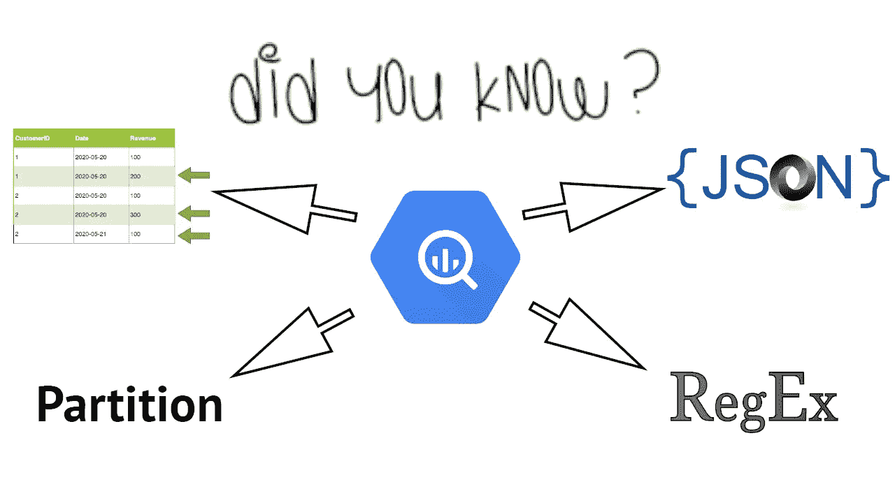
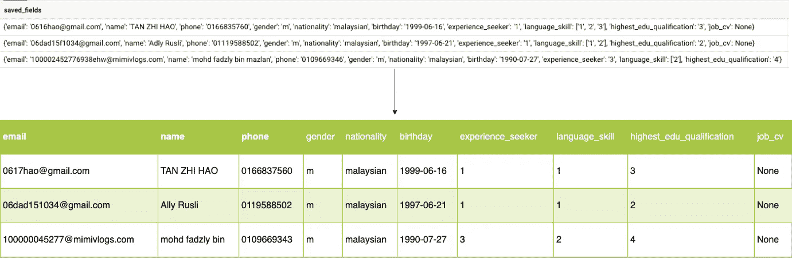
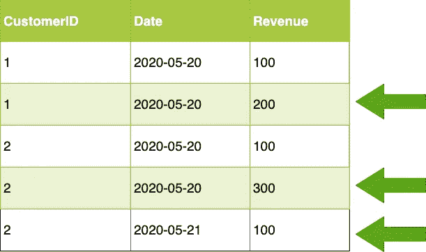
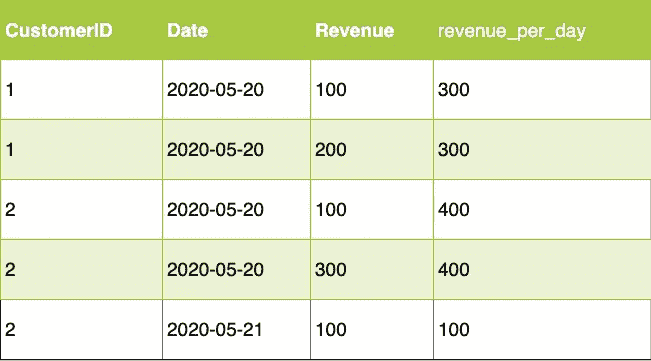

# 您[可能]不知道的 5 个 Bigquery SQL 命令

> 原文：<https://towardsdatascience.com/5-bigquery-sql-commands-you-probably-didnt-know-about-ebfd9d0dc160?source=collection_archive---------18----------------------->

## 将对您的数据科学职业生涯有巨大帮助的 5 个 SQL 技巧



作者图片

读者好。

如果你正在阅读这篇文章，你可能是一名数据从业者，或者渴望成为一名数据从业者。欢迎来到数据世界，在这里放松一下，你将会花相当多的时间学习新的东西。

随着数据科学领域工作需求的增加，人们渴望掌握该职业所需的技能。Python、机器学习、数据可视化，不胜枚举。然而，一项经常被忽视的技能是…

## 结构化查询语言

SQL 一直是所有数据库的首选查询语言，而且它不会很快走向任何地方。**所有数据科学家都必须从某个地方获取数据。**通常情况下，它来自 SQL 关系数据库。

快进到今天，我们可以在自己的公司中运行 SQL 相关的数据仓库。这些是 OLAP(在线分析处理)数据库，通常允许复杂的查询和与数据可视化工具的协作，同时不会干扰生产数据库。

著名的有 Google Bigquery，Amazon Redshift，Azure SQL 数据仓库，不胜枚举。

在这篇文章中，我们将讨论一些独特的 **SQL 命令**，这些命令你可能不知道，但是当你碰到类似的砖墙时，它们将会有很大的帮助。

让我们开始吧。

# 1.JSON 列到表



作者图片

如图所示，这是一个命令，我们用它将一个属于 **JSON 字符串**类型的 Bigquery 列转换成一个完整的**表**。您可能会在执行数据工程任务(通常来自外部数据源)时遇到这种情况。

这里，我们可以使用 JSON_EXTRACT_SCALAR Bigquery 命令。

```
**JSON_EXTRACT_SCALAR(<JSON COLUMN>, $[<PARENT>])**
```

在这个命令中，JSON 字符串被拆分成**父**、**子**和**子**。
函数是这样工作的:
JSON _ EXTRACT _ SCALAR(**JSON _ STRING**，" $[' **PARENT_NAME** ']")将得到子值。对于数据工程师来说，可以把它看作是一种键值的概念。

在本例中，
我们使用 JSON _ EXTRACT _ SCALAR(**saved _ fields**，" $[' **email** ']")，这将在 JSON 字符串中产生一列所有电子邮件。很酷吧。

来自[鹳](https://giphy.com/storksmovie/)的 Gif

如果孩子是在一个**列表**格式中，就像这个例子中的父 **language_skill** 一样，该怎么办？

我们可以使用 JSON _ EXTRACT _ SCALAR(saved _ fields，“$。language_skill[0]")，这将为您提供列表中的第一个元素作为列。

差不多就是这样。为了提取该列中的所有信息，我们使用

```
**SELECT** JSON_EXTRACT_SCALAR(saved_fields, "$['email']") **as** email, JSON_EXTRACT_SCALAR(saved_fields, "$['name']") **as** **name**, JSON_EXTRACT_SCALAR(saved_fields, "$['phone']")**as** phone, JSON_EXTRACT_SCALAR(saved_fields, "$['gender']")**as** gender, JSON_EXTRACT_SCALAR(saved_fields, "$['nationality']")**as** nationality, JSON_EXTRACT_SCALAR(saved_fields, "$['birthday']")**as** birthday, JSON_EXTRACT_SCALAR(saved_fields, "$['experience_seeker']")**as** experience_seeker, JSON_EXTRACT_SCALAR(saved_fields, "$.language_skill[0]") **as** language_skill_1, JSON_EXTRACT_SCALAR(saved_fields, "$.language_skill[1]") **as** language_skill_2, JSON_EXTRACT_SCALAR(saved_fields, "$.language_skill[2]") **as** language_skill_3, JSON_EXTRACT_SCALAR(saved_fields, "$.language_skill[3]") **as** language_skill_4, JSON_EXTRACT_SCALAR(saved_fields, "$.language_skill[4]") **as** language_skill_5, JSON_EXTRACT_SCALAR(saved_fields, "$['highest_edu_qualification']")**as** highest_edu_qualification, JSON_EXTRACT_SCALAR(saved_fields, "$['job_cv']")**as** job_cv **from**  dataset.**table**
```

官方文档，此处阅读[](https://cloud.google.com/bigquery/docs/reference/standard-sql/json_functions)**。**

# **2.划分依据**

****

**作者图片**

**这个命令不仅是这个列表中最常用的，而且在**数据科学访谈**中也经常被提到。**

**当谈到数据聚合时，许多经验丰富的数据科学家会自动求助于 **Group By，**这是聚合数据最常用的命令。**

**但是，您可能会遇到**按**分组不够的情况。
**Group By**函数要求你按列对数据进行分组，但是如果你不想分组呢？如果您希望在聚合数据的同时保留所有现有的行，该怎么办？**

**我能描述它的最好方式是给你一个面试问题:**

## **分组依据**

```
Given customerID, date and revenue columns. 
For **EACH** date, how do I show the total revenue value for **EACH** customer?
```

**诸如此类的问题可以由**小组通过**来解决**

```
Select
date,
customerID,
sum(revenue)
from dataset
group by date, customerID
```

**该命令按日期和 customerID 对数据进行分组。
这实质上意味着对于每个日期，我们将为每个 customerID 提供 1 行。**

## **划分依据**

**当您希望在执行聚合后**保留所有行**时，Partition By 就派上了用场。对于上面的同一个问题:**

```
Given customerID, date and revenue columns. 
For **EACH** date, how do I show the total revenue value for **EACH** customer while keeping all the rows?
```

**您可以通过以下方式实现这一点**

```
Select
date,
customerID,
revenue,
sum(revenue) over (partition by date,customerID) as revenue_per_day
from dataset 
```

****

**作者图片**

**注意所有的行在聚合后是如何被保留的。这里有一个我经常得到的更实际的例子。**

```
Given customerID, date and revenue columns. 
For each date, how do I show the highest revenue row for each customer?
```

**使用 partition by 命令，您可以通过以下方式轻松实现这一点**

```
Select
date,
customerID,
revenue,
sum(1) over (partition by date order by revenue desc rows unbounded preceding) as row_num
from dataset 
having row_num = 1
```

****

**作者图片**

**该命令正在执行:**

*   **对于每个日期和 customerID，每次出现一行时，将行号+1，按收入值排序(降序)**
*   **仅筛选 row_num=1 的行，这将返回每个客户每个日期的最高收入行**

**我希望现在你意识到通过命令分割**是多么强大。****

# **3.拥有**

****有**条款。
如果你熟悉 **Where** 子句，那是极其相似的。
当根据**布尔**表达式进行评估时，它过滤返回**真值**的行。**

**唯一的区别是对于有子句的**，它:****

*   **工作查询中必须有一个按分组的**或任何**聚合******
*   **发生在任何表示的**聚合之后，order by 之前。**另一方面， **Where** 子句出现在任何聚合之前**

**您已经可以使用嵌套的 where 子句实现这一点:**

```
#Looking for revenue > 100Select * from(
Select
date,
customerID,
sum(revenue) as revenue_sum
from dataset
group by 1,2) 
where revenue_sum > 100
```

**但是，当你可以选择编写更专业、看起来更酷的代码时，为什么要这样做呢？**

```
Select
date,
customerID,
sum(revenue) as revenue_sum
from dataset
group by 1,2
having revenue_sum > 100
```

**来自 [wiffleGif](https://wifflegif.com/) 的 gif**

# **4.正则表达式**

**Regex 是正则表达式的缩写，是 NLP 领域中一个非常流行的术语。正则表达式被定义为一系列定义搜索模式的**字符。它主要用于处理文本、数字和标点符号。****

**下面是 Regex 上的 [**文档**](https://www.rexegg.com/regex-quickstart.html) 。**

**你可以在正则表达式中做很多事情，比如查找特定的文本，删除数字或标点符号，替换某些字符等等。下面是如何在 Bigquery SQL 中实现的。**

**Bigquery 中有 3 个主要的 Regex 命令:**

## **正则表达式包含**

**如果提供的字符串(值)与正则表达式(REGEXP)部分匹配，则 REGEXP_CONTAINS 返回 TRUE。**

```
REGEXP_CONTAINS(value, regexp)
```

**这里有一个例子，我们想要过滤 customerID 以**‘P’**字符开始的数据。我们可以通过以下方式实现这一目标**

```
#^P means string starts with the character P
Select
*
from dataset 
where REGEXP_CONTAINS(customerID, '^P')
```

## **正则表达式 _ 替换**

**REGEXP_REPLACE 从提供的字符串(值)中搜索特定的正则表达式模式，并用您指定的内容替换它。**

```
REGEXP_REPLACE(value, regexp, replacement)
```

**与上一个示例类似，让我们将所有以字符**‘P’**开头的 customerID 替换为‘以 P 开头’。**

```
select 
*,
REGEXP_REPLACE(customerID,'^P','Starts with P')
from dataset
```

## **正则表达式 _ 提取**

**REGEXP_EXTRACT 从提供的字符串(值)中返回与指定的 Regex 模式匹配的第一个子字符串。**

```
REGEXP_EXTRACT(value, regexp)
```

**类似于前面的例子，让我们提取第一个字母子串。**

```
select 
*,
REGEXP_EXTRACT(customerID,'[a-zA-Z]')
from dataset
```

# **5.随着**

**带有子句的**包含子查询，每次后续的 **SELECT** 语句运行时都会运行这些子查询。它可以在查询的任何地方被引用，包括**联接**、**联合、**和**where**。****

**带有子句的**对于可读性非常有用，它也有助于数据从业者对所编写的查询有一个高层次的理解。****

```
WITH q1 AS (my_query)
SELECT *
FROM
  (WITH q2 AS (SELECT * FROM q1) SELECT * FROM q2)WITH q1 AS (my_query)
SELECT *
FROM q2 a
left join my_query b on 
a.id = b.id
```

**注意，在同一个 **With** 子句中引入的别名必须是唯一的，但是同一个别名可以使用多次。如果有相似的别名，带子句的**将自动取最新引用的别名。****

```
WITH q1 AS (my_query)
SELECT *
FROM
  (WITH q2 AS (SELECT * FROM q1),  # q1 resolves to my_query
        q3 AS (SELECT * FROM q1),  # q1 resolves to my_query
        q1 AS (SELECT * FROM q1),  # q1 (in the query) resolves to my_query
        q4 AS (SELECT * FROM q1)   # q1 resolves to the WITH subquery
                                   # on the previous line.
    SELECT * FROM q1)  # q1 resolves to the third inner WITH subquery.
```

# **结论**

****

**照片由[龙威·史密斯](https://unsplash.com/@hellosmith?utm_source=medium&utm_medium=referral)在 [Unsplash](https://unsplash.com?utm_source=medium&utm_medium=referral) 上拍摄**

****干得好！如果你已经做到了这一步，我想你已经对 SQL 有所了解了。在本文中，我们浏览了这些 SQL 命令:****

*   **JSON 列到表**
*   **划分依据**
*   **拥有**
*   **正则表达式**
*   **随着**

**让它留在你的脑海里，因为我发誓你以后会经常用到它。**

# **在你走之前**

**我们的数据之旅还没有结束。敬请关注，我正在撰写关于**更多数据科学项目**，以及更多数据行业的故事、指南和经验。与此同时，请随意查看我的其他[文章](https://medium.com/@nickmydata)，以暂时填补您对数据的渴望。
一如既往，我引用一句话作为结束。**

> **从数据中学习几乎是普遍有用的。掌握它，你将在任何地方受到欢迎。Splunk 首席技术官托德·帕帕约安努**

## **订阅我的时事通讯，保持联系。**

**也可以通过 [**我的链接**](https://nickefy.medium.com/membership) 注册一个中等会员来支持我。你将能够从我和其他不可思议的作家那里读到无限量的故事！**

**我正在撰写更多关于数据行业的故事、文章和指南。你绝对可以期待更多这样的帖子。与此同时，可以随时查看我的其他 [**文章**](https://medium.com/@nickmydata) 来暂时填补你对数据的饥渴。**

*****感谢*** *的阅读！如果你想与我取得联系，请随时联系我，地址是 nickmydata@gmail.com 或我的* [*LinkedIn 个人资料*](https://www.linkedin.com/in/nickefy/) *。也可以在我的*[*Github*](https://github.com/nickefy)*中查看之前写的代码。***