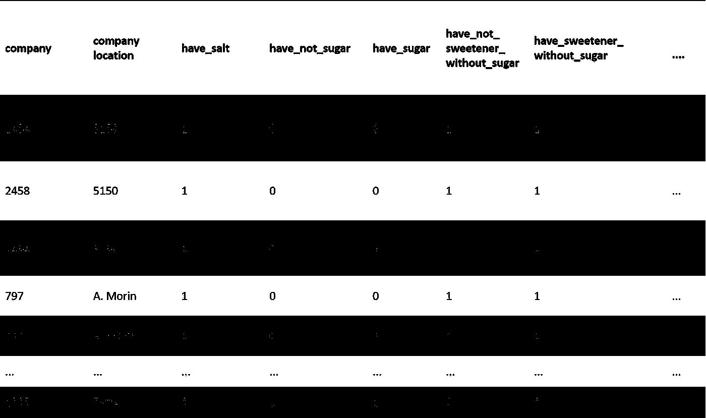
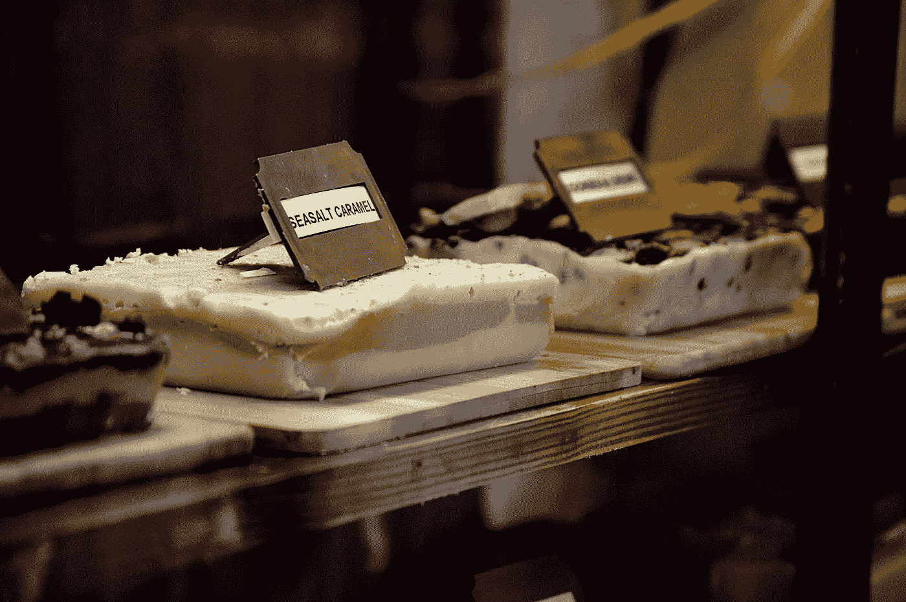
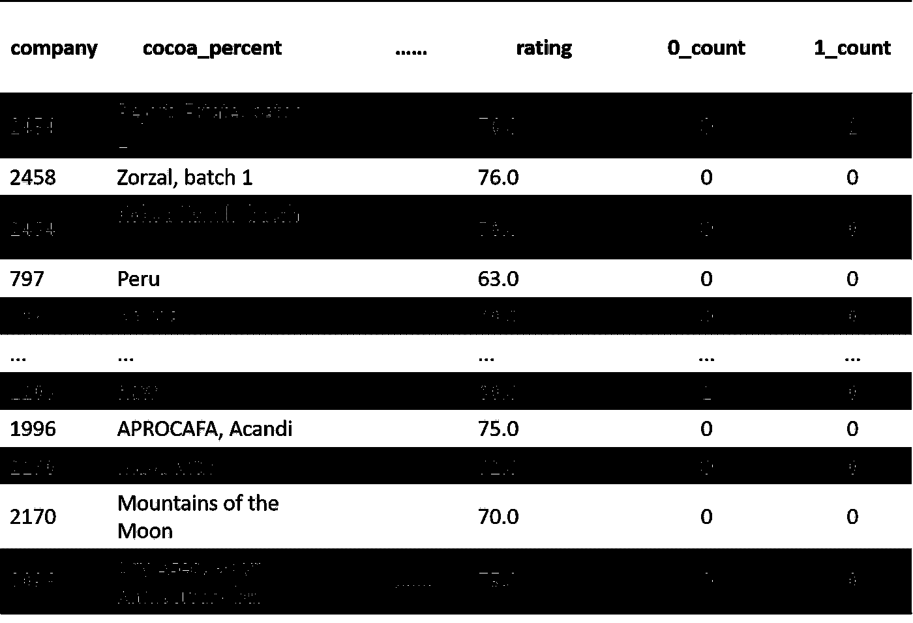
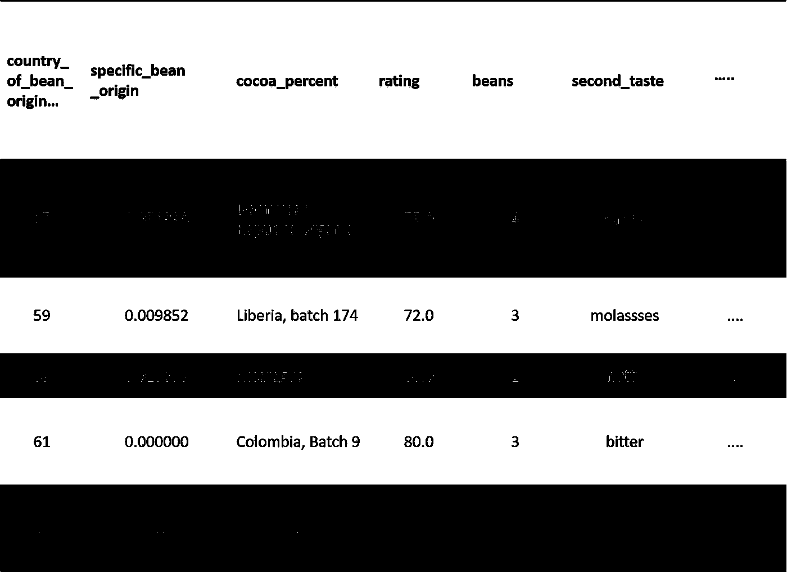
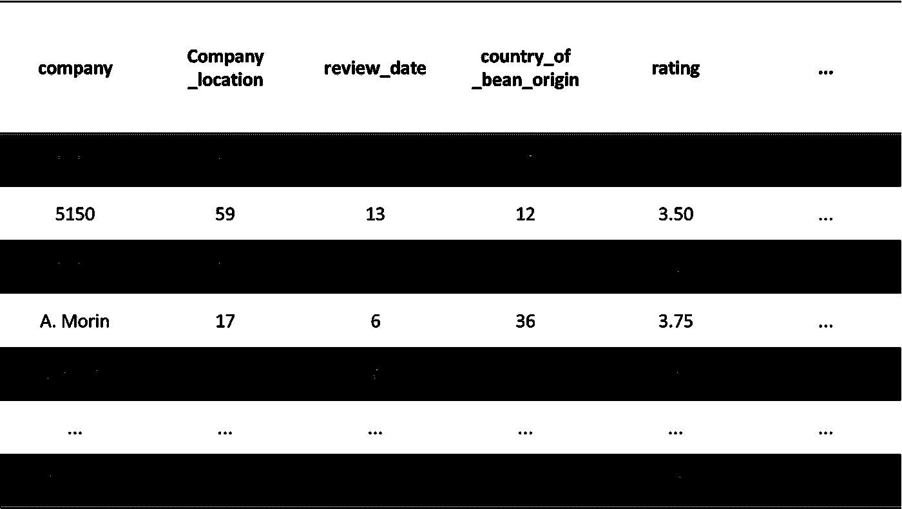
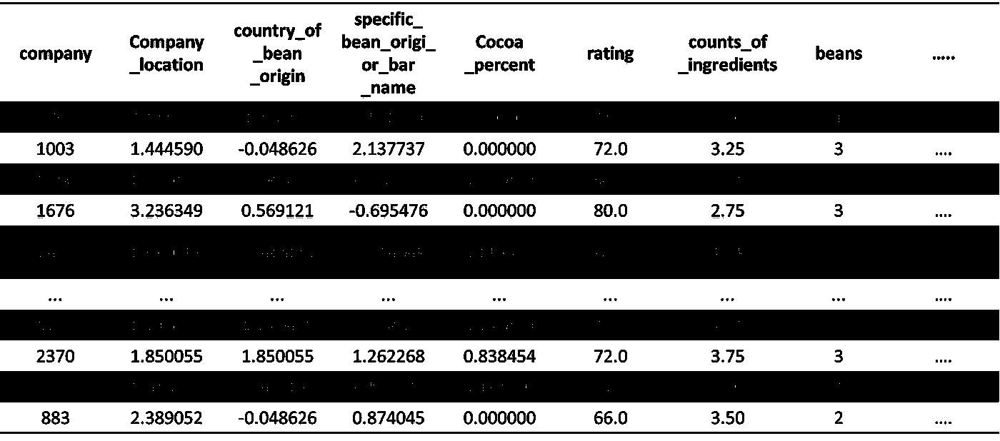

# 作为数据科学家，你今天需要知道的 5 个分类编码技巧

> 原文：<https://towardsdatascience.com/5-categorical-encoding-tricks-you-need-to-know-today-as-a-data-scientist-73cf75595298?source=collection_archive---------34----------------------->

## 完整的 Pythonic 编码教程


Jezael Melgoza 在 [Unsplash](https://unsplash.com/@jezael?utm_source=unsplash&utm_medium=referral&utm_content=creditCopyText) 上拍摄的照片

对于大多数高级数据科学项目，无论是开发机器学习模型还是商业分析，分类编码都是探索性数据分析(EDA)中的一个基本步骤。包括 scikit-learn 在内的大多数库都使用各种数据编码方法。由于数据量很大，找到在 python 中获得最佳分类编码的技巧对于成为独角兽数据科学家来说是一个巨大的优势。在本文中，我们将回顾 5 个最成功的开源短 python 代码行，它们可以组合在一起生成一流的分类编码报告。


照片由[大卫·格林伍德-黑格](https://unsplash.com/@dghchocolatier?utm_source=unsplash&utm_medium=referral&utm_content=creditCopyText)在 [Unsplash](https://unsplash.com/@dghchocolatier?utm_source=unsplash&utm_medium=referral&utm_content=creditCopyText) 拍摄

在本文中，我们将分析您可以在这里找到的巧克力棒评级数据集样本:[巧克力棒](https://www.kaggle.com/soroushghaderi/chocolate-bar-2020)。

**简介**

许多场景都在处理分类数据，传统方法包括检测具有分类值的单元格，计算它们的数量，并理解它们的类型(二进制、多值等)。在大多数 Kaggle 比赛中可以找到五种主要方法，让我们来回顾一下:

1.**一键编码**

一种热编码是将分类变量编码成虚拟变量的过程。这种数据处理方法将二进制分类列(是/否、男性/女性等)转换为 0/1 二进制向量，其中 0 表示不存在属于该类别的行。如果用于非二进制多维变量，这种方法可能会很棘手，因为这会导致添加无用的列。例如，如果我们有一个表示 x 种颜色的列，一个热编码将导致 x 个额外的列(colors_green，colors_blue，…)。

热编码的最佳分类变量由 2-4 个值的独立特征组成，对于更多维度，可以容易地应用替代方法。

完整的文档可以在 [GitHub](https://scikit-learn.org/stable/modules/generated/sklearn.preprocessing.OneHotEncoder.html) 上找到。现在，让我们从手头的案例开始，按如下方式加载:

```
**# import libraries**import pandas as pd**# Hot encoding the variables salt, sugar, sweetener_without_sugar**a = pd.get_dummies(choc.salt)b = pd.get_dummies(choc.sugar)c = pd.get_dummies(choc['sweetener_without_sugar'])**# Concatenate new variables with the dataframe**choc = pd.concat([choc,a,b,c], axis = 1)**# Drop non encoded binary variables**choc = choc.drop(['salt', 'sugar','sweetener_without_sugar'], axis = 1)choc
```



一键编码表示(图片由作者提供)



由[拉斯沃德](https://unsplash.com/@rssemfam?utm_source=unsplash&utm_medium=referral&utm_content=creditCopyText)在 [Unsplash](https://unsplash.com/s/photos/chocolate-gold?utm_source=unsplash&utm_medium=referral&utm_content=creditCopyText) 上拍摄的照片

2.**计数编码**

计数编码包括用分类列中的计数填充列中的分类值。例如，如果值“绿色”在“颜色”列中出现 5 次，那么每个“绿色”都将被替换为数字 5。

计数编码的最佳分类变量由超过 4 个值的独立特征组成。完整的文档可以在 [GitHub 上找到。](https://contrib.scikit-learn.org/category_encoders/count.html)我们开始吧:

```
**# Create the encoder**import category_encoders as cecat_features = ['lecithin']count_enc = ce.CountEncoder()**# Transform the features, rename the columns with the _count suffix, and join to dataframe**count_encoded = count_enc.fit_transform([cat_features])data = choc.join(count_encoded.add_suffix("_count"))
data
```



计数编码表示(图片由作者提供)


Louis Mornaud 在 [Unsplash](https://unsplash.com/s/photos/chocolate-gold?utm_source=unsplash&utm_medium=referral&utm_content=creditCopyText) 上拍摄的照片

3.**留一(Loo)编码**

留一编码是一种基于标签的编码器。该方法包括:如果从数据集中删除了值 B，则用值 B 的标签平均值替换测试数据集的分类列中的标签值。编码值范围创建一个倾向于更好地概括的模型。完整的文档可以在 [GitHub](https://scikit-learn.org/stable/modules/generated/sklearn.model_selection.LeaveOneOut.html) 上找到。让我们编码:

```
a = choc.drop('review_date', axis = 1)X = a.iloc[:,0:2800]y = choc.iloc[:,-1]**# Split the data**from sklearn.model_selection import train_test_splitX_train, X_test,y_train,y_test = train_test_split(X, y, test_size=0.3)**# Create the encoder**from category_encoders import TargetEncoderenc = TargetEncoder(cols=['country_of_bean_origin'])**# Fit the encoder**training_set = enc.fit_transform(X_train, y_train)training_set
```



留一(Loo)编码表示(图片由作者提供)


照片由[科比·门德斯](https://unsplash.com/@kobbyfotos?utm_source=unsplash&utm_medium=referral&utm_content=creditCopyText)在 [Unsplash](https://unsplash.com/s/photos/chocolate-gold?utm_source=unsplash&utm_medium=referral&utm_content=creditCopyText) 拍摄

4.**标签编码**

这种方法包括将列中的每个值转换为数字。考虑一个桥梁数据集，该数据集具有一个名为 bridge-types 的列，该列具有以下值。尽管数据集中会有更多的列，但为了理解标签编码，我们将只关注一个分类列。完整的文档可以在 [GitHub](https://scikit-learn.org/stable/modules/generated/sklearn.preprocessing.LabelEncoder.html) 上找到。让我们编码:



标签编码表示(图片由作者提供)


照片由[埃琳娜 G](https://unsplash.com/@lelena_g?utm_source=unsplash&utm_medium=referral&utm_content=creditCopyText) 在 [Unsplash](https://unsplash.com/s/photos/chocolate-gold?utm_source=unsplash&utm_medium=referral&utm_content=creditCopyText) 上拍摄

**5。** **证据的权重**

这种方法衡量违约或还贷客户之间的差异。这种监督编码方法考虑了目标(标签)变量，以提高预测质量。完整的文档可以在 [GitHub](https://contrib.scikit-learn.org/category_encoders/woe.html) 上找到。让我们编码:

```
**# Create the encoder**from category_encoders import WOEEncoderenc = WOEEncoder(cols=['specific_bean_origin_or_bar_name','company_location','country_of_bean_origin','beans','company'])**#Fit the encoder**training_set = enc.fit_transform(X_train, y_train)training_set
```



证据权重编码表示法(图片由作者提供)


照片由 [Gaby Yerden](https://unsplash.com/@gbyz13?utm_source=unsplash&utm_medium=referral&utm_content=creditCopyText) 在 [Unsplash](https://unsplash.com/@gbyz13?utm_source=unsplash&utm_medium=referral&utm_content=creditCopyText) 上拍摄

# 结论

如果你有空闲时间，我建议你看看这个:

[](/best-bulletproof-python-feature-selection-methods-every-data-scientist-should-know-7c1027a833c6) [## 每个数据科学家都应该知道的最佳防弹 Python 要素选择方法

### 用几行代码实现 5 种最佳特征选择方法

towardsdatascience.com](/best-bulletproof-python-feature-selection-methods-every-data-scientist-should-know-7c1027a833c6) 

**总结**

参考此[链接](https://jovian.ai/yeonathan/5-top-fast-categorical-encoding-methods-2020)分类编码，了解使用这些工具对巧克力棒评级的完整分类编码。

这个简短的概述提醒我们在数据科学中使用 python 来使用正确的分类编码方法的重要性。这篇文章涵盖了制作完整探索工作流的 5 个基本 Python 分类编码工具，以及有用的文档。


莎伦·麦卡琴在 [Unsplash](https://unsplash.com/s/photos/chocolate-gold?utm_source=unsplash&utm_medium=referral&utm_content=creditCopyText) 上的照片

**希望你喜欢，继续探索！！！**