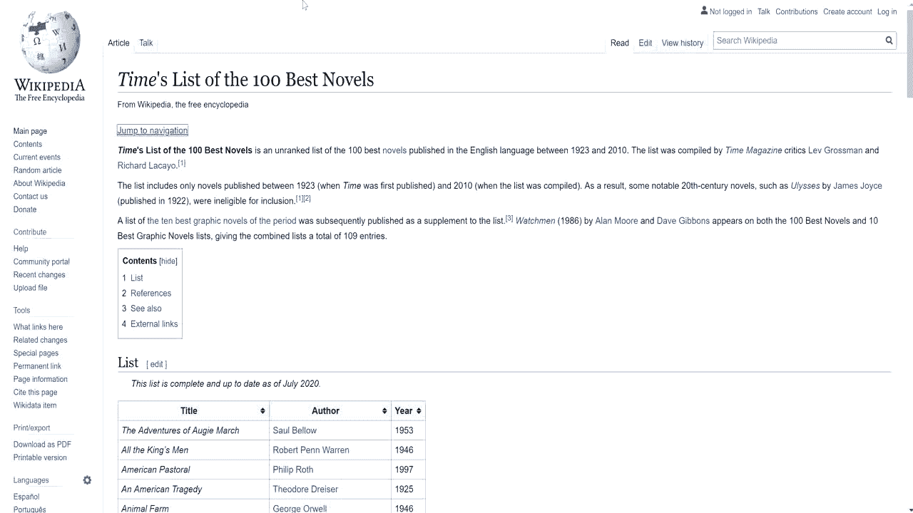
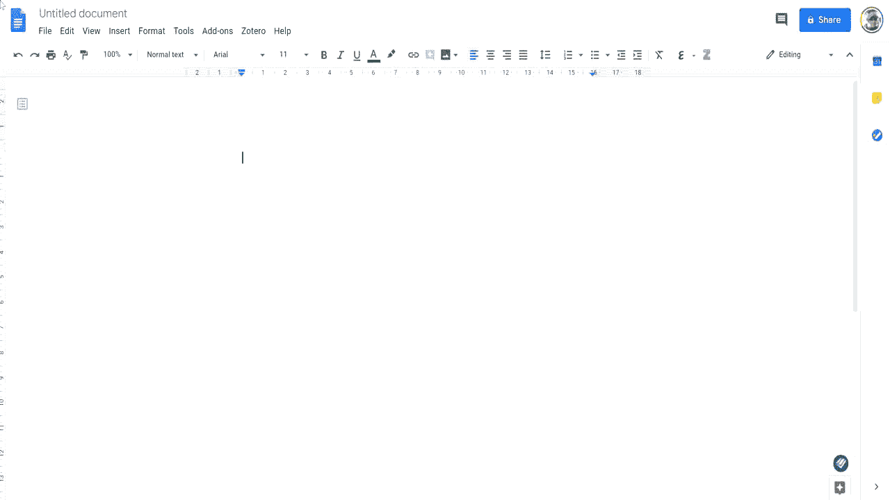
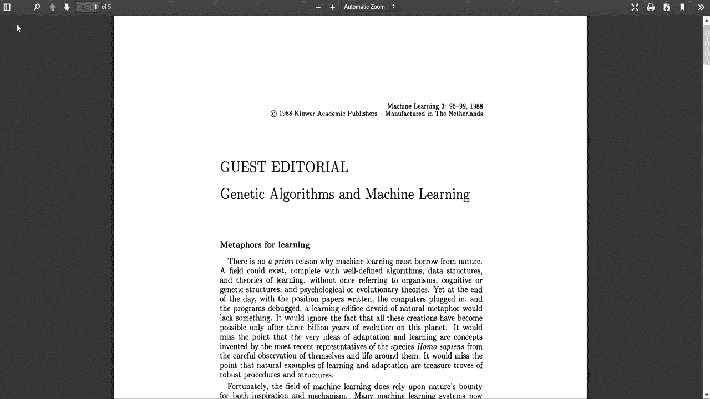

# 5 Chrome 扩展，让您作为数据科学家的生活更加轻松

> 原文：<https://towardsdatascience.com/5-chrome-extension-to-ease-up-your-life-as-a-data-scientist-c5c483605d0d?source=collection_archive---------23----------------------->

## 这些扩展对于流畅的工作流是必须的

照片由来自[佩克斯](https://www.pexels.com/photo/black-google-smartphone-on-box-1482061/?utm_content=attributionCopyText&utm_medium=referral&utm_source=pexels)的[深水人维尔马](https://www.pexels.com/@deepanker70?utm_content=attributionCopyText&utm_medium=referral&utm_source=pexels)拍摄

chrome 扩展是一种奇妙而有用的软件，如果你使用 Chrome，你可以把它添加到你的 Chrome 浏览器中，以加速和方便日常任务。

作为一名数据科学家，您可能需要做一些网络搜集、一些正则表达式匹配或搜索，当然，还要为您的机器学习模型浏览或编写一些数学方程。

你还会读到一些学术论文或报告，你可能会想在工作中引用它们。如果你必须手工完成，所有这些任务都会很麻烦。有时你需要处理电脑上的多个窗口，并在它们之间切换以完成不同的任务。

对我们来说幸运的是，有 chrome 扩展可以让你快速流畅地完成这些任务。

这里是我的**五大** chrome 扩展，让你的工作流程变得更快，没有麻烦或增加工作量。

# №1: DECS —代码片段管理器

当我们编写代码来收集数据、分析数据或清理数据时，我们经常发现自己一遍又一遍地重复相同的代码片段。用于机器学习模型和数据管道的数据处理的脚本通常是固定的。

代码片段管理器是一个 chrome 扩展，设计时考虑到了数据科学家的安全性和生产力。DECS 团队开发这个扩展是为了给开发者提供最大的安全性。CSM 使用默认的加密方案为您的敏感数据(如 API 密钥和数据库凭证)提供全面保护。

## 基本特征

1.  您可以将所有代码片段保存在一个安全的工作区中。
2.  只需轻轻一点，你就可以从网页中存储任何你想要的片段，如堆栈溢出，以供将来使用。
3.  将您所有的凭证、API 密钥和证书存储在安全的加密下，并严格管理它们。

## 用法示例

作者的屏幕录制

# №2:刮刀

当我们开始一个新的数据科学项目时，我们需要经历数据收集阶段。我们经常使用一些网络抓取技术来做到这一点。

 [## 为您的应用选择最佳的 Python Web 抓取库

### 前 5 个库的概述以及何时使用它们。

towardsdatascience.com](/choose-the-best-python-web-scraping-library-for-your-application-91a68bc81c4f) 

Web Scraper 是一个 Chrome 扩展，为你做那些繁琐的数据收集工作。使用这个扩展，你可以制作一个网站地图，帮助你决定如何浏览网站。创建站点地图后，Web Scraper 将遍历站点树并提取您想要的数据。

它可以在几分钟内为你收集、编号、文本和图像数据。Web 抓取可用于各种类型的应用，如品牌监控、电子商务和 web 内容抓取。

## 基本特征

1.  从多个网页抓取和提取数据。
2.  从动态页面抓取数据。
3.  浏览抓取的数据。
4.  将从网站收集的数据导出到 Excel。

## 用法示例

作者的屏幕录制

# №3:等式

处理数学方程总是很麻烦，从写它们到把它们嵌入你的文档。

[方程式](https://chrome.google.com/webstore/detail/equatio-math-made-digital/hjngolefdpdnooamgdldlkjgmdcmcjnc/related?hl=en-US)让处理数学方程式变得轻而易举。它允许你直接在键盘或触摸屏上输入或手写任何数学表达式。一旦你这样做了，你就能以多种格式导出你的方程，而不需要与任何复杂的代码或编程语言交互或编写任何复杂的代码或编程语言。

使用 EquatIO 使数学数字化，帮助各级教师和学生快速轻松地创建数学表达式。

## 基本特征

1.  用最少的努力和打字轻松创建数学方程。
2.  通过键盘或触摸屏接受输入。
3.  允许您输入/提取公式的 LateX 代码。
4.  大声说出你的数学方程式。
5.  将您的方程式导出为一些图像格式，以便以后使用。

## 用法示例

作者的屏幕录制

# №4:提取网络监视器

我们生活在一个信息时代。我们周围的数据，也就是我们经常用来建立数据科学的数据，变化很快。我们总是需要跟上这种变化。

当我们从一个特定的网页中提取信息时，我们通常称之为数据提取自动化。然而，如果页面所有者决定重塑或改革他们的数据，我们的模型将会崩溃。我们需要检查新的网页，并相应地改变我们的模型。

听起来不怎么样，是吧？尤其是当网页被更新或改变时，你必须保持跟踪。

[distilt Web Monitor](https://chrome.google.com/webstore/detail/distill-web-monitor/inlikjemeeknofckkjolnjbpehgadgge?hl=en)通过为我们跟踪特定的网页，为我们省去这些麻烦。该扩展将在您的浏览器中运行，以检查受监控页面的更改。一旦检测到更改，立即获得提醒。

## 基本特征

1.  从任何网页中选择您想要监控的内容。
2.  显示历史变化并突出显示变化。
3.  设置更改后的通知提醒。它支持各种类型的通知，如电子邮件、短信和弹出通知。

## 用法示例

作者的屏幕录制

# №5: MyBib:免费引用生成器

作为一名数据科学家和研究人员，我讨厌跟踪引用，但不喜欢格式化它们。将引文转换成任意格式并不总是一件容易的事情；我们并不都记得不同的风格指南。

[MyBib](https://chrome.google.com/webstore/detail/mybib-free-citation-gener/phidhnmbkbkbkbknhldmpmnacgicphkf/related?hl=en) 以各种类型的样式收集、存储和样式化你的引用，比如 MLA、APA、哈佛、芝加哥等等。您可以将生成的引文直接复制到论文中，或者保存到参考书目中以备后用。

您还可以将它们导出到其他引文管理器中，如 Zotero 或 Mendeley，打印它们，或将其保存为 BibTeX。

## 基本特征

1.  一键直接创建引文。
2.  支持超过 6000 种引用方式。
3.  允许您保存、导出或复制生成的引文。

## 用法示例

作者的屏幕录制

拥有可以帮助用户降低工作量要求的工具总是一件好事。它让我们专注于工作的关键方面，而不是在不太重要的任务上浪费宝贵的时间。

> 先做，再做对，再做得更好。—艾迪·奥斯马尼

 [## Python 中 Web 抓取的分步指南

### 抓取任何有请求和美丽声音的网页

towardsdatascience.com](/a-step-by-step-guide-to-web-scraping-in-python-5c4d9cef76e8)