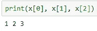
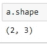

# 5 个常见的 Python 错误以及如何避免它们

> 原文：<https://towardsdatascience.com/5-common-python-errors-and-how-to-avoid-them-63d9afc1a58f?source=collection_archive---------35----------------------->

## 从初学者到专家，每个人在 python 和机器学习中都容易出现这些错误


[JESHOOTS.COM](https://unsplash.com/@jeshoots?utm_source=medium&utm_medium=referral)在 [Unsplash](https://unsplash.com?utm_source=medium&utm_medium=referral) 上拍照

# 简介:

Python 是一种出色的编程语言。它使用简单，并提供有效的结果。集成开发环境(ide)有很多选项，如 Pycharm、visual studio code、Jupyter notebooks 等。即使是简单的 Python IDLE 对于初学者来说也是一个非凡的可解释环境。无论您选择哪种开发，都可能会遇到一些错误。这些错误和问题的发生主要是由于判断失误，缺乏对特定主题的深入了解，或者只是一个可能发生在任何人身上的愚蠢错误。

今天，让我们讨论五个最常见的错误，从初学者到专家，任何人都可能由于缺乏注意力、知识或预防措施而犯这五个错误。我们还将讨论打印的错误类型。然后理解其中的原因以及如何避免特定的错误。所以事不宜迟，让我们从五个最常见的 python 错误以及如何防止它们开始。

# 5 个常见错误及其相应的修复方法:

## 1.缩进—

缩进是指代码行或代码块开头的空格数。这种缩进空格可能出现在条件语句(如 if-else 语句)之后或函数之后。通常的缩进量是使用空格键按钮缩进四个空格，或者按一次 Tab 键。缩进在 python 中非常重要。在其他编程语言(如 C、C++或 Java)中，缩进可以替代花括号“{}”。

你会得到下面的缩进错误—

*   当您忘记在函数或代码块的起始行进行缩进时，就会出现此错误。

```
**IndentationError:** expected an indented block
```

*   当代码块或程序中没有出现缩进时，会出现此错误。当您在所需的代码块中给出两个空格，而该特定行的描述不适合整个代码时，通常会发生这种错误。

```
**IndentationError:** unindent does not match any outer indentation level
```

*   代码中的一行没有与所有其他缩进对齐。

```
**IndentationError:** unexpected indent
```

当您试图盲目地将代码从网站复制并粘贴到您的工作环境中时，也会出现这些错误。这个问题的主要解决方案是确保间距的一致性，并通过查看出现的每个错误的描述来解决这些问题。

## 2.保存与模块名相同的文件名—

当您保存的文件名类似于模块名，并且您正在利用该特定模块调用您各自程序中的函数时，通常会出现此错误。这个错误会导致导入错误，因为您的 python 文件替换了实际存在的库模块。因此，当您试图在运行模块时调用函数时，它根本不起作用。在下面给出的代码块中可以看到这种错误的一个例子。在这里，我将文件保存为 gtts.py，这是我得到的—

```
ImportError: cannot import name 'gTTS' from 'gtts'
```

这个错误有一个简单的修复方法。只是不要将文件名保存为模块名，将会用到它。如果您想保留特定的模块名，只需在文件名末尾添加一个简单的下划线或数字，就可以修复您的错误。😃

要以更简洁的方式理解 gTTS 模块，请查阅我以前的一篇文章。

[](/how-to-get-started-with-google-text-to-speech-using-python-485e43d1d544) [## 如何使用 Python 开始使用 Google 文本到语音转换

### 从零开始的文本到语音转换简介

towardsdatascience.com](/how-to-get-started-with-google-text-to-speech-using-python-485e43d1d544) 

## 3.把括号弄乱—

基本上有三种类型的支架，每种都有特定的用途。方括号“[]”用于列表和索引，花括号“{}”用于字典或集合，圆括号“()”用于元组操作。初学者有可能经常会对要使用的正确括号感到困惑，从而导致一些可能发生的错误。

*   用变量声明列表的一种方法是 a = []。声明列表的另一种方法如下:a = list()。然而，当你把这里的括号搞乱成= list[]，你最终会得到下面的语法错误。

```
**SyntaxError:** invalid syntax
```

*   在处理列表或元组的索引时，我们总是使用方括号“[]”。在使用像 x = [1，2，3]这样的列表或像 x = (1，2，3)这样的元组，并像 x(1)那样写入索引时，将导致以下错误。

```
**TypeError**: 'list' object is not callable
```

或者

```
**TypeError**: 'tuple' object is not callable
```

解决这个问题的简单方法是确保您总是使用方括号来获取特定索引的值。

这个问题可以用 x[1]来解决，你会得到值 2。



## 4.打印数字形状时尝试使用括号—

阐述并稍微深入下一个与前一个非常相似的错误。当你试图利用 numpy 模块进行机器学习时，下一个问题更像是初学者或新手的错误。需要注意的是，numpy 中的 shape 是一个属性，而不是一个函数。它返回一个由 numpy 数组的形状组成的元组。元组中的形状值可以通过寻址所需上下文的相应索引来访问。理解此错误的示例如下。

这会导致以下错误。

```
**TypeError**: 'tuple' object is not callable
```

解决这个问题的简单方法是使用不带括号的 a.shape。此修复将提供实现完美解决方案所需的精确结果。



## 5.局部和全局变量—

局部变量是在特定代码块或代码语句中定义的变量。这个局部变量只能在那个特定的代码块中访问，而不能在其他地方访问。形式参数标识符也表现为局部变量。这些也是在函数中被定义为虚拟变量的变量。

全局变量是在主程序中定义的，而不是在函数或特定代码中定义的。这个变量在整个程序中都是可访问的。试图访问主程序中的局部变量时出现名称错误。

```
**NameError**: name 'x1' is not defined
```

最好的办法是在代码块中使用局部变量，如果你想在整个程序中使用这个变量，那么就使用全局变量格式。


照片由 [Nghia Le](https://unsplash.com/@lephunghia?utm_source=medium&utm_medium=referral) 在 [Unsplash](https://unsplash.com?utm_source=medium&utm_medium=referral) 上拍摄

# 结论:

这是我在开始学习 python 和机器学习时最常犯的五个错误。我毫不羞愧地承认，即使在今天，我偶尔也会弄糟这些愚蠢的事情。然而，我希望我们都了解了这些错误发生的原因，以及如何准确地预防它们。希望我们将来都能避免这些错误。至少，不要被卡住，跳到堆栈溢出来寻找解决问题的方法。如果我遗漏了从初学者到专家的任何其他常见错误，请告诉我，我将确保在下一篇文章中涵盖这些错误。

我强烈建议所有观众看看下面两篇文章，开始你掌握机器学习的旅程。它们将不断更新，本系列将从头开始涵盖与 python 进行机器学习相关的每个主题和算法。

[](/starting-your-journey-to-master-machine-learning-with-python-d0bd47ebada9) [## 开始使用 Python 掌握机器学习的旅程

### 了解精通机器学习的基本要求

towardsdatascience.com](/starting-your-journey-to-master-machine-learning-with-python-d0bd47ebada9) [](/basics-of-python-and-its-library-modules-required-for-machine-learning-51c9d26026b8) [## 机器学习所需的 Python 基础知识及其库模块

### 学习 python 数据结构的基础知识，对机器所需的每个库有直观的理解…

towardsdatascience.com](/basics-of-python-and-its-library-modules-required-for-machine-learning-51c9d26026b8) 

感谢大家阅读这篇文章。祝大家度过美好的一天！