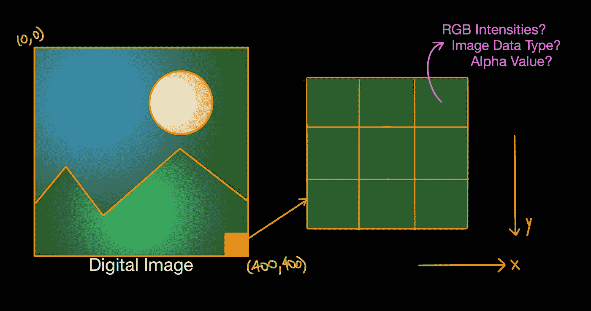
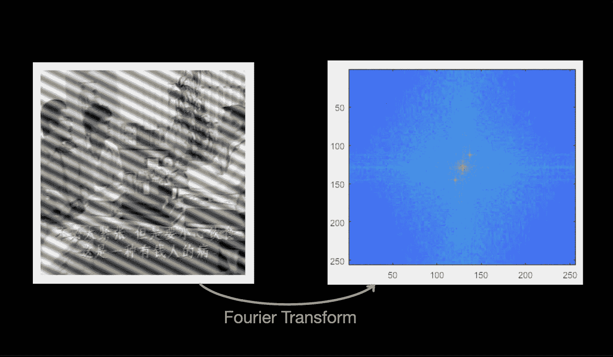
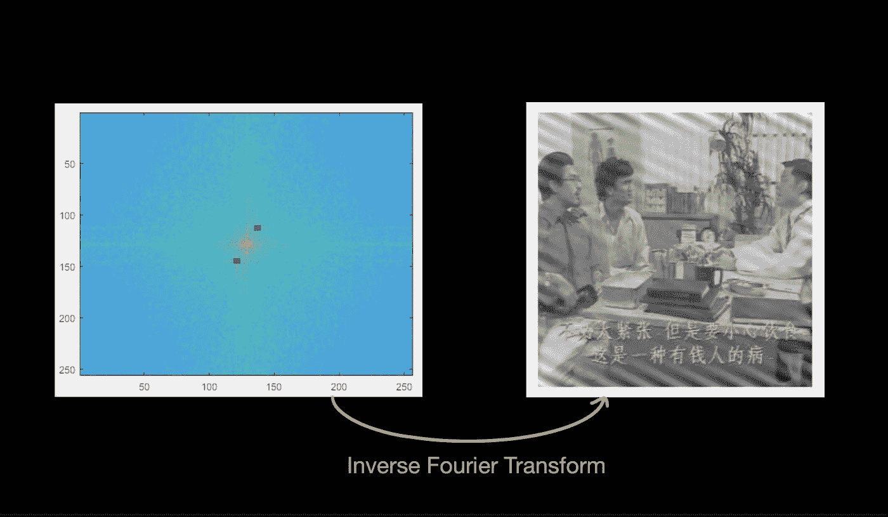
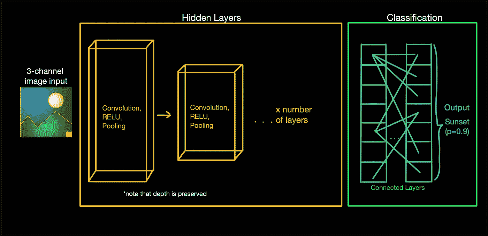

# 5 计算机视觉和深度学习基础

> 原文：<https://towardsdatascience.com/5-computer-vision-and-deep-learning-fundamentals-f2b5f697dde9?source=collection_archive---------35----------------------->

## 需要更好地理解最新的 CV & DL 项目是如何工作的

马里乌斯·马萨拉尔在 [Unsplash](https://unsplash.com?utm_source=medium&utm_medium=referral) 上的照片

当我整理我以前的深度技术项目列表，然后谈论每个项目时，我意识到，编写一个简单易懂的指南，涵盖计算机视觉和深度学习的基础知识，以便非技术读者可以更好地了解最新的深度技术项目，这可能是一个好主意。第一部分是关于图像处理的基础知识(传统的计算机视觉技术，今天仍然适用)，然后第二部分是深度学习的相关内容:)

## 为什么计算机视觉很重要？

我个人把它理解为我们所知的虚拟世界和物理世界之间的桥梁。正是我们植入机器的眼睛让它们“获得意识”并以前所未有的智能方式导航我们的世界。它实际上用于:

*   机器人，
*   自动驾驶汽车，
*   智能商店(像[亚马逊 Go](https://www.amazon.com/b?ie=UTF8&node=16008589011) )，
*   优化营销内容，
*   面部识别应用，
*   医疗成像/手术、军事、娱乐等行业

现在有大量其他计算机视觉项目正在进行，毫无疑问，计算机视觉应用将激增，然后无缝集成到我们的日常生活中——改变我们的生活方式。所以废话不多说，

我们开始吧！ᕙ(^▿^-ᕙ)

## 数字图像基础

作者创建的图像

参考上图，假设我们有一个尺寸为 400 x 400 的数字图像，这意味着我们的图像是 400 像素行(x 方向)和 400 像素列(y 方向)。所以数字图像是用二维矩阵来表示的。每个单独的像素将包含信息(如强度、数据类型、alpha 值等)，计算机将理解如何基于这些信息解释或处理图像。

## 传统计算机视觉

自 20 世纪 70 年代以来，计算机视觉算法就已经存在，图像操作大体上可以分为两个主要类别— **空间域**和**频域**。了解哪些图像处理方法是可用的可能是有帮助的，因此可以在将图像馈送到深度学习算法之前进行图像预处理，以便产生更好的结果。

**空间域方法** —我们按原样处理数字图像(原始数字图像已经在空间域中)。参考上图，因为每个像素都包含一组特定的信息，所以我们可以基于特定的技术来操作和更改这些信息，以获得特定的结果。方法包括:

*   点处理变换(对图像的每个单独像素应用变换函数)，
*   区域/掩模处理变换(对图像中的像素邻域应用变换函数)，
*   几何变换(如旋转、缩放和扭曲)，
*   帧处理转换(输出像素值是基于涉及两个或更多图像的操作生成的)

**频域方法** —与空间域方法不同，我们首先将图像转换为频率分布(使用傅立叶变换、拉普拉斯变换或 z 变换等方法)，然后处理图像。在这之后，我们执行逆变换，然后在空间域中得到新的图像。

作者的图表，左边的图片取自作者在 CZ4003 课程中的作业

如果我们看上面的图表，我们可以看到左边的原始数字图像非常嘈杂(对角线穿过图像)。如果我们对该图像应用傅立叶变换，我们可以看到右侧的图像(应用了 fftshift，因此零频率分量位于阵列中心)在图像中间有亮点(“峰值”)。这些峰值对应于左边的噪声模式(那些穿过图像的对角线/边缘)。

作者的图表，右边的图片取自作者在 CZ4003 课程中的作业

如果我们将这些亮点的强度设置为 0，然后进行傅里叶逆变换，我们可以看到一些对角线(噪声)逐渐消失。

如本例所示，我们可以利用图像处理技术(空间域方法或频率域方法)首先对图像进行预处理，然后再将其输入到深度学习模型中。此外，一些最流行的传统计算机视觉技术包括:

*   突出边缘、线条和显著区域的图像过滤和变换技术，
*   尺度不变特征变换( [SIFT](https://opencv-python-tutroals.readthedocs.io/en/latest/py_tutorials/py_feature2d/py_sift_intro/py_sift_intro.html) )，
*   加快了健壮的功能( [SURF](https://opencv-python-tutroals.readthedocs.io/en/latest/py_tutorials/py_feature2d/py_surf_intro/py_surf_intro.html) )，
*   来自加速分段测试([快速](https://opencv-python-tutroals.readthedocs.io/en/latest/py_tutorials/py_feature2d/py_fast/py_fast.html#theory))的特征，
*   二元鲁棒独立基本特征([简称](https://opencv-python-tutroals.readthedocs.io/en/latest/py_tutorials/py_feature2d/py_brief/py_brief.html))，
*   定向快速旋转简报([圆球](https://opencv-python-tutroals.readthedocs.io/en/latest/py_tutorials/py_feature2d/py_orb/py_orb.html))

我已经包含了链接，所以你可以点击它，阅读更多关于每个算法。接下来，我们将看看一些常见的计算机视觉任务，如果传统的计算机视觉技术不足以解决问题，深度学习可以帮助我们(并且正在该领域广泛探索)。

## 具有深度学习的计算机视觉

简而言之，深度学习是受人脑神经网络的启发和松散建模的——神经元相互连接，接收一些输入，然后根据权重和偏差值发出输出。深度学习帮助我们完成的常见计算机视觉任务包括——图像分类、定位/显著性检测、对象识别、检测和跟踪、人脸识别、场景理解、图像生成和图像分析。一些最流行的深度学习技术(监督、非监督、半监督)包括:

*   卷积神经网络(CNN，或 ConvNet)，
*   生成对抗网络(GAN)，
*   深度信念网络(DBNs)和深度波尔兹曼机器(DBMs)，
*   堆叠式自动编码器，
*   深度强化学习(DRL)，

还有很多。我将尝试快速概述卷积神经网络(CNN)的工作原理(以使本文相对简短易读)。如果你想了解更多关于其他深度学习技术的信息，请尝试谷歌搜索——甘真的很酷，这是人们试图用来产生艺术的东西:)无论如何，这里是(CNN):

作者图片——还有其他更好的图表和解释，比如([链接](https://adeshpande3.github.io/adeshpande3.github.io/A-Beginner's-Guide-To-Understanding-Convolutional-Neural-Networks/)、[链接](https://machinelearningmastery.com/object-recognition-convolutional-neural-networks-keras-deep-learning-library/))

简而言之，这就像通过一系列“东西”(更具体地说是卷积层、RELU 层、汇集或下采样层，然后是全连接层*例如*)来传递一系列数字图像，这些层将提取和学习关于图像的最重要信息，然后建立神经网络模型。然后，一旦这个模型被训练，我们可以通过这个模型传递测试图像，如果这个模型产生良好的结果，它应该能够预测它是什么。如果你不想训练你自己的模型，网上也有各种预训练的模型。

稍微不相干的旁注——我仍然记得在学校图书馆用 [**Google Collab**](https://colab.research.google.com/notebooks/intro.ipynb#recent=true) 训练一个神经网络模型，然后因为他们不得不关门而把我赶出去的时候，我就站在图书馆门口等待我的模型完成训练，因为我需要无线网络(ㆆ_ㆆ).所以，重点是，如果你没有硬件(比如 GPU)来训练你的模型，你可以考虑谷歌协作笔记本。你只需要无线网络。

关于数据集的快速说明—通常，我们使用数据集来训练、验证和测试我们的模型。使用的流行数据集:

*   COCODataset(查看他们的[演示](https://github.com/cocodataset/cocoapi/blob/master/PythonAPI/pycocoDemo.ipynb)
*   CIFAR-10 或 CIFAR-100(链接[此处](https://www.cs.toronto.edu/~kriz/cifar.html))
*   MNIST(手写数字，链接[此处](http://yann.lecun.com/exdb/mnist/))
*   时尚 MNIST(链接[此处](https://www.kaggle.com/zalando-research/fashionmnist))
*   ImageNet(链接[此处](http://www.image-net.org/))
*   IMDB-Wiki 数据集(链接[此处](https://data.vision.ee.ethz.ch/cvl/rrothe/imdb-wiki/))
*   打开图像(链接[此处](https://storage.googleapis.com/openimages/web/factsfigures.html))
*   更详尽的名单，请点击[这里](https://computervisiononline.com/datasets)

本文到此为止！正如在各种文章中提到的，我认为将传统的计算机视觉方法与深度学习技术相结合将更好地帮助我们解决我们的计算机视觉问题。此外，我知道你们中的一些可爱的读者是深度技术研究人员和从业者，他们比我更有经验和经验——如果有任何需要纠正的地方或您对此有任何想法，请随时告诉我。

快乐的计算机视觉！