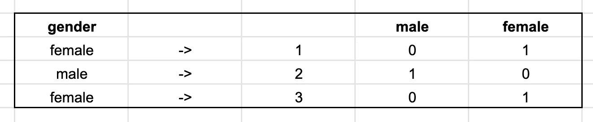

# 每个数据科学家都应该知道的 5 个概念

> 原文：<https://towardsdatascience.com/5-concepts-every-data-scientist-should-know-16c74d080a83?source=collection_archive---------21----------------------->

## 意见

## 多重共线性、编码、抽样、误差和故事讲述。


照片由[un splash](https://unsplash.com/s/photos/error?utm_source=unsplash&utm_medium=referral&utm_content=creditCopyText)【1】上的[rom son preech wit](https://unsplash.com/@woodies11?utm_source=unsplash&utm_medium=referral&utm_content=creditCopyText)拍摄。

# 目录

1.  介绍
2.  多重共线性
3.  一键编码
4.  抽样
5.  误差度量
6.  讲故事
7.  摘要
8.  参考

# 介绍

我已经写了一些数据科学家在职业生涯中可能会用到的常用技能，所以现在我想强调一些数据科学的关键概念，这些概念对了解和以后使用会有所帮助。我可能正在讨论一些你已经知道的，和一些你不知道的；我的目标是提供一些专业的解释，为什么这些概念是有益的，不管你现在知道什么。多重共线性、一键编码、欠采样和过采样、误差指标，最后，讲故事，是我在考虑专业数据科学家的日常*时首先想到的关键概念。最后一点可能是技能和概念的结合，但我仍然想强调它对作为数据科学家的日常工作生活的重要性。我将在下面阐述所有这些概念。*

# 多重共线性


Unsplash 上创意交流的照片[2]。

虽然这个词有些长，不好说，但是当你把它分解开来，多重共线性就简单了。多意味着多，共线性意味着线性相关。多重共线性可以描述为两个或多个解释变量解释相似信息或在回归模型中高度相关的情况。这个概念引起关注有几个原因。

> 对于某些建模技术，它会导致过度拟合，最终导致模型性能下降。

数据变得冗余，并且模型中不需要每个特征或属性。因此，有一些方法可以找出应该移除哪些构成多重共线性的要素。

*   *方差膨胀因子(VIF)*
*   *相关矩阵*

这两种技术在数据科学家中普遍使用，尤其是相关矩阵和图——通常以某种热图的形式可视化，而 VIF 则鲜为人知。

> VIF 值越高，要素对回归模型越不可用。

对 VIF 来说，一个伟大而简单的资源是:

[](https://www.statisticshowto.com/variance-inflation-factor/) [## 差异通货膨胀系数-统计方法

### 统计定义>方差膨胀因子您可能想先阅读这篇文章:什么是多重共线性…

www.statisticshowto.com](https://www.statisticshowto.com/variance-inflation-factor/) 

# 一键编码

模型中这种形式的特征转换被称为一键编码。您希望通过对分类特征进行编码来用数字表示它们。尽管分类特征本身具有文本值，但一键编码会转置该信息，以便每个值都成为特征，并且行中的观察值被表示为 0 或 1。例如，如果我们有分类变量*性别*，一键编码后的数字表示看起来像这样(之前是*性别*，之后是*男/女*):



一键编码前后。作者截图[4]。

当您不仅要处理数字特征，还需要创建带有文本/分类特征的数字表示时，这种转换非常有用。

# 抽样

当你没有足够的数据时，*过采样*可能被建议作为一种补偿形式。假设您正在处理一个分类问题，并且您有一个少数民族类，如下例所示:

```
class_1 = 100 rowsclass_2 = 1000 rowsclass_3 = 1100 rows
```

如您所见， *class_1* 的数据量很少，这意味着您的数据集是不平衡的，将被称为少数类。有几种过采样技术。其中一种叫做[SMOTE](https://imbalanced-learn.readthedocs.io/en/stable/generated/imblearn.over_sampling.SMOTE.html)【5】，代表 ***合成少数过采样技术*** 。SMOTE 工作的方式之一是利用 *K-neighbor* 方法寻找最近邻来创建合成样本。对于欠采样，有类似的技术使用相反的方法*。*

当您的类或回归数据中存在异常值，并且您希望确保您的采样是您的模型将来运行的数据的最佳表示时，这些技术非常有用。

# 误差度量

在数据科学中，分类和回归模型都使用了大量的误差指标。根据 sk learn【6】，这里有一些你可以专门用于回归模型的:

`[**metrics.explained_variance_score**](https://scikit-learn.org/stable/modules/generated/sklearn.metrics.explained_variance_score.html#sklearn.metrics.explained_variance_score)`

`[**metrics.max_error**](https://scikit-learn.org/stable/modules/generated/sklearn.metrics.max_error.html#sklearn.metrics.max_error)`

`[**metrics.mean_absolute_error**](https://scikit-learn.org/stable/modules/generated/sklearn.metrics.mean_absolute_error.html#sklearn.metrics.mean_absolute_error)`

`[**metrics.mean_squared_error**](https://scikit-learn.org/stable/modules/generated/sklearn.metrics.mean_squared_error.html#sklearn.metrics.mean_squared_error)`

`[**metrics.mean_squared_log_error**](https://scikit-learn.org/stable/modules/generated/sklearn.metrics.mean_squared_log_error.html#sklearn.metrics.mean_squared_log_error)`

`[**metrics.median_absolute_error**](https://scikit-learn.org/stable/modules/generated/sklearn.metrics.median_absolute_error.html#sklearn.metrics.median_absolute_error)`

`[**metrics.r2_score**](https://scikit-learn.org/stable/modules/generated/sklearn.metrics.r2_score.html#sklearn.metrics.r2_score)`

`[**metrics.mean_poisson_deviance**](https://scikit-learn.org/stable/modules/generated/sklearn.metrics.mean_poisson_deviance.html#sklearn.metrics.mean_poisson_deviance)`

`[**metrics.mean_gamma_deviance**](https://scikit-learn.org/stable/modules/generated/sklearn.metrics.mean_gamma_deviance.html#sklearn.metrics.mean_gamma_deviance)`

从上面回归的两个最流行的误差度量是 MSE 和 RMSE:

**MSE:** 概念是→平均绝对误差回归损失(sklearn)

**RMSE:** 概念是→均方误差回归损失(sklearn)

> 对于分类，您可以使用准确性和 AUC(曲线下面积)来评估模型的性能。

# 讲故事


照片由[农旺](https://unsplash.com/@californong?utm_source=unsplash&utm_medium=referral&utm_content=creditCopyText)在[Unsplash](https://unsplash.com/s/photos/story?utm_source=unsplash&utm_medium=referral&utm_content=creditCopyText)【7】拍摄。

我想添加一个独特的数据科学概念，那就是讲故事。我怎么强调这个概念的重要性都不为过。它可以被视为一种概念或技能，但这里的标签并不重要，重要的是你在商业环境中如何清晰地表达你的问题解决技巧。许多数据科学家将只关注模型的准确性，但却无法理解整个业务流程。该流程包括:

*   *是什么生意？*
*   *什么问题？*
*   *我们为什么需要数据科学？*
*   *这里数据科学的目标是什么？*
*   我们什么时候能得到可用的结果？
*   我们如何应用我们的结果？
*   *我们的结果有什么影响？*
*   *我们如何分享我们的结果和整体流程？*

如你所见，这些点都不是模型本身/准确性的提高。这里的重点是你将如何使用数据来解决你公司的问题。熟悉利益相关者和你最终将与之共事的非技术同事是有益的。您还将与产品经理一起工作，他们将与您一起评估问题，并与数据工程师一起在运行基本模型之前收集数据。在建模过程结束时，您将与关键人员分享您的结果，这些人通常希望看到模型的影响，最有可能是某种视觉表现形式( *Tableau、Google 幻灯片等)。*)，所以能够展示和交流也是有益的。

# 摘要

数据科学家和机器学习工程师应该知道很多关键概念。本文中讨论的五种方法是:

```
MulticollinearityOne-hot encodingSamplingErrorStorytelling
```

*请在下面随意评论一些您日常关注的数据科学概念，或者您认为其他人应该了解的概念。感谢你阅读我的文章，希望你喜欢！*

下面是一些参考资料和链接，可以提供关于本文中讨论的主题的更多信息。

> 我还想强调我写的与本文相关的另外两个故事[8]和[9]:

[](/5-common-skills-data-scientists-should-know-3247b2b12318) [## 数据科学家应该知道的 5 项常用技能

### 仔细看看我作为数据科学家所使用的流行技能。

towardsdatascience.com](/5-common-skills-data-scientists-should-know-3247b2b12318) [](/5-professional-projects-every-data-scientist-should-know-e89bf4e7e8e1) [## 每个数据科学家都应该知道的 5 个专业项目

### 客户细分、文本分类、情感、时间序列和推荐系统。

towardsdatascience.com](/5-professional-projects-every-data-scientist-should-know-e89bf4e7e8e1) 

这两篇文章强调了作为一名专业数据科学家，您需要了解或熟悉并期望最终聘用的关键技能和项目。

# 参考

[1]照片由[罗姆森·普里查维特](https://unsplash.com/@woodies11?utm_source=unsplash&utm_medium=referral&utm_content=creditCopyText)在[Unsplash](https://unsplash.com/s/photos/error?utm_source=unsplash&utm_medium=referral&utm_content=creditCopyText)(2020)拍摄

[2]照片由[在](https://unsplash.com/@thecreative_exchange?utm_source=unsplash&utm_medium=referral&utm_content=creditCopyText) [Unsplash](https://unsplash.com/s/photos/same?utm_source=unsplash&utm_medium=referral&utm_content=creditCopyText) 上的创意交流(2018)

[3]统计如何，[方差膨胀系数](https://www.statisticshowto.com/variance-inflation-factor/)，(2020)

[4] M.Przybyla，一键编码截图，(2020 年)

[5] G .勒迈特，f .诺盖拉，d .奥利维拉，c .阿里达斯修订版 12b2e0d2， [imblearn.over_sampling。击打](https://imbalanced-learn.readthedocs.io/en/stable/generated/imblearn.over_sampling.SMOTE.html)，(2016–2017)

[6] scikit-learn 开发者， [3.3。度量和评分:量化预测质量](https://scikit-learn.org/stable/modules/model_evaluation.html)(2007–2020)

[7]照片由[农旺](https://unsplash.com/@californong?utm_source=unsplash&utm_medium=referral&utm_content=creditCopyText)在[un splash](https://unsplash.com/s/photos/story?utm_source=unsplash&utm_medium=referral&utm_content=creditCopyText)(2018)上拍摄

[8] M.Przybyla，[每个数据科学家都应该知道的 5 个通用技能](http://3247b2b12318)，(2020)

[9] M.Przybyla，[每个数据科学家都应该知道的 5 个专业项目](http://e89bf4e7e8e1)，(2020)