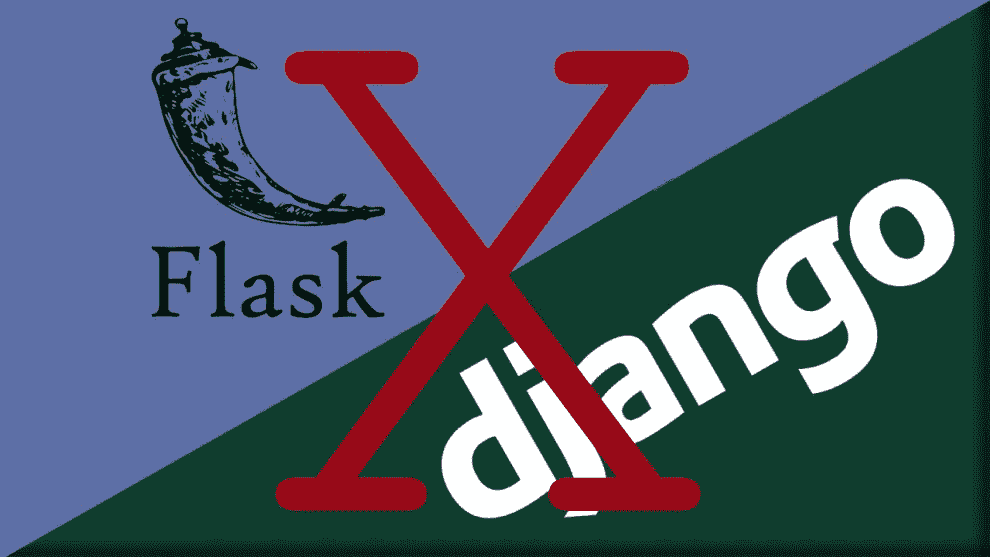

# 用于部署端点和 FullStack 的 Django 和 Flask 的 5 个很酷的替代方案

> 原文：<https://towardsdatascience.com/5-cool-alternatives-to-django-and-flask-for-deploying-endpoints-5c99a066696?source=collection_archive---------12----------------------->

## 不用 Flask 或 Django 部署 API 的有用框架。



(烧瓶标识 src =[https://palletsprojects.com/p/flask/](https://palletsprojects.com/p/flask/)姜戈标识 src =[https://www.djangoproject.com/](https://www.djangoproject.com/)

如果你曾经用 Python 部署过一个端点或者创建过一个网站，那么你很可能听说过 Flask 和 Django。Flask 和 Django 是 Python 中的行业标准，几乎可以用 Python 中的 HTTP 协议做任何事情。Flask 通常用于不需要太多功能的轻量级应用，而 Django 填补了 web 应用领域的空白。两者都是很好的工具，但是在一些特殊的环境下，使用类似的 web 框架而不保留 Flask 和 Django 的特性会更好。

# 瓶子


(src =[https://bottlepy.org/](https://bottlepy.org/))

Bottle 是 Python 中一个非常轻量级的 WSGI 微框架。它是在麻省理工学院的许可下出版的，修改和发布完全免费。使用 Bottle 的一个很大的优点是，它存储在一个单独的小 Python 模块中，没有依赖性。当您准备好部署 API 时，这使得事情变得极其简单和无缝。

我真正喜欢瓶子的一点是它非常容易使用和轻便，没有像 Flask 和 Django 那样的额外绒毛。有时候，极简主义是关键，Django 和 Flask 有时会因为一个小 API 的所有动态部分开始发挥作用而变得有点势不可挡。轻量级的另一个显著优势是 Bottle 的内置服务器。Bottle 自带网络服务器，这意味着不需要配置 Gunicorn3，但这并不是说你不能使用 Gunicorn3。Bottle 支持 Paste、fapws3、gae 或任何其他 WSGI 兼容的服务器。

在语法方面，Bottle 模糊了其自身和 Flask 之间的相似性，只有很少的语法差异。例如，Hello world:

```
**from** **bottle** **import** route, run, template

**@route**('/hello/<name>')
**def** index(name):
    **return** template('<b>Hello {{name}}</b>!', name=name)

run(host='localhost', port=8080)
```

# 涡轮齿轮


(https://turbogears.org/)

我喜欢使用的另一个很酷的 web 框架是 GNU TurboGears。坦白地说，我喜欢 TurboGears，部分原因是它是在 GNU GPL 许可证版本 2 下发布的，但这并不是说 TurboGears 不是一个很好的框架。奇怪的是，TurboGears 实际上是建立在其他几个框架之上的，包括 Django 和 Rails。也就是说，TurboGears 离类似 Bottle 的东西只有一步之遥，当然它的位置更像 Django。

TurboGears 被设计成一个全栈框架，当然也应该这样使用。TurboGears 的一大优点是它的可扩展性，可以使用各种简单的 WSGI 插件来扩展这个框架。此外，它还支持水平数据分区或分片。从语法上来说，TurboGears 可能与任何 Python 程序员所习惯的完全不同。代码倾向于更加关注面向对象的范例，这是一种与大多数其他框架完全不同的方法。例如，这里是 hello world:

```
**from** **tg** **import** expose, TGController

**class** **RootController**(TGController):
    **@expose**()
    **def** index(self):
        **return** 'Hello World'
**from** **tg** **import** MinimalApplicationConfigurator

config = MinimalApplicationConfigurator()
config.update_blueprint({
    'root_controller': RootController()
})
**from** **wsgiref.simple_server** **import** make_server

print("Serving on port 8080...")
httpd = make_server('', 8080, application)
httpd.serve_forever()
```

# web2py


(src =[http://www.web2py.com/](http://www.web2py.com/)

Web2py 是这个列表中的一个框架，我想我们都很熟悉。Web2py 是另一个主要关注全栈方面的模块。然而，与 bottle 类似，Web2py 在 Python 标准库之外没有依赖关系。Web2py 给我留下深刻印象的是，它能够完成与 Django 和 TurboGears 等框架类似的目标，同时更加轻量级和易于使用。Web2py 是在 GNU GPL 版本 3 许可下发布的，这意味着您可以使用它做任何事情，而不必担心许可问题。

Web2py 的卖点很可能是它的全功能 IDE，它允许你在部署后从任何浏览器修改你的网站。考虑到这一点，使用这个软件的主要优势就是你可以用它快速地进行创作。与 Django 和类似的框架相比，Web2py 无疑要简单和快捷得多，但是以我的经验来看，与更现代的选择相比，它可能有点欠缺和过时。


(https://cherrypy.org/的 src =

CherryPy 是另一个我非常喜欢的框架，可能是我在这个列表中最喜欢的。

> (在樱桃和瓶子之间)

CherryPy 以一种更类似于 TurboGears 的方式来处理 web 开发，但是以一种更类似于 Bottle 的方式来处理方法论。CherryPy 轻得令人难以置信，被认为是极简主义的 web 框架。尽管它很轻，但是 CherryPy 仍然设法塞进了许多非常有用的特性，包括认证、会话和缓存等等。CherryPy 还拥有一个有趣而独特的插件系统，可操作性极强…嗯…

> 一切！

CherryPy 是在 FreeBSD 许可下许可的， **BSD 许可**是一种低限制类型的**许可**用于开源软件，不要求再分发，这意味着与大多数其他框架类似，它是免费和开放使用的。与 TurboGears 相似，CherryPy 采用非常面向对象的方法进行 web 开发。这里是 hello world:

```
import cherrypy

class HelloWorld(object):
    **@cherrypy.expose**
    def index(self):
        return "Hello World!"

cherrypy.quickstart(HelloWorld())
```

# 堂吉诃德（西班牙作家塞万提斯所著《堂吉诃德》中的主人公）

堂吉诃德是另一个与面向对象范式紧密结合的框架。该框架主要关注速度和灵活性，但是很难进入。堂吉诃德并没有强制执行表示逻辑和“后端”逻辑的分离。这可以看做是优点也可以看做是缺点。我要说的是，这个框架是高度可操作的，但与 Python 程序员可用的其他选项相比，肯定要难用得多。

这个框架会遇到的另一个问题是，

> 缺少文档。

鉴于这些缺点，我想说这个框架只推荐给需要从头开始构建的应用程序。尽管由于构建时间的原因，它可能不适合很多应用程序，但它肯定有自己的位置，并且能够以其他框架无法完成的方式完成工作。

# 结论

虽然 Flask 和 Django 肯定是很棒的工具，但我认为看看竞争对手也很棒，因为偶尔拥有灵活性肯定会派上用场。我在框架中寻找的东西不一定是其他人寻找的东西，也可能完全取决于我想要创建的东西。毫无疑问，这个列表中我最喜欢的是 CherryPy，因为我经常寻找一个非常轻量级的选项，因为我通常使用 Pythonic web 框架。我的大部分 web 部署都是简单的 API，不需要大量的维护或代码，但同时需要足够安全和稳定，以根据需要提供数据，CherryPy 非常适合这一点。我很想知道其他工程师在他们的框架中寻找什么，他们会选择哪一个。Web 框架可能不是地球上最复杂的东西，但是拥有一个好的框架肯定会让你的生活简单很多！