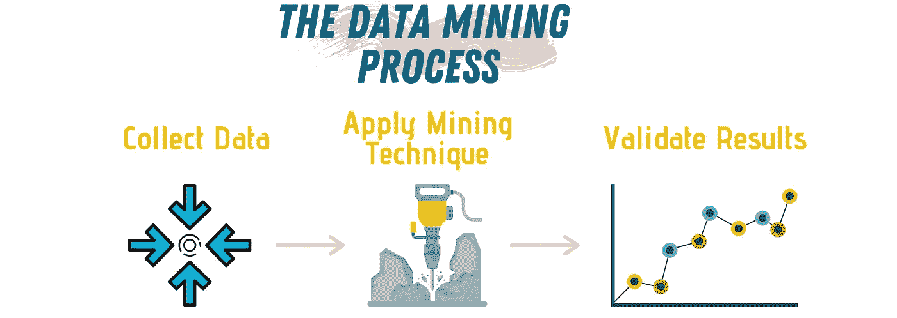
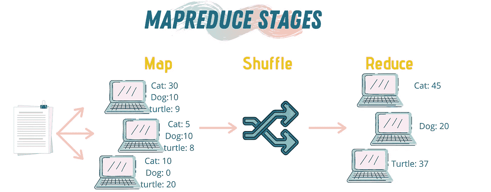
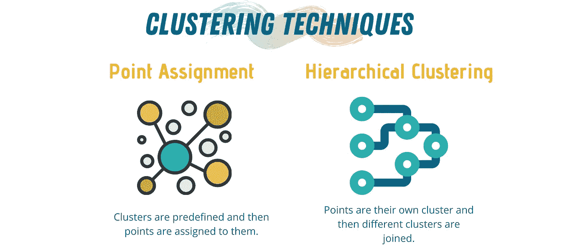
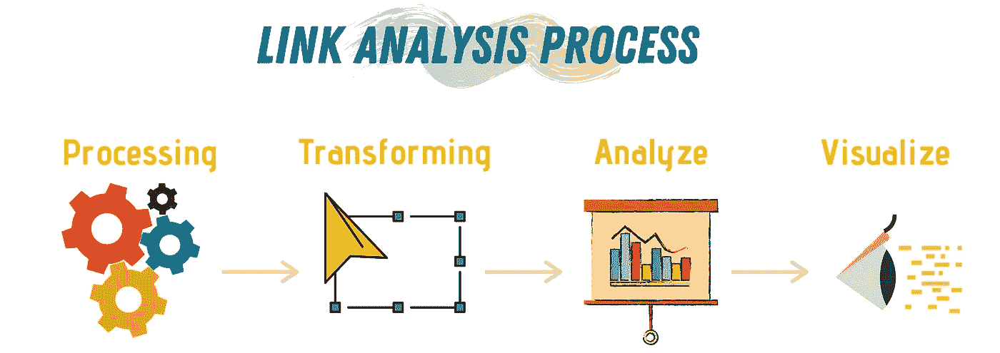
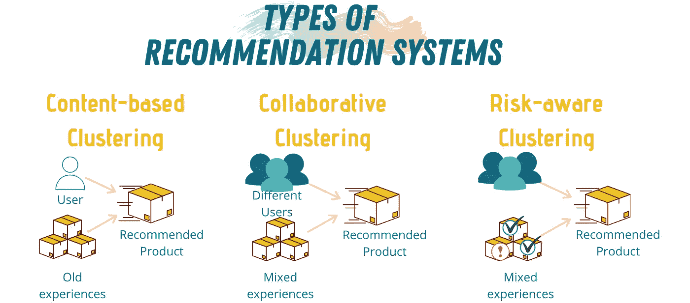
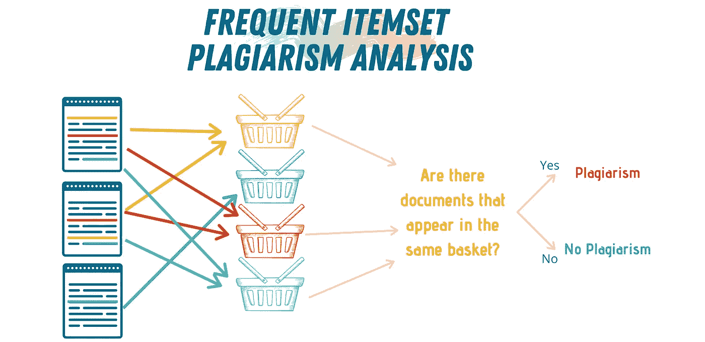

# 每个数据科学家都应该知道的 5 种数据挖掘技术

> 原文：<https://towardsdatascience.com/5-data-mining-techniques-every-data-scientist-should-know-be06426a4ed9?source=collection_archive---------14----------------------->

## 如何在混乱中找到模式？

来自 [Pexels](https://www.pexels.com/photo/code-projected-over-woman-3861969/?utm_content=attributionCopyText&utm_medium=referral&utm_source=pexels) 的 [ThisIsEngineering](https://www.pexels.com/@thisisengineering?utm_content=attributionCopyText&utm_medium=referral&utm_source=pexels) 摄影

数据科学是跨学科领域之一。作为一名数据科学家，你需要具备一些数学和统计学的基础知识，以及一些基本的编程技能。你还需要了解一些商业和科学传播知识，以便能够将你的工作传递给更广泛的受众。最重要的是，你需要对模式和趋势有敏锐的眼光。

为了通过数学和计算算法找到模式和异常，对大量原始数据进行结构化、分析和公式化的过程被称为 ***数据挖掘*** 。

作者图片(使用 [Canva](https://www.canva.com/) 制作)

每个想要在职业生涯中更进一步并获得强大技能的数据科学家都需要——至少——了解数据挖掘的基础知识。通过学习数据挖掘技术，人们可以利用这些知识来产生新的见解和发现新的趋势。

挖掘数据的过程可以分为三个主要部分:收集、收集和清理数据，对数据应用数据挖掘技术，以及验证该技术的结果。

 [## 数据科学统计学

### 分析、预测和分类

towardsdatascience.com](/statistics-in-data-science-8ee52459e282) 

有许多技术可以用来执行数据挖掘，然而，在本文中，我将重点关注个人和大公司现在使用的*五大数据挖掘技术*。我们将介绍的技术包括:

1.  MapReduce。
2.  聚类。
3.  链接分析。
4.  推荐系统。
5.  频繁项目集分析。

# MapReduce

作者图片(使用 [Canva](https://www.canva.com/) 制作)

**MapReduce** 是一个用于并行收集和处理大量数据集的编程模型和实现。换句话说，MapReduce 接受一些数据块，将其划分到不同的硬件上进行处理，然后从所有硬件上收集信息并得出结论。

MapReduce 在不同领域都有应用，例如奇异值分解(SVD)、文档聚类、统计机器翻译和各种机器学习应用。像谷歌这样的大公司已经起诉 MapReduce 通过替换更新索引的特别程序并对结果进行不同的分析来重新生成它的 WWW 索引。

MapReduce 程序由三个步骤组成:

1.  ***一个贴图步骤:*** 执行过滤和排序。这一步的结果是一组*(键，值)*对，它们代表我们试图挖掘的数据的映射。
2.  ***混洗步骤*** :混洗状态作为 map 和 reduce 状态之间的中间状态。它唯一的工作是对(key，value)集合进行排序，以便 reduce 阶段获得所有相同的键。
3.  ***一个* *减少步骤:*** 执行一个汇总操作(比如统计同一个键的不同值)。

使用 MapReduce 的一个例子是试图统计大量文档中出现的单词。在这种情况下要做的是，将文档划分到不同的计算机上。所以，如果我们有 10，000 个文档和 10 台计算机，每台计算机将分析 1000 个文档。

我必须提到，通常在地图阶段，不同的计算机之间没有通信。每台计算机将独立完成这项工作。

我们可以使用 Python 构建单词计数示例的简单实现，以实现两个主要功能:mapper 和 reducer。

# 使聚集

作者图片(使用 [Canva](https://www.canva.com/) 制作)

**聚类**是对一组项目进行分组的任务，以便一个组中的项目以某种方式连接起来。每个组称为一个集群。聚类经常用于探索性数据挖掘和统计数据分析。您可以在许多应用程序中找到聚类，如模式识别、计算机视觉、数据合成和生物信息学。

执行聚类操作的目标是获得彼此接近的点的聚类。当几个点彼此相距很小的距离时，它们将落在同一簇中，而如果它们相距很远，它们将具有不同的簇。通常使用的距离度量是欧几里德、余弦、雅克卡、汉明和编辑。

可以使用两种策略中的一种来进行聚类:

1.  ***层次聚类:*** 这里，每个数据点都以自己的聚类开始。然后，该算法开始加入彼此距离很近的聚类，直到 in 达到指定的限制。这个限制可以是一组集群数，也可以是一组不同集群的规则。
2.  ***点分配:*** 每个数据点被分配到一个预定义的聚类中，该聚类是基于它最适合的。这些算法的一些变体允许聚类分裂或聚类加入。有一些流行的点分配算法，如 **k-means** 和 **BFR** (布拉德利，法耶兹，雷纳)。

可能最著名的聚类算法是 k-means 算法，它可以使用 Python 和 Sci-kit 轻松实现。

# 链分析

作者图片(使用 [Canva](https://www.canva.com/) 制作)

**链接分析**是一种基于数学分支*图论的数据挖掘技术。*图论将不同的对象(节点)以及它们之间的关系(边)表示为一个图。链接分析可用于定向和非定向数据挖掘。

在可以轻松观察不同数据点之间关系的情况下，链接分析非常有用。然而，随着观察的增加，自动化方法是首选，因为它们将产生更快的结果。在这种情况下，链接分析工具可能相对便宜，并且代表了进入数据挖掘的经济切入点。

链接分析通常分 *4 步进行:*

1.  ***数据处理:*** 使用不同的算法收集和操纵数据，如排序、聚合、分类和验证。
2.  ***转换:*** 将数据从一种格式或结构转换成另一种格式或结构，以便简化数据分析过程。
3.  ***分析:*** 一旦数据被转换，现在可以使用不同的分析策略来提取有用的、想要的信息。
4.  可视化:交流信息的最佳方式是使用可视化的方法。

链接分析有不同的算法，如 PageRank 和 Link Sapna 和 TrustBank。可以使用 Python***NetworkX***库轻松实现和分析图形数据。

下面是一个使用 Python、Scikit 和 pagerank_fast 模块的 PageRank 算法的简单实现。

# 推荐系统

作者图片(使用 [Canva](https://www.canva.com/) 制作)

**推荐系统**是一类应用程序，涉及使用机器学习和数学模型来预测用户对不同选项集的反应。

你每天都会遇到推荐系统。你用亚马逊吗？网飞？Spotify？所有这些大公司都使用推荐系统来为用户提供下一步购买/观看或收听什么的选项。

 [## 5 线性代数在数据科学中的应用

### ML、CV 和 NLP 中的线性代数

towardsdatascience.com](/5-applications-of-linear-algebra-in-data-science-81dfc5eb9d4) 

推荐系统的核心概念是线性代数。更准确地说，是一个叫做效用矩阵的方面。推荐系统通常的工作方式是收集用户和产品——或者歌曲或节目——的数据，然后以矩阵形式对这些信息之间的关系进行编码。然后，这个矩阵被用来预测用户对类似产品的喜爱程度。

实现推荐系统有不同的方法，最常用的 4 种方法是:

1.  ***协作系统:*** 这种方式结合了不同的用户和对象，是亚马逊使用的主要方式。例如，如果你买了一个包，亚马逊会推荐其他产品，那些和你买了同样商品的人也会考虑。
2.  ***基于内容的系统:*** 这种方法主要关注你以前经历的内容。比如你经常在 Spotify 上听流行歌曲，它会推荐更多的流行歌曲给你欣赏。
3.  ***风险感知系统:*** 这种方法使用内容和协作技术，但在此基础上又增加了一层。这个新的层将根据用户的位置或年龄来计算推荐特定内容的风险。这是为了避免推荐可能导致用户停止使用该服务的项目。
4.  ***混合系统:*** 混合系统是指利用不同的推荐技术来提高推荐的准确性，确保更高的用户满意率的系统。

您可以使用 [Suprise](http://surpriselib.com/) Scikit 库在 Python 中实现推荐系统。

# 频繁项目集分析

作者图片(使用 [Canva](https://www.canva.com/) 制作)

**频繁项集分析**是用于购物篮模型数据的分析方法。市场篮是一种数据模型，用于描述多对多关系的常见形式。这个数据模型用于连接两种类型的数据点，项目和购物篮。每个篮子都有一组项目，也就是项目集，通常认为项目集的大小小于项目的总数。

频繁项集分析可用于对不同种类的应用进行分类和分析，例如，假设我们有一些文本文档，我们想要从中挖掘特定的单词，我们可以使用:

1.  **相关概念:**让物品成为文字，让篮子成为文件。如果我们想要寻找在许多文档中出现的一些单词，则集合将由文档中最常见的单词主导，例如停用词或连接词。我们可以忽略这些单词来查看文档中最常用的单词。
2.  **剽窃:**在这种情况下，条目将是文档，而篮子将是文档中的句子。如果句子在文档中，则项目是篮子的一部分。如果我们想检测抄袭，那么我们就要努力寻找在两个不同文档的几个篮子中同时出现的成对项目。如果我们找到这样的一对，那么我们有 2 个文档共享几个共同的句子，这意味着抄袭是存在的。

我们可以使用 Pandas 和 [MLXtend](http://rasbt.github.io/mlxtend/user_guide/frequent_patterns/apriori/) 库在 Python 中执行频繁项集分析。

这些技术是经常用于预测一些数据的未来实例的属性的技术的一个例子，或者简单地理解该数据的当前属性。

数据挖掘是可以转变你的能力并让你成为数据科学家的技术之一。如今，了解挖掘数据、发现模式和可视化这些模式的不同方法是一项非常需要的技能。

作为一名数据科学家，我们必须始终跟上未来的技术和趋势，数据挖掘是保持我们的技能相关和最新的一种方法。