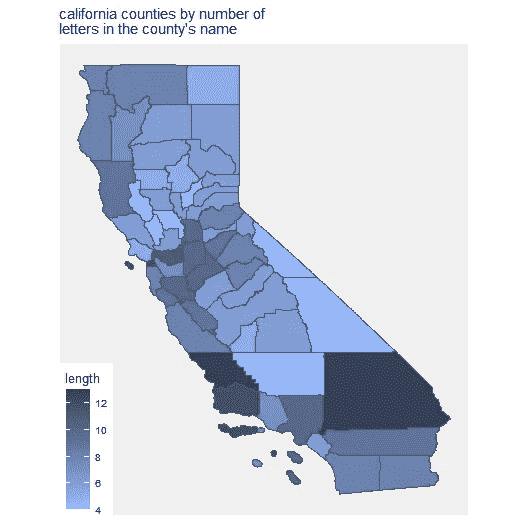
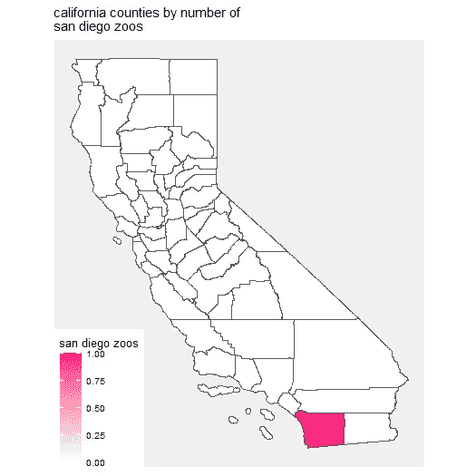
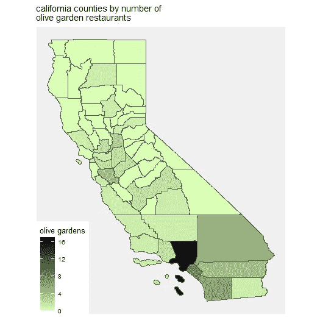
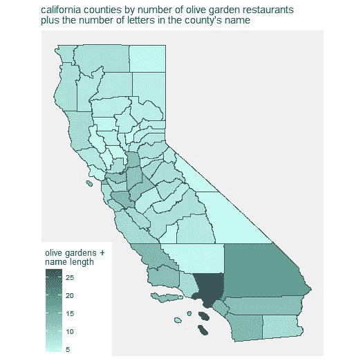
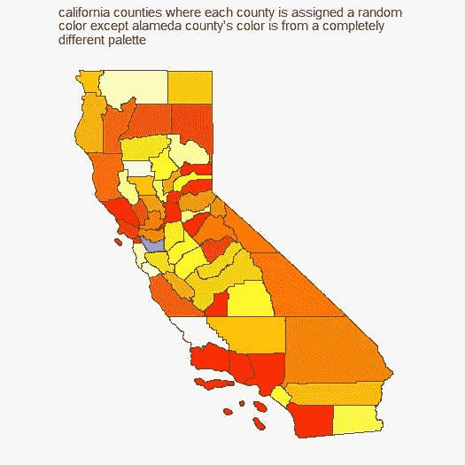

# 我做的 5 个完全无用的数据图

> 原文：<https://towardsdatascience.com/5-data-plots-i-made-that-are-completely-useless-d3c503d45a26?source=collection_archive---------40----------------------->

## 使用 R 中的制图包创建无目的的绘图

你的分析应该会揭示一些新的东西。它应该揭示对趋势或异常模式的洞察。数据科学工作的雇主希望看到你的分析有用且有影响力。

不过是*无聊*罢了。相反，我们可以制作完全无用的图表，这就是我花了几个小时在做的事情。

R 中的[制图包](https://www.rdocumentation.org/packages/cartography/versions/2.4.1)帮助你将数据转化成引人注目的地图。例如，R 带有北卡罗来纳州婴儿猝死综合症死亡的数据集。使用 shapefile(提供北卡罗来纳州县边界的几何数据)，您可以创建婴儿猝死综合症死亡率最高、婴儿猝死综合症死亡率最低等县的地图。

像那样的地图很有用。我正要反其道而行之，给你们看一堆我用 R 制图学软件包做的没用的图。

# 1.加州各县按县名中的字母数排列



获得加利福尼亚(我的家乡)的 shapefile 非常容易。它在加州政府网站上，还有一些有用的数据集，从犯罪到 COVID。但是我们现在对这些数据集不感兴趣。令人欣慰的是，我们也可以使用这个 shapefile 来绘制无用的图，比如用县名的长度来着色的县图。我们只需要为名称长度创建一个新列:

```
# add new column based on county name length
library(stringi)
ca$NAME_LENGTH <- stri_length(ca$NAME) - stri_count_fixed(ca$NAME, " ")
#using stri_length and stri_count_fixed removes spaces from the count. For example, "Santa Barbara" is counted as 12 letters instead of 13.
```

在那里，我使用 ggplot 来可视化数据。添加了`geom_sf`图形来填充县，添加了来自 ggthemes 包的`theme_map`图形来使我们的地图看起来更好一些:

```
ggplot(data=ca) +
  geom_sf(aes(fill=NAME_LENGTH), size=.5) +
  scale_fill_gradient(low="#98BAFF", high="#354057") +
  labs(title="california counties by number of \nletters in the county's name", fill="length") +
  theme_map() +
  theme(panel.background = element_rect(fill = '#F0F0F0', colour = 'white'))
```

现在我们有了我们的情节，我们可以看到圣伯纳迪诺县正在*杀死它*，而[约洛县](https://en.wikipedia.org/wiki/Yolo_County,_California)需要收拾它名字长度上的懈怠。

# 2.加州各县的圣地亚哥动物园数量



终于，我们有了答案。几十年来，我们加州人一直想知道哪个县有最多的圣地亚哥动物园，结果答案是圣地亚哥县，有一个圣地亚哥动物园。

对于这个图表，我创建了一个名为 SD_ZOOS 的新列，将每个县的值设为 0，然后手动将圣地亚哥县的值更改为 1:

```
#initialize all SD_ZOOS values to 0
ca$SD_ZOOS <- 0
#set SD_ZOOS value to 1 for san diego county
ca <- ca %>%
 transform(SD_ZOOS = if_else(NAME==”San Diego”, 1,0)))
```

据我所知，这是第一次可视化圣地亚哥动物园位置的数据，希望如果你想去加州旅行，这将帮助你找到离你最近的圣地亚哥动物园。

# 3.加州各县橄榄园餐厅的数量



这个图花了最长的时间来制作，因为我找不到加利福尼亚所有橄榄园位置的原始数据集。我手动找到了每个县的数字，方法是点击“查找离你最近的橄榄园！”网站，并跟踪加州所有 72 个地点的城市。然后，我将每个县的橄榄园数量相加，并将结果导出为 csv 文件，以便更容易地手动添加到 r 中的数据框中。

然而，把这个图放在这里是一个艰难的决定，因为它几乎是有用的。如果有什么不同的话，我们现在知道洛杉矶县到处都是面包条(它有 17 个橄榄园)。通过插入命令`sum(ca$OG==0)`,我们发现有 32 个加州县没有一个橄榄园。

# 4.加州各县的橄榄园数量加上县名中的字母数量



由于橄榄花园图有点太有影响力，我决定通过添加任意的数学来使它无用。幸运的是，R 允许您基于一些简单的算法创建新的列。因此，如果您有一个橄榄园位置列(ca$OG)和一个名称长度列(ca$NAME_LENGTH ),您可以这样做:

```
ca$OG_LENGTH <- ca$OG + ca$NAME_LENGTH
```

洛杉矶县从它的 17 个橄榄园位置仍然是强有力的，但是“圣伯纳迪诺”的名字的影响不是睡觉。

# 5.除了阿拉米达县的颜色来自完全不同的调色板之外，每个县都被赋予一种随机的颜色



很简单，没有理由需要这个数据图。这个情节绝对没用。这正是我想要的。

我使用`which`命令在数据表中找到了阿拉米达县的索引:

```
which(ca$NAME=="Alameda")
```

r 带有一些内置的调色板，允许你随意选择颜色。我使用了热调色板，重新分配了阿拉米达县的颜色，并相应地绘制了:

```
cols <- heat.colors(58, a=1)
# reassign alameda county's color
cols[42] <- "#0D26FF"#plot
ggplot(data=ca) +
  geom_sf(fill=cols) +
  labs(title="california counties where each county is assigned a random\ncolor except alameda county's color is from a completely \ndifferent palette") +
  theme_map() +
  theme(panel.background = element_rect(fill = '#F0F0F0', colour =   'white'))
```

这张图故意让阿拉米达县看起来格格不入。您没有理由需要这样做。这张图表毫无用处。

如果这篇文章照亮了你的一天，或者甚至帮助你学习了一点关于制图包的知识，我会很感激，尽管我真诚地希望你使用自己的数据科学技能使图表比这些更有用。也许你甚至能找到一个我为什么要把阿拉米达县变成蓝色的理由。我可以肯定地说，这会对我产生影响。谁知道呢，也许有一天有人需要知道所有的橄榄园在哪里。我们已经掩护他们了。