# 5 种数据追求，让你不再去想疫情

> 原文：<https://towardsdatascience.com/5-data-pursuits-to-take-your-mind-off-the-pandemic-f25bd713ac3b?source=collection_archive---------38----------------------->

## 给副业一个让你感觉更好和练习技能的机会

由 [Unsplash](https://unsplash.com/s/photos/laptop-couch?utm_source=unsplash&utm_medium=referral&utm_content=creditCopyText) 上的 [ConvertKit](https://unsplash.com/@convertkit?utm_source=unsplash&utm_medium=referral&utm_content=creditCopyText) 拍摄

在家工作真好。我喜欢自己家里的舒适，喜欢我收藏的茶叶，喜欢穿着舒适的衣服工作。尽管如此，它有时还是会影响到我。每天都开始有同样的感觉，时间过得很快。在互联网上，每个人都在谈论、写作和思考同样的事情，这也于事无补。

这就是为什么我想把一些小的个人追求或数据冒险列在一起，这样你就可以忘记当前的事件。请将它们视为练习数据获取和数据理解技能的练习。

声明:我没有列出 Kaggle，主要是因为几乎每个人都知道它。还因为它现在充满了新冠肺炎数据集。我想谈谈处理与疫情相关的数据集的一些替代方法。

# 1.分析你的谷歌地图历史

如果你启用了它，惊喜吧，谷歌一直在收集你去过的地方的信息。如果你没有意识到这一点，但从好的方面来看，现在你有了过去几年你去过的所有地方的数据，意识到这一点是非常令人毛骨悚然的。这是你可以处理的大量数据。你可以在地图上显示这些数据，分析你经常去的场馆，或者只是观察你的日常活动。

# 如何:

要下载您的位置历史，请前往 https://www.google.com/maps/timeline

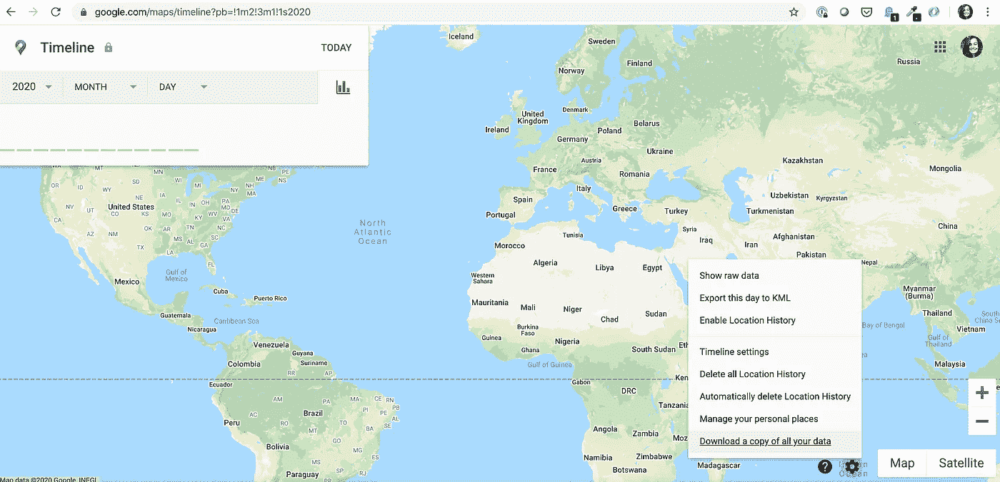

不幸的是，我从未给予许可，所以我没有收集任何数据。

在右下角，点击齿轮图标并选择**下载您所有数据的副本**。如果你对这些数据感到不舒服，也可以选择要求删除你的数据。

# 2.利用[驱动数据](https://www.drivendata.org/)为良好的事业处理数据

这个[网站](https://www.drivendata.org/)举办数据科学竞赛，发布数据集。在这个意义上，它类似于 Kaggle，但驱动数据为慈善机构和非营利组织做这件事。参加这些比赛，你不一定要成为一名优秀的数据科学家。只需下载数据，理解数据集，并开始利用您的想象力进行构建。

我认为在驱动数据上有很好的开放式问题的例子。在寻找解决方案或从原始数据中创造见解时，这是一个练习创造力的好机会。我会说，试试看。

# 如何:

参观 https://www.drivendata.org/，选择你感兴趣的案例

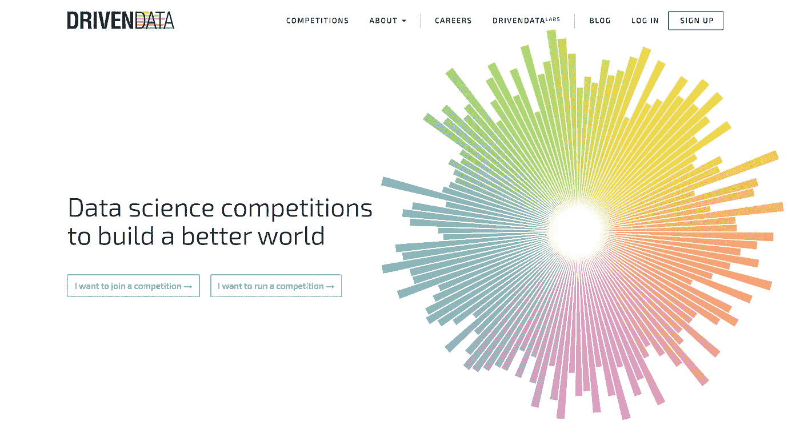

尤其是如果您正在寻找真实的用例，驱动数据是一个不错的选择。

# 3.在 Reddit 上找到你的梦想数据集

Redditors 请求并共享许多不同的数据集。就我个人而言，当我需要数据集时，我会首先在这里寻找。偶尔访问这个 subreddit，谁知道呢，也许你会对你的下一个个人项目有所启发。

# 如何:

去 https://www.reddit.com/r/datasets/[的](https://www.reddit.com/r/datasets/top/?t=all)

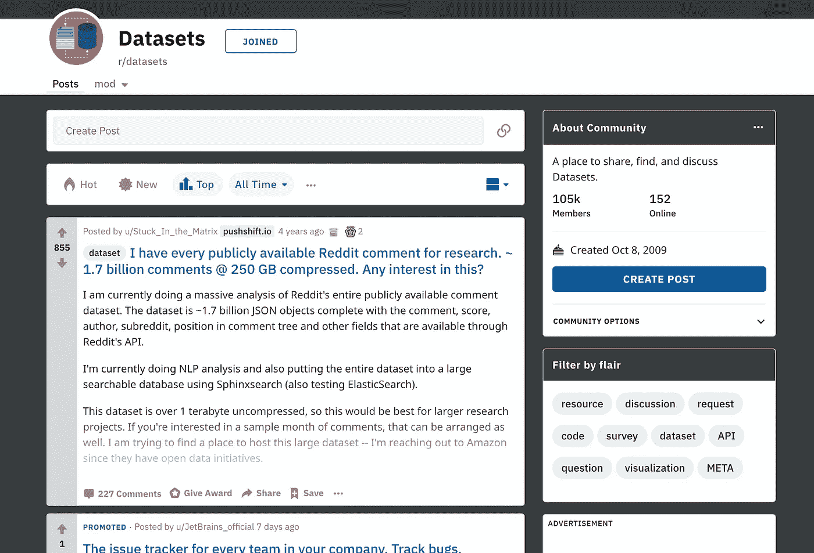

您可以使用排序选项来获取最流行的数据集。

# 4.从社交媒体平台下载您的数据

谷歌不是唯一一个你可以下载从自己身上收集的数据的地方。所有其他社交媒体渠道一直在收集我们的数据，以定制他们的平台，并能够提供个性化的推荐。由于最近的数据隐私法和数据所有权讨论，现在，公司有义务给人们一个选项，以获得从他们身上收集的数据的副本。

使用这些数据集对你来说是一个体验杂乱数据的好机会。你可能无法用它们预测任何事情，但是和它们一起玩总是很有趣的。我的建议是试着把数据整理好，看看你能从中获得什么样的见解。也许你会发现自己以前没有意识到的事情。谁知道呢。

# 如何:

## 商务化人际关系网

1.  从你的提要中点击你的小照片，然后选择**设置&隐私。**
2.  选择**隐私**>**LinkedIn 如何使用您的数据。**
3.  点击**获取您数据的副本**，选择您想要包含的内容，然后点击**请求存档。**
4.  你可能需要提供你的密码，然后你就可以下载你的数据。

更多信息请访问他们的官方网站。

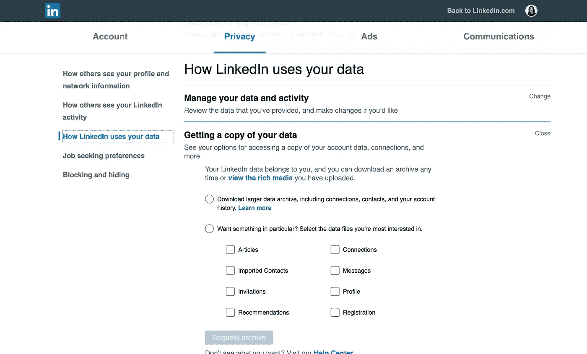

## 脸谱网

1.  转到[https://www.facebook.com/settings.](https://www.facebook.com/settings.)
2.  在左侧点击**您的脸书信息。**
3.  从菜单中选择**下载您的信息。**
4.  再次选择您想要包含的数据并点击**创建文件。**

更多信息请访问他们的官方网站。

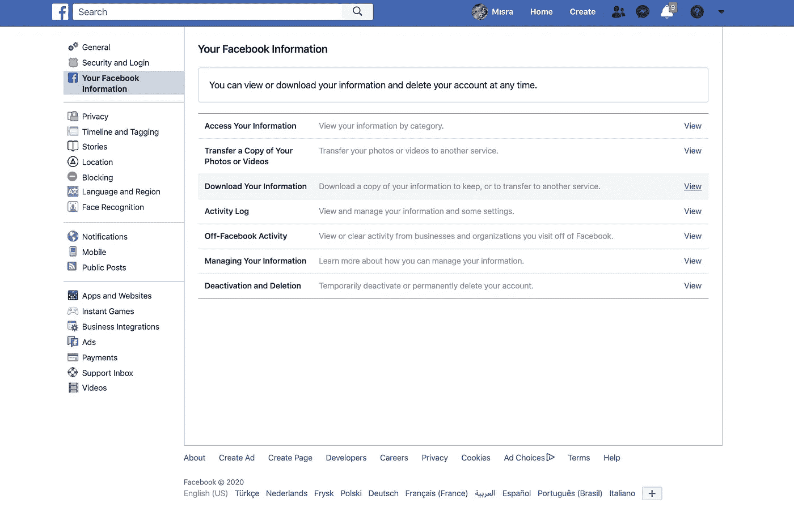

## 推特

1.  从您的 Twitter feed 中选择**更多** > **设置和隐私。**
2.  在**账户**下，选择**你的 Twitter 数据。**
3.  在**下输入您的密码，下载您的 Twitter 数据。**
4.  点击**请求存档。**
5.  当你的数据可以下载时，Twitter 会给你发一封邮件。

更多信息请访问他们的官方网站。

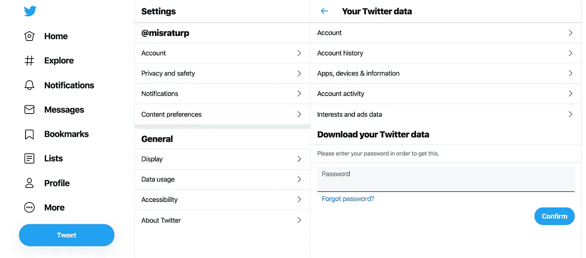

## Whatsapp

1.  在 iPhone 上:转到您想要下载的聊天，点击联系人姓名，向下滚动，点击**导出聊天**
2.  对于 Android [访问他们的官方网站](https://faq.whatsapp.com/en/android/23756533/)。

# 5.建立一个漏斗从你自己/你的朋友那里收集数据

有很多数据集可供你下载和使用。但是，如何创建自己的数据集以供将来分析呢？是的，我们不是数据收集方面的专家，所以我们不应该期望从中获得惊人的结果，但这很有趣，它会让你体会到数据收集的挑战。有人做到了: [**我追踪了一年来每天的快乐状况**](/i-tracked-my-happiness-each-day-of-2018-cafe0d048aa2)
你所要做的就是设置一个谷歌表单，每天通过电子邮件发送给你(或者你想包括的任何人)，或者以你希望的任何频率发送，然后收集答案。你可以把你的朋友也包括进来，让它成为一个更大规模的项目。一个例子就是追踪你的情绪和相关因素。尤其是现在我们花了很多时间在家里，看看是什么让你感觉更好或更差，如果你能察觉出来，这将是非常有趣的。也许你能看出那天你是否外出和你的情绪之间的关系。有一点需要注意的是，你需要有一个谷歌账户才能按照这里给出的说明进行操作。你准备好了吗？一开始听起来很复杂，但实际上很简单。

# 如何:

## 创建表单

1.转到[谷歌表单。](http://docs.google.com/forms)

2.创建一个新的表格，并填写您的问题。

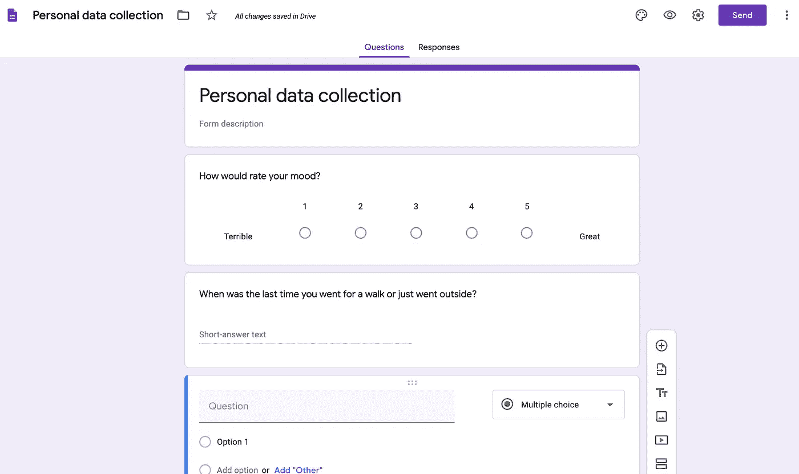

3.转到“回应”选项卡，然后单击 Google Sheets 图标。

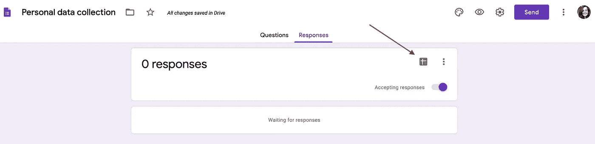

4.为您的回应电子表格填写您想要的名称，然后单击创建。这确保了当您收到回复时，它会被保存到这个新创建的电子表格中。

## 现在来设置每日发送功能

1.将表格发送给自己。

2.打开您发送给自己的电子邮件。

3.点击三个点(Gmail ),然后点击**显示原文**查看这封邮件的原始版本。

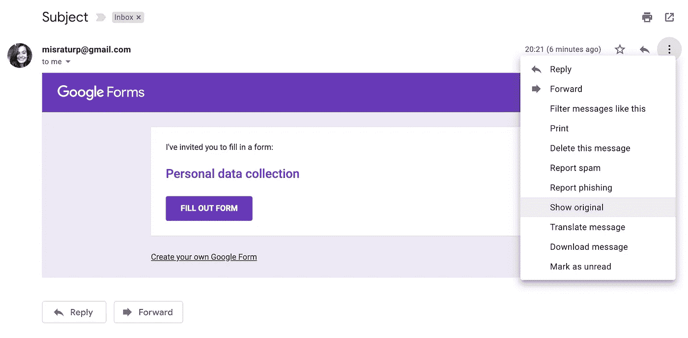

4.向下滚动并复制标签之间的所有内容。

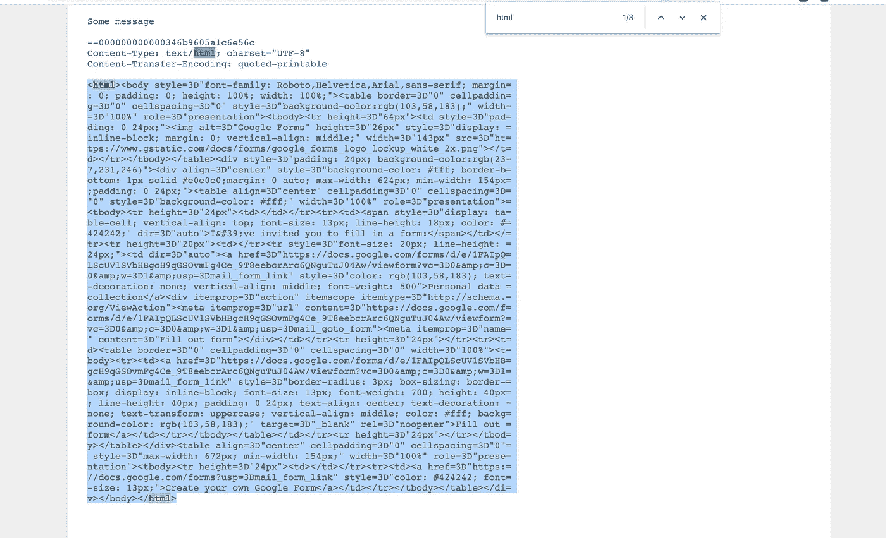

5.如果它被编码[使用这个网站](https://www.webatic.com/quoted-printable-convertor)来解码 html 代码。

6.复制解码后的代码。

7.创建一个新的 Google 电子表格，名称无关紧要。

8.打开电子表格，进入**工具** > **脚本编辑器。**

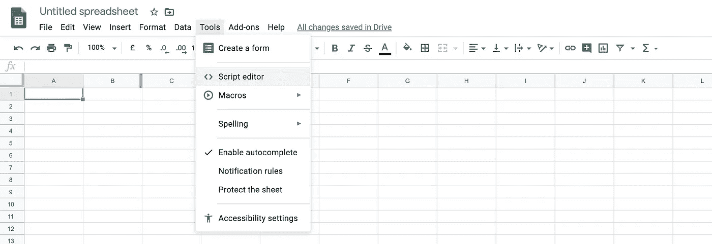

9.创建一个新的 HTML 文件，名称无关紧要。

10.删除所有内容，并将解码后的 HTML 代码粘贴到那里。

11.1.将以下内容粘贴到。gs 文件。

11.2.如果你想发送给多人，请使用此代码。

13.请确保更改电子邮件地址，并键入您创建的 html 文件的名称。

14.单击运行以测试电子邮件发送是否正确。

15.要安排它每天运行，单击**编辑** > **当前项目的触发器。**

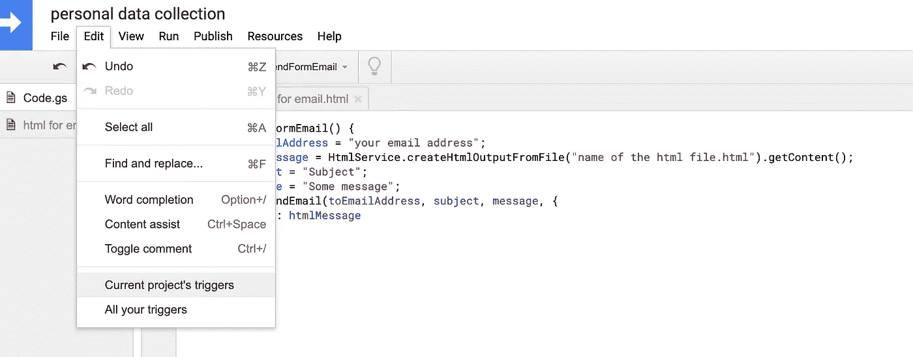

‍16 岁。点击**添加触发器**。

17.根据需要设置选项，然后单击保存。

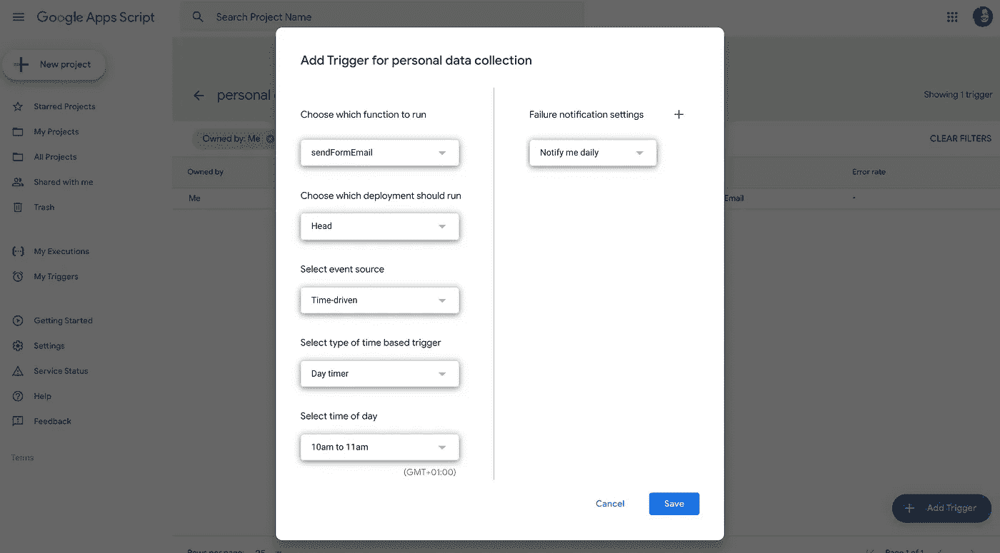

‍18 岁。现在，您的脚本将按照您的要求运行，并将 Google 表单发送到您的收件箱，这样您就可以填写表单并收集数据。

这些是我在思考简单的个人项目时想到的一些想法。我做一些小的兼职项目来让我忘记世界上或我的生活中正在发生的事情。我试着养成一种习惯，专门做我不擅长的事情，增加额外的挑战，学习新的东西。

让我知道你是否使用这些选项来创建一个个人项目，或者你是否有什么要添加到这个列表中！

您是否打算转行从事数据科学职业，但不确定从哪里开始？ [**通过我的网站免费参加我的数据科学入门课程。**](https://www.soyouwanttobeadatascientist.com/)

本课程旨在帮助您:

*   阐明您的数据职业目标，
*   明白努力的方向，
*   了解必要的技能，
*   在您的学习旅程中做出明智的决定

此外，我每周发表文章、采访数据专业人员和免费资源，以帮助专业人员有效地将他们的职业生涯转向数据科学。如果你对你需要学习的东西感到迷茫，对所有声称自己是最好的课程感到困惑，觉得没有一门课程对你的目的来说足够完整，我的网站就是为你准备的。