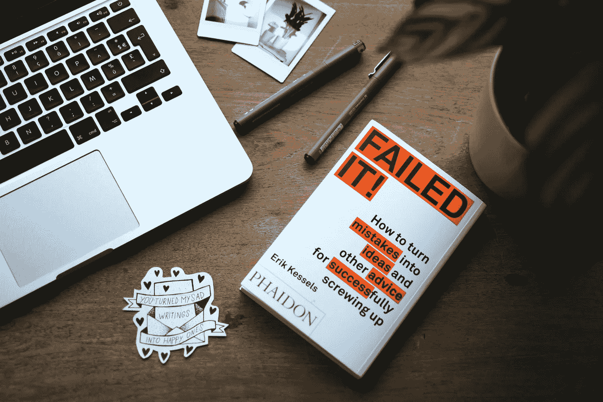
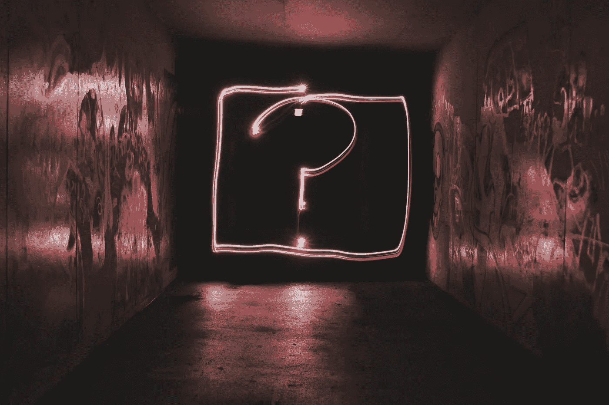

# 我犯过的 5 个数据科学面试错误

> 原文：<https://towardsdatascience.com/5-data-science-interview-mistakes-ive-made-59afcd41744f?source=collection_archive---------19----------------------->

## 你能从我的错误中学到什么。



在[Unsplash](https://unsplash.com/s/photos/mistake?utm_source=unsplash&utm_medium=referral&utm_content=creditCopyText)【1】上由[埃斯特·扬森斯](https://unsplash.com/@esteejanssens?utm_source=unsplash&utm_medium=referral&utm_content=creditCopyText)拍摄的照片。

# 目录

1.  介绍
2.  讨论同一个过去的项目
3.  没有问足够多的问题
4.  假设面试官知道我过去的经历
5.  不考虑业务影响
6.  没有概述整个数据科学过程
7.  摘要
8.  参考

# 介绍

我面试了几家公司，一路上都有一些重复和关键的错误。因此，我从他们那里学到了东西，并通过数据科学职位的工作机会获得了成功。我将强调的一些错误尤其适用于数据科学家，而一些错误几乎适用于任何面试。我的目标是让你跳过在无数公司面试的反复试验，这样你就可以专注于为你的目标公司和目标数据科学职位改进和执行一次出色的面试。

# 讨论同一个过去的项目

有时候，作为一名面试数据科学家，你会遇到几个面试官会问类似的问题。我认为这意味着我应该对每个人给出相同的答案。我还认为新的问题可以追溯到相同的过去的项目。然而，重要的是要注意，这些面试官最终会在你的面试结束后进行讨论。这意味着他们会看到，你只是针对类似的问题和不同的问题谈论了相同的教育或专业数据科学项目，所以这限制了他们如何判断你。因为你谈论的是同一个项目，所以看起来你的经验更少。这一点我其实是被叫出来的。他们告诉我，我不断回到同一个例子，他们想知道其他情况，以及我如何处理这些问题。

我确实认为，对类似的问题说类似的答案不一定是一个大错误——在这种情况下，你应该确保为每个问你同样问题的新人添加一些细节。

> 对于另一点，回过头来看，我确实认为这个错误更大，你应该考虑一些重要的建议。我认为这一点更重要的原因是，我让面试官告诉我这是一个问题。

然而，我不确定是否所有的公司都有这种感觉，因为我倾向于对一个项目感到自豪，并对每个新问题谈论同一个项目。我还认为，让所有这些答案都基于同一个例子是很独特的，这样面试官就可以更好地了解我作为数据科学家的整个过程。

> 我的错误是对不同的问题讲得如此相似，以至于好像我一整年都只在一个项目上工作。你可以想象这不会给面试官留下深刻印象。

很难百分之百肯定地说这个错误是你应该避免的，但是我可以告诉你，它是作为一个错误向我提出来的，所以它是我在下一次面试中学习和改进的东西。

# 没有问足够多的问题



在[Unsplash](https://unsplash.com/s/photos/question?utm_source=unsplash&utm_medium=referral&utm_content=creditCopyText)【2】上由[艾米丽·莫特](https://unsplash.com/@emilymorter?utm_source=unsplash&utm_medium=referral&utm_content=creditCopyText)拍摄的照片。

这一点可能不像上面的观点那样独特，但它是更广泛的，我相信大多数公司都会同意这一点是一个常见的错误。

***提问不够说明了几件事:***

*   *你对公司不感兴趣*
*   *你注意力不够集中，没有提出问题*
*   *可能显示你过于自信*
*   *可能表明你很难共事*

没有人愿意和一个过于自信的无所不知的人一起工作。同样，没有人愿意与对公司或其目标以及各自的数据科学项目不感兴趣的人合作。最重要的是，当你没有问足够多的问题时，听起来好像你不够关心去听。最终，你没有向面试官提问，这表明你不是一个合作的好人选。

同样重要的是，这个错误不仅仅与数据科学家有关，大多数职业领域也是如此。

# 假设面试官知道我过去的经历

这个错误是我经常犯的，不仅仅是在采访中，在讲故事时也是如此。你和面试官一起做的就是——讲故事。我犯的一个常见错误是假设面试官知道一些关于我项目背景的信息。

> 他们很可能什么都不知道——有些人甚至不会看你的简历。

这一评论可能会让你感到震惊，但可能只有一个或几个来自该公司的面试者深入研究了你的简历——这并不是说你不应该在面试前概述你的简历，因为他们很可能会从你简历中的一个细节中问你一个相当具体的问题。

但是，回到讲故事，您需要在回答问题时为您执行的数据科学项目提供基本信息。这种类型的解释将向面试官展示你可以与利益相关者和其他非数据科学人员合作。

***要调出的一些要点有:***

*   *业务问题是什么？*
*   或者你当初为什么想做这个项目？
*   谁参与了？(产品经理、软件工程师等。)
*   *流程是怎样的？*
*   *你是怎么做到的？*
*   这个项目在企业的大计划中处于什么位置？
*   结果如何？
*   *人们是如何看待他们的？*
*   你帮助了多少人/节省了多少钱/节省了多少时间？

一旦你用这种格式概述了你过去的项目，它将更好地描绘出你的答案。

# 不考虑业务影响


[Riccardo Annandale](https://unsplash.com/@pavement_special?utm_source=unsplash&utm_medium=referral&utm_content=creditCopyText) 在[Unsplash](https://unsplash.com/s/photos/business?utm_source=unsplash&utm_medium=referral&utm_content=creditCopyText)【3】上拍摄的照片。

按照上面讲故事的观点，你必须确保考虑你的模型的商业影响。我相信这个错误对于数据科学家来说特别普遍，因为他们只关注模型及其性能，而没有提到业务是如何受到影响的。

你希望以一种准确但更重要的方式突出你的结果，即*有影响力的*。你很可能取得了有影响力的结果，但你可能没有让面试官知道这一点。你可以这样表述你的答案:

*   *“我研究了决策树模型，该模型自动化了一个手动过程，节省了 50%的时间和 50%的金钱，为改进产品创造了时间和金钱。”*

如果你经常提到你 99%的准确率，但没有提到它的影响，你可以预期面试官会认为你不知道如何在企业中工作，更注重教育。有时，如果整个过程在某种程度上更快、更有影响力，甚至更低的精度也更好。

假装你正在雇人——你想知道他们能帮助你的生意。

# 没有概述整个数据科学过程

就像本文中的第一个错误一样，我也因为这个错误而被特别点名——没有概述整个数据科学过程。这一点意味着我没有包括在主要数据科学项目之前和之后发生的围绕数据工程和机器学习组件的讨论。

***面试想知道:***

*   *你是如何得到数据的*
*   *你如何预处理它*
*   *如何将模型转换成面向对象的编程格式*
*   *如何进行测试*
*   *如何部署*
*   *它是如何集成到您的产品中的*

这些要点可能不是你自己执行的，但面试官知道每个数据科学家并不都是数据工程师、机器学习工程师或软件工程师。他们测试你的是，你是否知道从开始到结束的整个过程，以及谁在做什么。如果你正确回答了这个问题，那么公司将会看到你进入了一个更专业的数据科学角色，并可能了解数据科学过程的开始或结束部分。

# 摘要


乔纳森·博尔巴在[Unsplash](https://unsplash.com/s/photos/interview?utm_source=unsplash&utm_medium=referral&utm_content=creditCopyText)【4】上拍摄的照片。

我希望你从这篇文章中学到了一些真正新的建议。我已经涵盖了我在数据科学职位面试过程中遇到的五个主要错误。你可能会因为避免了我的错误而获得工作机会，也可能不会，但它们可能在某种程度上对你很重要。也许，在这些问题上加上你自己的想法会让*成为数据科学面试中最适合你的*。

***总结一下，这是我犯过的五个数据科学面试错误:***

```
Discussing the same past projectNot asking enough questionsAssuming interviewers know my past experiencesNot considering the business impactNot overviewing the whole Data Science process
```

请随时在下面发表评论，并讨论您在数据科学职位面试过程中犯的一些常见错误，以便我们可以互相学习。

*感谢您的阅读！*

# 参考

[1]2017 年 [Unsplash](https://unsplash.com/s/photos/mistake?utm_source=unsplash&utm_medium=referral&utm_content=creditCopyText) 上[Estee 扬森斯](https://unsplash.com/@esteejanssens?utm_source=unsplash&utm_medium=referral&utm_content=creditCopyText)拍摄的照片

[2]照片由[艾米丽·莫特](https://unsplash.com/@emilymorter?utm_source=unsplash&utm_medium=referral&utm_content=creditCopyText)在[Unsplash](https://unsplash.com/s/photos/question?utm_source=unsplash&utm_medium=referral&utm_content=creditCopyText)(2017)上拍摄

[3]照片由 [Riccardo Annandale](https://unsplash.com/@pavement_special?utm_source=unsplash&utm_medium=referral&utm_content=creditCopyText) 在[Unsplash](https://unsplash.com/s/photos/business?utm_source=unsplash&utm_medium=referral&utm_content=creditCopyText)(2016)上拍摄

[4]照片由 [Jonathan Borba](https://unsplash.com/@jonathanborba?utm_source=unsplash&utm_medium=referral&utm_content=creditCopyText) 在[Unsplash](https://unsplash.com/s/photos/interview?utm_source=unsplash&utm_medium=referral&utm_content=creditCopyText)(2019)上拍摄