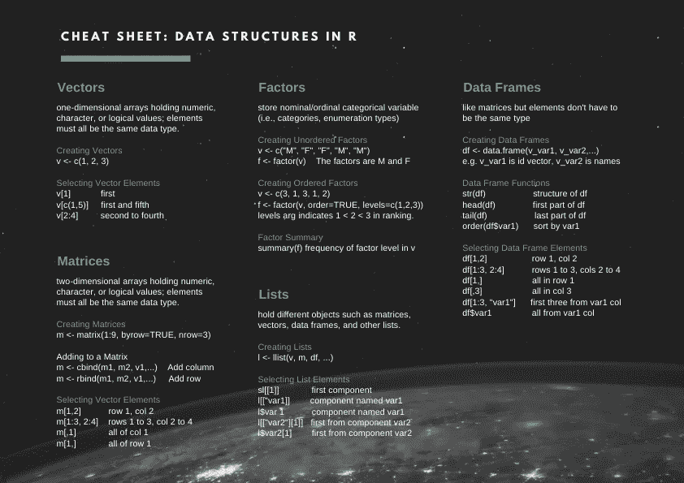

# 如果你想成为一名数据科学家，在 R 语言中要掌握 5 种数据结构

> 原文：<https://towardsdatascience.com/5-data-structures-to-master-in-r-if-you-want-to-be-a-data-scientist-df9c09609a3f?source=collection_archive---------47----------------------->

## 了解如何掌握基本数据类型和高级数据结构，如因子、列表和数据框。


要成为一名 R 数据科学家，您需要掌握这种广泛使用的开源语言的基础知识，包括因子、列表和数据框架。掌握这些数据结构后，您就可以开始自己的第一次数据分析了！

这五种数据结构是:

1.  **矢量**
2.  **矩阵**
3.  **因素**
4.  **数据帧**
5.  **列表**

一直读到数据类型的备忘单的末尾。

# 基本数据类型

在我们开始讨论数据结构之前，了解一下组成这些数据结构中的一些元素的基本数据类型是很重要的。

主要类型有:

*   **数字** —十进制值，如`4.5`，或整数值，如`4`。
*   **逻辑值** —布尔值(`TRUE`或`FALSE`)
*   **字符** —文本(或字符串)值，如`"medium"`(注意这些是区分大小写的)

```
# Here are some variables being assigned these basic data types
my_numeric <- 9.5
my_logical <- TRUE
my_character <- "Linda"
```

如果您想更深入地了解 R 中的基础知识，请查看我写的这篇文章，这篇文章教您如何计算、分配变量以及使用基本数据类型。它也包括练习题！

# 向量

**Vectors** 是一维数组，可以存储任何基本的数据类型，包括数字、逻辑和字符。

## 创建向量

要创建一个向量，使用[组合功能](https://www.rdocumentation.org/packages/base/versions/3.6.2/topics/c) `[c()](https://www.rdocumentation.org/packages/base/versions/3.6.2/topics/c)`，用圆括号之间的逗号分隔元素。

```
my_vector <- c(elem1, elem2, elem3)
numeric_vector <- c(1, 2, 3)
character_vector <- c("a", "b", "c")
```

## 命名一个向量

给向量命名就是给向量元素命名。可以使用名称功能`names()`来完成。

```
# Without names, its not clear what data is being used
some_vector <- c("Linda", "Data Scientist")
names(some_vector) <- c("Name", "Profession") # Output
> some_vector
     Name          Profession
   "Linda"   "Data Scientist"
```

## 从向量中选择

如果我们想从一个向量中选择一个*元素*，我们只需在方括号中输入我们想要选择的元素的索引。

```
my_vector[i]
# my_vector is the vector we are selecting from
# i is the index of the element# To select the first element 
# Note that the first element has index 1 not 0 (as in many other programming languages)
my_vector[1]
```

要从一个矢量中选择多个元素，使用方括号中的矢量指示应该选择哪些元素。

```
# For example, to select the first and fifth element, us c(1,5)
my_vector[c(1,5)]# For example, to select a range, we can abbreviate c(2,3,4) to 2:4
my_vector[2:4]
```

我们也可以使用元素的*名称*来代替它们的数字位置。

```
weekday_vector["Monday"]
```

如果你想更深入地了解向量，看看这篇我写的关于如何创建、命名、选择和比较向量的文章。结束时，你将学会如何使用向量分析游戏结果！

# 矩阵

**矩阵**是排列成固定数量的行和列的相同数据类型(数字、字符或逻辑)元素的集合。**二维矩阵**仅适用于行和列。

## 创建矩阵

函数`[**matrix()**](https://www.rdocumentation.org/packages/base/versions/3.6.2/topics/matrix)`创建一个矩阵。这个函数有三个重要的参数:

1.  `**vector**` —这是将被排列到矩阵行和列中的元素的集合。该参数是可选的；如果我们把这个参数留空，矩阵就不会被填充，但它可以在以后被填充。我们可以使用已经创建的向量。
2.  `**byrow**` —表示矩阵是按行(`byrow=TRUE`)还是按列(`byrow=FALSE`)填充。默认设置为`FALSE`。
3.  `**nrows**` —表示所需的行数。

```
# A matrix containing the numbers 1 to 9, filled row-wise, with 3 rows.
matrix(1:9, byrow=TRUE, nrow=3)
# 1 2 3
# 4 5 6
# 7 8 9
```

## 命名矩阵

为了给行和列添加名称，我们可以使用函数`colnames()`和`rownames()`。

```
rownames(my_matrix) <- row_names_vector
colnames(my_matrix) <- col_names_vector
```

我们也可以使用`dimnames`属性，在创建时直接命名矩阵。

```
my_matrix <- matrix(vector, byrow=some_logical, nrow=some_number
  dimnames = list(row_names_vector, column_names_vector)
```

## 添加到矩阵

我们可以使用`[cbind()](https://www.rdocumentation.org/packages/base/versions/3.6.2/topics/cbind)`将矩阵和/或向量按列合并在一起，向矩阵中添加一列或多列。

```
big_matrix <- cbind(matrix1, matrix2, vector1, ...)
```

要添加一行，我们使用`[**rbind()**](https://www.rdocumentation.org/packages/base/versions/3.6.2/topics/cbind)` 函数获取一系列向量或矩阵，并按行组合它们。

```
big_matrix <- rbind(matrix1, matrix2, vector1, ...)
```

## 计算总数

我们可以用`rowSums()`计算每行的总和，用`colSums()`计算每列的总和。

```
rowSums(my_matrix)
colSums(my_matrix)
```

## 选择矩阵元素

方括号`[]`用于从矩阵中选择一个或多个元素。因为矩阵是二维的，所以需要逗号来分隔行和列。

```
my_matrix[row, column]# Select element on the first row and second column
my_matrix[1,2]# Returns a matrix with the data on rows 1 through 3, and columns 2 through 4
my_matrix[1:3, 2:4]# To select all elements of a column, no number is needed before the column
# Select all elements of the first column
my_matrix[,1]# To select all elements of a row, no number is needed after the row
# Select all elements of the first row
my_matrix[1,]
```

如果您想更深入地了解矩阵，请查看我写的这篇关于如何创建、命名、选择矩阵以及用矩阵进行基本计算的文章。它甚至包括练习题要做！

# 因素

一个**因子**用于存储分类变量。**分类变量**属于*有限数量的类别*(例如，“男性”、“女性”)。它们与**连续变量**相反，后者可以对应于无限数量的值。

## 创建因子

要创建一个因子，使用`[**factor()**](https://www.rdocumentation.org/packages/base/versions/3.6.2/topics/factor)`函数，它将一个向量编码为一个因子(也称为“类别”或“枚举类型”)。

```
# Creates a gender factor with the categories "Female" and "Male"
gender_vector <- c("Male", "Female", "Female", "Male", "Male")
gender_factor <- factor(gender_vector)
```

**名义分类变量**没有隐含顺序(例如`“Elephant”`、`“Monkey”`、`“Horse”`)。**有序分类变量**具有自然排序/排名(例如`“Low”`、`“Medium”`、`“High”`)。

r 以不同的方式构造和打印它们。默认情况下，`factor()`函数将向量转换成一个无序因子。要创建有序因子，我们需要两个额外的参数:

*   `**ordered**` —设置为`TRUE`，表示因子已排序。
*   `**levels**` —以正确的顺序设置因子的值。

```
# Constructs a factor with nominal categorical variables
animal_vector <- c("Elephant", "Monkey", "Horse")
animal_factor <- factor(animal_vector) # Constructs a factor with ordinal categorical variable
temperature_vector <- c("High", "Low", "High", "Low", "Medium")
temperature_factor <- factor(temperature_vector, order = TRUE, levels = c("Low", "Medium", "High"))
```

对于顺序变量，使用`<`指示顺序。

```
# Output for nominal variables
# Animals
[1] Elephant Giraffe  Donkey   Horse   
Levels: Donkey Elephant Giraffe Horse# Output for ordinal variables
# Temperature
[1] High   Low    High   Low    Medium
Levels: Low < Medium < High
```

## 重命名因子级别

有时，出于清晰或其他原因，更改数据集中特定因子级别的名称会有所帮助。例如，假设来自调查的原始数据包含一个关于回答者性别的问题，只记录了两个类别:`"M"`和`"F"`。在数据收集过程中记录缩写可能很方便，但在分析过程中可能会变得混乱。我们可以通过使用`[**levels()**](https://www.rdocumentation.org/packages/base/versions/3.6.2/topics/levels)` 功能来改变关卡的名称:

```
levels(factor_vector) <- c("name1", "name2", ...)# Specify the levels to "Male" and "Female" instead of "M" and "F"
survey_vector <- c("M", "F", "F", "M", "M")
survey_factor <- factor(survey_vector)
levels(survey_factor) <- c("Female", "Male")
```

**注意:**分配等级的顺序很重要。`levels(survey_factor)`输出`[1] "F" "M"`。如果在创建过程中未指定因子等级，它们将自动按字母顺序分配*。为了正确地将`"F"`映射到`"Female"`和`"M"`映射到`"Male"`，需要按照特定的顺序将电平设置为`c("Female", "Male")`。*

## 总结一个因素

`[**summary()**](https://www.rdocumentation.org/packages/base/versions/3.6.2/topics/summary)` 函数给出了变量内容的快速概览。它可用于因子，以确定我们的向量中每个因子级别有多少个响应。

```
summary(my_factor)# Example
summary(survey_factor)# Output
Female    Male
     2       3
```

如果您想更深入地了解因素，请查看我写的这篇关于如何创建、子集化和比较因素的文章。它包括练习题，这样你可以练习你新开发的技能。

# 数据帧

**数据帧**类似于矩阵，但元素不必都是相同的数据类型。数据框以变量为列(如 `married, age`)，以观察值为行(如`respondent1, respondent2 , …`)。

```
 married  age
Respondent1      TRUE   24
Respondent2      FALSE  18
Respondent3      FALSE  28
```

## 检查数据帧

我们可以通过使用以下函数显示整个帧的一小部分来检查元素:

*   `[**head()**](https://www.rdocumentation.org/packages/utils/versions/3.6.2/topics/head)` —显示数据帧的第一部分
*   `[**tail()**](https://www.rdocumentation.org/packages/utils/versions/3.6.2/topics/head)` —显示最后一部分。

我们还可以使用`[str()](https://www.rdocumentation.org/packages/utils/versions/3.6.2/topics/str)`函数来显示框架的结构，得到以下信息:

*   观察总数
*   变量总数
*   变量名的完整列表
*   每个变量的数据类型
*   第一次观察

## 创建数据框

为了构建数据框，我们使用了`[data.frame()](https://www.rdocumentation.org/packages/base/versions/3.6.2/topics/data.frame)`函数，将数据向量作为不同列的参数传递。请注意，数据帧中的每一列都具有相同的长度，因此传递的向量也应该具有相同的长度。但是它们不需要相同的数据类型。

```
my_df <- data.frame(vector_variable1, vector_variable2, ...) 
```

## 选择数据框元素

类似于向量和矩阵，我们用方括号`[]`来选择元素。逗号用于指示分别从行和列中选择什么。

```
# Select the value at the first row and second column
my_df[1,2]# Select rows 1 to 3, and columns 2 to 4
my_df[1:3, 2:4]# Select all elements in row 1
my_df[1,]# Select all elements in col 3
my_df[,3]# Select the first three elements from the age column
my_df[1:3, "age"]# Select all elements of the married column
my_df[,"married"]
my_df$married # Notice that we can use the $ sign as a short-cut
subset(my_df, subset = married) # We can also use the subset function
```

## 对数据帧进行排序

我们可以使用`[**order()**](http://www.rdocumentation.org/packages/base/functions/order)` 函数根据某个数据框变量对数据进行排序。

```
# Sorts data frame by age (youngest to oldest)
positions <- order(my_df$age) # Use order() to create positions
my_df[positions,] # Use positions to sort df
```

如果您想更深入地了解数据框，请查看我写的这篇关于如何创建、选择和排序数据框的[文章](/introduction-to-data-frames-in-r-b9a6302d9a56)，通过练习问题来进一步巩固您的学习。

# 列表

**列表**可以保存不同对象的组件，如矩阵、向量、数据帧和其他列表，以有序的方式聚集在一个名称(列表的名称)下。这些对象不需要以任何方式相关联，因此，实际上任何东西都可以存储在一个列表中。

## 创建列表

我们使用函数`[**list()**](http://www.rdocumentation.org/packages/base/functions/list)` 来构造一个列表:

```
my_list <- list(comp1, comp2, ...)# Constructs a list with different elements
my_list <- list(my_vector, my_matrix, my_df)
```

## 命名列表组件

我们可以给列表中的组件命名，这样就不会忘记它们所代表的含义。我们既可以在构建列表时命名它们，也可以在之后命名它们。举个例子，

```
# Name components directly during list construction.
my_list <- list(name1 = comp1, name2 = comp2)# Use names() function to name list after construction
my_list <- list(comp1, comp2)
names(my_list) <- c("name1", "name2")
```

## 选择列表元素

我们可以使用组件的编号位置以及双方括号`[[]]`，而不是用于向量和矩阵的单方括号`[]`。

```
# Select the first component (position 1)
my_list[[1]]# Select name2 from the list
my_list[["name2]]
my_list$name2# Select first element from name2 component
my_list[["name2"][1]]
my_list$name2[1]
```

# r 数据结构备忘单



创建和选择不同数据结构的备忘单。

# 笔记

所有图片，除非特别注明，均归作者所有。横幅图像是使用 [Canva](https://www.canva.com/) 创建的。