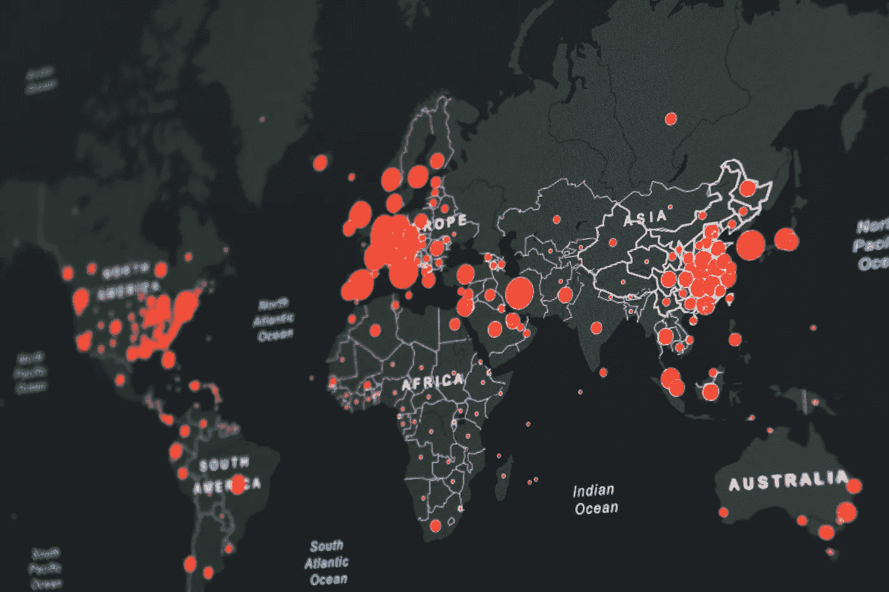
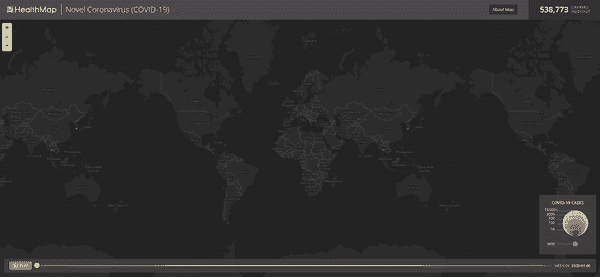
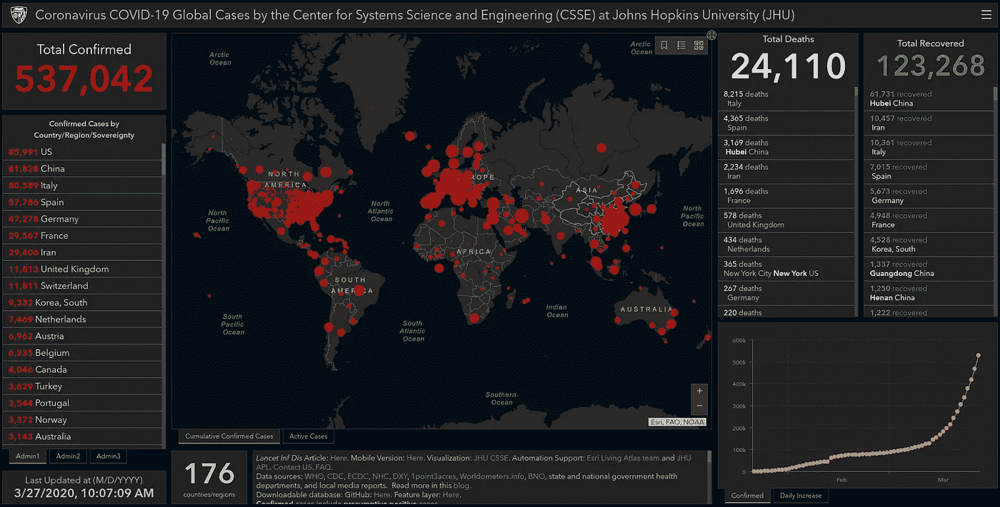

# 你现在可以使用的关于新冠肺炎的 5 个数据集

> 原文：<https://towardsdatascience.com/5-datasets-about-covid-19-you-can-use-right-now-46307b1406a?source=collection_archive---------3----------------------->

## 开放数据集可用于改进预测模型、预测和分析新冠肺炎的影响或调查 Twitter 上传播的信息。



由[马丁·桑切斯](https://unsplash.com/@martinsanchez?utm_source=unsplash&utm_medium=referral&utm_content=creditCopyText)在 [Unsplash](https://unsplash.com/s/photos/covid?utm_source=unsplash&utm_medium=referral&utm_content=creditCopyText) 拍摄的照片

冠状病毒爆发及其导致的疾病新冠肺炎席卷了全世界。新闻编辑室每天过滤大量信息——文章、官方简报、专家采访等。医务人员每周都要努力跟踪数百份科学出版物，涉及药物研究、流行病学报告、干预政策等等。此外，社交网络平台需要减少噪音，推广经过验证的故事，以避免培养误导和恐惧的用户。

在这场斗争中，我们很幸运地生活在一个充分了解数据价值的世界，并且在收集和提炼这些数据方面有许多努力正在进行中。**因此，问题是如何利用它们来提取价值和智慧，从而影响政策的制定和警报的触发。**

在这个故事中，我展示了六个精心策划的数据集，它们在某种分析光线下可以证明非常有用。它们的主要可能应用从改善流行病学预测模型和预测各种干预政策的影响，到自然语言处理和 Twitter 上的信息传播。对于已经存在的应用，我邀请您阅读下面的故事。

[](https://medium.com/swlh/how-data-science-can-help-with-outbreaks-like-coronavirus-a042de25efa1) [## 数据科学如何帮助应对冠状病毒等疾病的爆发

### 卓越方法和特殊实践概述。

medium.com](https://medium.com/swlh/how-data-science-can-help-with-outbreaks-like-coronavirus-a042de25efa1) 

> [学习率](https://mailchi.mp/d2d2d4a109b5/learning-rate-newsletter)是为那些对 AI 和 MLOps 的世界感到好奇的人准备的时事通讯。你会在每周五收到我关于最新人工智能新闻和文章的更新和想法。在这里订阅！

# `nCoV-2019`

我们考虑的第一个数据集发表于 2020 年 3 月 24 日，标题为“*来自新冠肺炎疫情的流行病学数据，实时病例信息*”[1]。它从国家、省和市卫生报告中收集个人信息，并从在线报告中收集额外知识。所有数据都进行了地理编码，并包含进一步的输入，如症状、关键日期(发病、入院和确诊日期)和旅行记录(如果有)。你可以在这里找到相关的 GitHub 回购。



新冠肺炎疫情可视化使用`nCoV-2019`

`nCoV-2019`数据集能够产生模拟疾病爆发的实时方法。这种机制支持公共卫生决策，并协助决策者执行知情的指导方针。

# 新冠肺炎（新型冠状病毒肺炎）

新冠肺炎[2]可以说是收集冠状病毒爆发信息的最大努力。几乎所有读过关于即将到来的疫情的文章的人都看过它提供的仪表盘。



新冠肺炎·JHU 仪表板

数据集包含两个文件夹；一个记录每日病例报告，另一个提供每日时间序列汇总表，包括确认的新病例、死亡和康复。新冠肺炎数据集为研究人员、公共卫生机构和普通公众提供了一个直观、用户友好的工具来跟踪疫情的发展。你可以在这里找到相关的 GitHub repo。

# 绳索-19

艾伦人工智能研究所(Allen Institute for AI)与几个研究小组一起准备并发布了新冠肺炎开放研究数据集(CORD-19) [3]。该数据集汇集了 44，000 篇关于新冠肺炎和冠状病毒家族的学术文章，供全球研究界使用。

该数据集已经有了一个相关的 [Kaggle challenge](https://www.kaggle.com/allen-institute-for-ai/CORD-19-research-challenge) ，数据科学家被要求开发文本和数据挖掘工具，以帮助医疗界开发高优先级科学问题的答案。此外，已经有一个 [CORD-19 Explorer](https://cord-19.apps.allenai.org/) 工具，它提供了一种熟悉的方式来浏览 CORD-19 语料库。

# 世卫组织 COVID-2019

世界卫生组织(世卫组织)也在进行类似的努力。世卫组织每天通过手动搜索相关期刊的目录来更新数据集。此外，他们追踪其他相关的科学文章，丰富了数据集。

你可以下载整个数据集或通过作者、关键词(标题、作者、期刊)、期刊或一般主题[在这里](https://www.who.int/emergencies/diseases/novel-coronavirus-2019/global-research-on-novel-coronavirus-2019-ncov)进行搜索。

# 新冠肺炎推文 ID

新冠肺炎推特 IDs 数据集收集了数百万条与冠状病毒爆发和新冠肺炎病相关的推特[4]。这个数据集中的第一条推文可以追溯到 2020 年 1 月 22 日。

作者使用 Twitter 的 API 来搜索和关注相关账户，并收集多种语言的带有特定关键词的推文。在此之前，下面给出了语言分类。

```
| Language        | ISO     | No. tweets       | % total Tweets |
|-------------    |-----    |------------      |----------------    |
| English         | en      | 44,482,496       | 69.92%             |
| Spanish         | es      | 6,087,308        | 9.57%              |
| Indonesian      | in      | 1,844,037        | 2.90%              |
| French          | fr      | 1,800,318        | 2.83%              |
| Thai            | th      | 1,687,309        | 2.65%              |
| Portuguese      | pt      | 1,278,662        | 2.01%              |
| Japanese        | ja      | 1,223,646        | 1.92%              |
| Italian         | it      | 1,113,001        | 1.75%              |
| (undefined)     | und     | 1,110,165        | 1.75%              |
| Turkish         | tr      | 570,744          | 0.90% 
```

你可以在该项目的 GitHub repo [这里](https://github.com/echen102/COVID-19-TweetIDs)下载数据集以及更多信息，包括如何水化它(即一条推文的完整细节)。

# 结论

数据社区在冠状病毒爆发时做出了反应，生成了各种数据集，这些数据集可以加快新疗法的研究，为政策制定者提供信息，或创建预测模型，以更好地预测当前疾病的表现或触发对未来事件的警告。

剩下的问题是数据科学家将如何使用这些数据集，以及将产生什么工具。无论如何，我们的武器库中似乎多了一件对抗这种病毒的武器。

> **我叫 Dimitris Poulopoulos，是希腊比雷埃夫斯大学***[**BigDataStack**](https://bigdatastack.eu/)***的机器学习研究员和博士(c)。我曾为欧洲委员会、欧盟统计局、国际货币基金组织、欧洲中央银行、经合组织和宜家等主要客户设计和实施人工智能和软件解决方案。如果你有兴趣阅读更多关于机器学习、深度学习和数据科学的帖子，请在 twitter 上关注我的****[](https://medium.com/@dpoulopoulos)****[**LinkedIn**](https://www.linkedin.com/in/dpoulopoulos/)**或**[**@ james2pl**](https://twitter.com/james2pl)**。********

# ******参考******

******[1]徐，b，Gutierrez，b，Mekaru，S. *等*来自疫情的流行病学数据，实时病例信息。 *Sci 数据* **7、** 106 (2020)。[https://doi.org/10.1038/s41597-020-0448-0](https://doi.org/10.1038/s41597-020-0448-0)******

******[2]董，e，杜，h .，，加德纳，L. (2020).实时跟踪新冠肺炎的交互式网络仪表板。*柳叶刀传染病*。[https://doi . org/10.1016/s 1473-3099(20)30120-1](https://doi.org/10.1016/S1473-3099(20)30120-1)******

******[3]新冠肺炎开放研究数据集(CORD-19)。2020.版本 2020-03-20。从年月日访问的 https://pages.semanticscholar.org/coronavirus-research.检索。[https://doi.org/10.5281/zenodo.3727291](https://doi.org/10.5281/zenodo.3727291)******

******[4]陈，e .，勒曼，k .，，费拉拉，E. (2020)。新冠肺炎:第一个公开的冠状病毒推特数据集。arXiv 预印本 arXiv:2003.07372******