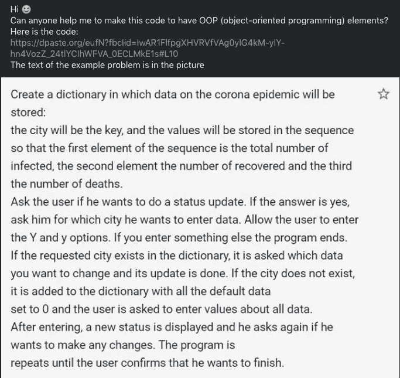
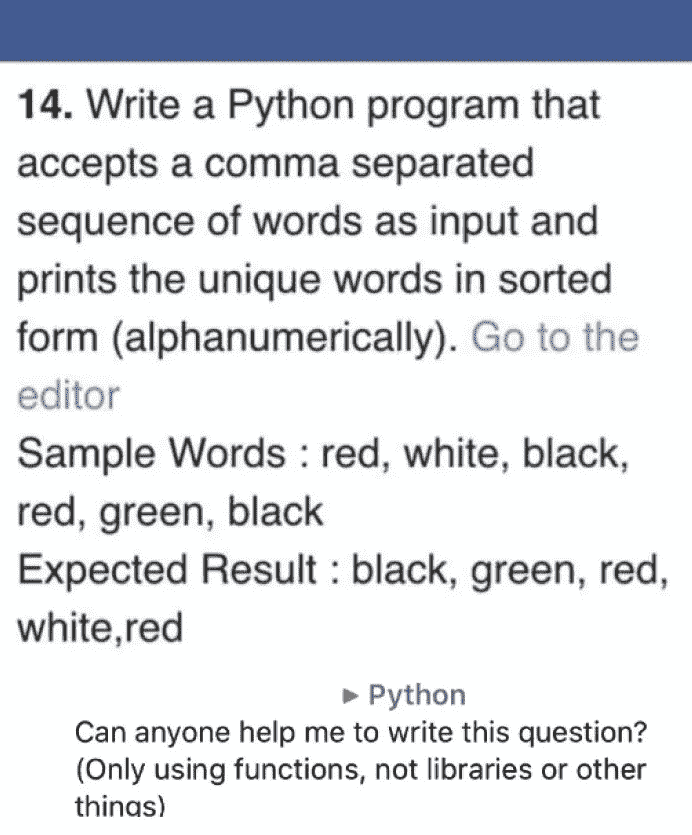
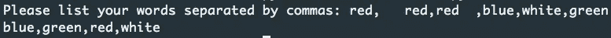
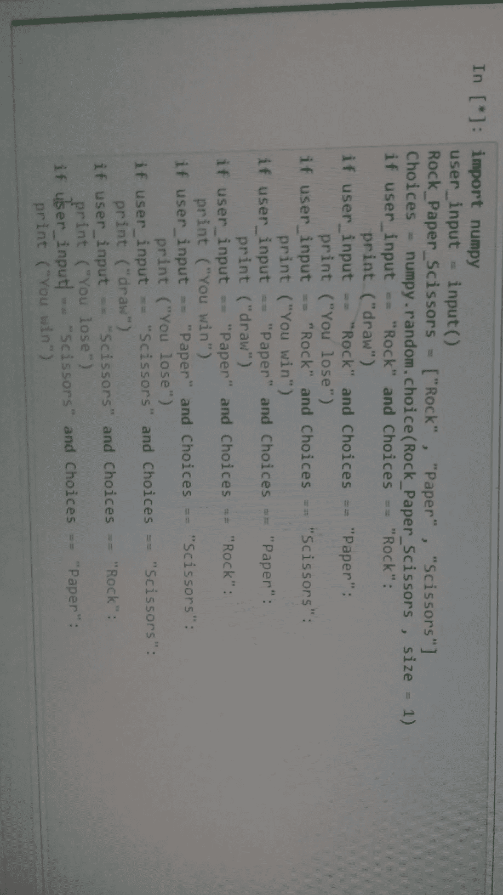

# 5 天做别人的 Python 作业

> 原文：<https://towardsdatascience.com/5-days-of-doing-other-peoples-python-homework-bc00b87d9b90?source=collection_archive---------47----------------------->

## 所有的家庭作业都很酷，不仅仅是你自己的


照片由[古斯塔沃·福林](https://www.pexels.com/@gustavo-fring?utm_content=attributionCopyText&utm_medium=referral&utm_source=pexels)从[派克斯](https://www.pexels.com/photo/mother-and-daughter-bonding-3985033/?utm_content=attributionCopyText&utm_medium=referral&utm_source=pexels)拍摄

> 看起来你想让别人帮你做作业…

让我帮你做作业吧！家庭作业应该让你学习你正在做的主题。做别人的作业只是让别人摆脱困境，他们也会错过学习的因素，对不对？

通常你会皱眉说“看起来你只是想让某人做你的作业……”，但是做别人的作业会很有趣！如果他们不想学，我当然想学。

我没有感到有点恼火，而是跳上车开始做作业！所有这些都可以在各种脸书团体中找到。我保持帖子匿名，但如果你看到你的帖子，并希望得到信任，请给我留言，我会将它添加到文章中。

# 第一天—用面向对象编程创建疫情:

让我们以最彻底的一个开始这一周。



这涉及到*面向对象编程*的使用。我想画出这些课程的草图，看看它们是如何联系在一起的，但是看着作业，我不认为我们需要太多。这可能是一个只有字典而没有课程的任务。然后你需要把它全部转换成包含类。这是一种强制使用的类赋值。

起初，我在寻找一个`City`类的用法。你可以在这里使用一个城市类，但是真的没有必要。我们可以创建一个`Pandemic`类并将城市存储在 dict 中。

# pandemic.py

## def add_city()

这个方法只是在`self._city_overview = {}`字典中添加了一个城市。作业说城市的数据应该是一个序列。这通常是一个列表或一个元组，但是字典在这里更好，所以我们为用户添加到主字典中的键创建一个新字典，就像这样。

```
self._city_overview = {'Oslo' : {infected:0 , recovered:0 , deaths:0} }
```

这样，我们就完成了添加带有默认值的城市的任务。

## def edit_city()

此方法编辑主概览字典中的现有城市。

因为我们只接受整数，所以我们首先检查是否所有的输入都是整数。由于 input 首先返回一个字符串，我们可以使用`.isdigit()`来检查用户是否输入了有效的数字。

我们也可以使用`int(input(‘’))`来强制一个 int，但是我不喜欢这种方法，因为如果你输入一个字符串，它会使程序崩溃。

## def 显示 _ 所有 _ 城市 _ 统计()

这个方法只是显示我们拥有的数据。因为这是一个 dict with dicts，我们需要在这里做一些循环。

要打印城市名，这是一个键，我们只需要循环遍历这些键。我们可以在 dict 上使用`key()`方法来获得这些

```
for key in self._city_overview.keys():
```

对于 city 键中的 dict，我们需要键和值。这里我们可以使用`items()`方法

```
for inner_key,inner_value in self._city_overview[key].items():
    print (f'{inner_key} : {inner_value}')
```

如果我们使用列表库，看起来会更漂亮。你可以在我关于作家分析的文章中看到这些漂亮表格的例子:

[](https://medium.com/better-marketing/7-ways-you-can-find-the-magic-formula-of-great-successful-writers-d32001d6ac4e) [## 7 个数据点编译成功媒体作家的神奇公式

### 用数据分析为什么三位顶级作家如此成功

medium.com](https://medium.com/better-marketing/7-ways-you-can-find-the-magic-formula-of-great-successful-writers-d32001d6ac4e) 

如果你觉得大胆，你可以在这里找到 400 万个城市的名单:

[](https://simplemaps.com/data/world-cities) [## 世界城市数据库

### 我们自豪地提供一个简单、准确和最新的世界城镇数据库。我们从…构建了它

simplemaps.com](https://simplemaps.com/data/world-cities) 

使用`csv`模块填充项目。

## def get_city_overview()

以防万一，你曾经需要抓住任何东西的概述字典

# main.py

让我们来看看完成所有交互的主程序。没什么大不了的，但我会把它分解。

您要做的第一件事是导入您的疫情类。

我们首先创建电晕疫情，然后我们将`user_choice`设置为`‘y’`，以确保我们进入了 while 循环，在这里我们请求用户输入。

作业说我们需要考虑到`‘Y’`和`‘y’`。通过使用`lower()`，我们确保输入总是小写。这样我们只需要检查`‘y’`就可以了。

如果用户说`‘y’`，我们要求城市。如果城市在字典中，我们可以使用。edit_city()方法。

如果城市不存在，作业希望我们用默认值添加城市。我们为此使用了`.add_city()`方法，如果用户想要立即编辑新的城市，我们在新创建的城市上使用`edit_city()`。

您可以将数据输入到疫情方法本身，而不是在 main 中运行两次。这可能是一个好主意，看看…

# 第 2 天—器械包的经典用法:

让我们更轻松地做下一个来喘口气。



我喜欢作业中有错误的时候…这经常发生。预期的结果不会返回您期望从为解决问题而编写的程序中得到的结果。

作业希望我们得到一个序列中的值的列表(我猜要么是一个列表，要么是一个逗号分隔的字符串。)然后，它希望我们删除任何重复项，并返回排序后的列表。

有许多方法可以获得逗号分隔值的列表。对用户来说，最简单的方法可能是写一个单词，按回车键，然后再写一个。你可以创建一个菜单，直到你按下“q”或其他键。对于这个项目，我选择让用户一次按顺序输入所有内容。因为这个方法，我们需要解决另一个。如果用户在任何地方输入空格，我们需要删除它们。

你可能还想使用`lower()`来确保“红色”和“红色”被同等对待。

为了解决这个问题，我们可以使用多种内置方法。这背后的基本思想是:

```
1) get a list of strings comma separated. 
2) kill the duplicates
3) sort what's left
4) return sorted representation
```

我们允许用户输入单词，所以它是多才多艺的。我们还添加了一个条，这样我们可以在用户添加空格时考虑错误。



互动

```
split_user_words = [word.strip() for word in user_words.split(',')]
```

我们使用列表理解去除列表元素中的所有空格。拆分版的话，加`strip()`。这将创建一个去掉空格的新列表。

```
clean_user_words = set(split_user_words)
```

这将创建一个`set`，您可能知道，一个`set`不能有同一个单词的多个实例。这对这项任务来说再合适不过了。

```
print (','.join(sorted(clean_user_words)))
```

为了确保我们根据任务文本正确输出打印结果，我们可以使用`.join()`。这将使用列表中的所有元素，并将它们连接成一个字符串。`‘,’`告诉 join 用逗号将它们连接起来。猜猜`(sorted(clean_user_words))`是干什么的。

# 第三天——理解代码并以 pythonic 的方式重写代码


正如函数名所示，代码将接受一个 iterable 并返回第二大的 iterable。在这种情况下，我们传递一个列表。

它是以一种混乱的方式写的，但是让我们看看我们得到了什么。

```
largest = nums[0]
second_largest = num[0]
```

这里，代码将列表的第一个数字分配给最大和第二大的变量。当我们遍历列表的其余部分时，它准备看看是否有更大的数字进来。

```
for i in range(1,len(nums)):
    if nums[i] > largest:
        second_largest = largest
        largest = nums[i]
```

好的，如果下一个数字大于`largest`，它会将当前最大的数字加到变量`second_largest`中，并将新的更大的值赋给 maximum。这样它就把数字推到了一边。

```
elif nums[i] > second_largest:
    second_largest = nums[i]
```

如果该数字不大于`largest`，但大于`second_largest`，则应该将其从变量中推出并保持最大值。

```
return second_largest
```

## 替代代码:

我觉得上面的代码很笨拙。看起来写它的人来自非 Python 背景。手动工作太多，无法抓住要点。

**下面是我如何编写相同的函数:**

```
def get_second_largest(number_list):
    return sorted(number_list)[-2]def main():
    my_nums = [44,11,8,29,25,76,88]
    print (f'second highest number: {get_second_largest(my_nums)}')main()>>> second highest number: 76
```

或者，您可以使用`.sort()`，但是如果我不需要就地修改列表，我更喜欢使用 sorted。

```
#alternative:
def get_second_largest_sort(number_list):
    number_list.sort()
    return number_list[-2]
```

# 第四天——石头、布、剪刀



是的…大多数“截图”都是这样贴出来的。

我注意到最近在脸书问题上石头、纸、剪刀有所增加。我不知道这是不是因为几个人在做同一个作业，但我认为尝试解决这个问题是个好主意。

我不想用一长串 if/else 来解决这个问题，所以我开始寻找一种实现规则的方法，并找到了一种写一个简短而可靠的版本的方法。

## 定义菜单()

这是返回一个长字符串并将其用作菜单的简单方法。我想把它放在一个独立的函数中，这样它就很容易改变，并且和游戏本身是分开的。

## def 随机计算机选择()

该函数使用导入模块，并根据该随机数返回计算机选择。

该数字生成索引，并使用备选项列表返回一个选项。

## 定义节拍 _ 检查()

这个函数允许我们不依赖一堆如果问题。

字典保存节拍值。这意味着键“石头”将击败值“剪刀”。

我使用了`.get()`方法，而不是`dict[key]`方法来获取键的值。通过使用`.lower()`,我们也确保捕捉到岩石对岩石。

[Jonathan Hsu](https://medium.com/u/d2ef7f5ede53?source=post_page-----bc00b87d9b90--------------------------------) 有一篇很好的文章讲述了这是如何工作的:

[](https://medium.com/better-programming/stop-using-square-bracket-notation-to-get-a-dictionarys-value-in-python-c617f6ea15a3) [## 在 Python 中，停止使用方括号符号来获取字典的值

### 超越传统方法，保护您的代码

medium.com](https://medium.com/better-programming/stop-using-square-bracket-notation-to-get-a-dictionarys-value-in-python-c617f6ea15a3) 

我们不是在检查打字中的实际错误。您应该将这一点融入代码和交互循环中。

## def main()

这里没什么特别的…我们有电脑选择和玩家选择。然后我们让他们互相比赛，看谁赢了。

这里唯一的额外部分是检查它是否是一个领带。

## 升级程序

为了让这个游戏更具互动性，你可以尝试创建一个循环，这样玩家就可以想玩多久就玩多久。

# 第五天——只想学 Python


嗯，他的范围很广，我对此没有很好的答案。不过，我想链接一些关于 Python 的好资源。下面是我用过的资源和被推荐的资源的随机列表。欢迎在评论区添加您的收藏。

## 用 Mosh 编程— Python 全教程

## Andrei Neagoie——2020 年的完全 Python 开发者:零到精通，

我的课程

## zed Shaw——艰难地学习 Python

**ISBN-10:**1593279280
**ISBN-13:**978–1593279288

## Eric Matthes——Python 速成班第二版:基于项目的编程入门实践

**ISBN-10:**1593279280
ISBN-13:978–1593279288

## YouTube——科里·谢弗

[科里谢弗频道](https://www.youtube.com/user/schafer5)

## YouTube——卡勒·哈尔登

[卡勒·哈尔登频道](https://www.youtube.com/channel/UCWr0mx597DnSGLFk1WfvSkQ)

# 最后

这是一个非常有趣的练习，我希望你能学到一两个技巧。我正在考虑创作一个名为“允许我做你的作业”的系列。我接触初学者的地方。我们会看到这有多受欢迎。

谢谢你坚持和我在一起！

-M