# 在你的机器学习面试中脱颖而出的 5 个衍生物

> 原文：<https://towardsdatascience.com/5-derivatives-to-excel-in-your-machine-learning-interview-25601c3ba9fc?source=collection_archive---------6----------------------->

## 机器学习背后的微积分:回顾导数，梯度，雅可比和海森

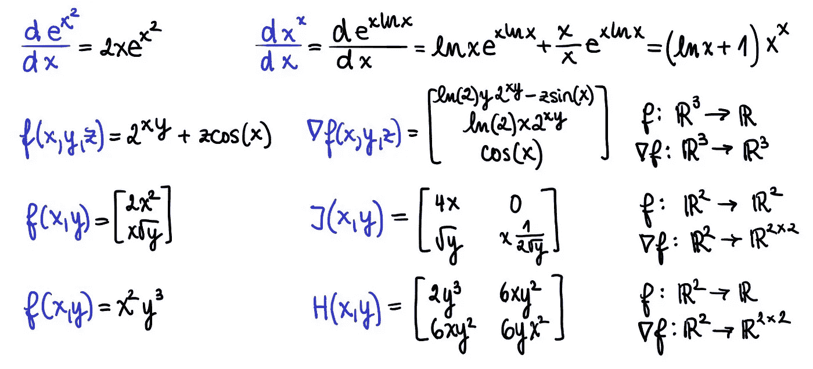

就业市场对机器学习工程师及其对数学的深刻理解存在整体怀疑。事实是，所有机器学习算法本质上都是数学框架——支持向量机被表述为对偶优化问题，主成分分析被表述为光谱分解滤波，或者神经网络被表述为连续非线性函数的组合——只有彻底的数学理解才能让你真正掌握它们。

各种 Python 库有助于将高级算法用于简单的步骤，*例如，* Scikit-learn 库包含 KNN、K-means、决策树等。，或 Keras，让您无需了解 CNN 或 rnn 背后的细节就可以构建神经网络架构。然而，成为一名优秀的机器学习工程师需要的远不止这些，这些职位的面试通常会包括一些问题，例如，从零开始实现 KNN 或决策树，或者推导线性回归或 softmax 反向传播方程的矩阵闭式解。

在这篇文章中，我们将回顾微积分的一些基本概念，例如一维和多维函数的导数，包括**梯度、**雅可比和海森，让你开始准备面试，同时帮助你建立一个良好的基础，成功地深入探索机器学习背后的数学，特别是神经网络。

这些概念将用 5 个衍生产品的例子来说明，这些例子是你面试时绝对应该随身携带的:

1.  复合指数函数的导数— *f(x)= eˣ*
2.  变基变指数函数的导数— *f(x)= xˣ*
3.  多维输入函数的梯度— *f(x，y，z) = 2ˣʸ+zcos(x)*
4.  多维函数的雅可比矩阵— *f(x，y) = [2x，x √y]*
5.  多维输入函数的 hessian—*f(x，y) = x y*

# 导数 1:复合指数函数

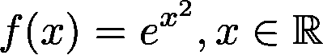

指数函数是一个非常基础、常见和有用的例子。它是一个严格的正函数，*即ℝ的 eˣ > 0* ，需要记住的一个重要性质是 *e⁰ = 1。*另外，你要记住指数是对数函数的倒数。这也是最容易求导的函数之一，因为它的导数就是指数本身，*即(eˣ)' = eˣ.)*当指数与另一个函数结合时，导数变得更加复杂。在这种情况下，我们使用**链式法则**公式，即 *f(g(x))* 的导数等于 *f'(g(x))⋅g'(x)* ，*即*:

应用链式法则，我们可以计算出 *f(x)= eˣ的导数。*我们先求出 *g(x)=x 的导数，即 g(x)'=2x。我们还知道，ˣ)'=eˣ.*将这些相乘得到两个中间结果，我们得到

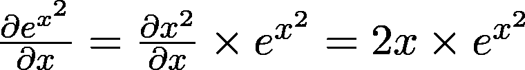

这是一个非常简单的例子，乍一看似乎微不足道，但它经常被面试官作为热身问题来问。如果你有一段时间没有看到衍生品，确保你能迅速对这些简单的问题做出反应，因为虽然这不会给你这份工作，但在这样一个基本问题上的失败肯定会让你失去这份工作！

# 导数 2。变基变指数函数

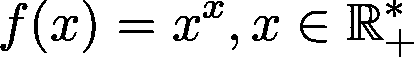

这个功能在面试中是一个经典，尤其是在金融/量化行业，这里对数学技能的测试甚至比科技公司的机器学习职位更深入。这有时会让受访者脱离他们的舒适区，但实际上，这个问题最难的部分是能够正确地开始。

当处理这种指数形式的函数时，要认识到的最重要的事情是，第一，指数和对数之间的反比关系，第二，每个指数函数都可以改写为自然指数函数的形式

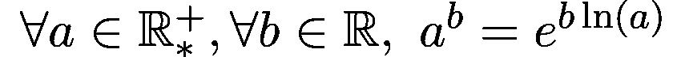

在我们讨论 f(x) = xˣ的例子之前，让我们用一个更简单的函数 f(x) = 2ˣ.来演示这个性质我们首先使用上面的等式将 2 *ˣ* 重写为 *exp(xln(2))* ，随后应用链式法则来推导合成。

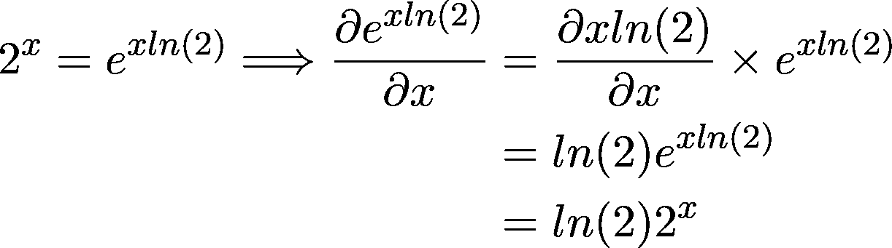

回到最初的函数 *f(x)=xˣ* ，一旦你将函数改写为 *f(x)=exp(x ln x)* ，导数的计算就变得相对简单，唯一可能困难的部分是链式法则步骤。

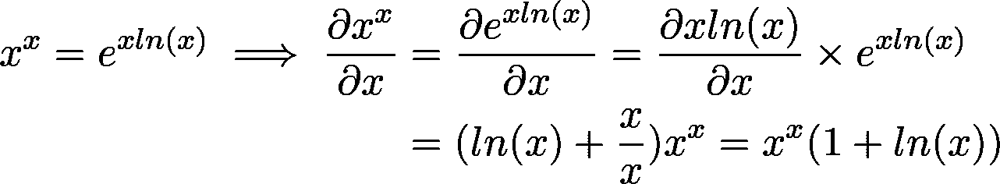

注意，这里我们对指数 *xln(x)* 使用了乘积法则*(uv)’= u’v+uv’*。

这个函数通常在没有任何函数域信息的情况下被调用。如果你的面试官没有默认指定领域，他可能是在测试你的数学敏锐度。这就是问题的欺骗性所在。在不具体说明域的情况下，似乎为正值和负值都定义了 *xˣ* 。但对于负数 *x* ， *e.g.(-0.9)^(-0.9)* ，结果是一个复数，具体为*-1.05–0.34 I*。一种可能的解决方法是将函数的定义域定义为ℤ⁻∪ℝ⁺0(进一步讨论见[这里的](https://math.stackexchange.com/questions/1551470/domain-of-xx))，但是这对于负值仍然是不可微的。因此，为了正确定义 *xˣ* 的导数，我们需要将定义域限制为严格的正值。我们排除 0 是因为对于定义在 0 中的导数，我们需要左边的极限导数(对于负值限制在 0 中)等于右边的极限导数(对于正值限制在 0 中)，这是一个在这种情况下被打破的条件。自左极限

未定义，函数在 0 中不可微，因此函数的定义域仅限于正值。

在我们进入下一部分之前，我留给你这个函数的一个稍微高级一点的版本来测试你的理解: *f(x) = xˣ* 。如果您理解了第一个示例背后的逻辑和步骤，添加额外的指数应该不会造成任何困难，并且您应该得出以下结果:

# 导数 3:多维输入函数的梯度

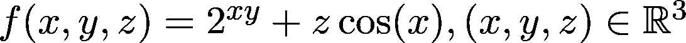

到目前为止，一阶和二阶导数部分讨论的函数都是从ℝ到ℝ的映射，*即*函数的定义域和值域都是实数。但是机器学习本质上是矢量的，函数是多维的。这种多维性的一个很好的例子是输入大小为 *m* 和输出大小为 *k 的神经网络层，即 f(x) = g(Wᵀx + b，*其中是线性映射 *Wᵀx (* 具有权重矩阵 *W* 和输入向量 *x* )和非线性映射 *g* (激活函数)的元素式组合。在一般情况下，这也可以看作是从ℝᵐ到ℝᵏ.的映射

在 *k=1 的具体情况下，*的导数称为**梯度** *。*现在让我们计算以下三维函数的导数，该函数将ℝ 映射到ℝ:

**

*你可以把 *f* 想象成一个把大小为 3 的向量映射到大小为 1 的向量的函数。*

*多维输入函数的导数被称为**梯度**，用符号 *nabla* (倒置 *delta* ): ∇.表示将ℝⁿ映射到ℝ的函数 *g* 的梯度是 *g* 的一组 *n* 偏导数，其中每个偏导数是 *n* 变量的函数。因此，如果 g 是从ℝⁿ到ℝ的映射，那么它的梯度∇g 就是从ℝⁿ到ℝⁿ.的映射*

*为了求我们函数 *f(x，y，z) = 2ˣʸ + zcos(x)* 的梯度，我们构造了一个偏导数的向量 *∂f/∂x，*∂f/∂y， *∂f/∂z* ，得到如下结果:*

*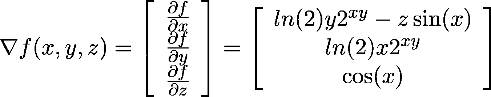*

*注意，这是一个类似于前一节的例子，我们使用等价关系 *2ˣʸ=exp(xy ln(2))。**

*总之，对于将ℝ 映射到ℝ*的多维函数，导数是将ℝ映射到ℝ的梯度 *∇ f，*。**

**在ℝᵐ到ℝᵏ的映射的一般形式中，其中将ℝᵐ映射到ℝᵏ的多维函数的导数是雅可比矩阵(而不是梯度向量)。让我们在下一节对此进行研究。**

# **导数 4。多维输入输出函数的雅可比矩阵**

**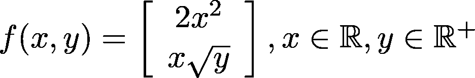**

**从上一节我们知道，映射ℝᵐ到ℝ的函数的导数是映射ℝᵐ到ℝᵐ.的梯度但是对于输出域也是多维的情况，*即*对于 *k > 1* 从ℝᵐ到ℝᵏ的映射呢？**

**在这种情况下，导数称为**雅可比矩阵**。我们可以简单地将梯度视为雅可比矩阵的一种特殊情况，其维数为 *m* x *1* ，其中 *m* 等于变量的数量。函数 *g* 映射ℝᵐ到ℝᵏ的雅可比矩阵 *J(g)* 就是ℝᵐ到ℝᵏ*ᵐ.的映射这意味着输出域的尺寸为 *k* x *m* ，*即*是一个形状为 *k* x *m* 的矩阵。换句话说， *J(g)* 的每一行 *i* 代表 *g.* 的每个子功能 *gᵢ* 的梯度 *∇ gᵢ***

**让我们推导上面定义的函数 *f(x，y) = [2x，x √y]* 映射ℝ到ℝ，因此输入和输出域都是多维的。在这种特殊情况下，由于平方根函数不是为负值定义的，我们需要将 *y* 的域限制在ℝ⁺.我们的输出雅可比矩阵的第一行将是函数 1 的导数， *i.e.∇ 2x，*，第二行是函数 2 的导数，*，即* *∇ x √y.***

**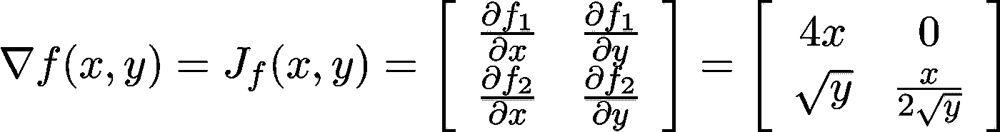**

**在深度学习中，雅可比矩阵特别令人感兴趣的一个例子是可解释性领域(例如，参见[基于敏感性的神经网络解释](https://arxiv.org/abs/1812.01029))，该领域旨在理解神经网络的行为，并分析神经网络输出层对输入的敏感性。雅可比矩阵有助于研究输入空间的变化对输出的影响。这可以类似地应用于理解神经网络中中间层的概念。**

**总之，记住梯度是一个*标量*相对于一个*向量*的导数，雅可比是一个*向量*相对于另一个*向量*的导数。**

# **导数 5。多维输入函数的 Hessian**

**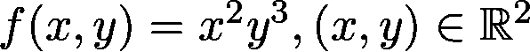**

**到目前为止，我们的讨论只集中在一阶导数上，但是在神经网络中我们经常会谈到多维函数的高阶导数。一个特殊情况是二阶导数，也称为**海森矩阵**，并表示为 *H(f)* 或 *∇(纳布拉平方)。从ℝⁿ到ℝ的映射是从ℝⁿ到ℝⁿ*ⁿ.的映射***

**让我们分析一下，在输出领域，我们是如何从ℝ走向ℝⁿ*ⁿ的。一阶导数，*即*梯度 *∇g，*是从ℝⁿ到ℝⁿ的映射，其导数是雅可比矩阵。因此，每个子函数 *∇gᵢ* 的推导导致ℝⁿ到ℝⁿ的映射，具有 *n 个*这样的函数。你可以这样想，就好像导出梯度向量的每个元素展开成一个向量，从而成为向量的向量，*即*一个矩阵。**

**为了计算 Hessian，我们需要计算所谓的*交叉导数，t* 也就是，首先相对于 *x* 求导，然后相对于 *y* 求导，反之亦然。有人可能会问，我们取交叉导数的顺序是否重要；换句话说，海森矩阵是否对称。在函数 *f* 是𝒞的情况下，*即*两次连续可微，*施瓦兹定理*陈述交叉导数相等，因此海森矩阵是对称的。一些不连续但可微的函数不满足交叉导数相等。**

**构造函数的 Hessian 等价于求标量值函数的二阶偏导数。对于特定示例 *f(x，y) = x y* ，计算产生以下结果:**

**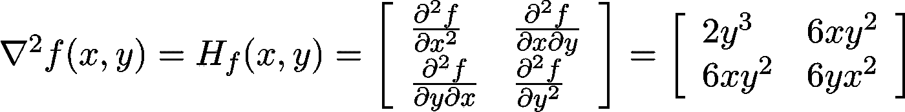**

**你可以看到交叉导数 *6xy* 实际上是相等的。我们首先针对 *x* 进行推导，得到 *2xy、*，然后再针对 *y、*得到 *6xy。*对角元素是简单的*fᵢ*，用于*x*或*y*的每个一维子功能**

**一个扩展将是讨论多维函数的二阶导数将ℝᵐ映射到ℝᵏ的情况，这可以直观地视为二阶雅可比。这是从ℝᵐ到ℝᵏ*ᵐ*ᵐ的映射，*即*一个 3D 张量。类似于 Hessian，为了找到 Jacobian 的梯度(第二次微分)，我们对 *k* x *m* 矩阵的每个元素进行微分，得到一个向量矩阵，*即*一个张量。虽然不太可能要求您手动进行此类计算，但了解多维函数的高阶导数非常重要。**

# **结论**

**在本文中，我们回顾了机器学习背后的重要微积分基础。我们用一维和多维函数的例子演示了它们，讨论了梯度、雅可比和海森。这篇综述是对可能的面试概念的彻底演练，也是对机器学习背后的微积分相关知识的概述。**