# 定制熊猫图和图表的 5 种简单方法

> 原文：<https://towardsdatascience.com/5-easy-ways-of-customizing-pandas-plots-and-charts-7aefa73ff18b?source=collection_archive---------4----------------------->

## Pandas 为您提供了一种简单而又吸引人的方式来从您的数据中制作图表。但是有时候你想要一些不同的东西。这里有一些建议

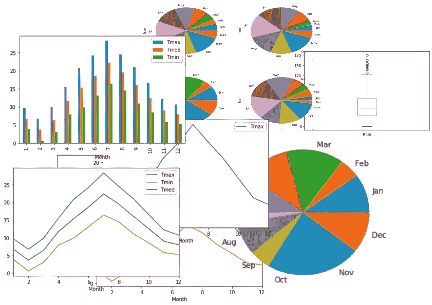

也许你是一名正在整理新故事的数据记者，或者是一名正在准备论文或演示的数据科学家。你已经有了一套漂亮的图表，看起来不错，但稍加调整会有所帮助。也许你想给他们所有的头衔。也许有些会用网格来改善，或者刻度在错误的位置或者太小而不容易阅读。

您知道如何制作折线图、条形图、散点图等，但并不精通 Pandas plot 函数的所有细节(如果看不到下面的链接)。

[](https://medium.com/codefile/plotting-with-pandas-an-introduction-to-data-visualization-8bd7c0831650) [## 用熊猫绘图:数据可视化导论

### 如果您是一名初露头角的数据科学家或数据记者，能够可视化您的数据会让您有能力…

medium.com](https://medium.com/codefile/plotting-with-pandas-an-introduction-to-data-visualization-8bd7c0831650) 

你不必坚持你被给予的东西。有相当多的参数允许你改变你的图表的各个方面。你可以改变标签，添加网格，改变颜色等等。

使用底层的 matplotlib 库，你可以改变你的绘图的方方面面，这可能会变得复杂。然而，我们将看看一些我们可以用熊猫做的更简单的事情。

在我们开始之前，您需要导入适当的库并获取一些数据。

让我们从导入运行示例所需的所有库开始

```
# The first line is only required if you are using a Jupyter Notebook

%matplotlib inline import numpy as npimport pandas as pdimport matplotlib.pyplot as plt
```

这都是非常标准的东西，我以前的文章应该很熟悉。不过有一点需要注意的是第一行——如果你像我一样使用 Jupyter 笔记本，那么你可能需要包括这一行。如果你正在使用一个普通的 Python 程序，或者 Python 控制台，那么你应该*而不是*包括它。

## 获取一些数据

您需要一些数据来处理，所以我们将使用与之前相同的数据集:2008 年英国伦敦的天气数据。

像这样加载数据:

```
weather = pd.read_csv(‘https://raw.githubusercontent.com/alanjones2/dataviz/master/london2018.csv')print(weather[:2])Year Month Tmax Tmin Rain Sun
 0 2018 1 9.7 3.8 58.0 46.5
 1 2018 2 6.7 0.6 29.0 92.0
```

print 语句打印出表的前几行，代表一月和二月。你可以看到有四个数据(除了年份和月份)， *Tmax* 是该月的最高温度， *Tmin* 是最低温度， *Rain* 是以毫米为单位的降雨量， *Sun* 是该月的日照总时数。

所以让我们画一个简单的图表，展示一年中最高温度的变化

```
weather.plot(x=’Month’, y=’Tmax’)plt.show()
```

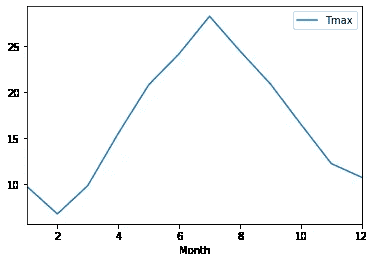

这是默认图表，完全可以接受。但是我们可以改变一些事情让它变得更好。

# 1.改变尺寸和颜色

你可能想做的第一件事就是改变尺寸。为此，我们添加了 *figsize* 参数，并赋予其尺寸 *x* 和 *y* (以英寸为单位)。这些值由一个元组给出，如下所示。

为了改变颜色，我们设置了*颜色*参数。最简单的方法是使用一个代表有效网页颜色的字符串，如“红色”、“黑色”或“蓝绿色”。(注:你可以在维基百科找到网页颜色列表。)

```
weather.plot(x='Month', y='Tmax', figsize=(8,5), color='Red')plt.show()
```

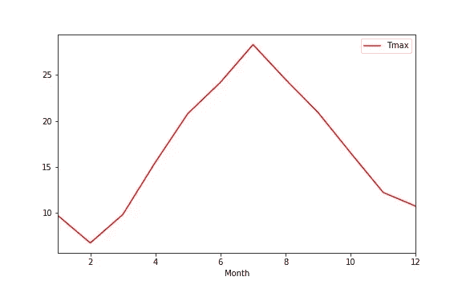

# 2.设置标题

对于一篇文章、一篇论文或一个演示文稿，你很可能想要为你的图表设置一个标题。正如您可能已经收集到的，这主要是知道什么是正确的参数并正确地设置它们。设置标题的参数是*标题*。当然啦！代码如下:

```
weather.plot(x=’Month’, y=’Tmax’, title=”Maximum temperatures”)plt.show()
```

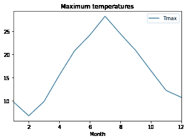

# 3.显示网格

虽然默认图表很好，但有时您希望观众更容易看到图表中的某些值。在绘图上绘制网格线会有所帮助。

要绘制网格，只需将*网格*参数设置为*真*。熊猫默认*假*。

```
weather.plot(x=’Month’, y=’Tmax’, grid=True)plt.show()
```

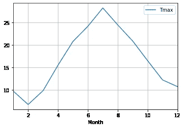

# 4.改变传奇

图例以代表 *y* 轴的列名给出。如果这不是一个可接受的描述性名称，您可以更改它。或者，事实上，你可以完全消除它！

如果我们想要移除它，我们将参数*图例*设置为*假*。如果我们想改变标签，我们结合*标签*参数，并将其设置为我们想要显示的字符串。

```
weather.plot(x=’Month’, y=’Tmax’, legend=False)plt.show()
```

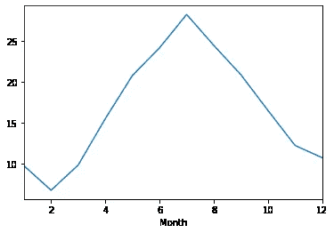

```
weather.plot(x=’Month’, y=’Tmax’, label=’Max Temp’)plt.show()
```

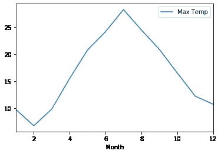

# 5.自定义刻度

刻度是在 *x* 和 *y* 轴上的刻度。你可以看到，在我们的图表上，它们在 y 轴上被标注为 10 到 25，在 y 轴上被标注为 2 到 12。鉴于底部的集合应该代表月份，如果它们从 1 到 12 会更好。我们可以用元组来设置刻度标签。如果我们想显示所有的十二个月，我们可以将参数 *xticks* 设置为(1，2，3，4，5，6，7，8，9，10，11，12)。你可以用 *yticks* 参数做类似的事情。看一下这段代码:

```
weather.plot(x=’Month’, y=’Tmax’, xticks=range(1,13), yticks=(0,10,20,30))plt.show()
```

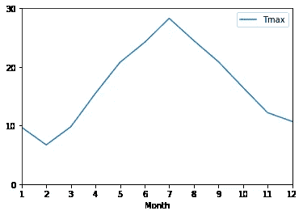

如您所见，我已经显式设置了两组刻度。 *y* 刻度现在从 0 开始，以十为单位增加到 30， *x* 刻度每月显示一次。但是我在这里有点偷偷摸摸，没有使用我在上面展示的元组，而是使用 Python *range* 函数来生成一个从 1 到 12 的列表(少打字！).

如果您想完全删除这些记号，只需将其中一个参数设置为空元组即可，例如 xticks=()。

```
weather.plot(x=’Month’, y=’Tmax’, xticks=())plt.show()
```

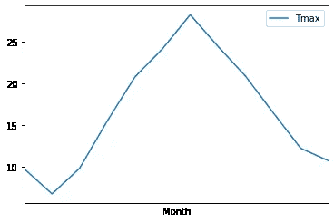

如果你想更强调记号，你可以改变字体大小。在下面的例子中，你可以看到如何。

```
plot = weather.plot(x=’Month’, y=’Tmax’, xticks=range(1,13), fontsize=18)plt.show()
```

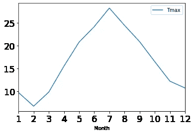

# 可能会变得很乱

我的意思是你的代码可能会变得混乱。如果你想设置刻度、标题、标签、网格等等，该怎么办呢？首先，做这个情节的代码行会很长，其次，如果你有几个情节让你发现自己在重复它。

这里有一个解决方案。

假设您希望所有的图看起来都一样。您要做的是定义一个字典，其中包含您想要应用于所有图表的所有参数，如下所示:

```
plot_kwargs={‘xticks’:range(1,13),
 ‘yticks’:(0,10,20,30),
 ‘grid’:True,
 ‘fontsize’:12}
```

然后，您可以利用 Python 的**操作符，而不是显式地输入所有的参数，该操作符会将一个字典扩展为一个关键字参数列表。我将变量 *plot_kwargs* 称为 *kwargs* 是包含关键字参数的变量的常规名称(这就是它们是什么)。

像这样使用它们:

```
weather.plot(y=’Tmax’,x=’Month’, **plot_kwargs)plt.show()
```

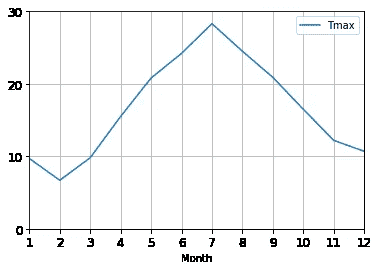

现在，您也可以对其他图使用相同的字典，例如:

```
weather.plot.scatter(y=’Tmax’,x=’Month’, legend=True, label=”Min Temperature”, **plot_kwargs)plt.show()
```

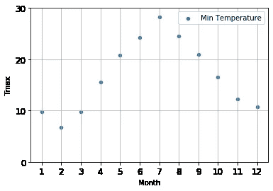

在这里，我使用了 *plot_kwargs* 参数来设置默认参数，但是为单独的图显式地设置这些参数。

## 好了

嗯，不。不是真的。使用 Pandas 和 matplotlib，您可以做很多事情来定制您的地块。您也可以在将图保存到文件时进行更改。一篇文章涵盖的内容实在太多了。

谢谢，看到了文章的结尾，希望你觉得有用。

*关于格式的快速附言。所有的代码都很短，但是有些行有点长，而且是换行的——所以我在每一行后面都加了一个空行，这样你就可以看到应该在一行上的内容。文章末尾的字典分配中唯一的例外，看起来不错。*

[](https://medium.com/codefile/plotting-with-pandas-an-introduction-to-data-visualization-8bd7c0831650) [## 用熊猫绘图:数据可视化导论

### 如果您是一名初露头角的数据科学家或数据记者，能够可视化您的数据会让您有能力…

medium.com](https://medium.com/codefile/plotting-with-pandas-an-introduction-to-data-visualization-8bd7c0831650)