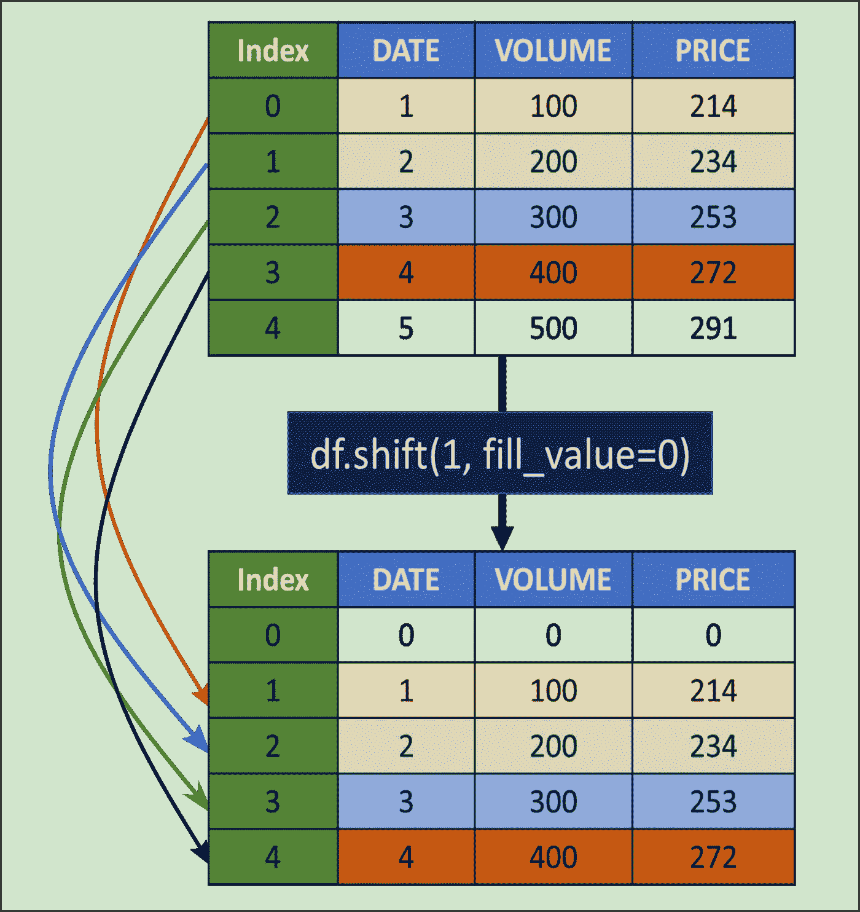
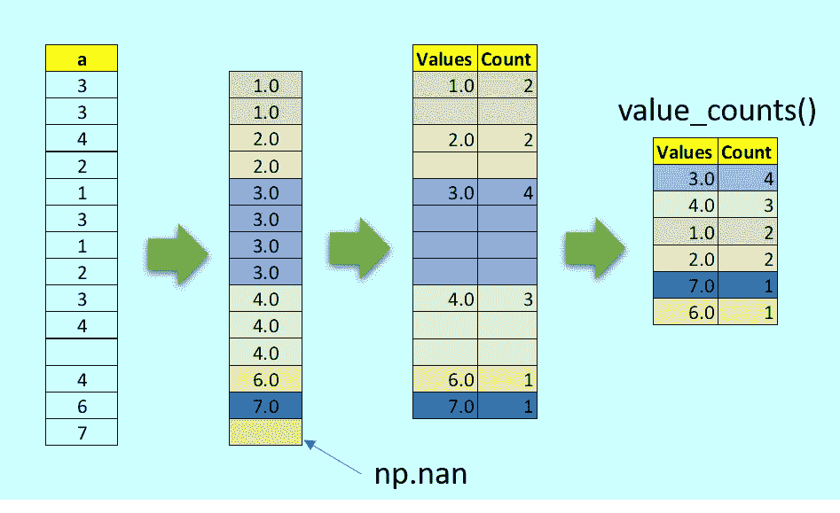
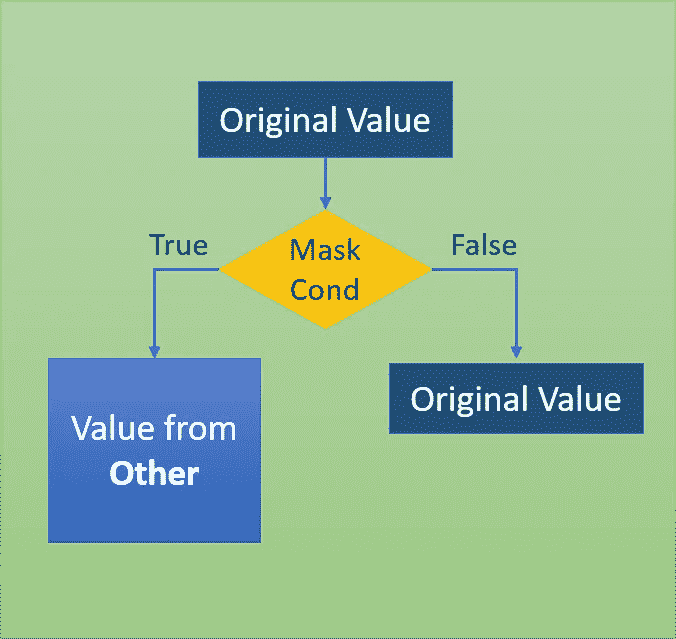
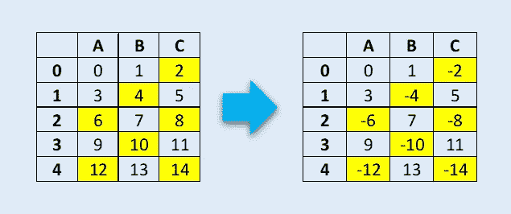
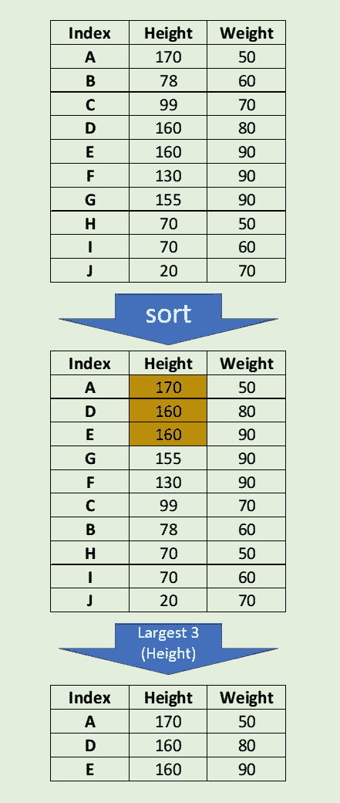
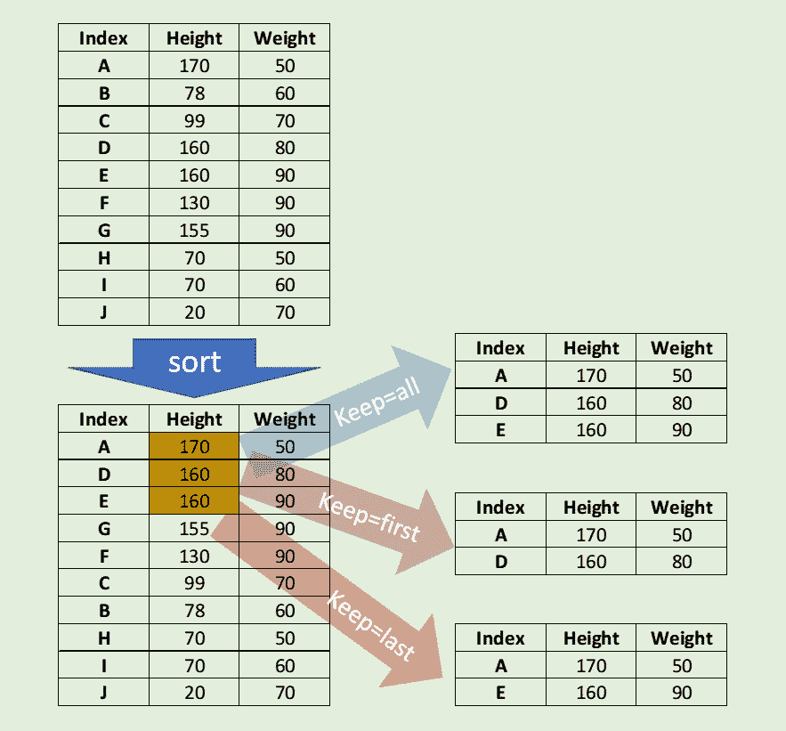

# 5 优雅的 Python 熊猫函数

> 原文：<https://towardsdatascience.com/5-elegant-python-pandas-functions-a4bf395ebef4?source=collection_archive---------7----------------------->


图片来源:Pixabay &谷歌照片

## 五只美丽的熊猫为日常数据科学的使用发挥作用

在机器学习和数据科学项目的日常数据处理中，Pandas 是使用最多的 Python 库之一。像 Numpy 一样，Pandas 用许多优雅构建的函数统治着数据科学、机器学习和人工编程领域，这些函数为每个从业者的武器库增添了力量。在这里，我重申一些优雅的功能，这些功能使 Pandas 成为数据科学家和机器学习工程师的首选库。

## (1)换档()

假设您遇到了这样一种情况，您需要移动数据帧中的所有行，或者需要使用数据帧中前一天的股票价格。也许我们想在数据集中构建最近三天的平均温度；Shift()将是实现所有这些目标的理想方式。

Pandas Shift()函数，将指数移动所需的周期数。该函数采用一个称为周期的标量参数，它代表所需轴的移动次数。这个函数在处理时间序列数据时很有用。我们可以使用 fill_value 来填充超出边界的值。

```
import pandas as pd
import numpy as npdf = pd.DataFrame({'DATE': [1, 2, 3, 4, 5],
                   'VOLUME': [100, 200, 300,400,500],
                   'PRICE': [214, 234, 253,272,291]})print(df)

    DATE  VOLUME  PRICE
0     1     100    214
1     2     200    234
2     3     300    253
3     4     400    272
4     5     500    291df.shift(1)DATE  VOLUME  PRICE
0   NaN     NaN    NaN
1   1.0   100.0  214.0
2   2.0   200.0  234.0
3   3.0   300.0  253.0
4   4.0   400.0  272.0# with fill_Value = 0df.shift(1,fill_value=0)DATE  VOLUME  PRICE
0     0       0      0
1     1     100    214
2     2     200    234
3     3     300    253
4     4     400    272
```



现在，如果我们需要将前一天的股票价格作为一个新列，我们可以使用如下的 shift。

```
df['PREV_DAY_PRICE'] = df['PRICE'].shift(1,fill_value=0)
print(df)DATE  VOLUME  PRICE  PREV_DAY_PRICE
0     1     100    214               0
1     2     200    234             214
2     3     300    253             234
3     4     400    272             253
4     5     500    291             272
```

我们可以很容易地计算出最近三天的平均股价如下，并创建一个新的功能栏。

```
df['LAST_3_DAYS_AVE_PRICE'] = (df['PRICE'].shift(1,fill_value=0) + 
                               df['PRICE'].shift(2,fill_value=0) + 
                               df['PRICE'].shift(3,fill_value=0))/3
```

现在数据帧会变成

```
DATE  VOLUME  PRICE     LAST_3_DAYS_AVE_PRICE
0     1     100    214               0.000000
1     2     200    234              71.333333
2     3     300    253             149.333333
3     4     400    272             233.666667
4     5     500    291             253.000000
```

我们也可以向前移动，从下一个时间步或下一行获取值。

```
df['TOMORROW_PRICE'] = df['PRICE'].shift(-1,fill_value=0)
```

现在数据帧应该是:

```
DATE  VOLUME  PRICE     TOMORROW_PRICE
0     1     100    214             234
1     2     200    234             253
2     3     300    253             272
3     4     400    272             291
4     5     500    291               0
```

有关选项和其他设置的更多详细信息，请参考 Pandas [文档](https://pandas.pydata.org/pandas-docs/stable/reference/api/pandas.Series.shift.html?highlight=shift#pandas.Series.shift)。

## (2)值计数()

函数的作用是:返回包含唯一值的计数的对象。生成的对象可以按降序或升序排序，通过参数控制包括 NA 或排除 NA。请参考带有图示视图的 w 示例。该功能可用于 index 或 pandas 系列。



```
a = pd.Index([3,3,4,2,1,3, 1, 2, 3, 4, np.nan,4,6,7])
a.value_counts()#Output
3.0    4
4.0    3
1.0    2
2.0    2
7.0    1
6.0    1
dtype: int64
```

下面是这个系列的一个例子。

```
#Inb = pd.Series(['ab','bc','cd',1,'cd','cd','bc','ab','bc',1,2,3,2,3,np.nan,1,np.nan])
b.value_counts()#Outbc    3
cd    3
1     3
3     2
ab    2
2     2
dtype: int64
```

可以使用 Bin 选项，而不是计算值的唯一幻影，将索引划分到指定数量的半开 bin 中。

```
#Ina = pd.Index([3,3,4,2,1,3, 1, 2, 3, 4, np.nan,4,6,7])
a.value_counts(bins=4)#Out(2.5, 4.0]      7
(0.993, 2.5]    4
(5.5, 7.0]      2
(4.0, 5.5]      0
dtype: int64
```

关于选项和其他设置的更多细节，请参考熊猫[文档](https://pandas.pydata.org/pandas-docs/stable/reference/api/pandas.Series.value_counts.html)。

## (3)面具()

mask 方法是对系列或数据帧的每个元素应用 if-then 条件。如果 Cond 为 True，则它使用 Other 中的值(默认值为 NaN ),否则将保留原始值。这个 mask()方法与 where()非常相似。



参考下面的数据帧，我们要改变所有被 2 整除但没有余数的元素的符号。



这可以通过 mask 函数轻松实现。

```
df = pd.DataFrame(np.arange(15).reshape(-1, 3), columns=['A', 'B','C'])
print(df)#Out
    A   B   C
0   0   1   2
1   3   4   5
2   6   7   8
3   9  10  11
4  12  13  14#mask operation to check if element is divided by 2 without any remainder. If match change the sign of the element as originaldf.mask(df % 2 == 0,-df)#OutA   B   C
0   0   1  -2
1   3  -4   5
2  -6   7  -8
3   9 -10  11
4 -12  13 -14
```

有关选项和其他设置的更多详细信息，请参考 Pandas [文档](https://pandas.pydata.org/pandas-docs/stable/reference/api/pandas.DataFrame.mask.html#pandas.DataFrame.mask)。

## (4) nlargest()

在许多情况下，我们会遇到这样的情况，我们需要找到某个系列或数据帧的前 3 名或后 5 名值(比如表现最好的 3 名学生的总分，或者在选举中获得总票数的 3 名垫底候选人)。

熊猫 nlargest()和 nsmallest()是这类数据处理需求的最佳答案。

下面的例子显示了 10 次观测的数据帧中的三个最大高度。



```
import pandas as pd
import numpy as npdf = pd.DataFrame({'HEIGHT': [170,78,99,160,160,130,155,70,70,20],
                   'WEIGHT': [50,60,70,80,90,90,90,50,60,70]},
                   index=['A','B','C','D','E','F','G','H','I','J'])print(df)HEIGHT  WEIGHT
A     170      50
B      78      60
C      99      70
D     160      80
E     160      90
F     130      90
G     155      90
H      70      50
I      70      60
J      20      70dfl = df.nlargest(3,'HEIGHT')
print(dfl)HEIGHT  WEIGHT
A     170      50
D     160      80
E     160      90
```

如果出现平局，那么使用**、*、【第一】、【最后】、【所有】、***、*(默认为“第一”)解决的选项很少。保留所有事件。我们将尝试在下面的例子中找到两个最大的高度。*



```
dfl **=** df.nlargest(2,'HEIGHT',keep**=**'all')
print(dfl)HEIGHT  WEIGHT
A     170      50
D     160      80
E     160      90
```

保留最后一次出现。

```
dfl **=** df.nlargest(2,'HEIGHT',keep**=**'last')
print(dfl)HEIGHT  WEIGHT
A     170      50
E     160      90
```

保留第一个事件。

```
dfl **=** df.nlargest(2,'HEIGHT',keep**=**'first')
print(dfl)HEIGHT  WEIGHT
A     170      50
D     160      80
```

有关选项和其他设置的更多详细信息，请参考 Pandas [文档](https://pandas.pydata.org/pandas-docs/stable/reference/api/pandas.Series.nlargest.html)。

## 5)n 最小()

nsmallest()也类似地工作，但是考虑的是习语最小滤波器。参考下面的例子，我们现在使用权重来寻找两个最小的权重。

```
import pandas as pd
import numpy as npdf = pd.DataFrame({'HEIGHT': [170,78,99,160,160,130,155,70,70,20],
                   'WEIGHT': [50,60,70,80,90,90,90,50,60,70]},
                   index=['A','B','C','D','E','F','G','H','I','J'])print(df)HEIGHT  WEIGHT
A     170      50
B      78      60
C      99      70
D     160      80
E     160      90
F     130      90
G     155      90
H      70      50
I      70      60
J      20      70dfs = df.nsmallest(3,'WEIGHT')
print(dfs)HEIGHT  WEIGHT
A     170      50
H      70      50
B      78      60
```

有关选项和其他设置的更多详细信息，请参考 Pandas [文档](https://pandas.pydata.org/pandas-docs/stable/reference/api/pandas.Series.nsmallest.html#pandas.Series.nsmallest)。

## 最后注意:

这是熊猫的五个功能，不仅优雅而且富有表现力。在我看来，只要有类似的情况，我们就应该使用它们，因为它们不仅提供了更少的代码，而且是实现复杂问题解决方案的一种聪明方式。

# 感谢阅读。可以联系我@ [LinkedIn](http://www.linkedin.com/in/baijayantaroy) 。

> *每月只需 5 美元，就可以无限制地获取最鼓舞人心的内容……点击下面的链接，成为 Medium 会员，支持我的写作。谢谢大家！* [***https://baijayanta.medium.com/membership***](https://baijayanta.medium.com/membership)

你可能也会喜欢我的另一篇关于熊猫的文章。

[](/alluring-python-pandas-834fe1656a34) [## 诱人的蟒蛇熊猫

### 数据科学变得容易:熊猫的几个令人愉快的使用例子

towardsdatascience.com](/alluring-python-pandas-834fe1656a34)