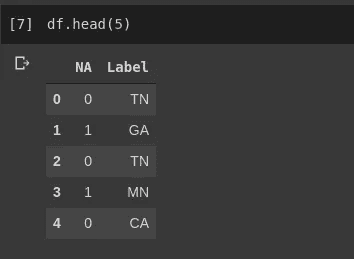
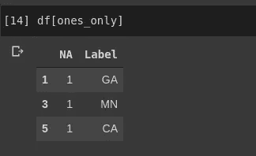
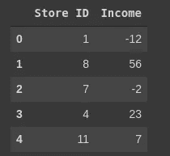
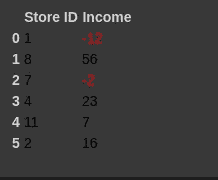
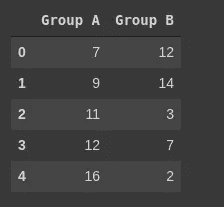
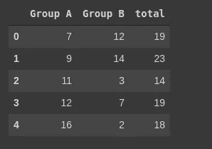
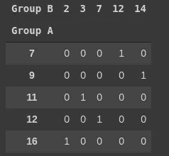
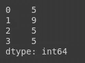

# 简化数据操作的 5 个熊猫小贴士

> 原文：<https://towardsdatascience.com/5-essential-pandas-tips-for-easier-data-manipulation-4c2968d37a79?source=collection_archive---------43----------------------->

## 用这些简单有效的熊猫技巧让你的科学课有个好的开始！


# 介绍

Python 的 andas 是一款无需介绍的软件。无论您是第一次接触 Python 数据科学，还是已经在这个领域工作了很长时间，您都可能听说过 Pandas Python 模块。该库在业界被广泛用于数据操作，并且是任何想要使用数据框和 Numpy 的有抱负的数据科学家的首选工具。许多数据科学家每天都在使用 Pandas，它被广泛认为是使用 Python 操作数据的重要工具。

虽然 Pandas 相当容易使用，并且有许多简单的方法可供使用，但是 Pandas 有许多部分，其中一些大部分时间都被完全忽略了。熊猫是一种复杂的动物，可能需要几个月，甚至几年才能适应它的绝对最高水平。也就是说，熊猫声称有一些基本属性可以在目前大多数情况下有效使用。

# 条件掩蔽

一个最有可能使 Pandas 超越其竞争对手和字典类型本身的属性是条件屏蔽。条件屏蔽允许用户使用简单的条件语句过滤掉不符合要求的值。这是令人难以置信的方便，是目前 Julia 或 R 中可用的联盟以上。然而以 Julia 为例，我们需要使用过滤器！为了管理我们的数据，Pandas 通过使用所谓的条件掩码使过滤数据变得非常容易。

条件掩码迭代遍历数据帧中的所有数据，并将数据与预设条件进行比较。返回的将是遵循掩码中设置的条件的过滤后的数据帧。

```
import pandas as pd
df = pd.DataFrame({"NA": [0,1,0,1,0,1], "Label": ["TN", "GA", "TN", "MN", "CA","CA"]})
```



```
ones_only = df["NA"] == 1
```



# 着色

有时数据可能很难读取。对于数据科学家来说，这可能没什么大不了的，但通常需要呈现数据并使其更易读。Pandas 使得改变数据框中不同值的颜色变得相当容易。让我们考虑一个例子，我们想要显示哪些值低于某个阈值，哪些值低于该阈值。

```
df = pd.DataFrame({"Store ID": [1,8,7,4,11,2], "Income": [-12, 56, -2, 23, 7, 16]})
```



首先，我们需要写一个小函数来根据我们的条件给我们的值着色。在本例中，我们将负值映射为红色，以显示每个商店的亏损与其他商店的盈利。

```
def negatives(input):color = 'red' if input < 0 else 'black'return 'color: %s' % color
```

这就是所谓的风格图。样式地图是 Pandas 用来确定数据框应如何呈现的功能。我们可以用`df.style.applymap().`应用一个样式图

```
df.style.applymap(negatives)
```



请注意，我们的数据框的样式确实发生了变化。Pandas 数据框使用级联样式表进行样式设计，因此实际上非常容易修改。可以使用`df.style.set_table_styles.`应用新的样式表

# 汇总和交叉列表

当试图探索和理解大型数据集时，在许多情况下可能有用的一件事是获得某些列的总计数，我们可以使用 lambda 应用它。

```
df = pd.DataFrame({"Group A": [7,9,11,12,16], "Group B": [12,14, 3, 7, 2]})
```



```
df['total']     = df.apply(lambda x: x.sum(), axis=1)
```



同样，我们可以使用交叉列表来实现本质上相同的目标。交叉列表用于计算列中的频率，然而，上面的方法提供了列的总和。

```
cross = pd.crosstab(index = df["Group A"], columns = df["Group B"])
```



# 配置

关于熊猫的另一个很酷的事情是它是高度可配置和动态的。Pandas 允许在运行时创建各种各样的“配置文件”,这些文件可以用来改变环境变量，以确定它如何工作。这在许多不同的情况下都很有用。例如，考虑这种显示配置:

```
def load_config():options = {'display': {'max_columns': None,'max_colwidth': 25,'expand_frame_repr': False,'max_rows': 14,'max_seq_items': 50,'precision': 4,'show_dimensions': False},'mode': {'chained_assignment': None}}for category, option in options.items():for op, value in option.items():pd.set_option(f'{category}.{op}', value)
```

这当然是通过 set_option 方法来完成的，该方法将类别名和相应的值作为参数。

# 访问者

Series 类型必须提供的一个重要特性是使用访问器的能力。在最新版本的 Pandas 中有四种类型的访问器。

*   `str`地图到`StringMethods`。
*   `.dt`地图到`CombinedDatetimelikeProperties`。
*   `.cat`到`CategoricalAccessor`的路线。

这些都是使用缓存附件连接到 Series 类的独立类。他们都有自己独特的方法，有时非常有用。考虑下面的例子:

```
locations = pd.Series(['Cleveland, TN 37311','Brooklyn, NY 11211-1755','East Moline, IL 61275','Pittsburgh, PA 15211'])
```

在这个例子中，我们想计算每个邮政编码中有多少个数字。我们可以这样使用字符串访问器:

```
locations.str.count(r'\d')
```



> 很酷，对吧？

# 结论

Pandas 是一个用 Python 处理数据的很好的库，它有很多非常有用的特性，使得数据操作比其他方式容易得多。从简单的访问器类和条件掩码，到简单的样式和完全动态的选项集，Pandas 是一个非常动态的库，可以用于不同操作的负载。这当然使熊猫很难与之竞争。很难证明在现代分析中使用任何其他软件是正确的，因为 Pandas 实在是太棒了！