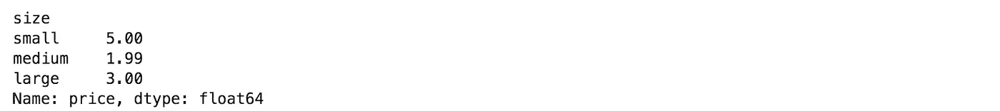
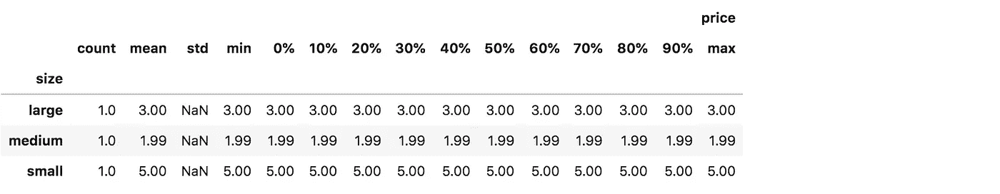

# 你不知道的 5 个熊猫基本技巧

> 原文：<https://towardsdatascience.com/5-essential-pandas-tricks-you-didnt-know-about-2d1a5b6f2e7?source=collection_archive---------19----------------------->

## 如何用熊猫处理大数据？了解“between”、“reindex”等函数。


Gif 来自 [giphy](https://giphy.com/gifs/panda-dancing-dance-a9CSmhwtk4IhO) 。

我用熊猫已经很多年了，每次我觉得我打字太多的时候，我就谷歌一下，我通常会发现一个新的熊猫技巧！我最近了解了这些功能，我认为它们很重要，因为它们很容易使用。

[](https://medium.com/@romanorac/pandas-data-analysis-series-b8cec5b38b22) [## 熊猫数据分析系列

### 从提示和技巧，如何不指南到与大数据分析相关的提示，熊猫文章的精选列表。

medium.com](https://medium.com/@romanorac/pandas-data-analysis-series-b8cec5b38b22) 

**这里有几个你可能会感兴趣的链接:**

```
- [Labeling and Data Engineering for Conversational AI and Analytics](https://www.humanfirst.ai/)- [Data Science for Business Leaders](https://imp.i115008.net/c/2402645/880006/11298) [Course]- [Intro to Machine Learning with PyTorch](https://imp.i115008.net/c/2402645/788201/11298) [Course]- [Become a Growth Product Manager](https://imp.i115008.net/c/2402645/803127/11298) [Course]- [Deep Learning (Adaptive Computation and ML series)](https://amzn.to/3ncTG7D) [Ebook]- [Free skill tests for Data Scientists & Machine Learning Engineers](https://aigents.co/skills)
```

上面的一些链接是附属链接，如果你通过它们进行购买，我会赚取佣金。请记住，我链接课程是因为它们的质量，而不是因为我从你的购买中获得的佣金。

# 1.函数之间


Gif 来自 [Giphy](https://giphy.com/gifs/natgeowild-panda-nat-geo-wild-mission-critical-l3vR33TV0vszF7rWg)

我在 SQL 中使用“between”函数已经很多年了，但是我最近才在 pandas 中发现它。

假设我们有一个包含价格的数据框架，我们想过滤 2 到 4 之间的价格。

```
df = pd.DataFrame({'price': [1.99, 3, 5, 0.5, 3.5, 5.5, 3.9]})
```

使用 between 函数，您可以减少这种过滤:

```
df[(df.price >= 2) & (df.price <= 4)]
```

对此:

```
df[df.price.between(2, 4)]
```


这可能看起来不多，但在编写许多过滤器时，这些括号很烦人。带有 between 函数的过滤器可读性也更好。

> 功能组之间的间隔在功能之间的左侧<= series <= right.

See pandas, documentation to learn more about [。](https://pandas.pydata.org/pandas-docs/stable/reference/api/pandas.Series.between.html)

# 2.使用 reindex 函数修复行的顺序


Gif 来自 [giphy](https://giphy.com/gifs/panda-tree-giant-5M7C95yZ0TQiI)

reindex 函数使系列或数据帧符合新的索引。当生成包含具有预定义顺序的列的报表时，我求助于 reindex 函数。

让我们将 T 恤衫的尺寸添加到我们的数据框架中。分析的目标是计算每个尺码的平均价格:

```
df = pd.DataFrame({'price': [1.99, 3, 5], 'size': ['medium', 'large', 'small']})df_avg = df.groupby('size').price.mean()
df_avg
```


上表中的尺寸随机排列。应该是这样排序的:小号，中号，大号。因为大小是字符串，所以我们不能使用 sort_values 函数。重新索引功能来拯救我们了:

```
df_avg.reindex(['small', 'medium', 'large'])
```



> 通过在 reindex 函数中指定大小的顺序，使得结果表更容易解释。

参见 pandas，文档以了解更多关于[重新索引功能](https://pandas.pydata.org/pandas-docs/stable/reference/api/pandas.DataFrame.reindex.html)的信息。

# 3.描述类固醇


Gif 来自 [Giphy](https://giphy.com/gifs/panda-attack-cnbsOTkEJnq0)

描述函数是进行探索性数据分析的基本工具。它显示数据帧中所有列的基本汇总统计信息。

```
df.price.describe()
```


如果我们想计算 10 个分位数而不是 3 个分位数呢？

```
df.price.describe(percentiles=np.arange(0, 1, 0.1))
```


描述函数采用百分位数参数。我们可以用 NumPy 的 arange 函数指定百分位数，以避免手工输入每个百分位数。

当与 group by 函数结合使用时，此功能变得非常有用:

```
df.groupby('size').describe(percentiles=np.arange(0, 1, 0.1))
```



看熊猫，文档了解更多关于[描述功能](https://pandas.pydata.org/pandas-docs/stable/reference/api/pandas.DataFrame.describe.html)。

# **4。使用正则表达式进行文本搜索**


Gif 来自 [Giphy](https://giphy.com/gifs/panda-animal-kBCEriIZaersY)

我们的 t 恤数据集有 3 个尺寸。假设我们想要过滤中小型尺寸。一种繁琐的过滤方式是:

```
df[(df['size'] == 'small') | (df['size'] == 'medium')]
```

这很糟糕，因为我们通常将它与其他过滤器结合在一起，这使得表达式不可读。有没有更好的办法？

pandas 字符串列有一个“str”访问器，它实现了许多简化字符串操作的功能。其中一个是“包含”函数，支持正则表达式搜索。

```
df[df['size'].str.contains('small|medium')]
```

> 具有“包含”功能的过滤器可读性更强，更易于扩展和与其他过滤器结合。

见熊猫，文档了解更多关于[包含功能](https://pandas.pydata.org/pandas-docs/stable/reference/api/pandas.Series.str.contains.html)。

# 5.比熊猫的记忆数据集还要大


Gif 来自 [giphy](https://giphy.com/gifs/panda-fail-falling-gB5o7HVgpkCYM)

熊猫甚至不能读取比主内存数据集更大的数据。它抛出一个内存错误或 Jupyter 内核崩溃。但是要处理一个大数据集，你不需要 Dask 或 Vaex。你只需要一些独创性。听起来好得难以置信？

如果您错过了我关于 Dask 和 Vaex 使用大于主内存数据集的文章:

[](/dask-vs-vaex-for-big-data-38cb66728747) [## Dask 与 Vaex 在大数据领域的对比

### 你真的能在笔记本电脑上处理大于内存的数据集吗？Dask 比 Vaex 快吗？我做了一些基准测试，所以…

towardsdatascience.com](/dask-vs-vaex-for-big-data-38cb66728747) 

进行分析时，通常不需要数据集中的所有行或所有列。

在一种情况下，您不需要所有行，您可以分块读取数据集并过滤不必要的行以减少内存使用:

```
iter_csv = pd.read_csv('dataset.csv', iterator=True, chunksize=1000)
df = pd.concat([chunk[chunk['field'] > constant] for chunk in iter_csv])
```

> 分块读取数据集比一次全部读取要慢。我建议只对大于内存的数据集使用这种方法。

在一种情况下，您不需要所有的列，您可以在读取数据集时使用“usecols”参数指定必需的列:

```
df = pd.read_csv('file.csv', u*secols=['col1', 'col2'])*
```

> 这两种方法的伟大之处在于，您可以将它们结合起来。

# 在你走之前

在 [Twitter](https://twitter.com/romanorac) 上关注我，在那里我定期[发布关于数据科学和机器学习的](https://twitter.com/romanorac/status/1328952374447267843)。


由[考特尼·海杰](https://unsplash.com/@cmhedger?utm_source=medium&utm_medium=referral)在 [Unsplash](https://unsplash.com/?utm_source=medium&utm_medium=referral) 拍摄的照片