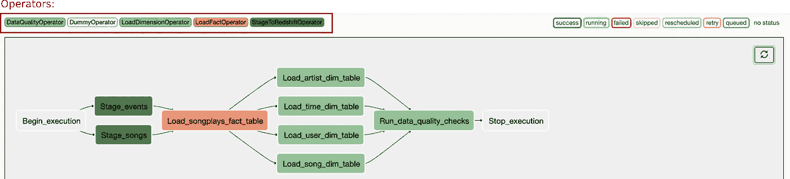
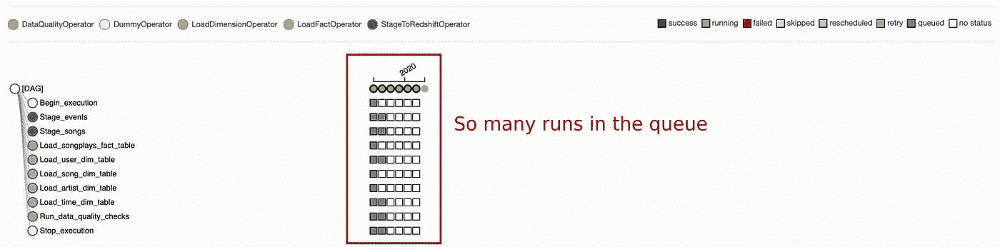
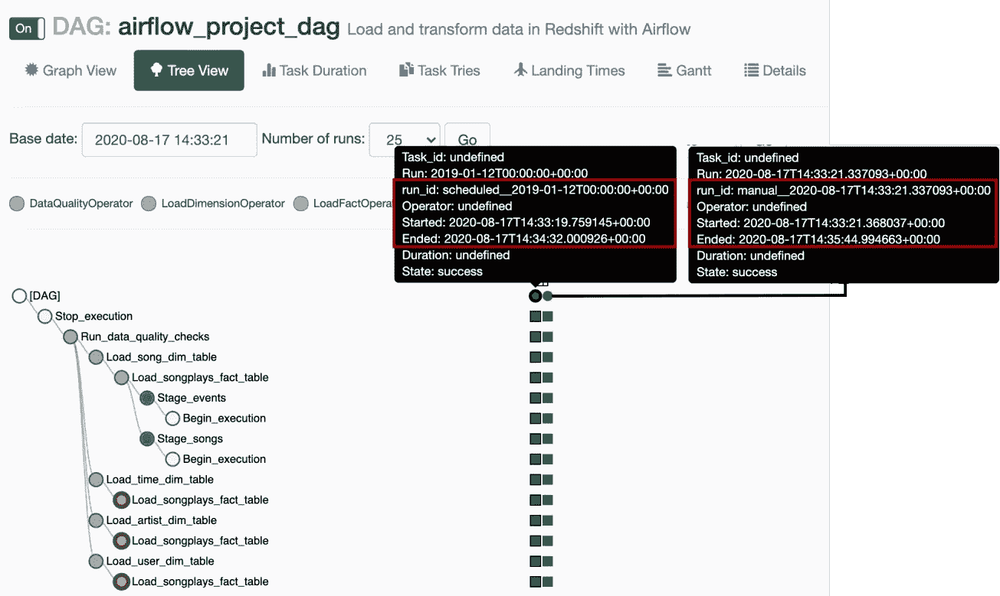
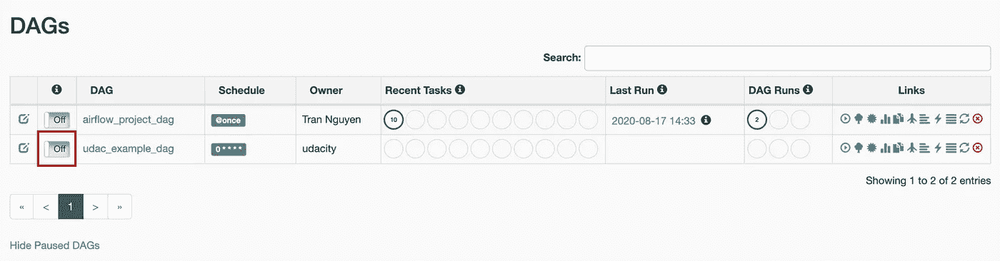
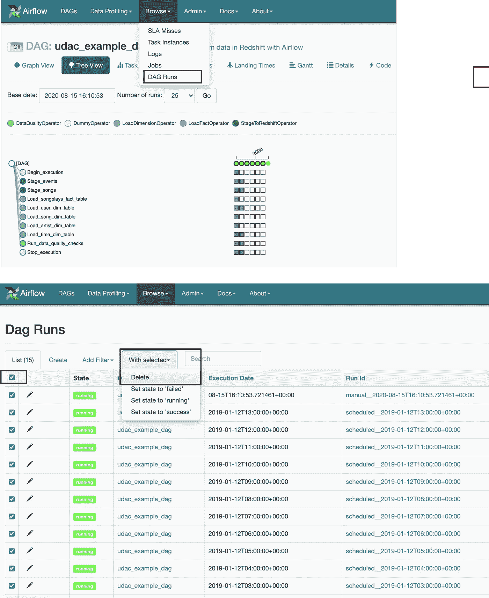
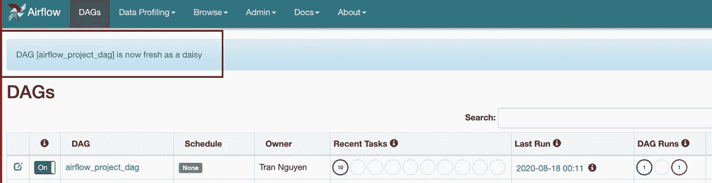
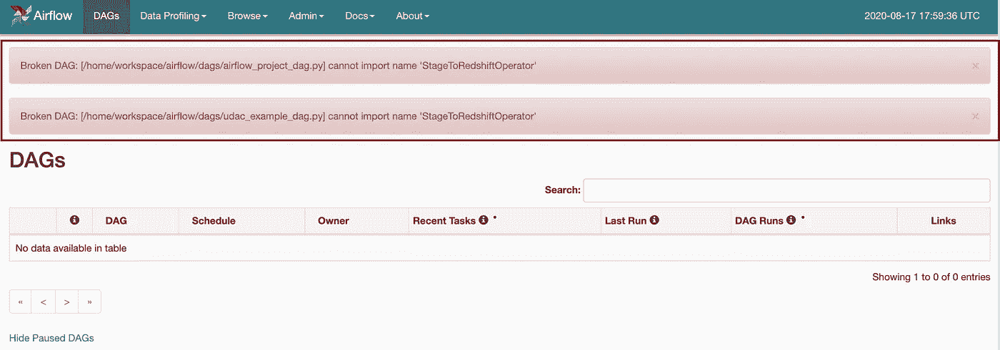
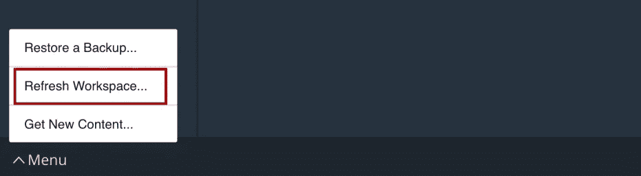
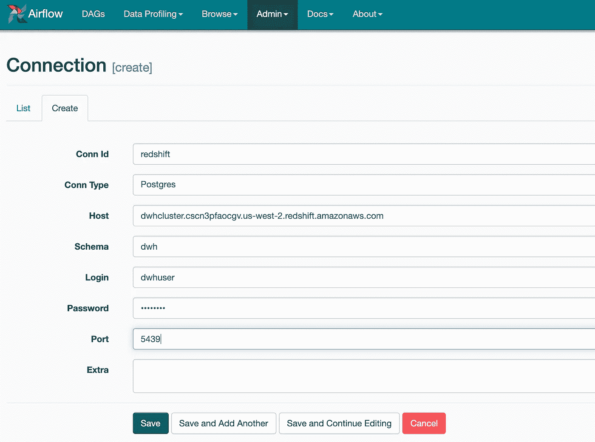

# 使用 Apache Airflow 为 Redshift 上托管的数据库构建 ETL 管道的 5 个基本技巧

> 原文：<https://towardsdatascience.com/5-essential-tips-when-using-apache-airflow-to-build-an-etl-pipeline-for-a-database-hosted-on-3d8fd0430acc?source=collection_archive---------18----------------------->

## 技术提示

## 初学者使用气流的最佳实践

# 介绍

[Apache Airflow](https://airflow.incubator.apache.org/) 是最好的工作流管理系统(WMS)之一，它为数据工程师提供了一个友好的平台来自动化、监控和维护他们复杂的数据管道。始于 2014 年的 Airbnb，后来成为一个拥有出色 UI 的开源项目，Airflow 已经成为开发者们的[热门选择](/why-quizlet-chose-apache-airflow-for-executing-data-workflows-3f97d40e9571)。对于不同层次的 Airflow 用户，有很多好的资源/教程。你可以从许多好的教程开始学习气流，例如[这个逐步指南](https://blog.insightdatascience.com/airflow-101-start-automating-your-batch-workflows-with-ease-8e7d35387f94)，或者[这个系列](https://medium.com/@dustinstansbury/understanding-apache-airflows-key-concepts-a96efed52b1a)，在这个系列中你还可以学习工作流管理系统[的一般知识](https://medium.com/@dustinstansbury/beyond-cron-an-introduction-to-workflow-management-systems-19987afcdb5e)。对于已经熟悉气流的用户来说，[这个资源](https://github.com/jghoman/awesome-apache-airflow)可能会帮助你对气流的许多方面有非常深刻的理解。

在这篇文章中，我只想分享我在 AWS 上用 Airflow 创建数据仓库 ETL 管道的经验。希望有帮助。如果你在我的帖子里发现了什么错误，请纠正我。

> **注意事项**
> 
> 1.本文假设您已经掌握了一些数据仓库、AWS、特别是 Amazon Redshift、Apache Airflow、命令行环境和 Jupyter 笔记本的工作知识。
> 
> 2.您有责任监控您使用的 AWS 帐户的使用费。每次完成工作时，请记住终止集群和其他相关资源。
> 
> 3.这是优达城数据工程纳米学位评估项目之一。所以为了尊重 Udacity 荣誉代码，我不会在工作流中包含完整的笔记本来探索和构建项目的 ETL 管道。本教程的 Jupyter 笔记本版本的部分内容，以及其他数据科学教程可以在我的 [github 上找到。](https://github.com/nhntran)

## 参考

*   一些材料来自 Udacity 上的数据工程纳米学位项目。
*   一些想法和问题是从 Knowledge-uda city 问答平台和学生中心-uda city 聊天平台收集的。感谢大家对我们的付出和巨大贡献。

# 项目介绍

## 项目目标

Sparkify 是一家致力于音乐流媒体应用的初创公司。通过 app，Sparkify 已经收集了关于用户活动和歌曲的信息，这些信息被存储为 JSON 日志的目录(`log-data` -用户活动)和 JSON 元数据文件的目录(`song_data` -歌曲信息)。这些数据位于 AWS 上的公共 S3 存储桶中。

这个项目将是一个工作流程，探索和建立一个 ETL(提取-转换-加载)管道:

*   从 S3 提取数据，并将它们暂存在 AWS 红移上作为暂存表(用户活动— `Stage_events`表和歌曲数据— `Stage_songs`表)。
*   出于分析目的，将数据从临时表转换为一组事实表(`songplays`)和维度表(包括`artists, time, users, and songs`表)。关于这些表格的更多细节可以在我的另一个相关项目中找到。
*   这种高级 ETL 管道必须是动态的，可以被监控，并允许在必要时容易回填。通过将 Apache 气流引入系统来满足这一要求。

下面是完整的有向无环图(DAG ),其中包含该项目使用的运算符。(如果您不知道 Dag 或运算符是什么，请在此处快速阅读气流概念的定义[)。](https://blog.insightdatascience.com/airflow-101-start-automating-your-batch-workflows-with-ease-8e7d35387f94)

有了这个帖子，我就不详细讨论这个项目是怎么一步一步做出来的了。相反，我只是向您介绍一些我在使用气流时遇到的重要提示和问题。我希望它能为您节省大量的时间和精力来处理您在构建工作流时可能遇到的许多奇怪的状态。

## 技巧 1:从最简单的 DAG 开始

您的 DAG，即以特定顺序定义任务的高级大纲，应该尽可能简单。这显然是编程中的最佳实践，但容易被遗忘。

**为什么我们应该从简单的 DAG 开始？**

下面是我的项目的最终 DAG 配置要求:

基本上，DAG 不依赖于过去的运行；start_date 是 2019 年 1 月 12 日；管道将被安排每小时运行一次。失败时，任务重试 3 次；每 5 分钟重试一次。
**我太天真了，第一次尝试使用最终的 DAG 配置，结果在 Airflow UI 上触发 DAG 时不知所措。排队的人太多了。许多人，实际上更多的人，可能会在这些之后。**

**队列中的这些游程都是从哪里来的？**

*   参数`start_date': datetime(2019, 1, 12),`和`schedule_interval = '@hourly`将产生从 start _ date(2019 . 1 . 12)到现在(2020)的`~ 600 days x 24 hourly backfill runs`。
*   有了`'retries': 3,`和`'retry_delay': timedelta(minutes = 5),`的说法:如果任务失败了——*当然会失败，一个复杂的数据管道哪里会在第一次尝试*就失败——需要重试 3 次，间隔 5 分钟。因此，在失败的情况下，除了大量运行(`each scheduled run x 3 times of retries`)之外，在此设置下，每次运行需要 3 x 5 分钟的等待时间，并进行重试。关于回填运行的次数，除了停止/杀死气流任务，你别无选择。 [***从 UI***](https://stackoverflow.com/questions/43631693/how-to-stop-kill-airflow-tasks-from-the-ui) ***中停止/杀死气流的任务很麻烦，所以最好不要碰到这个问题。*** 在某些情况下，尽管正在运行的 Dag 被删除，并且 Dag 被修改并再次触发，但它们仍可能重新启动并运行之前未完成的任务。

那么，一个简单的 DAG 是什么样子的呢？

在我的调试版本中，DAG 将在被触发(`'start_date': datetime.now()`)时立即运行，一次只运行一次(`max_active_runs=1,)`)并且只运行一次(`schedule_interval= None`)，没有任何失败重试(DAG 中的默认设置)。这个简单 DAG 将在任何任务失败时立即停止，这使我们能够轻松地调试我们的 DAG。

***其他一些注释:***

*   如果我将 start_date 保持为`start_date': datetime(2019, 1, 12)`，并且只运行 DAG 一次(`schedule_interval= None`)，会发生什么:将会有 2 次运行:2019 年的回填运行和当前手动运行。由于我的 DAG 开发过程只需要运行 1 次，所以最好设置`'start_date': datetime.now()`。

*   DAG 正在同时执行多个计划，后面的运行可能会同时发生**和**并彻底击败前面的运行。如果 DAG 包含一些繁重的任务，比如将一个巨大的表从 S3 复制到红移，那就不好了。要绕过这一点，您可以将`max_active_runs`设置为 1。

## 技巧 2:如何从气流 UI 停止/杀死气流任务？

正如技巧 1 中提到的，停止/终止气流任务是相当棘手的。在 UI 上有一些停止/终止气流任务的方法。最适合我的方法如下:

**步骤 1:关闭 DAG**

**第二步:删除所有运行**

在气流菜单栏上，选择`Browse -> DAG Runs -> Checkbox to select all the runs -> With Selected -> Delete`

请注意，**您必须先关闭 DAG**，否则，您可能会看到*[*白行者*](https://en.wikipedia.org/wiki/White_Walker) *和正在运行的活死人军团*:即使您刚刚删除了所有 DAG 运行，执行程序也可能会继续计划并开始新的运行。*

## *提示 3:“破损的 DAG”——这可能是由于 DAG 解析问题，而不是您的代码。*

*使用气流默认设置，当您更新关联的 python 文件时，应重新加载 Dag。[有人提到过](https://stackoverflow.com/questions/43606311/refreshing-dags-without-web-server-restart-apache-airflow)，webserver 运行时，默认每 30 秒刷新一次 Dag。当我们看到我们的狗“现在像雏菊一样新鲜”时，我们就可以走了:*

**

***我花了一整天的时间试图找出我的代码出了什么问题。我甚至重新加载了一个虚拟的 DAG——不会出错的 DAG，但仍然无法修复导致 DAG 损坏的错误:***

**

*事实证明，我的 DAG 没有任何问题，我只需要刷新工作区，就可以解决 DAG 解析带来的 webserver 问题。*

*总之，当出现 DAG 中断问题，并且您确定不是因为您的代码时，您可以尝试:*

*   *使用 DAG 主屏幕上的*刷新*按钮，可让您手动重新加载 DAG。*
*   *在命令行上键入`python -c "from airflow.models import DagBag; d = DagBag();"`以手动刷新 Dag。*
*   *在命令行中键入`/opt/airflow/start.sh`再次启动 Airflow webserver。*
*   *对于那些在 Udacity 上使用项目工作区的人来说，如果什么都不工作，就用菜单栏刷新工作区。*

**

*刷新工作区将会把你所有的文件复制到一个新的机器上，因此，每一个与文件解析相关的问题都可以得到解决。**做完我的气流项目，不得不承认** `**Refresh Workspace**` **是我很多** `**Broken DAG**` **问题的终极解决方案。***

## *关于调试损坏的 DAG 的说明*

*气流 UI 可能会通知您有一个损坏的 DAG，但是，它不会显示您的 DAG 的问题。可以通过使用`python -c "from airflow.models import DagBag; d = DagBag();"`手动重新加载 DAG 或使用命令行上的`/opt/airflow/start.sh`再次启动 Airflow 服务器来查看损坏的 DAG 中的详细问题。下面是对此的演示:*

**

## *技巧 4:对于 AWS 的所有任务，使用 Jupyter 笔记本上的 IaC(基础设施代码)*

*AWS 资源可以通过***AWS 控制台*** 或 ***IaC(基础设施即代码)*** 进行设置和监控。我更喜欢 IaC 方法，因为它可以帮助开发人员轻松地自动化、维护、部署、复制和共享复杂的基础设施。AWS 上的 IaC 有 3 个选项:*

*   *AWS-CLI 脚本:类似于 bash 脚本。*
*   *亚马逊云的形成通过 JSON 描述了所有的资源、权限和约束。*
*   *AWS SDK:更强大，可以与许多应用程序集成。Python 用户可以使用`boto3`，一个 [Python SDK](https://boto3.amazonaws.com/v1/documentation/api/latest/index.html) ，以编程方式访问 AWS。*

*我们可以使用 IaC 来构建、启动 Amazon Redshift 集群，并打印出气流连接所需的所有配置信息，如`host`、`schema`、`login_user`、`password`等。，而无需在 AWS 控制台上点击和搜索。我发现它非常方便和省时，特别是当我们必须终止集群/清理资源，然后改天再创建、启动、配置集群以降低 AWS 成本时。*

*设置和清理 Amazon Redshift 和其他 AWS 资源的整个端到端过程，以及在 AWS 上使用 Airflow 创建简单数据仓库 ETL 管道的演示，可以在 [my Github repository](https://github.com/nhntran/Data-pipeline-Airflow-on-AWSRedshift/blob/master/Data_pipeline_Apache_Airflow_on_AWSRedshift.ipynb) 中找到。*

## *技巧 5:以编程方式设置气流连接*

*要使用 AWS 服务运行 Dag，您可以使用 Airflow 的 UI 来设置连接，例如配置您的 AWS 凭证、连接到 Redshift 等。*

**

*设置到 Amazon Redshift 的气流连接的步骤*

*但是，当服务器停止或刷新工作区时，这些连接可能会丢失。为避免不必要的失败，建议在运行 Dag 之前检查这些连接是否可用。*

***在 DAG 开发期间，一次又一次地手动重新设置这些气流连接是一个麻烦且容易出错的过程，因此我更喜欢以编程方式将气流连接设置为 python 脚本文件**。必要时，您可以在命令行上运行该脚本。用于设置气流连接的简单 python 脚本如下:*

*一个好的做法是，在创建红移集群时(如技巧 4 中所述),您可以将所有 AWS 凭证和红移信息导出到一个. cfg 文件，然后使用 Python 包`configparser`获取必要的信息，而不是直接将它们放到脚本中。*

*非常感谢你阅读这篇文章。祝你的项目好运，我非常乐意回答任何问题和讨论。*

*[***《丘比特笔记本》，代号，。cfg 文件等。***](https://github.com/nhntran/Data-pipeline-Airflow-on-AWSRedshift) ***对于这篇文章，连同其他数据科学教程可以在***[***my Github***](https://github.com/nhntran)***上找到。****