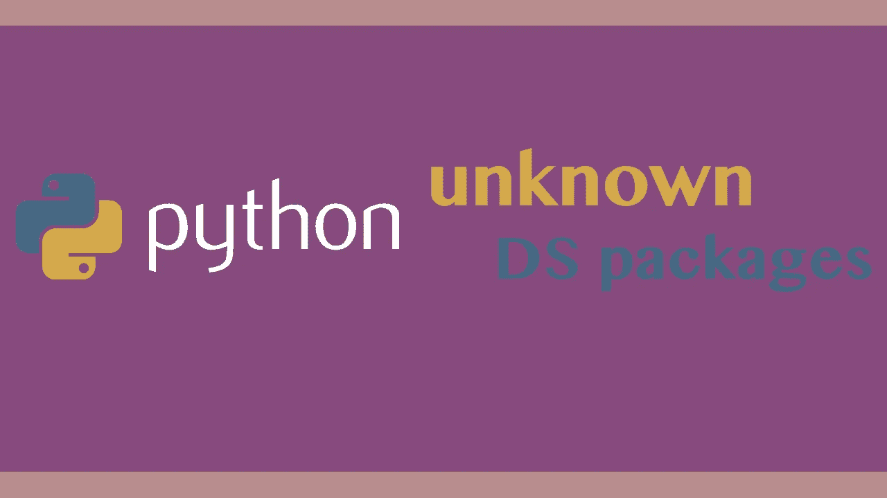
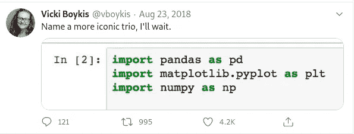
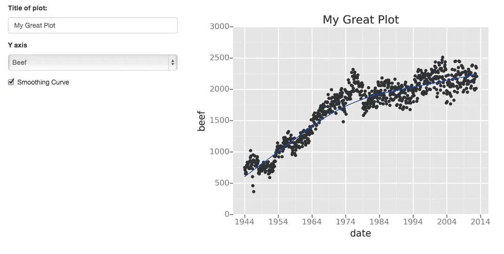

# 5 个无人知晓的用于数据科学的精彩 Python 包

> 原文：<https://towardsdatascience.com/5-fabulous-python-packages-for-data-science-nobody-knows-about-9fa192f312e4?source=collection_archive---------13----------------------->

## 你知道这些包裹吗？



(python logo src =[http://python.org](http://python.org)

所以我们可能都知道动态数据科学三重奏，Numpy，Pandas 和 Matplotlib。



您很可能熟悉这些包以及它们是如何工作的。可能还有其他一些你喜欢使用的很酷的软件包，比如 Plotly、Seaborne、Scikit-Learn、Tensorflow 和 Pytorch 等等。尽管这些都是很棒的包，但是有数百万个 Pythonic 机器学习包，其中一些不被重视，还有一些完全不为人知！

# №1:微光

你听说过 Plotly，你听说过 Matplotlib，也许还有 Seaborne，但你可能没听说过 Gleam。Gleam 是一个非常棒的工具，可以创建带有页面、面板和按钮的交互式可视化效果。这些交互式 web 可视化也是完全 web 集成的，这意味着您可以将它们放入从网站到终端的任何东西中！Gleam 使用 wtforms 进行交互，并且可以使用任何不同的可视化工具来实际显示数据。



如果你想要一个很酷的交互面板，你可以使用任何图形库，Gleam 就是你要的模块！

# №2:表格

[](https://pypi.org/project/tabel/) [## 塔贝尔

### 轻量级，直观和快速的数据表。

pypi.org](https://pypi.org/project/tabel/) 

好吧，我知道你在想什么，

> “为什么不用熊猫呢？”

这当然是一个可行的论点。餐桌包装是熊猫难以置信的轻便替代品。使用 Table.py 可以比使用 Pandas.py 更容易地读取大量数据集，这也是它上榜的唯一原因。总的来说，在某些情况下，这可能是工作的一部分，但在大多数情况下，我只会坚持

```
import pandas as pd
```

# №3:幕府


https://www.shogun-toolbox.org/(src =

幕府将军是一个用 C++编写的机器学习库，碰巧也拥有一个 Python 端口。关于幕府的一个伟大的事情是，它可以跨众多不同的编程语言使用，并且在这方面相对统一。如果你要学习 Python 中的幕府将军，你可以将这些知识应用到它支持的任何其他语言中，这太棒了！

幕府将军拥有广泛的尖端机器学习算法，肯定任何科学家都可以欣赏。它当然也是开源的，并且是在 GNU 通用许可下发布的，这总是一个优点！

# №4: OpenCV

OpenCV 是另一个伟大的机器学习包，实际上最初是由英特尔开发的。然而，尽管 OpenCV 是私有的，但它是开源的，并在 FreeBSD 许可协议下发布。OpenCV 真正酷的一点是它对实时计算机视觉的关注。像幕府将军一样，OpenCV 最初是用 C++编写的，但是有 Python 和其他语言的接口。

# №5: Mlpy


(src =[http://mlpy.sourceforge.net/](http://mlpy.sourceforge.net/)

Mlpy 为**监督的**和**非监督的**学习提供了广泛的最先进的机器学习方法。与同类产品不同，它旨在为数据科学提供一体化的方法。虽然在这一点上有点过时，但它无疑是 Pythonic 机器学习的巨大软件包爆炸的一个巨大的导火索。尽管年代久远，但在我看来，它仍然值得一看。这是由于它的易用性、有趣的算法和包容性。

Mlpy 试图创建一个包，平衡再现性，调制和效率。在这一点上，我认为这个包是成功的，因为虽然它的许多对应部分更新得更频繁，而且肯定是行业标准，但许多这些想法似乎在翻译中以这样或那样的方式丢失了。这是有道理的，因为这些庞大的软件包大部分是由成千上万的开发人员用 C 编写的，然而，我要说的是，使用它们可能是一个缺点。

# 结论

所以你有它，五个软件包在我看来是不被承认的，并没有得到他们所完成的荣誉。虽然这些软件包确实很酷，但我确信还有成百上千的其他酷模块可以添加到您的 Pip 环境中，它们也是令人敬畏和闻所未闻的！

Python 有一个压倒性的生态系统和许多要挖掘的包，这是它如此伟大的部分原因！学习如何不断地使用新模块将会保持你的知识基础的扩展，并保持你的程序员的大脑活跃！