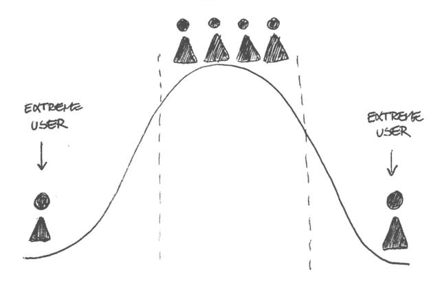

# 面试官在分析候选人时寻找的 5 个因素

> 原文：<https://towardsdatascience.com/5-factors-that-interviewers-look-for-in-analytics-candidates-cbc032ef5f0f?source=collection_archive---------36----------------------->

## 这不全是关于你能多好地编码

在这里，我们将关注分析面试过程中非常重要的一部分:招聘经理在分析候选人身上寻找什么。我们知道面试过程的压力有多大，所以我们希望，通过对招聘过程本身有更多的了解，你可以调整你的面试方法，以获得最大的成功机会。

首先，我们将解释在分析工作面试中你会遇到的一般类型的问题。然后，我们将看看一个好的候选人应该具备的五个关键因素。​

**我能从分析工作面试中得到什么？**
显然，在一次分析工作面试中，他们希望你能够很好地编码。至此，您应该对他们正在评估的编码语言类型有了经验，并且拥有处理他们扔给你的任何东西的数据分析技能。

你可能会在面试中遇到一个用例，它基本上是一个场景，有时会很复杂，需要多个步骤和解决方案来解决。通常，这是基于公司已经经历或正在经历的问题。

显然，他们希望你尝试解决这个问题，但同样重要的是你要解释你是如何得到你的解决方案的。他们正在评估你的过程和方法。你如何得出你的解决方案和解决方案本身一样重要。

# **分析面试官在候选人身上寻找的 5 个因素**

# 1.思想开放

我们提到过，在分析工作面试中，最重要的是过程。解决分析中的问题有很多方法，因此与面试官保持开放的沟通，解释你是如何做出每个决定的，以及你将如何处理每个用例及边缘情况至关重要。

> 保持开放的心态是面试过程中的一个关键因素。你必须评估每个问题，并愿意考虑每个可行的选择。这对于确定你试图解决的问题是至关重要的。

你的目标是通过提问和回答进行健康的对话，向面试官展示你已经考虑了所有的选择。通过这样做，你也有更好的机会把自己放在选择最佳选项的位置上。

# 2.结构化思维

如上所述，分析面试官正在寻找一个思想开放、愿意在选择最佳方案之前考虑所有可行方案的人。这显示了你对你正在尝试做的事情背后的数学和理论的理解。交流你的过程并解释你如何处理数据对面试官理解你的分析技巧很重要。

> 为了有效地沟通，你必须在处理问题时形成一种务实的、结构化的思路。这样，无论你面临什么问题，你都有一个结构化的方法向面试官展示你是如何解决问题的。

问题通常包括分析代码行。仔细查看语法并解释每个代码块要实现的功能。在此基础上，确定代码所要实现的“大画面”,并确定代码中可以添加或删除的内容，以达成解决方案。通过遵循这个可靠的过程，你可以确保面试官可以很容易地跟踪你的思维过程。你要确保你这边没有遗漏任何东西。

# 3.关闭边缘案例

边缘案例是理解分析问题最重要的部分之一。对于你在面试中遇到的任何问题，试着想一想代码可能会被破坏的边缘情况，并与面试官交流。此外，确定您的解决方案可能无法捕捉到的业务问题中的某些情况的边缘案例。然后构建一个解决方案来捕获这些边缘案例。建议可以解释它们的方法，以便给定的情况不会破坏代码。这很容易做到，因为您首先确定了潜在的问题领域。

# 4.理解权衡

在技术面试中，几乎总是有不止一种方法来分析数据和解决一个问题，这就不可避免地要做出取舍。你可能不得不放弃一种方法去追求一种不同的方法。在你的面试中，在这种情况下最重要的事情是确定这些权衡，然后解释每个选项，以及为什么你可能会或可能不会选择其中一个。这应该是与面试官的一次对话，这样你的解决方案就可以针对业务目标进行优化。

你的解决方案可能不是 100%完美的，但是如果你表达了为什么你选择了一个方案，为什么你认为你的解决方案是理想的，面试官会对你解决问题的技巧和分析能力感到满意。这些都是面试官往往最感兴趣评价的东西。

# 5.以任何人都容易理解的方式解释该解决方案将为您带来什么

一旦你对自己的思考过程和解决问题的方法感到满意，重要的是把它们都总结起来。一个很好的方法是向面试官提供你的解决方案的概要。记住，最重要的是你要理解问题，你要达到什么目的，并且愿意评估所有的选择来达成解决方案。

> 所以，用总结来总结每个答案。快速解释您的解决方案、您考虑过的选项、权衡、边缘案例，以及为什么您认为您的解决方案是最好的。这可以确保面试官带着对你思维过程的理解离开。

> 你可能已经注意到贯穿这几点的一个共同主题。在这些技术面试中，它是关于展示你对概念的理解以及批判性和务实性思考的能力，而不是得出问题的正确答案。正确的答案只是谜题的一部分。分析型面试官在面试过程中的意图是雇佣一个以开放的心态处理每个问题并愿意考虑每个选择的人。

这些品质代表了候选人不仅会战略性地思考，而且不怕与他人合作或寻求帮助。毕竟，公司希望雇佣可以共事的人，而你需要证明你有必要的沟通技巧和洞察力来做到这一点。

如果你想练习一些技术问题，并想看看其他人是如何处理同样的问题的，尝试一下 [Strata Scratch](https://platform.stratascratch.com) 中的一些技术问题，并回顾一下他们的用户的方法和解决方案。

*最初发表于*[T5【https://www.stratascratch.com】](https://www.stratascratch.com/blog_feed/5-factors-that-analytics-interviewers-look-for-in-candidates)*。*