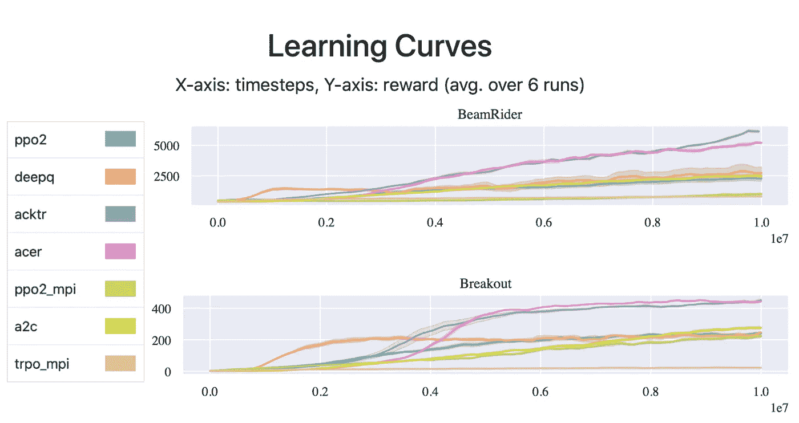

# Python 强化学习的 5 个框架

> 原文：<https://towardsdatascience.com/5-frameworks-for-reinforcement-learning-on-python-1447fede2f18?source=collection_archive---------3----------------------->

## 从头开始编写自己的强化学习实现可能需要大量的工作，但是您不需要这样做。有很多很棒的、简单的和免费的框架可以让你在几分钟内开始。


通过重用现有的 RL 库，你可以节省很多精力。]

有很多用于监督和非监督机器学习的标准库，如 Scikit-learn、XGBoost 甚至 Tensorflow，它们可以让你立即开始，并且你可以在网上找到支持的日志。遗憾的是，对于强化学习(RL)来说，情况并非如此。

这并不是说没有框架，事实上，有很多关于 RL 的框架。问题是现在还没有标准，所以在网上寻找支持来开始、解决问题或定制解决方案并不容易。这可能是因为虽然 RL 是一个非常受欢迎的研究主题，但它仍处于行业实施和使用的早期阶段。

但是这并不意味着没有伟大的框架可以帮助你开始使用 RL 来解决你喜欢的任何问题。我在这里列出了一些我逐渐了解和使用的框架，以及它们的优点和缺点。我希望这能让你对目前可用的 RL 框架有一个快速的了解，这样你就可以选择一个更适合你需求的框架。

# Keras-RL


不得不承认从整个榜单来看，这是我的最爱。我相信是目前为止最容易理解的几种 RL 算法的代码实现包括深度 Q 学习(DQN)、双 DQN、深度确定性策略梯度(DDPG)、连续 DQN (CDQN 或 NAF)、交叉熵方法(CEM)、决斗 DQN)和 SARSA。当我说*“最简单易懂的代码”*时，我指的不是使用，而是定制它，并将其作为您项目的构建模块*。Keras-RL github 也包含了一些例子，你可以使用它们立刻开始。当然，它使用 Keras，您可以将它与 Tensorflow 或 PyTorch 一起使用。

不幸的是，Keras-RL 已经有一段时间没有得到很好的维护，它的官方文档也不是最好的。这给了这个项目的一个分支 [Keras-RL2](https://github.com/wau/keras-rl2) 以启示。

> (*)我用这个框架做什么？嗯，我很高兴你问了——或者是我？我用这个框架创建了一个定制的辅导 DQN 代理，你可以在这里了解更多。

# Keras-RL2

Keras-RL2 是 Keras-RL 的派生产品，因此它支持与 Keras-RL2 相同的代理，并且易于定制。这里大的变化是 Keras-RL2 维护更好，使用 Tensorflow 2.1.0。不幸的是，没有这个库的文档，尽管 Keras-RL 的文档也可以很容易地用于这个分支。

# OpenAI 基线

[OpenAI Baselines](https://github.com/openai/baselines) 是 OpenAI 的一套高质量 RL 算法实现，OpenAI 是人工智能特别是 RL 研发领域的领先公司之一。它的构想是让研究人员可以容易地比较他们的 RL 算法，使用 OpenAI 的最先进的实现作为基线——因此得名。该框架包含许多流行代理的实现，如 [A2C](https://github.com/openai/baselines/blob/master/baselines/a2c) 、 [DDPG](https://github.com/openai/baselines/blob/master/baselines/ddpg) 、 [DQN](https://github.com/openai/baselines/blob/master/baselines/deepq) 、 [PPO2](https://github.com/openai/baselines/blob/master/baselines/ppo2) 和 [TRPO](https://github.com/openai/baselines/blob/master/baselines/trpo_mpi) 。



【图来自[稳定基线基准](http://htmlpreview.github.io/?https://github.com/openai/baselines/blob/master/benchmarks_atari10M.htm)。]

不利的一面是，OpenAI 基线没有得到很好的记录，尽管代码中有很多有用的注释。此外，因为它是作为基线而不是构建块开发的，所以如果您想为您的项目定制或修改一些代理，代码就不那么友好了。事实上，下一个框架就是从这里派生出来的，解决了大部分问题。

# 稳定基线


[图片来自[稳定基线文档](https://stable-baselines.readthedocs.io/en/master/)。]

[稳定基线](https://github.com/hill-a/stable-baselines)是[开放 AI 基线](https://github.com/openai/baselines)的分支，有重大的结构重构和代码清理。在其官方文档网站中列出的[变更如下:](https://stable-baselines.readthedocs.io/en/master/)

*   所有算法的统一结构
*   PEP8 兼容(统一代码风格)
*   记录的函数和类
*   更多测试和更多代码覆盖
*   附加算法:SAC 和 TD3(她支持 DQN、DDPG、SAC 和 TD3)

我个人在过去使用过稳定的基线，我可以确认它确实有很好的文档记录并且易于使用。甚至有可能用一句台词来训练一个用于[开放式健身房环境](https://github.com/openai/gym)的代理:

```
**from** **stable_baselines** **import** PPO2model = PPO2('MlpPolicy', 'CartPole-v1').learn(10000)
```

# 顶点


郊狼已经使用 ACME 几十年了，远远领先于他的时代！【图片来自[漫画及超越](https://comicbookandbeyond.com/wile-e-coyote-live-action-finally-gets-a-director/)。]

Acme 来自 DeepMind，可能是研究中最知名的致力于 RL 的公司。因此，它是为构建可读、高效、面向研究的 RL 算法而开发的，并包含多种先进代理的实现，如 D4PG、DQN、R2D2、R2D3 等。Acme 使用 Tensorflow 作为后端，并且一些代理实现使用了 [JAX](https://github.com/google/jax/blob/master/README.md) 和 Tensorflow 的组合。

Acme 的开发牢记使其代码尽可能可重用，因此其设计是模块化的，易于定制。它的[文档](https://github.com/deepmind/acme/blob/master/docs/index.md)并不丰富，但足以给你一个很好的库介绍，也有一些例子让你开始使用 Jupyter 笔记本。

# 外卖食品

这里列出的所有框架都是任何 RL 项目的可靠选择；决定使用哪一个取决于你的偏好和你到底想用它做什么。为了更好地形象化每个框架及其优缺点，我做了以下直观总结:

## **Keras-RL—**[**Github**](https://github.com/keras-rl/keras-rl)

RL 算法的选择:☆☆☆
文档:☆☆☆
定制:☆☆☆☆
维护:☆
后端:Keras 和 Tensorflow 1.14。

## **Keras-RL2—**[Github](https://github.com/wau/keras-rl2)

RL 算法的选择:☆☆
文档:不可用
定制:☆☆☆☆
维护:☆☆
后端:Keras 和 Tensorflow 2.1.0。

## **OpenAI 基线—**[**Github**](https://github.com/openai/baselines)

RL 算法的选择:☆☆☆
文档:☆☆
定制:☆☆
维护:☆☆☆
后端:Tensorflow 1.14。

## **稳定基线—**[**Github**](https://github.com/hill-a/stable-baselines)

RL 算法的选择:☆☆☆
文档:☆☆☆☆
定制:☆☆☆
维护:☆☆☆☆
后端:Tensorflow 1.14。

## **极致—**[**Github**](https://github.com/deepmind/acme/tree/master/acme)

RL 算法的选择:☆☆☆
文档:☆☆
定制:☆☆☆
维护:☆☆☆☆
后端:Tensorflow v2+和 JAX

如果您已经决定了使用什么框架，那么现在您所需要的就是一个环境。您可以开始使用 OpenAI Gym，它已经在这些框架的大多数示例中使用，但是如果您想在其他任务上尝试 RL，如交易股票、联网或产生推荐，您可以在这里找到一个易于理解的现成可用环境列表:

[](https://medium.com/@mauriciofadelargerich/reinforcement-learning-environments-cff767bc241f) [## 强化学习环境

### 我最近一直在研究强化学习(RL ),我发现有很多很棒的文章、教程…

medium.com](https://medium.com/@mauriciofadelargerich/reinforcement-learning-environments-cff767bc241f) 

如果你知道任何其他好的 RL 框架，请在下面的回复中告诉我！感谢阅读！:)