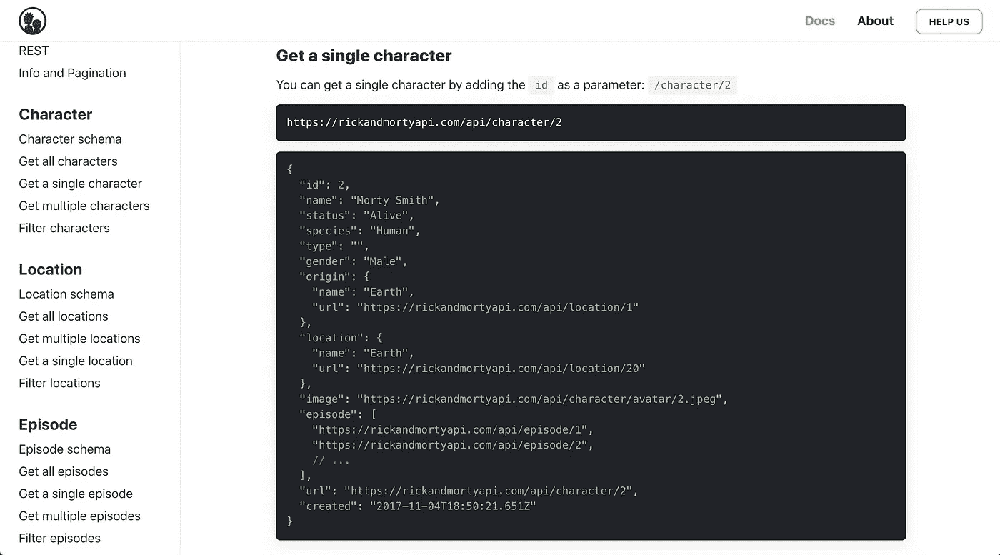

# 5 个免费有趣的 API，可用于学习、个人项目等！

> 原文：<https://towardsdatascience.com/5-free-and-fun-apis-to-use-for-learning-personal-projects-and-more-1cb37b0d3685?source=collection_archive---------9----------------------->

## 你会对外面的世界感到惊喜。


艺术由[西斯卡杜斯](https://www.instagram.com/siscadraws/)

公共 API 超赞！

仅在《走向数据科学》出版物上就有 50 多篇涉及 API 的文章，所以我不会做太长的介绍。API 基本上可以让你与一些工具或服务(实际上任何人都可以提供)进行交互。

您可以使用 API 从数据源中检索某种信息，然后在您自己的脚本或应用程序中使用它。公共(开放)API 很棒，因为它们允许任何第三方开发者构建可以连接到现有服务的东西。

有一些流行的 API 做“严肃的事情”，比如跟踪时间序列股票数据或[提供空气质量的更新](https://docs.openaq.org/)。我们不会在这篇文章中触及这些，因为我想分享一些有趣的 API，你可以在学习与 API 交互甚至创建 API 时进行实验。

您甚至可以用其中的一个构建一个简单的个人项目，来学习如何将一个应用程序连接到您当前正在学习的任何一种语言的 API。

我们开始吧！

# 1.PlaceGOAT——山羊的免费随机图片


天啊，这是一只由 [PlaceGoat](https://placegoat.com/) 生成的山羊

我想我会从一只可爱的小山羊开始。

这是一个非常简单的 GET API，可以生成山羊的图片。我希望我有更多的话要说，但这是真的。这里有到[主站点](https://placegoat.com/)和 [Github 库](https://github.com/rosshettel/placegoat)的链接。


[山羊主场地](https://placegoat.com/)

您可以指定要生成的图像的宽度和高度，以像素为单位，如下所示:

```
[http://placegoat.com/width/height](http://placegoat.com/width/height)
```

如果你只是想测试一下 Python 中的`requests`库，这将是一个很好的起点。如果你需要一个想法，试着写一个脚本来获得每天的山羊图像，并每天早上发送给你的另一半(或你的妈妈),以提醒他们你有多关心他们。这会是床上早餐的更好版本。

# 2.PokéApi —主要游戏的神奇宝贝数据库


[口袋 Api 主页](https://pokeapi.co/)

神奇宝贝！一定要把他们都干掉，神奇宝贝！

RESTful PokéApi 可以免费使用，并允许您从一个全面的数据库中获取从神奇宝贝游戏到第一个红色和蓝色版本直到剑与盾的所有信息。

这个数据库真的是庞大。你可以得到任何东西，从神奇宝贝的能力到进化触发器到浆果硬度。直接查看 [PokéApi 主站点](https://pokeapi.co/)和[文档](https://pokeapi.co/docs/v2)了解更多信息。如果您对特定语言的包装器感兴趣，请查看[包装器库部分](https://pokeapi.co/docs/v2#wrap)。例如，您可以安装 [Pokebase](https://github.com/PokeAPI/pokebase) Python 接口，直接在您的 Python 脚本中使用，而不必调用带有`requests`库的 API。


[PokéApi 文档](https://pokeapi.co/docs/v2#berries-section)

我不知道浆果可以按硬度分类。我想了解更多，所以我点击了以下链接:

```
[https://pokeapi.co/api/v2/berry-firmness/](https://pokeapi.co/api/v2/berry-firmness/)
```


JSON pretty printed [浆果硬度结果](https://pokeapi.co/api/v2/berry-firmness/)

通常，当您调用 API 端点时，您还应该提供一个 ID 或名称来检索特定数据点的信息。对于 PokéApi，他们说，如果您调用一个没有 ID 或名称的端点，您将得到一个默认的最多 20 个 Api 可用资源的列表。在这种情况下,“浆果硬度”端点有 5 种可能的结果，所以当您调用上面的链接时，您会看到所有结果都以 JSON 格式返回。

值得注意的是，当您使用完全开放的 API 时，您应该注意调用服务端点的频率。PokéApi 取消了速率限制(Api 配置每个时间间隔可以发出多少请求)，但它仍然提醒用户限制他们请求的频率，以保持较低的托管成本。在他们的公平使用政策中，他们说人们应该在本地缓存请求的资源，DDoS 攻击将导致永久的 IP 地址禁令。要负责任！

# 3.Rick 和 Morty API —来自 Rick 和 Morty 的角色、位置和更多信息


[里克和莫蒂 API 主网站](https://rickandmortyapi.com/)

瑞克和莫蒂！

这个 API 是 RESTful 的，允许您使用 GraphQL 来查询它。如果你不熟悉这种查询语言，它们还可以方便地将你链接到 [GraphQL 文档](https://graphql.org/learn/)。您可以通过对剧中人物、地点和剧集的元数据发出`GET`请求来使用 API。



[里克和莫蒂的 API 文档](https://rickandmortyapi.com/documentation/#get-a-single-character)

要从节目中获得角色的信息，您应该向角色端点提供他们的 ID，如下所示:

```
[https://rickandmortyapi.com/api/character/5](https://rickandmortyapi.com/api/character/5)
```


JSON 漂亮打印[杰瑞·史密斯结果](https://rickandmortyapi.com/api/character/5)

在这里，提供“5”给我们 Jerry Smith 的角色信息。你还可以在最后看到一个角色的相关图像，所以如果你想练习从 API 下载文件，这可能是一个好的开始。

查看[主站点](https://rickandmortyapi.com/)和[文档](https://rickandmortyapi.com/documentation/)了解更多信息。也有一些由不同语言的作者提供的[包装器库](https://rickandmortyapi.com/documentation/#libraries)，所以如果你想使用它们的话，可以去看看。它的 Python 实现可以在[这里](https://github.com/curiousrohan/ramapi)找到。此外，如果你懂一些 JavaScript 并且有兴趣为开源项目做贡献，你可以看看 Rick 和 Morty API Github。

# 4.icanhazdadjoke 爸爸笑话数据库


[icanhazdaddankles 主站点](https://icanhazdadjoke.com/)

谁不喜欢爸爸的笑话？

我不确定到目前为止我的 API 相关的双关语算不算，但是我绝对喜欢各种“坏”笑话。

您可以使用 icanhazdadjoke API 从服务中获取一个爸爸笑话。API 文档给出了如何用`curl`与 API 端点交互的例子。


[icanhazdadskeys API 文档](https://icanhazdadjoke.com/api)

`curl`是一个简洁的工具，你可以用它在你的终端和服务器之间传输数据。在这种情况下，您可以通过使用 HTTP 获取特定的 URL 来测试它。例如，您可以在终端中尝试以下操作:

```
curl -H "Accept: text/plain" [https://icanhazdadjoke.com/](https://icanhazdadjoke.com/)
```


icanhazdadjoke 卷曲输出

`-H`命令行参数允许您在请求中包含一个额外标头的参数，在本例中是“Accept: text/plain”。这种修改允许您指定请求的输出类型，这里将是纯文本。如果你需要的话，你也可以把它设置成 JSON ( `Accept: text/html`)或者 HTML ( `Accept: Application/json`)。

还有一个端点，您可以使用它来搜索与某个关键字匹配的特定笑话。


[icanhazdadjook API 文档](https://icanhazdadjoke.com/api)

通过调用这个端点并将结果存储在数据库中来练习搜索一些关键字可能会很有趣。然后，您会有一个基于您指定的关键字的笑话的本地副本。

查看[主站点](https://icanhazdadjoke.com/)和[文档](https://icanhazdadjoke.com/api)了解更多信息。还有一个 [GraphQL 查询端点](https://icanhazdadjoke.com/graphql)可以用来查询 API，如果你想这样加载数据的话。

# 5.邪恶侮辱生成器—一个卑鄙的数据库


[恶辱生成器主站点](https://evilinsult.com/)

…这个网站很卑鄙。

前提真的很简单:你调用 API，得到一个侮辱。


[邪恶侮辱生成器 API 文档](https://evilinsult.com/api/)

就像山羊 API 一样，我在这里真的没有那么多要说的。

您可以指定语言和您希望如何回复侮辱的格式。为了好玩，我想看看另一种语言是否真的有用，所以我试图得到一个西班牙语的侮辱:

```
[https://evilinsult.com/generate_insult.php?lang=es&type=json](https://evilinsult.com/generate_insult.php?lang=es&type=json)
```


[恶意侮辱生成器 API 调用的结果](https://evilinsult.com/generate_insult.php?lang=es&type=json)

“马拉车乐”直译成英语是“坏牛奶”。通俗地说，你可以用它来形容不守信用的人或者心情不好的人。

您还可以将这个 API 作为一个非常简单的 API 来练习发出请求。如果你想探索，可以查看一下[主站点](https://evilinsult.com/)和它的(相当简单)[文档](https://evilinsult.com/api/)。

仅此而已！

我希望当你开始熟悉 API 时，或者如果你只是在寻找一些有趣的工作，你可以尝试使用其中的一个。一定要负责任地调用 API，因为这些 API 是公共的，每个人都可以免费使用。过于频繁地 ping 它们会导致你的 IP 地址被禁止，如果你喜欢山羊图片(或者你正在使用的任何服务)，这可不是一件好事。

除了调用 GET 请求之外，我还提到存储结果可能会为您的项目增添一些有趣的内容，所以如果您想了解如何写入 SQLite，请查看这篇文章:

[](/using-just-one-line-of-code-to-write-to-a-relational-database-3ed08a643c5f) [## 仅使用一行代码写入关系数据库

### 谁知道您可以在没有任何 SQL 的情况下添加到数据库中呢？

towardsdatascience.com](/using-just-one-line-of-code-to-write-to-a-relational-database-3ed08a643c5f) 

对于一种完全不同的在线收集数据的方式，请查看这篇关于 XPath 语言及其在 Python 中的用法的介绍:

[](/how-to-use-python-and-xpath-to-scrape-websites-99eaed73f1dd) [## 如何使用 Python 和 Xpath 抓取网站

### 用 XPath 表达式从 HTML 中收集星球大战引言

towardsdatascience.com](/how-to-use-python-and-xpath-to-scrape-websites-99eaed73f1dd)