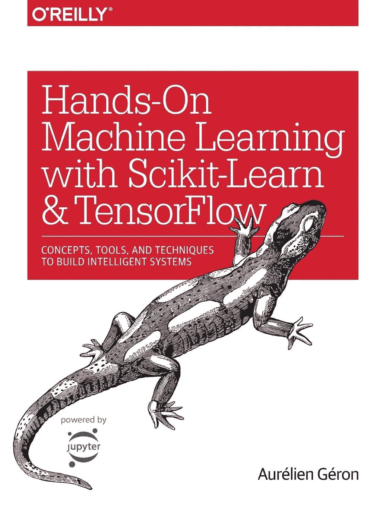
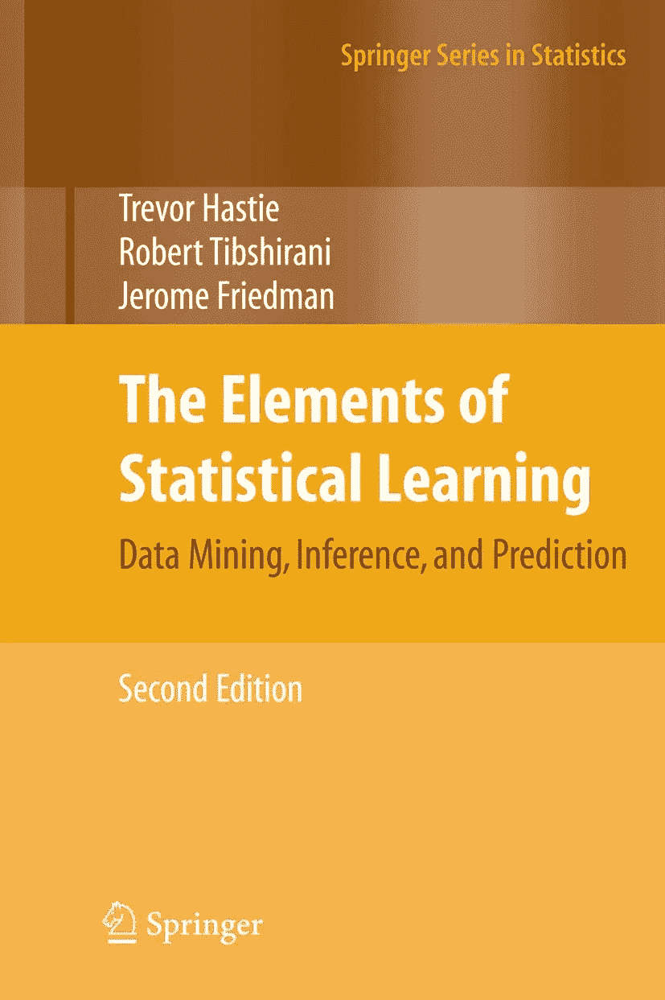
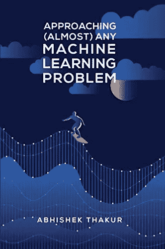

# 5 本免费书籍，让您的数据科学技能更上一层楼

> 原文：<https://towardsdatascience.com/5-free-books-to-take-your-data-science-skills-to-the-next-level-a2026c8cad71?source=collection_archive---------9----------------------->

金伯利农民在 [Unsplash](https://unsplash.com?utm_source=medium&utm_medium=referral) 上拍摄的照片

## 帮助您提高数据科学技能的书籍

就目前的情况来看，我还远没有达到作为一名数据科学家的目标。在我迄今为止的旅程中，我遇到了许多乐于助人的人，并遇到了各种有用的资源。

当我思考我从哪里来，我现在在哪里时，我立即想起了对我作为数据科学家的进步具有革命性意义的 4 本书，今天我将与你们分享其中的内容。

***更新于 2020 年 6 月 10 日:*使用 Scikit-Learn 和 Tensorflow 的动手机器学习受版权保护，因此我添加了购买链接(向作者致以诚挚的歉意)。这意味着目前只有 4 本免费的书。我一直在阅读，看看是否有什么可以填充，如果你发现什么，请发送您的建议，以便我可以通读(它必须是免费的，请)。**

> **注意**:我的任何推荐都没有关联链接，我也不同意任何作者的观点。

## Python 的搭便车指南

这是一本与众不同的书！不是因为它有争议或什么，而是因为它与数据科学没有直接关系。

Python 是数据科学家(以及 R)中一种流行语言，这本书可以带你达到专家水平。这本书描述了用 Python 编程时应该遵循的最佳实践，如果你读过[数据科学家应该知道软件工程最佳实践](/data-scientist-should-know-software-engineering-best-practices-f964ec44cada)，你会知道这比以往任何时候都更重要。

越来越多的数据科学项目投入生产，这对数据科学家提出了更高的端到端技能要求。这本书是一个很好的开端。

你可以通过下面的链接免费下载这本书！

 [## Python 的搭便车指南！Python 的搭便车指南

### Python 编程语言的见解性指南和安装的最佳实践手册…

docs.python-guide.org](https://docs.python-guide.org/) 

## Python 数据科学手册

杰克·范德普拉斯一针见血地为这本书命名；这是那种“永远不要扔掉这本书”的书。

从 NumPy 到 Pandas，再到 Matplotlib 和机器学习，VanderPlas 先生全面概述了我们如何面对日常挑战，如操纵、转换和清理数据；可视化各种数据；并使用数据建立统计或机器学习模型。

最理想，容易阅读的参考书！

 [## Python 数据科学手册

### 该网站包含 Jake VanderPlas 的 Python 数据科学手册的全文；该内容可在…上获得

jakevdp.github.io](https://jakevdp.github.io/PythonDataScienceHandbook/) 

## 使用 Scikit-Learn 和 Tensorflow 进行机器实践学习

> 注意:我注意到这本书是受版权保护的，因此从技术上来说，它并不是免费的——更多细节见页面顶部的注意事项。

概念和编码示例的解释对于想要开始从事个人项目的人来说是非常直观和有用的。

事实上，在我看来，我相信在读完这本书之后(或者当你读的时候),你必须用你的新知识去建立一些东西。

这是一本非常实用的书，你绝对应该花时间来回答这些问题！

要获得这本书，请访问[亚马逊](https://www.amazon.co.uk/Hands-Machine-Learning-Scikit-Learn-TensorFlow/dp/1491962291)

## 统计学习的要素

个人建议？睡前不要看这个！你想在精力最充沛的时候读。

这本书是迄今为止我推荐的所有书中最复杂的一本，也是你会经常提到的一本。它深入到统计学中，并且以相当复杂的方式编写，因为它在我们作为数据科学家将遇到的许多事情背后的数学上很重要。

我把这本书放在这里不是为了炫耀我很聪明——我不是，但我可以像你一样学习任何我想学的东西！——而是为了设定标准。如果我们想成为顶尖的数据科学家，我们必须愿意做大多数人不愿意做的事情，例如深入研究将我们的领域结合在一起的基础。

> **注**:如果你没有数学背景，我强烈建议你在阅读本文之前，以更简单的方式接触一些机器学习算法，比如实现它们。

不要畏惧数学，读 [**统计学习的要素**](https://web.stanford.edu/~hastie/Papers/ESLII.pdf) 。

## 机器学习向往

我很惊讶这本书不像列表中的其他一些书那样被提及。吴恩达是 Coursera 的创始人，也是一些关于机器学习和深度学习的最佳课程的讲师，他整理了自己在谷歌和百度等公司工作期间最有价值的经验，并把它们写在纸上，供我们借鉴。

在我个人看来，看了像 ____ 这样为我们提供了实用的使用机器学习方法的书，这本书是一个超集的最佳书籍。这是关于成为一名优秀的团队成员，包括高效、高效和优秀的团队成员(以防不明显)。

> **注意**:要获得免费图书，您需要填写一些详细信息，完成后会通过电子邮件发送给您。

 [## 机器学习向往- deeplearning.ai

### 人工智能正在改变众多行业。来自吴恩达的免费电子书《机器学习向往》教你如何…

www.deeplearning.ai](https://www.deeplearning.ai/machine-learning-yearning/) 

## 奖金簿

按照约定，我给了你 4 本免费的书，它们会让你的数据科学技能更上一层楼。然而，作为奖励，我会提供 __ 本书，让你的数据科学技能更上一层楼——这些书的唯一区别是它们不是免费的。但是嘿！花钱买质量好没有错。

## 接近(几乎)任何机器学习问题

[在亚马逊上购买](https://www.amazon.co.uk/Approaching-Almost-Machine-Learning-Problem-ebook/dp/B089P13QHT)

如果我有女朋友，她可能会嫉妒我对阿布舍克·塔库尔作品的赞赏。我见过的最有动手能力的人之一，这就解释了为什么他是 Kaggle 4x 特级大师！

他出版了一本书，让我们深入了解他的世界，老实说，就我从中获得的实用知识量而言，这是今年我最好的读物之一。

> **注意**:这本书要求你有很好的机器学习知识，所以让你自己爬起来，捡起这个坏男孩！

在亚马逊上购买 [**接近(几乎)任何机器学习问题**](https://www.amazon.co.uk/Approaching-Almost-Machine-Learning-Problem-ebook/dp/B089P13QHT) 。

## 包裹

我总结了一些让我达到新高度的书。我没有阅读所有关于数据科学领域的书籍，所以我可能错过了一本非常重要的书。如果你碰巧认为是这种情况，留下一个带有书名和 pdf 免费链接的回复。非常感谢！

让我们继续 LinkedIn 上的对话…

 [## Kurtis Pykes -人工智能作家-走向数据科学| LinkedIn

### 在世界上最大的职业社区 LinkedIn 上查看 Kurtis Pykes 的个人资料。Kurtis 有两个工作列在他们的…

www.linkedin.com](https://www.linkedin.com/in/kurtispykes?originalSubdomain=uk)