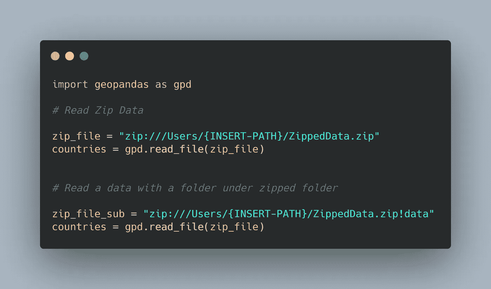
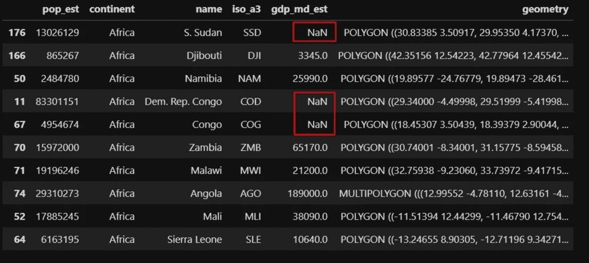
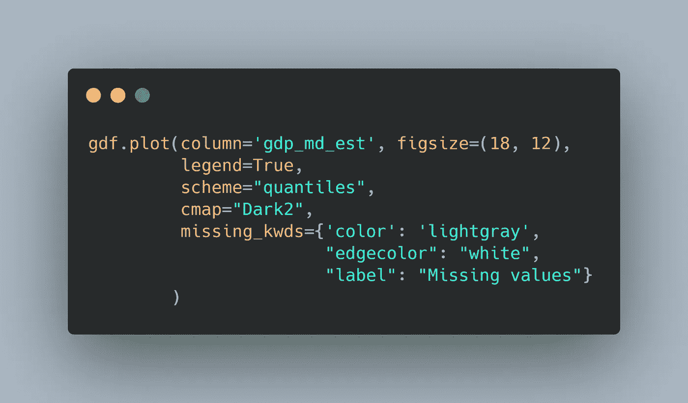
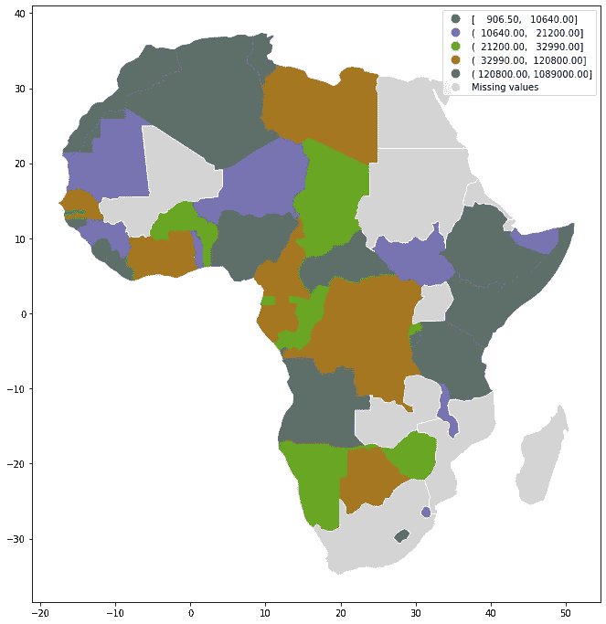
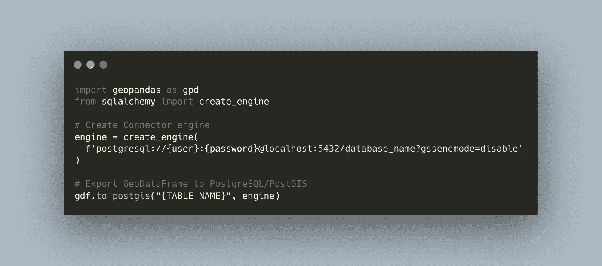
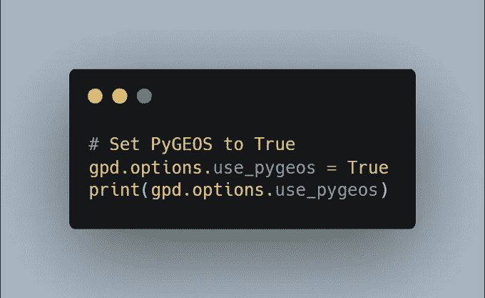
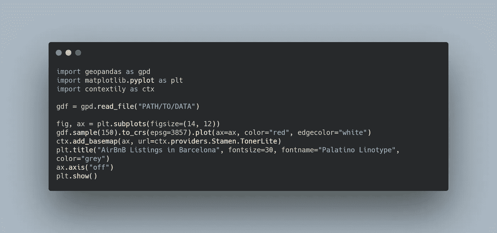
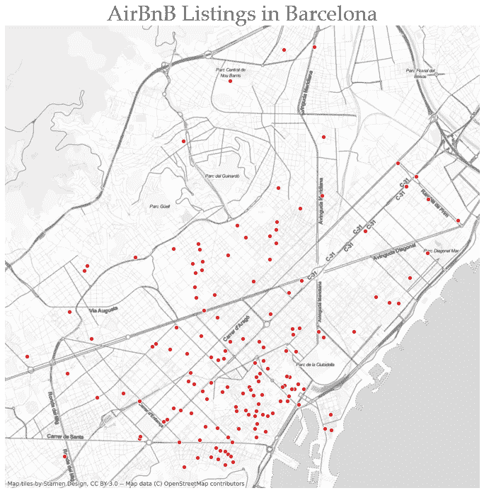

# Python 中的 5 个地理空间提示和技巧

> 原文：<https://towardsdatascience.com/5-geospatial-tips-and-tricks-in-python-eef86aec5110?source=collection_archive---------37----------------------->

## 第 1 部分:如何使用 Geopandas 在 Python 中轻松有效地集成空间要素。

在 [Unsplash](https://unsplash.com?utm_source=medium&utm_medium=referral) 上由 [L B](https://unsplash.com/@iliketobike?utm_source=medium&utm_medium=referral) 拍摄的照片

在数据科学领域，处理地理空间数据通常被认为是一件麻烦的事情。我们很少费心在我们的机器学习模型中包括空间特征。部分原因是几何图形和地理坐标参考系统的复杂性。然而，我倾向于在我的机器学习模型中获得提升，并获得融入空间特征的更好的洞察力。

在过去的一个月里，我一直在 Twitter 上分享 Python 中的地理空间技巧和诀窍，它受到了地理空间社区的大量关注。

在本文中，我将分享使用 Geopandas 处理地理空间数据的前五个技巧和诀窍。我使用了一个[代码美化器在线工具](https://carbon.now.sh/)来显示代码。

## 技巧 1:直接在压缩文件夹下读取地理空间数据

我们压缩数据以减少空间和快速传输。因此，我们往往倾向于在读取数据之前对其进行解压缩或解压。然而，这不是必须的。使用 Geopandas，您可以直接读取压缩文件，就像这样。

读取地理数据 zip 文件。

这种技术也适用于 zip 文件中的子文件夹。你只需要把它指向子文件夹。

## 技巧 2:用一个单独的类别标出缺失的数据

数据集中缺少数据并不罕见。创建带有缺失数据的 Choropleth 地图不会区分零值或空值，因此会将它们聚合到一个类别中。

但是，如果您需要空值有一个单独的类别，您可以如下面的代码片段所示来实现。

Geopandas 有。plot()方法为其所有的地理空间数据可视化接口，它可以带关键字参数 missing_kwds，在那里可以提供要使用的颜色和要调用的类别。

结果是这幅美丽的地图，图例中缺失值类别被着色为浅灰色。

缺少值的地图

## 技巧 3:将地理数据框导出到 PostGIS 数据库

我们经常使用 PostGIS 来存储和分析地理空间数据。使用 PostgreSQL 设置空间数据库，并像专业人员一样使用 Python 和 Geopandas 传输数据。

从 Python 导出到 PostGIS

## 技巧 4:使用 PyGEOS 加速空间运算

空间索引是空间操作的运行引擎。它通常需要更长的处理时间，但是在 Geopandas 中添加 PyGEOS 集成后，您可以加快和提高性能。

您需要做的就是将 use_pyges 设置为 True。

PyGEOS

使用这个新的 PyGEOS 集成，我发现我的处理时间有了显著的改进。因此，如果您使用大数据执行空间操作，请尝试一下。

## 技巧 5:使用 Contextily 向 Geopandas 图添加底图。

尽管我们认为这是理所当然的，但底图将我们的地图融入了语境。使用最新版本的 Geopandas，可以使用不同的底图提供商叠加您的地图。

以下代码片段显示了如何将底图合并到 Geopandas 图中。

背景底图

您在地图上的点有上下文和丰富的可视化底图。

工作草图

## 结论

处理地理空间数据并不困难。有了 Geopandas，它可以有效地处理地理空间数据。在本文中，我们分享了 Python 中空间数据的五个不同的技巧和诀窍。

如果你喜欢我在 Twitter 上发布的这些提示和技巧，你可以在 [@spatialML](https://twitter.com/SpatialML) 找到它们