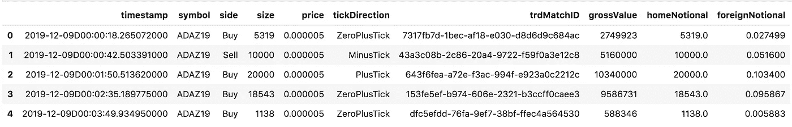
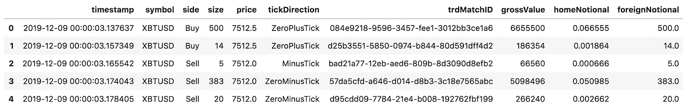
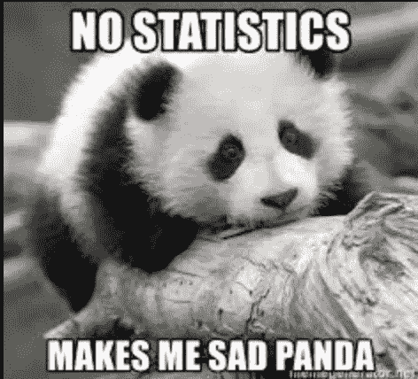
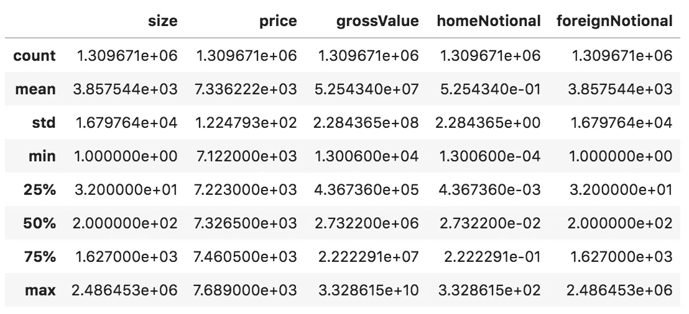
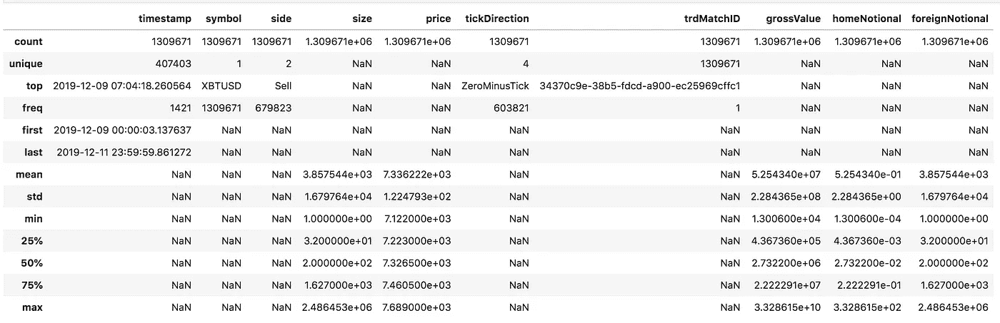
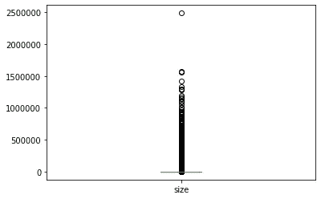
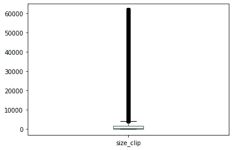
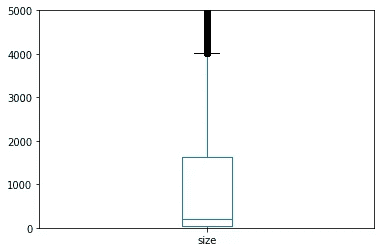

# 熊猫的 5 个陷阱

> 原文：<https://towardsdatascience.com/5-gotchas-with-pandas-974df6595e61?source=collection_archive---------15----------------------->

## 用熊猫做数据分析是非常简单的……但事实并非如此！在这篇博文中，我提出了一些你需要注意的关于熊猫的问题。


用 [ImgFlip](https://imgflip.com/memegenerator) 生成的熊猫迷因

*运行示例下载本* [*Jupyter 笔记本*](https://romanorac.github.io/assets/notebooks/2019-12-23-few-gotchas-with-pandas.ipynb) *。*

**这里有几个你可能会感兴趣的链接:**

```
- [Labeling and Data Engineering for Conversational AI and Analytics](https://www.humanfirst.ai/)- [Data Science for Business Leaders](https://imp.i115008.net/c/2402645/880006/11298) [Course]- [Intro to Machine Learning with PyTorch](https://imp.i115008.net/c/2402645/788201/11298) [Course]- [Become a Growth Product Manager](https://imp.i115008.net/c/2402645/803127/11298) [Course]- [Deep Learning (Adaptive Computation and ML series)](https://amzn.to/3ncTG7D) [Ebook]- [Free skill tests for Data Scientists & Machine Learning Engineers](https://aigents.co/skills)
```

*上面的一些链接是附属链接，如果你通过它们购买，我会赚取佣金。请记住，我链接课程是因为它们的质量，而不是因为我从你的购买中获得的佣金。*

要升级你的熊猫游戏，请阅读:

[](/pandas-analytics-server-d9abceec888b) [## 熊猫分析服务器

### 一个开源项目，简化了熊猫与实时数据的连接，测试假设和可视化…

towardsdatascience.com](/pandas-analytics-server-d9abceec888b) 

# 1.读取多个文件


图片来自 [Meme](https://me.me/i/dontworry-its-all-gonna-panda-out-dont-worry-its-all-35c9094c786b4a16a4236d032c4fbdc2)

假设我们想从一个文件夹中读取多个文件到一个熊猫数据帧中。Python 有一个路径库，可以列出某个文件夹中的所有文件，但我发现 glob 更容易使用。glob 支持正则表达式，这给了我们对想要读取的文件的粒度控制。注意，没有必要解压压缩文件，因为熊猫可以在阅读时自动解压。

为了指定我们想要读取哪些文件，我们在 glob 中使用了`*.gz`。

```
filepaths **=** glob**.**glob('data/*.gz')# Output
['data/20191210.csv.gz', 'data/20191209.csv.gz', 'data/20191211.csv.gz']
```

glob 检测文件，但是它们没有排序。列表中日期为 2019-12-10 的文件在 2019-12-09 之前。如果我们像在这个例子中一样处理时间序列数据，这是一个问题。

为了获得时序数据的正确顺序，我们有两个选择(一个比另一个好):

*   将文件按名称排序并按排序顺序读取(坏)，
*   在数据帧中读取所有数据后，按列对数据进行排序(首选)。

## 1.1 按文件名排序

让我们按名称对文件进行分类，以说明为什么这是个坏主意。

```
filepaths **=** sorted(filepaths)# Output
['data/20191209.csv.gz', 'data/20191210.csv.gz', 'data/20191211.csv.gz']
```

在本例中，对文件名进行排序是可行的，但是我们需要注意，对字符串进行排序不同于对整数进行排序，如下例所示。这是因为编程语言逐字符进行比较。依靠文件名来保证数据的正确顺序是一个坏主意。

在下面的例子中，我们分别对字符串和整数进行排序。

```
sorted(['100', '200', '1000', '20000', '9'])# Output
['100', '1000', '200', '20000', '9'] sorted([100, 200, 1000, 20000, 9])# Output
[9, 100, 200, 1000, 20000]
```

## 1.2 按列对整个数据帧进行排序

如上所述，按列对数据帧进行排序是一个更好的选择，但是我们需要注意列数据类型。

我们来读数据。

```
df_list **=** []
**for** filepath **in** filepaths:
    df_ **=** pd**.**read_csv(filepath)
    df_list**.**append(df_)df **=** pd**.**concat(df_list)
```

DataFrame 有多列，我们希望按时间戳对其进行排序。

```
df**.**head()
```



没那么快！让我们看看时间戳列的数据类型。

```
df**.**timestamp# Output
0         2019-12-09D00:00:18.265072000
1         2019-12-09D00:00:42.503391000
2         2019-12-09D00:01:50.513620000
3         2019-12-09D00:02:35.189775000
4         2019-12-09D00:03:49.934950000
                      ...              
389905    2019-12-11D23:35:26.637330000
389906    2019-12-11D23:35:26.637330000
389907    2019-12-11D23:37:25.166632000
389908    2019-12-11D23:40:09.701271000
389909    2019-12-11D23:55:46.793512000
Name: timestamp, Length: 1578327, dtype: object
```

时间戳列有一个对象类型。当我们对一个对象类型进行排序时会发生什么？

```
pd**.**Series(['100', '200', '1000', '20000', '9'])**.**sort_values()# Output
0      100
2     1000
1      200
3    20000
4        9
dtype: object
```

熊猫对象类型用于文本或混合数值和非数值。为了获得时间戳列的正确顺序，我们需要将其更改为 datetime64 类型。

```
df**.**timestamp **=** pd**.**to_datetime(df**.**timestamp**.**str**.**replace("D", "T"))
df**.**timestamp# Output
0        2019-12-09 00:00:18.265072
1        2019-12-09 00:00:42.503391
2        2019-12-09 00:01:50.513620
3        2019-12-09 00:02:35.189775
4        2019-12-09 00:03:49.934950
                    ...            
389905   2019-12-11 23:35:26.637330
389906   2019-12-11 23:35:26.637330
389907   2019-12-11 23:37:25.166632
389908   2019-12-11 23:40:09.701271
389909   2019-12-11 23:55:46.793512
Name: timestamp, Length: 1578327, dtype: datetime64[ns]
```

timestamp 列具有 datetime64 类型，我们现在可以继续排序了。

```
df **=** df**.**sort_values("timestamp")
df**.**head()
```



# 2.描述统计学



图片来自 MemeGenerator

当我不熟悉数据集时，describe 是我通常运行的第一个命令。我简要回顾了描述性统计数据，如计数、最小值和最大值，以查看数据是否被正确读取。

```
df**.**describe()
```



我有一段时间没有注意到的是，describe 只输出数字列的描述性统计数据。这是有意义的，因为我们不能用其他数据类型如字符串来计算它们。

当我们输出列时，我们看到有时间戳、符号等列。，上面没有列出。

```
df**.**columns# Output
Index(['timestamp', 'symbol', 'side', 'size', 'price', 'tickDirection', 'trdMatchID', 'grossValue', 'homeNotional', 'foreignNotional'], dtype='object')
```

幸运的是，describe 使用 include 参数，我们可以指定包含所有列。Include 参数也接受一个列表，我们可以在其中指定列的子集。

```
df**.**describe(include**=**'all')
```



# 3.可视化离群值


来自 [Pinterest](https://www.pinterest.com/pin/792352128176205493/) 的熊猫迷因

Pandas `plot`功能使我们能够快速可视化某一列的分布情况。

为了可视化某一列的异常值，我们可以使用一个箱线图。

```
df["size"]**.**plot(kind**=**"box")
```



在上面的图中，我们可以观察到**大小**有许多异常值，这使得箱形图没有信息。

我的解决方案是去掉底部和顶部的 1%分位数。

```
df['size_clip'] **=** df['size']**.**clip(df['size']**.**quantile(0.01), df['size']**.**quantile(0.99))df**.**size_clip**.**plot(kind**=**'box')
```



这使得盒图更具信息量，但我们需要尝试不同的分位数值，并在数据帧中添加一个新列。出现了一个问题，我们应该使用哪一列。有没有更好的办法？

Plot 函数采用 ylim 参数，在这里我们可以指定 y 轴的边界。这使得一个方框图更能提供信息，我们不需要在数据框中增加新的一列。

```
df["size"]**.**plot(kind**=**"box", ylim**=**(0, 5000))
```



# 4.宁滨数据


来自 [Giphy](https://giphy.com/) 的熊猫玩耍

假设我们想将一个数值列转换成一个离散列。

# 4.1 将值装入离散区间

最直接的方法是指定 n 个间隔，并相应地绑定数据。熊猫有这样的功能。

让我们将价格列绑定到 5 个离散值。

```
df['price_discrete_bins'] **=** pd**.**cut(df**.**price, 5)# Output
0            (7462.2, 7575.6]
1            (7462.2, 7575.6]
2            (7462.2, 7575.6]
3            (7462.2, 7575.6]
4            (7462.2, 7575.6]
                  ...        
1309666    (7121.433, 7235.4]
1309667    (7121.433, 7235.4]
1309668    (7121.433, 7235.4]
1309669    (7121.433, 7235.4]
1309670    (7121.433, 7235.4]
Name: price_discrete_bins, Length: 1309671, dtype: category
Categories (5, interval[float64]): [(7121.433, 7235.4] < (7235.4, 7348.8] < (7348.8, 7462.2] < (7462.2, 7575.6] < (7575.6, 7689.0]]
```

正如我们所料，price_discrete_bins 有 5 个不同的值，每个 bin 一个。

```
df['price_discrete_bins']**.**value_counts()# Output
(7121.433, 7235.4]    419820
(7235.4, 7348.8]      367043
(7462.2, 7575.6]      301654
(7348.8, 7462.2]      200231
(7575.6, 7689.0]       20923
Name: price_discrete_bins, dtype: int64
```

剪切功能还使我们能够指定箱标签。另请参见 retbins 参数，它输出间隔和标签。

```
df['price_discrete_labels'] **=** pd**.**cut(df**.**price, 5, labels**=**['very low', 'low', 'mid', 'high', 'very high'])# Output
0              high
1              high
2              high
3              high
4              high
             ...   
1309666    very low
1309667    very low
1309668    very low
1309669    very low
1309670    very low
Name: price_discrete_labels, Length: 1309671, dtype: category
Categories (5, object): [very low < low < mid < high < very high]df**.**price_discrete_labels**.**value_counts(normalize**=**True)# Output
very low     0.320554
low          0.280256
high         0.230328
mid          0.152886
very high    0.015976
Name: price_discrete_labels, dtype: float64
```

# 4.2 将值装入大小相等的桶中

在进行数据分析时，最直接的方式并不总是最好的方式(或者我认为是其他方式)😊).上面我没有指出的是，极高值(0.015%)明显比其他值(都超过 15%)代表的少。如果我们打算在这个数据集上训练一个预测模型，这可能会带来一个问题:

*   算法可能会过度拟合“非常高”的值，因为该值非常罕见，
*   算法可以将“非常高”值的出现归因于错误，并完全跳过它。

有办法避免这个问题吗？

有。让我们将价格分成大小相等的箱，这样每个箱都有相同数量的值。

```
df['price_discrete_equal_bins'] **=** pd**.**qcut(df**.**price, 5)# Output
0            (7477.0, 7689.0]
1            (7477.0, 7689.0]
2            (7477.0, 7689.0]
3            (7477.0, 7689.0]
4            (7477.0, 7689.0]
                  ...        
1309666    (7121.999, 7212.5]
1309667    (7121.999, 7212.5]
1309668    (7121.999, 7212.5]
1309669    (7121.999, 7212.5]
1309670    (7121.999, 7212.5]
Name: price_discrete_equal_bins, Length: 1309671, dtype: category
Categories (5, interval[float64]): [(7121.999, 7212.5] < (7212.5, 7292.5] < (7292.5, 7348.5] < (7348.5, 7477.0] < (7477.0, 7689.0]] df**.**price_discrete_equal_bins**.**value_counts()# Output
(7121.999, 7212.5]    264009
(7292.5, 7348.5]      262610
(7348.5, 7477.0]      262396
(7477.0, 7689.0]      260412
(7212.5, 7292.5]      260244
Name: price_discrete_equal_bins, dtype: int64
```

# 5.处理缺失数据


来自 [Giphy](https://giphy.com/gifs/panda-angry-breaking-EPcvhM28ER9XW) 的愤怒熊猫

在熊猫中，多个值表示一个缺失值:

*   NaN 表示数值/对象缺失值，
*   DateTime 的 NaT 缺少值，
*   None，来自 Python。

造成这种混乱的原因是(来自 [pandas 文档](https://pandas.pydata.org/pandas-docs/stable/user_guide/missing_data.html)):
选择在内部使用 NaN 来表示丢失的数据很大程度上是出于简单和性能的原因。我们希望 NumPy 很快能够提供一个本地 NA 类型的解决方案(类似于 R ),其性能足以用于熊猫。

让我惊讶的是 Python 中的 None 等于 None，而 numpy 中的 nan 不等于 nan。

```
None **==** None
Truepd**.**np**.**nan **==** pd**.**np**.**nan
False
```

这一点很重要，这样我们就不会按“无”来筛选值:

```
df[df.some_column == None]# instead use:
df[df.some_column.isnull()]
```

numpy nan 不等于自身的原因是什么？让我们潜入更深的地方。某些函数在不可计算时返回 nan。

```
pd**.**np**.**log(**-**1)nan pd**.**np**.**arccos(2)nan
```

这是否意味着函数的结果应该是相同的？显然不是。

```
pd**.**np**.**log(**-**1) **==** pd**.**np**.**arccos(2)False
```

关于缺失值行为的一些重要细节摘自 [pandas 文档](https://pandas.pydata.org/pandas-docs/stable/user_guide/missing_data.html):

*   GroupBy 中的 NA 组被自动排除。
*   对数据求和时，NA(缺失)值将被视为零。
*   如果数据都是 NA，结果会是 0。
*   像 cumsum()和 cumprod()这样的累积方法默认情况下忽略 NA 值，但是将它们保留在结果数组中。

# 结论


来自 [Giphy](https://giphy.com/gifs/panda-critters-TRuV1HrNrNmP6) 的强壮熊猫

这些是你在做数据分析时需要小心的一些关于熊猫的问题。希望你学到了新的东西。

# 在你走之前

在 [Twitter](https://twitter.com/romanorac) 上关注我，在那里我定期[发布关于数据科学和机器学习的](https://twitter.com/romanorac/status/1328952374447267843)消息。


在 [Unsplash](https://unsplash.com/?utm_source=medium&utm_medium=referral) 上由[Courtney hedge](https://unsplash.com/@cmhedger?utm_source=medium&utm_medium=referral)拍摄的照片