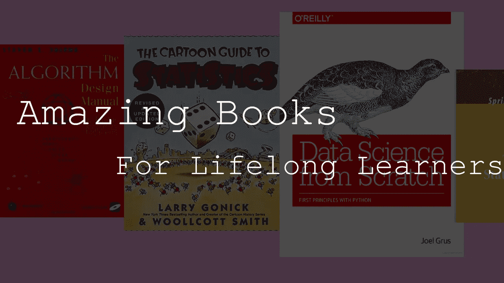
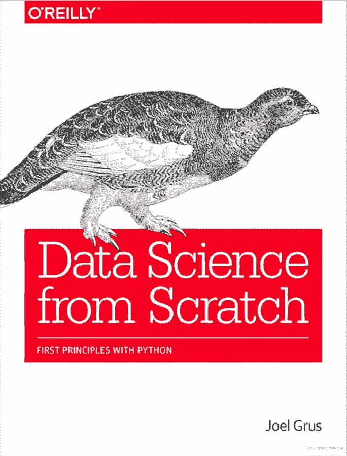
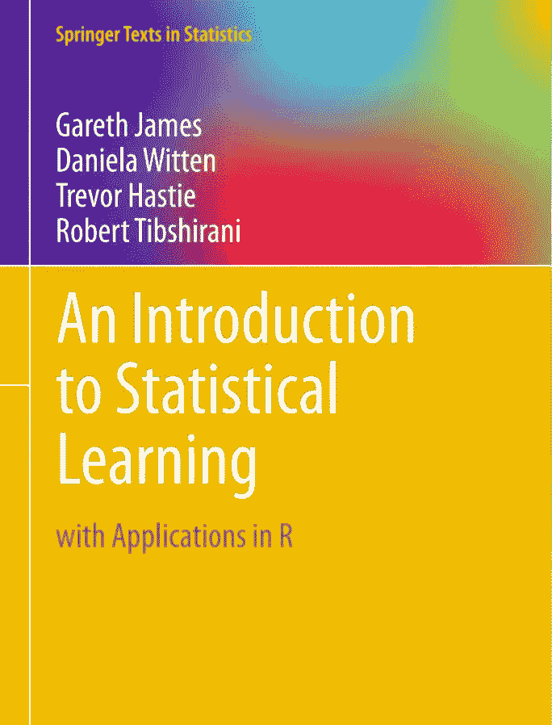
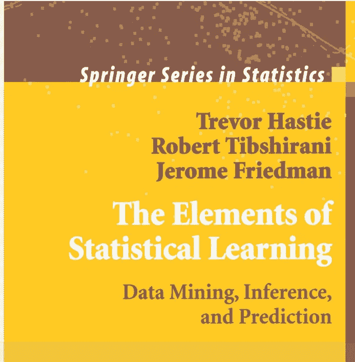
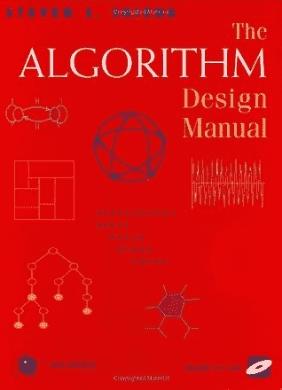

# 面向终身学习者的 5 本伟大的数据科学书籍

> 原文：<https://towardsdatascience.com/5-great-data-science-books-for-lifelong-learners-3a6405a7f890?source=collection_archive---------22----------------------->

## 在这次疫情期间，我对那些对机器学习感兴趣的人的阅读建议。

# 介绍

随着全球疫情的进行，我们所有人都被困在家里，现在是一个远离世界、补上阅读的好时机。虽然我喜欢阅读许多不同类型的书籍，但我发现最有成效的书籍类型很少，而且很少有详细解释统计学和机器学习的例子。作为一个终身学习者，书籍是推断全部剩余信息的伟大媒介，在某些主题上甚至可以超过互联网上可用的信息。

# 从零开始的数据科学

乔尔·格鲁什

数据科学模块是试验和熟悉数据科学的绝佳工具。然而，随之而来的一个大缺点是，熟悉**模块比熟悉模型容易得多。**从零开始的*数据科学*的伟大之处在于，它在一本 330 页的书里深入探究了几个行业标准模型究竟是如何实现的。虽然对这本书的主观看法似乎是复杂的，但它确实是我非常喜欢的一本书，你也可能喜欢。

首先，这本书提供了 Python 的速成课程，虽然“速成课程”可能不是学习编程的好方法，但我认为 Joel 的解释来自任何其他编程语言，肯定是恰当的。除了 Python 课程之外，这本书还附带了数据科学中线性代数的概要，以及涉及概率、基础和高级的统计学。

在整本书中，k 近邻、朴素贝叶斯、线性和逻辑回归、决策树、神经网络和无监督聚类等模型都得到了生动的详细讨论，并在我看来得到了很好的解释。这本书最后概述了自然语言处理和网络分析，这绝对是我推荐的一本书！

# 统计学习导论

作者:加雷斯·詹姆斯、丹妮拉·威滕、特雷弗·哈斯蒂和罗伯特·蒂布拉尼

与我讨论过的上一本书不同，这本书使用 R 而不是 Python 进行了完全不同的阐述。这本书介绍了 R 中一些最重要的建模和预测技术，以及相关的应用程序。与*从头开始的数据科学*相比，我认为这本书更适合初学者。这本书也有真正精心设计的彩色图形和真实世界的场景，它们结合在一起，成为一个易于理解的机器学习课程。

这本书的每一章都有一个很棒的教程，介绍如何在 r 中实现不同的分析和建模模块。

# 统计学习的要素

作者:特雷弗·哈斯蒂、罗伯特·蒂布拉尼和杰罗姆·弗里德曼

许多主题在统计学习的元素中被很好地覆盖，包括模型绘图、神经网络、支持向量机、分类树和梯度推进。这本书深入探讨了你可能会想到的东西:有监督的学习，也有无监督的学习。这本书被广泛认为是任何一本书中第一个全面论述这一主题的主要著作之一。Hastie、Tibshirani 和 Friedman 都是斯坦福大学的统计学教授，都是统计学领域的杰出研究者。

# 统计卡通指南

拉里·戈尼克和伍尔科特·史密斯

与前几本书来了一个一百八十度的大转弯的是*统计学的卡通指南，*这本书使用漂亮的插图和简单的解释，以一种真正独特而美丽的方式解释统计学。我不仅因为这本书有时非常有趣的插图而读得很开心，而且里面也有很多信息。虽然它可能没有这个列表中其他书籍的统计水平高，但我认为它绝对符合它迷人的艺术风格和对初学者友好的性质。

# 算法设计手册

史蒂文·s·斯基埃纳

虽然数据科学经常面临更多的问题——统计比编写算法更重要，但在许多不同的情况下，成为算法向导对任何数据科学家来说都是一个巨大的好处。《算法设计手册》深入探讨了如何从头开始创建高级、复杂的算法。

这本书的伟大之处在于，它吸取了真实的、实际的经验，并把它压缩在短短的 486 页中。这本书分为两大部分，第一部分是算法设计和分析的广泛介绍。这本书的第二部分是参考部分，这是一个各种各样的“词汇表”,包含 75 种需要熟悉的最重要的算法。这不仅是一本值得一读的好书，也是一本可以随身携带以供参考的好书！

# 结论

这些是我个人最喜欢的书籍，从统计学到机器学习和开发算法。总的来说，我认为这些书对长期使用特别有益，因为我经常参考像*从头开始的数据科学*和*算法设计手册*这样的书。

幸运的是，数据科学文献远没有以前那么少了，而且每天都有更多的书籍需要解读。虽然这对于终身学习者来说绝对是一个很好的情况，但整个机器学习书籍图书馆可能会令人望而生畏。这些是我最喜欢的关于数据科学、机器学习、统计学和计算机科学的书，但是我很想知道你推荐读什么！有没有哪本书是你获得大量知识的原因？