# 5 个有趣的 Python 库

> 原文：<https://towardsdatascience.com/5-interesting-python-libraries-1395c791deb5?source=collection_archive---------7----------------------->


约书亚·科尔曼在 [Unsplash](https://unsplash.com?utm_source=medium&utm_medium=referral) 上拍摄的照片

## 你有没有想过数据可视化可以在命令行中实现？

作为最受欢迎的编程语言之一，Python 拥有大量优秀的有利于开发的库，如 Pandas、Numpy、Matplotlib、SciPy 等。

然而，在本文中，我将向您介绍一些更有趣而不是非常有用的库。我相信这些库可以展示 Python 的另一面和社区的繁荣。

# 1.Bashplotlib


由 [David Werbrouck](https://unsplash.com/@bigkids?utm_source=medium&utm_medium=referral) 在 [Unsplash](https://unsplash.com?utm_source=medium&utm_medium=referral) 上拍摄的照片

老实说，当我第一次看到这个图书馆时，我质疑为什么人们会需要它？Bashplotlib 是一个 Python 库，它使我们能够在命令行 stdout 环境中绘制数据。

很快我意识到，当你没有任何可用的 GUI 时，它可能会有用。嗯，这种情况可能不太常见，但这并不妨碍我的好奇心，并觉得这是一个非常有趣的 Python 库。

Bashplotlib 可以用`pip`轻松安装。

```
pip install bashplotlib
```

让我们看一些例子。在下面的代码中，我导入了`numpy`来生成一些随机数组，当然还有`bashplotlib`。

```
import numpy as np
from bashplotlib.histogram import plot_hist
arr = np.random.normal(size=1000, loc=0, scale=1)
```

`plot_hist`是来自`bashplotlib`的函数，用于绘制直方图中的一维数据，就像 Matplotlib 中的`plt.hist`一样。然后，我使用 Numpy 生成一个随机数组，其中包含 1000 个正态分布的数字。之后，我们可以很容易地将这些数据绘制如下:

```
plot_hist(arr, bincount=50)
```

输出是这样的

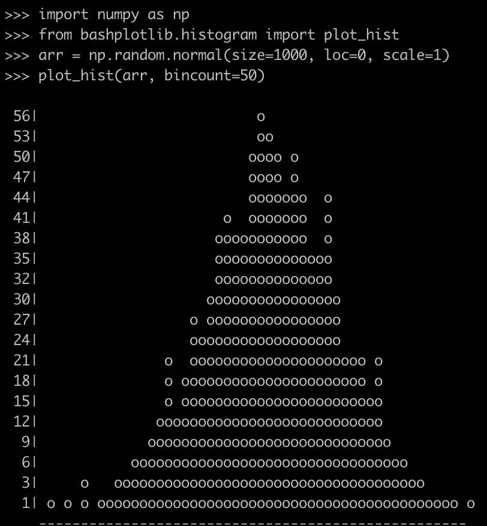

那不是很有趣吗？:)

此外，您可以将文本文件中的数据绘制成散点图。

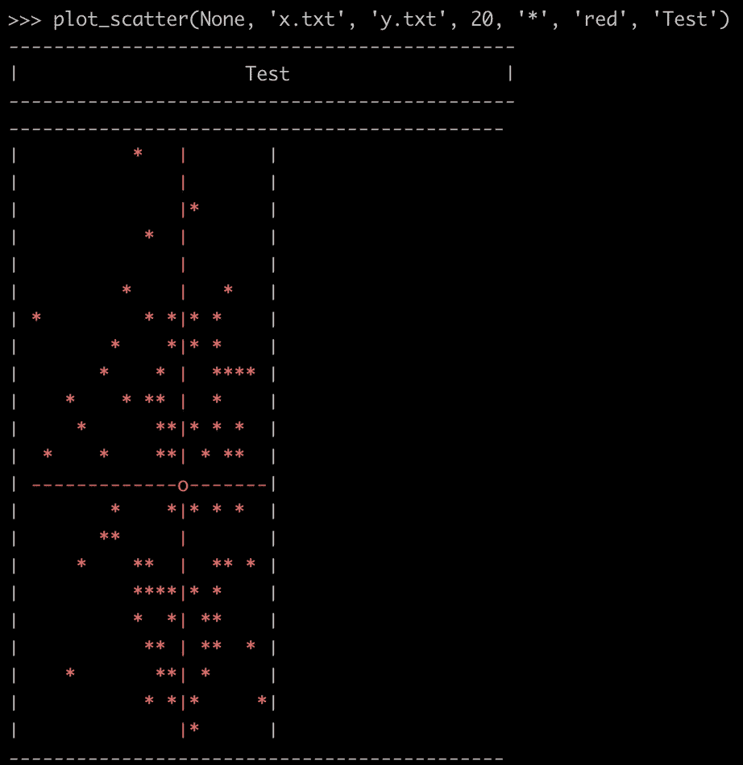

# 2.漂亮的桌子


[Goran Ivos](https://unsplash.com/@goran_ivos?utm_source=medium&utm_medium=referral) 在 [Unsplash](https://unsplash.com?utm_source=medium&utm_medium=referral) 上拍摄的照片

我刚才介绍的 Bashplotlib 用于在命令行环境中绘制数据，而 PrettyTable 用于以漂亮的格式输出表格。

同样，我们可以使用`pip`轻松安装这个库。

```
pip install prettytable
```

首先，让我们导入库。

```
from prettytable import PrettyTable
```

然后，我们可以使用`PrettyTable`创建一个表格对象。

```
table = PrettyTable()
```

一旦我们有了表对象，我们就可以开始添加字段和数据行。

```
table.field_names = ['Name', 'Age', 'City']
table.add_row(["Alice", 20, "Adelaide"])
table.add_row(["Bob", 20, "Brisbane"])
table.add_row(["Chris", 20, "Cairns"])
table.add_row(["David", 20, "Sydney"])
table.add_row(["Ella", 20, "Melbourne"])
```

要显示表格，只需简单地打印它！

```
print(table)
```

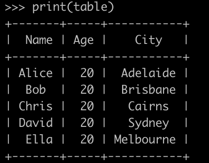

PrettyTable 还支持细化表格样式，几乎可以从任何角度来看。例如，您可以右对齐表格中的文本:

```
table.align = 'r'
print(table)
```

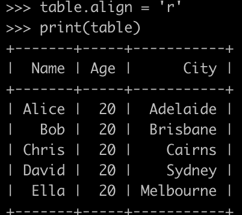

按列对表格排序

```
table.sortby = "City"
print(table)
```

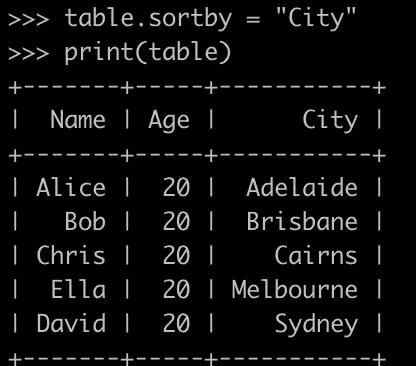

您甚至可以获得表格的 HTML 字符串

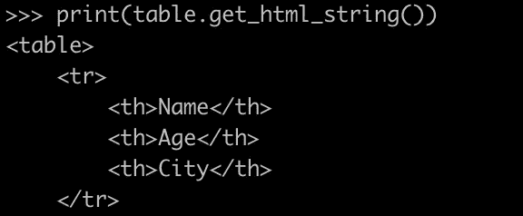

# 3.模糊的


[布雷特·乔丹](https://unsplash.com/@brett_jordan?utm_source=medium&utm_medium=referral)在 [Unsplash](https://unsplash.com?utm_source=medium&utm_medium=referral) 上的照片

在我看来，这个图书馆不仅非常有趣，而且非常有用。很多时候你可能想为你的程序实现一个“模糊”的搜索特性。FuzzyWuzzy 为此提供了一个开箱即用的轻量级解决方案。

照常从`pip`开始安装。

```
pip install fuzzywuzzy
```

导入库:

```
from fuzzywuzzy import fuzz
```

让我们做一个简单的测试。

```
fuzz.ratio("Let’s do a simple test", "Let us do a simple test")
```

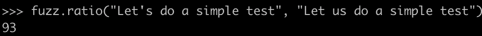

如图所示，结果“93”意味着这两个字符串有 93%的相似性，这是相当高的。

当你有一个字符串列表，并且你想搜索所有字符串的时候，FuzzyWuzzy 会帮助你提取最相关的字符串。

```
from fuzzywuzzy import processchoices = ["Data Visualisation", "Data Visualization", "Customised Behaviours", "Customized Behaviors"]process.extract("data visulisation", choices, limit=2)
process.extract("custom behaviour", choices, limit=2)
```

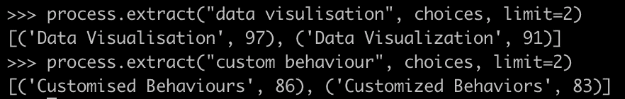

在上面的例子中，参数`limit`告诉 FuzzyWuzzy 为您提取“前 n 个”结果。否则，您将获得一个包含所有这些原始字符串及其相似性得分的元组列表。

# 4.TQDM


照片由 [Jungwoo Hong](https://unsplash.com/@oowgnuj?utm_source=medium&utm_medium=referral) 在 [Unsplash](https://unsplash.com?utm_source=medium&utm_medium=referral) 上拍摄

你通常使用 Python 开发命令行工具吗？如果是这样，这个有趣的库将在您的 CLI 工具处理一些耗时的事情时通过显示进度条来指示已经完成了多少来帮助您。

再次使用`pip`进行安装。

```
pip install tqdm
```

当你有一个使用`range`函数的 for 循环时，只需用 tqdm 的`trange`来代替它。

```
from tqdm import trangefor i in trange(100):
    sleep(0.01)
```

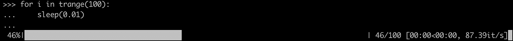

更一般地，你可能想要循环一个列表。使用 tqdm 也很简单。

```
from tqdm import tqdm
for e in tqdm([1,2,3,4,5,6,7,8,9]):
    sleep(0.5)  # Suppose we are doing something with the elements
```

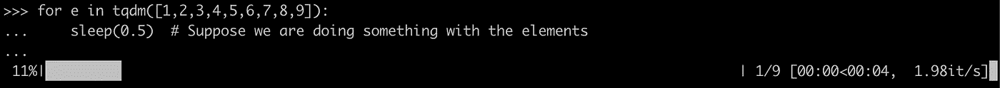

tqdm 不仅适用于命令行环境，也适用于 iPython/Jupyter 笔记本。


图片提供:[https://github.com/tqdm/tqdm](https://github.com/tqdm/tqdm)

# 5.彩色光


照片由[格雷森·乔拉蒙](https://unsplash.com/@greysonjoralemon?utm_source=medium&utm_medium=referral)在 [Unsplash](https://unsplash.com?utm_source=medium&utm_medium=referral) 上拍摄

你想给你的命令行应用增加一些色彩吗？Colorama 可以让您轻松地以自己喜欢的颜色输出所有内容。

再次安装 Colorama 需要`pip`。

```
pip install colorama
```

Colorama 支持在“前景”(文本颜色)、“背景”(背景颜色)和“样式”(颜色的额外样式)中渲染输出文本颜色。我们可以进口

```
from colorama import Fore, Back, Style
```

首先，让我们用黄色显示一些警告。

```
print(Fore.YELLOW)
print("This is a warning!")
```

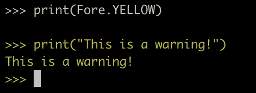

然后，让我们试着用红色背景显示一些错误。

```
print(Back.RED + Fore.WHITE + "This is an error!")
```

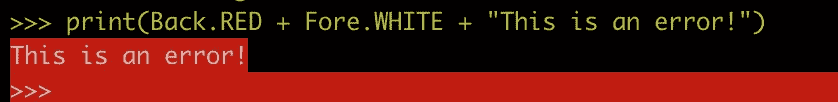

那红色太亮了。让我们使用“暗淡”风格。

```
print(Back.RESET + Style.DIM + "Another error!")
```

在这里，我们设置“重置”为回改变背景颜色为默认。

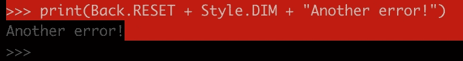

“暗淡”风格使字体看不见。当我们想把一切恢复正常时，只需将“样式”设置为“重置所有”

```
print(Style.RESET_ALL)
```

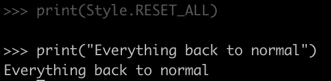

# 摘要


照片由 [twinsfisch](https://unsplash.com/@twinsfisch?utm_source=medium&utm_medium=referral) 在 [Unsplash](https://unsplash.com?utm_source=medium&utm_medium=referral) 上拍摄

感谢这些为 Python 社区做出贡献并使其繁荣的开源开发者。

在我见过 Bashplotlib 库之前，我不得不说我从来没有过在命令行环境中绘制数据的想法。不管它对你是否有用，我要说的是，人们的发展思想和创造力的多样性从未停止。

[](https://medium.com/@qiuyujx/membership) [## 通过我的推荐链接加入 Medium 克里斯托弗·陶

### 作为一个媒体会员，你的会员费的一部分会给你阅读的作家，你可以完全接触到每一个故事…

medium.com](https://medium.com/@qiuyujx/membership) 

如果你觉得我的文章有帮助，请考虑加入 Medium 会员来支持我和成千上万的其他作者！(点击上面的链接)