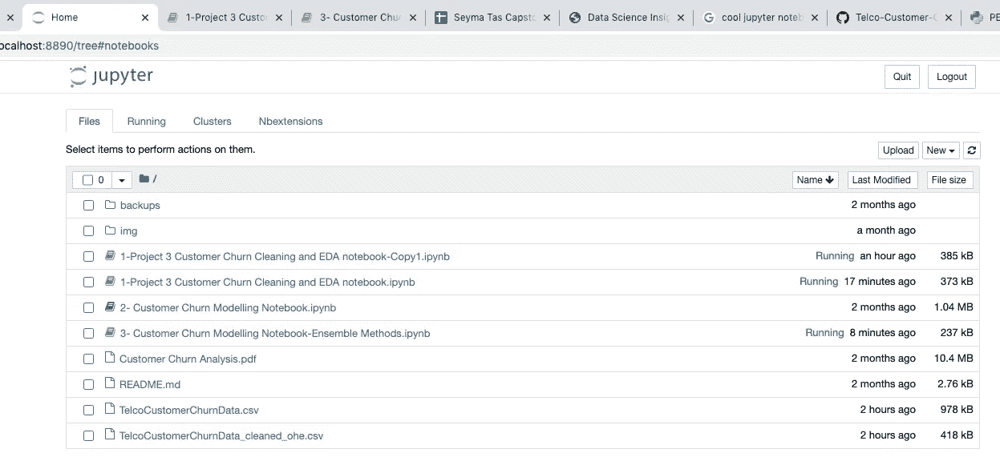
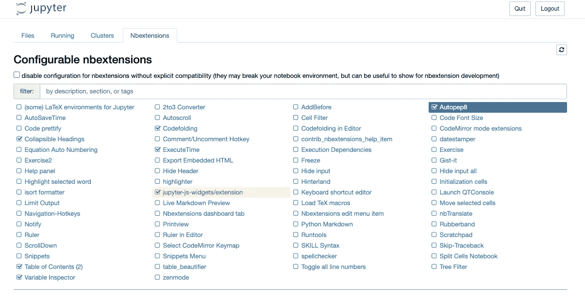
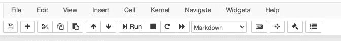
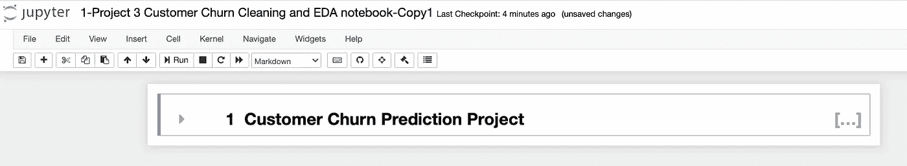
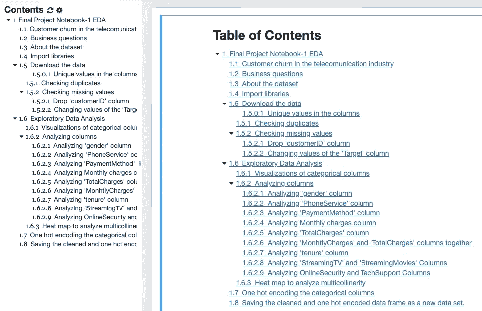
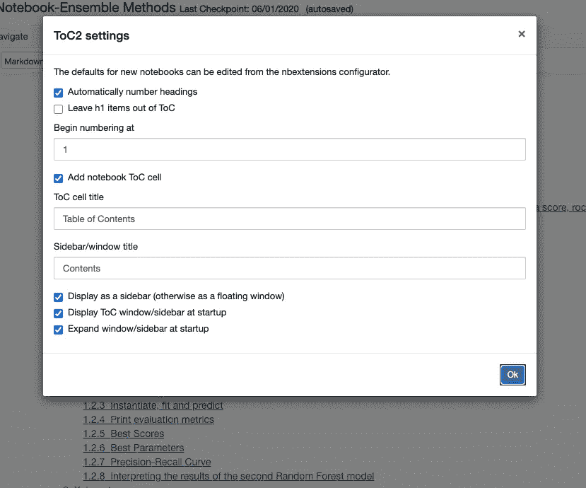
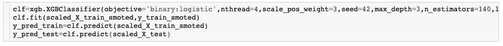
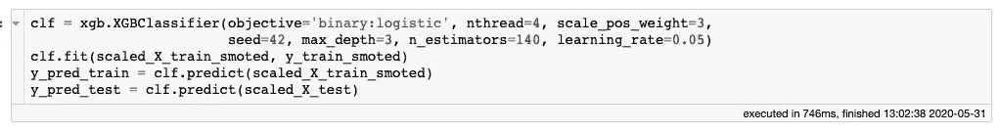
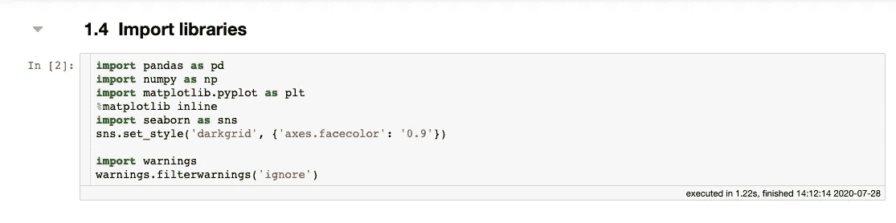
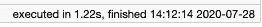

# Jupyter 笔记本扩展，用于全面组织的数据科学项目

> 原文：<https://towardsdatascience.com/5-jupyter-notebook-extensions-for-a-fully-organized-data-science-project-d764195f91be?source=collection_archive---------31----------------------->

## 解释了 5 个实用的 Jupyter 技巧…

在数据科学项目笔记本上工作时，我每分钟都在创建代码和标记单元格，打印变量，获得结果，可视化数据，尝试数十种可视化效果以找到最好的……如果我在整个过程中没有保持良好的组织，我就无法在截止日期前完成项目。

在这篇文章中，我将分享我每天在做项目时使用的 Jupyter 笔记本扩展。

# 如何安装 Jupyter 笔记本扩展？

**在终端:**

```
pip install jupyter_contrib_nbextensions
```

**在朱庇特笔记本里:**

```
! pip install jupyter_contrib_nbextensions
```

安装笔记本扩展后，点击*主页*标签，然后点击*nb 扩展。*



选择可折叠标题、代码折叠、目录(2)、Autopep8 和 ExecuteTime。



打开笔记本后，您会看到下面的工具栏。



是时候发现这 5 个扩展了:

# 1.可折叠标题

这种扩展将使你在技术演示中更有条理。

这是你所有的项目:只有一行！



浏览这些可折叠的标题非常容易。

# 2.代码折叠

这是代码单元中一个可折叠的标题。如果你使用这个扩展，你的代码会看起来更短。隐藏长代码单元格。蓝色左右小箭头表示可以打开这条线。


# 3.目录

这是笔记本中目录扩展的图标。


当你点击它时，左边会弹出一个窗口。



您可以通过单击设置按钮来更改设置。



在这个扩展中最好的事情是，你什么都不做。目录是自动准备的。你只需将标题放在减价单元格中，它就会自动给你的标题编号。爱死了！

# 4.Autopep8

**什么是 PEP-8 风格？**

PEP-8 是关于如何编写易读和一致的代码的指南。它是由吉多·范·罗苏姆、巴里·华沙和尼克·科格兰在 2001 年写的。

**如何安装 autopep8？**

```
python3 -m pip install autopep8
```

这段代码将 autopep8 安装到 Python3 上

**如何使用 autopep8？**

前往您想要符合 pep8 标准的单元格。只需点击工具栏上的这个图标。


它会改变你的代码，



变成类似的东西。



酷！

# 5.执行时间

如果要处理大量数据，执行时间很重要。你试图降低计算成本，让你的代码运行得更快。您可以测量所有单元的运行时间和时间戳，而不是使用%timeit 或%time 命令。



# 结论

Jupyter 笔记本有大约 60 个扩展。我只分享了其中的 5 条，它们让我的生活变得更轻松。只需点击即可发现其他扩展。

非常感谢您对 seymatas@gmail.com 的任何建议！